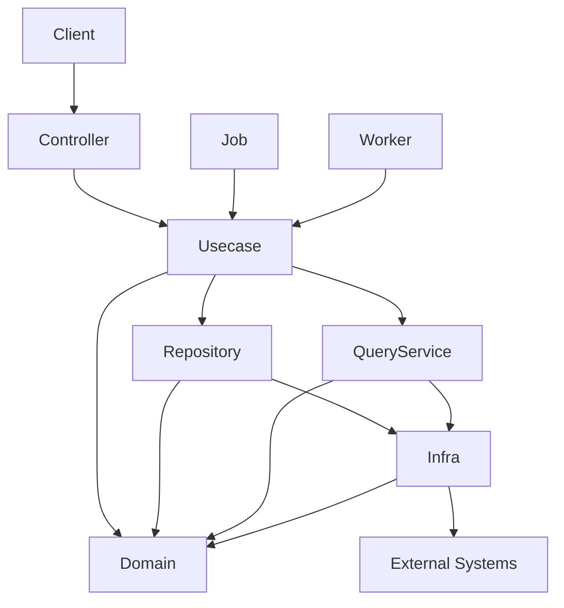

# go-boilerplate


日本語 | [English](README.md)

**Golang × Echo × OpenAPI × PostgreSQL × オニオンアーキテクチャ** で構築したバックエンド基盤プロジェクトです。

広く使われる OSS — `uber/fx`（DI）・`sqlc`（型安全 SQL）・`golang-migrate`（マイグレーション）・
`oapi-codegen`（OpenAPI コード生成）・OpenTelemetry — を統合し、**契約駆動・型安全・レイヤード**な
バックエンドに、本番運用で必要となる関心事（バックグラウンド処理・信頼性・可観測性）をあらかじめ配線しています。

> この README は意図的に最小限に留めています。各トピックは、それを所有する README / 設計ドキュメントへ
> リンクで飛ばします（[ドキュメントマップ](#ドキュメントマップ)を参照）。真の出所はそれらのドキュメントで、
> このページは入口に過ぎません。

## 主な機能（Capabilities）

いずれも拡張用の薄い seam です。設計とルールはリンク先を参照してください。

- **オニオンアーキテクチャ + OpenAPI ファースト** — [docs/architecture.md](docs/architecture.md) / [docs/development-flow.md](docs/development-flow.md)
- **バックグラウンド worker**（pull-ack・graceful drain） — [docs/design/worker.md](docs/design/worker.md)
- **Transactional Outbox**（relay / replay / GC） — [docs/design/outbox.md](docs/design/outbox.md)
- **冪等なリクエスト処理** — [docs/design/idempotency.md](docs/design/idempotency.md)
- **アプリケーションジョブ** — [docs/design/job.md](docs/design/job.md)
- **REST の信頼性**（タイムアウト / ボディ上限 / deadline budget / tx リトライ） — [docs/design/rest.md](docs/design/rest.md)
- **可観測性**（OpenTelemetry の traces / metrics / logs・config 駆動） — [docs/design/observability.md](docs/design/observability.md)
- **自己完結の単一バイナリ**（env とマイグレーションを埋め込み → 単一イメージ） — [docker/README.md](docker/README.md)

## 前提条件

実行前に以下のツールが必要です。

- [mise](https://mise.jdx.dev) — ツール / ランタイムのバージョン管理（**必須**。シェルで有効化すること）
- Docker Desktop — PostgreSQL などを Docker Compose で起動
- Make — 開発コマンドの入口
- GitHub CLI（`gh`） — GitHub 自動化（任意・推奨）
- Visual Studio Code（推奨） — Go / OpenAPI 拡張と併用

### 対応プラットフォーム

本プロジェクトは **Unix ライクな開発環境**を前提とします（`make`・`mise`・`lefthook`・Docker の
bind-mount 性能はいずれも POSIX シェルと Linux パスに依存します）。

- **macOS / Linux** — 主対象・サポート対象。
- **Windows** — **WSL2 + Remote-WSL VSCode 拡張**を使用してください。Windows ネイティブ実行は
  **非対応**です。WSL2 内では Linux と同一に動作します。

## クイックスタート

まっさらな環境（mise 未導入）からの手順です。

```bash
git clone https://github.com/Tomy-ch/go-boilerplate.git
cd go-boilerplate

# 1. mise を導入し（https://mise.jdx.dev/getting-started.html）、シェルで有効化する。
#    Make ターゲットは mise の shim 経由でツールを解決するため必須です。
echo 'eval "$(mise activate zsh)"' >> ~/.zshrc   # bash は ~/.bashrc に `mise activate bash` を追記
# 新しいターミナルを開く（またはシェルを再読み込みする）と mise の shim が PATH に載る

# 2. 固定バージョンの Go ランタイム + 開発ツールを導入し、git hook を設定する。
make go-update
make install-tools
make activate-tools

# 3. ローカル起動（API + PostgreSQL + otel-lgtm）と DB 初期化。
make serve
make tools
make db-init
```

`make serve` は API を <http://localhost:8080>、Grafana を <http://localhost:3000> で起動します。
モジュール名の一括置換などを含む完全なセットアップは
[docs/get-started/setup-repository.md](docs/get-started/setup-repository.md) を参照してください。
全ターゲットは [.makefiles/README.md](.makefiles/README.md) にあります。worker / relay / job の
起動口はそれぞれ `make worker`・`make outbox-relay`・`make job` です。

> **`mise` がツール & ランタイムのバージョンの単一の真実源（SSOT）です。** すべてのバージョン
> （Go・`golangci-lint`・`sqlc`・`oapi-codegen`・`mockgen`・`lefthook` …）は [`mise.toml`](mise.toml)
> に固定され、Dockerfile・ローカルインストーラ・CI はいずれも同じファイルから `mise install <tool>`
> で導入します。そのためローカルと CI が一致します。`make sync-versions` がこれを `go.mod` と
> Dockerfile の `FROM` 行へ反映します。

## API の例

```bash
curl http://localhost:8080/health
```

```json
{
  "status": "ok"
}
```

## はじめに

開発の前にセットアップ手順を実施してください: [docs/get-started/setup-repository.md](docs/get-started/setup-repository.md)。

## アーキテクチャ概要

本プロジェクトは**オニオンアーキテクチャ**を採用します。依存は常に内側を向き、ドメインは純粋で副作用を
持たず、インフラがドメインインターフェースを実装し、コントローラはビジネスロジックを持ちません。

```txt
controller → usecase → domain ← infrastructure
```



レイヤ境界は CI（`golangci-lint` depguard）で強制されており、ドキュメント上の約束事に留まりません。
詳細: [docs/architecture.md](docs/architecture.md) / [docs/rules.md](docs/rules.md)。

## ドキュメントマップ

真の出所はコードの近くにあります。ここを起点に、トピックを所有するリンクへ辿ってください。

### コア

- [docs/index.md](docs/index.md) — ドキュメント索引
- [docs/architecture.md](docs/architecture.md) — システム構造とレイヤ責務
- [docs/rules.md](docs/rules.md) — 非交渉ルール（レイヤ依存・生成コード・DTO・tx・エラー）
- [docs/development-flow.md](docs/development-flow.md) — 変更の進め方（API / DB / ロジック）
- [docs/decisions.md](docs/decisions.md) — 技術選定の根拠（ADR）
- [docs/testing-conventions.md](docs/testing-conventions.md) — テスト規約
- [docs/project/versioning.md](docs/project/versioning.md) — バージョニング方針

### サブシステム設計

- [docs/design/README.md](docs/design/README.md) — 索引
- [rest](docs/design/rest.md) · [worker](docs/design/worker.md) · [job](docs/design/job.md) · [outbox](docs/design/outbox.md) · [idempotency](docs/design/idempotency.md) · [observability](docs/design/observability.md)

### レイヤ README（`internal/`・`pkg/`）

- [domain](internal/domain/README.md) · [usecase](internal/usecase/README.md) · [controller](internal/controller/README.md) · [infrastructure](internal/infrastructure/README.md) · [di](internal/di/README.md)
- [pkg](pkg/README.md) — フレームワーク非依存の共有ユーティリティ

### 契約・データ・ツール

- [openapi/README.md](openapi/README.md) — API 契約（OpenAPI ファースト）
- [database/README.md](database/README.md) — マイグレーション & SQL（sqlc）
- [env/README.md](env/README.md) — 環境変数（環境別にバイナリ埋め込み）
- [.makefiles/README.md](.makefiles/README.md) — すべての `make` ターゲット
- [docker/README.md](docker/README.md) — イメージ・compose プロファイル・単一コンテナ運用

## ディレクトリ構成

```txt
.
├── cmd/            # アプリケーションのエントリポイント（Cobra サブコマンド）
├── internal/       # アプリケーションコード（オニオンアーキテクチャ）
│   ├── domain/
│   ├── usecase/
│   ├── infrastructure/
│   ├── controller/
│   ├── observability/
│   └── di/
├── pkg/            # フレームワーク非依存の共有ユーティリティ
├── openapi/        # API 契約
├── database/       # マイグレーション & SQL（sqlc）
├── env/            # 環境別の環境変数（バイナリへ埋め込み）
├── docker/
├── docs/
├── .makefiles/     # make ターゲットレジストリ
└── makefile
```

## 技術スタック

| カテゴリ | 技術 |
| --- | --- |
| 言語 | Go |
| Web フレームワーク | Echo |
| 依存性注入 | uber/fx |
| API 定義 | OpenAPI + oapi-codegen |
| データベース | PostgreSQL |
| クエリ | sqlc |
| マイグレーション | golang-migrate |
| ロギング | zap（otelzap 経由で OpenTelemetry へ） |
| 可観測性 | OpenTelemetry（OTLP）/ Prometheus |
| テスト | testify |
| CLI | cobra |
| 開発ツール | Docker / docker-compose / air |

## ブランチ戦略

本リポジトリは**リリース中心のブランチモデル**を採用します。フィーチャーブランチは `release/*` から
切り、保護ブランチ（`develop` / `staging` / `production`）へはリリースブランチ経由でのみ反映し、
すべての変更は Pull Request を通します。ルール: [docs/rules.md](docs/rules.md)。

## 設計思想

### なぜ存在するのか

バックエンド開発では、アーキテクチャ・ライブラリ選定・ディレクトリ構成・開発ワークフローを毎回
一から議論しがちです。本ボイラープレートは**初期設計コストを下げるベースライン**を提供し、チームが
安全かつ迅速に着手できるようにします。その価値は特定ライブラリではなく、**広く使われる OSS を
一貫した・置換可能なアーキテクチャへ統合した点**にあります。

### AI 支援開発

制約（レイヤの強制・生成コードの分離・リリースベースのブランチ・OpenAPI ファースト・ドメイン純粋性）は
意図的なものです。AI 支援による変更のアーキテクチャドリフトを抑えつつ、AI ツール**なしでも**完全に
保守できます。参照: [docs/rules.md](docs/rules.md)。

### 想定するシステム種別

新規バックエンドプロダクト、PoC 〜 初期スケール期、厳格なレイヤードのチーム開発、強いドメインルールを
持つシステムに向け、**モジュラモノリス**として設計しています。単一ファイルのマイクロ API・アーキテクチャの
無いプロトタイプ・超低レイテンシシステム・強いマイクロサービス分割にはあまり向きません。

### ベンダー中立性と拡張性

可観測性・ツールは OSS ファーストでベンダー中立です。`internal/` 配下は疎結合で、DI によりインフラ・
実装・ミドルウェアを実行環境ごとに差し替えられます。

## メンテナ方針 / 免責事項

本リポジトリは**著者が個人で維持**しており、いかなる組織にも属しません。善意で提供していますが、
**セキュリティ・安定性・特定用途への適合性について保証はありません**。利用前に、依存の脆弱性・
セキュリティ設定・運用互換性をご自身で検証してください。

ライブラリは、活発なメンテナンス・コミュニティ採用・置換可能性・強いフレームワークロックインの回避を
基準に選定しています。メンテナは依存更新・セキュリティ修正・アーキテクチャ改善を提供する場合が
ありますが、Issue 応答期限・バグ修正の保証・長期メンテナンスの確約は**保証しません**。

今後のリリース予定: フロントエンド / インフラ / 可観測性の各ボイラープレート。

## ライセンス

本プロジェクト自身のソースコードは **MIT License** で公開しています — [LICENSE](LICENSE) を参照してください。

配布するコンテナイメージには、ベースイメージ由来のサードパーティ OS パッケージが同梱されます。
たとえば本番用の `runtime` イメージは `alpine:3.23` をベースにしており、その基本パッケージ
（`busybox` / `apk-tools` / `alpine-baselayout` / `ssl_client` など）は **GPL-2.0-only** です。
これらは *mere aggregation（単なる同梱）* にあたります。独立したプログラムとして動作し、Go バイナリには
**リンクされない**ため、コピーレフトの条件が本プロジェクトのコードに波及することはなく、商用利用を
**制限しません**。義務は Linux ベースイメージを再配布する際の通常の対応（対応するパッケージソースの
入手手段を提供すること。upstream の Alpine が既に提供済み）のみです。イメージ詳細:
[docker/README.md](docker/README.md)。
