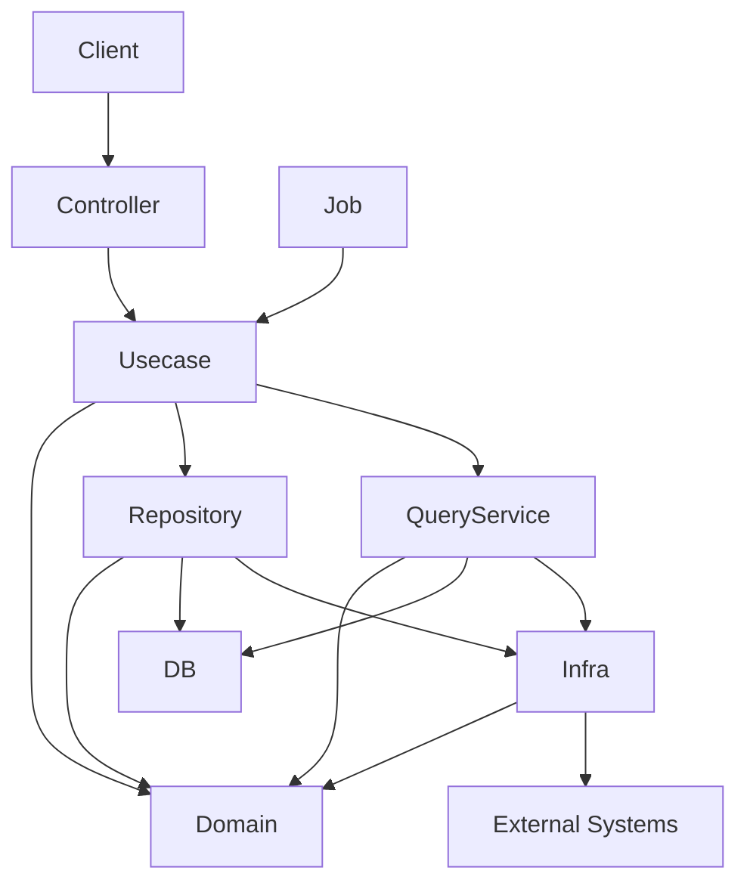

# go-boilerplate


日本語 | [English](README.md)

**Golang × Echo × OpenAPI × PostgreSQL × Onion Architecture** をベースに構築されたバックエンド用のベースプロジェクトです。

このプロジェクトは以下を統合しています。

- `uber/fx`（Dependency Injection）
- `sqlc`（型安全な SQL）
- `golang-migrate`（スキーママイグレーション）
- `oapi-codegen`（OpenAPI コード生成）

これにより、**スキーマ駆動（schema-driven）かつ型安全なレイヤードバックエンドアーキテクチャ**を提供します。

## 前提条件

本プロジェクトを実行するには、以下のツールを事前にインストールしておく必要があります。

- Visual Studio Code（推奨）
- Docker Desktop
- Make
- GitHub CLI（gh）

### 前提条件の補足

- Docker Desktop は、Docker Compose を用いて PostgreSQL などのサービスを起動するために必要です。
- Make は、ビルド・テスト・コード生成などの開発コマンドを簡略化するために使用します。
- GitHub CLI は、GitHub Actions や各種自動化との連携に使用します（任意ですが推奨）。
- Visual Studio Code は、Go や OpenAPI 関連の拡張機能と組み合わせることで、効率的な開発が可能です。

### サポート対象プラットフォーム

本プロジェクトは **Unix 系の開発環境** を前提としています。ツールチェイン（`make` / `mise` / `lefthook` / Docker のバインドマウント性能など）は POSIX シェルおよび Linux のファイルパス形式に依存しています。

- **macOS / Linux** — 主な開発環境としてサポートします。
- **Windows** — **WSL2 + VSCode の Remote-WSL 拡張** を利用してください。Windows ネイティブでの動作は**サポート対象外**です。`make` / `mise` の shim 配置 / `lefthook` の POSIX フックがいずれも Unix シェルを前提としており、Docker の I/O 性能も WSL2 のファイルシステムを使わないと大きく低下します。

WSL2 上であれば挙動は Linux と同一で、`.vscode/settings.json` が参照する `~/.local/share/mise/shims/` などのパスもそのまま機能します。

## Quick Start

以下のコマンドでローカル起動できます。

```bash
git clone <https://github.com/Tomy-ch/go-boilerplate.git>
cd go-boilerplate

make install-tools
make activate-tools
make tidy-lib
make serve
make tools
```

データベース初期化：

```bash
make db-init
```

API サーバーがローカルで起動します。

その他のコマンドは、[Makeターゲット一覧](.makefiles/README.ja.md)を参照してください。

## Example API

例：

```bash
curl <http://localhost:8080/health>
```

レスポンス例：

```json
{
  "status": "ok"
}
```

## Getting Started

開発を開始する前に、必ず以下のセットアップ手順を実行してください。

[セットアップ手順はこちら](./docs/ja/get-started/setup-repository.ja.md)

## この Boilerplate の目的

バックエンド開発では、プロジェクトごとに以下を毎回設計することが多くあります。

- アーキテクチャ
- ライブラリ選定
- ディレクトリ構成
- 開発ワークフロー

その結果、多くのプロジェクトで  
同じ設計議論や試行錯誤が繰り返されがちです。

この boilerplate は**初期設計コストを削減し、安全かつ迅速に開発を開始するためのベースアーキテクチャ**を提供します。

主な特徴：

- Onion Architecture
- OpenAPI-first 開発
- sqlc による型安全な SQL
- Dependency Injection
- CI による構造チェック

これらを組み合わせ、**スキーマ駆動かつ型安全なレイヤードアーキテクチャ**を提供します。

この boilerplate の価値は特定のライブラリではなく、**広く利用されている OSS を一貫したアーキテクチャとして統合している点**にあります。

## アーキテクチャ概要

このプロジェクトは **Onion Architecture** を採用しています。

```txt
controller → usecase → domain ← infrastructure
```

基本原則：

- 依存関係は常に内側へ向かう
- Domain 層は純粋で副作用を持たない
- Infrastructure は Domain Interface を実装する
- Controller にビジネスロジックは置かない



詳細は[docs/architecture.md](docs/architecture.md)を参照してください。

## アーキテクチャガバナンス

本プロジェクトでは、アーキテクチャの一貫性を維持するために以下の方針を採用しています。

### 基本方針

- レイヤー境界は厳密に守る
- Domain の純粋性を維持する
- Infrastructure の詳細を上位層に漏らさない

### 例外の扱い

例外的な実装が必要な場合：

- 理由を明文化する（コメント or ADR）
- 一時的な回避か恒久対応かを明確にする
- レビューで必ず合意を取る

### レビュー観点

- レイヤー違反がないか
- Domain にビジネスロジックが閉じているか
- Infrastructure 依存が漏れていないか

### AI利用時の注意

- 生成コードがアーキテクチャを破っていないか確認する
- ルールに従わないコードは修正する

## API 開発ポリシー（OpenAPI First）

このプロジェクトは **OpenAPI-first** ワークフローを採用しています。

API を変更する場合は以下の順序で行います。

1. OpenAPI 定義(`openapi/`)を変更する
2. コードを生成する

    ```sh
    make gen-api
    ```

3. handler / usecase を実装する

生成されたコードは **手動編集してはいけません**。

## ブランチ戦略

このプロジェクトでは **release 中心のブランチモデル** を採用しています。

ルール：

- Feature ブランチは `release/*` から作成
- `develop`, `staging`, `production` には release ブランチ経由でのみ変更可能
- 保護ブランチへの直接コミットは禁止
- すべての変更は Pull Request を経由

メリット：

- バージョン整合性の確保
- 安全なリリースフロー
- AI支援開発時のリスク低減

## ディレクトリ構成

```txt
.
├── cmd/            # アプリケーションエントリポイント
├── internal/       # アプリケーションコード（Onion Architecture）
│   ├── domain/
│   ├── usecase/
│   ├── infrastructure/
│   ├── controller/
│   └── di/
├── database/       # マイグレーション & SQL（sqlc）
├── openapi/        # API契約
├── pkg/            # 共通ユーティリティ
├── docker/
├── docs/
└── makefile
```

## 技術スタック

|カテゴリ|技術|
|---|---|
|言語|Go|
|Web Framework|Echo|
|Dependency Injection|uber/fx|
|API定義|OpenAPI + oapi-codegen|
|Database|PostgreSQL|
|Query|sqlc|
|Migration|golang-migrate|
|Logging|zap|
|Testing|testify|
|CLI|cobra|
|Dev Tools|Docker / docker-compose / air|

## AI フレンドリーな設計

この boilerplate は **AI支援開発を前提に設計**されています。

意図しないアーキテクチャ崩壊を防ぐため、  
いくつかの制約を設けています。

主な仕組み：

- 厳格なレイヤー構造
- 生成コードの分離
- release ベースのブランチ戦略
- OpenAPI-first API設計
- Domain 層の純粋性

これにより、AI エージェントでも  
**安全なコード生成が可能**になります。

## ドキュメント

詳細なドキュメントは `docs/` にあります。

- [Architecture](docs/ja/architecture.ja.md)  
- [Development Workflow](docs/ja/development-flow.ja.md)  
- [Architectural Rules](docs/ja/rules.ja.md)  
- [Design Decisions](docs/ja/decisions.ja.md)  
- [Versioning Policy](docs/ja/project/versioning.ja.md)  

## 想定システム

この boilerplate は以下の用途を想定しています。

- 新規バックエンド開発
- PoC → 初期スケールフェーズ
- レイヤード開発を行うチーム
- ドメインルールが強いシステム
- 長期保守を前提としたバックエンド

以下の用途には向いていません。

- 単一ファイルの小規模 API
- アーキテクチャを考えない高速プロトタイプ
- 超低レイテンシシステム
- 強いマイクロサービス分割

このテンプレートは**モジュラーモノリス構成**を前提としています。

## SaaS / Vendor 中立性

このプロジェクトは特定の SaaS への依存を避けています。

Observability やツール設計は以下を前提にしています。

- OSS ベース
- Vendor 中立アーキテクチャ

## 拡張性

`internal/` 配下のコンポーネントは疎結合です。

Dependency Injection により

- Infrastructure
- Implementation
- Middleware

などを環境に応じて差し替えることが可能です。

## メンテナーポリシー / 免責

このプロジェクトは **作者個人によって管理されています**。

特定の組織とは関係ありません。

善意で公開されていますが、以下は保証されません。

- セキュリティ
- 安定性
- 特定用途への適合性

利用者は使用前に以下を確認してください。

- 依存関係の脆弱性
- セキュリティ設定
- 運用環境との互換性

## ライブラリ選定ポリシー

ライブラリは以下の基準で選定しています。

- 継続的なメンテナンス
- コミュニティ採用
- 交換可能性
- 強いフレームワーク依存を避ける

このアーキテクチャは**コンポーネントの置き換え可能性**を前提としています。

## メンテナンスポリシー

メンテナーは以下を行う可能性があります。

- 依存関係の更新
- セキュリティ修正
- アーキテクチャ改善

ただし以下は保証されません。

- Issue への対応期限
- バグ修正保証
- 長期メンテナンス

## 将来の Boilerplate

今後予定しているもの：

- Frontend Boilerplate
- Infrastructure Boilerplate
- Observability Boilerplate

## AI エージェント向けドキュメント

このプロジェクトには、AI エージェント向けのドキュメントも含まれています。

ただし、このプロジェクトは**AIツールなしでも完全に保守可能**な設計になっています。

## License

MIT License

```txt
LICENSE
```

## 参考

- [versioning.md](docs/project/ja/versioning.ja.md)
- [architecture-index.md](docs/ja/index.ja.md)
  - [architecture.md](docs/ja/architecture.ja.md)
  - [development-flow.md](docs/ja/development-flow.ja.md)
  - [decisions.md](docs/ja/decisions.ja.md)
  - [rules.md](docs/ja/rules.ja.md)
- [go-upgrade.md](docs/maintenance/ja/go-upgrade.ja.md)
- [Make Commands](.makefiles/README.ja.md)
