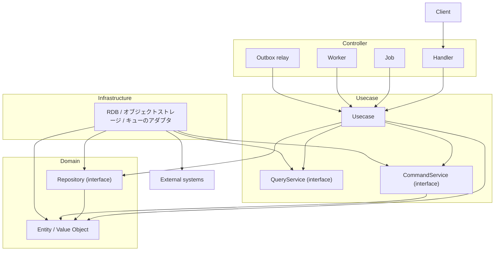

# go-boilerplate


日本語 | [English](README.md)

**Golang × Echo × OpenAPI × PostgreSQL × オニオンアーキテクチャ** で構築したバックエンド基盤プロジェクトです。

広く使われる OSS — `uber/fx`（DI）・`sqlc`（型安全 SQL）・`golang-migrate`（マイグレーション）・
`oapi-codegen`（OpenAPI コード生成）・OpenTelemetry — を統合し、**契約駆動・型安全・レイヤード**な
バックエンドに、本番運用で必要となる関心事（バックグラウンド処理・信頼性・可観測性）をあらかじめ配線しています。

> この README は意図的に最小限に留めています。各トピックは、それを所有する README / 設計ドキュメントへ
> リンクで飛ばします（[ドキュメントマップ](#ドキュメントマップ)を参照）。真の出所はそれらのドキュメントで、
> このページは入口に過ぎません。
>
> **ほぼすべてのディレクトリが自分の README を持っています。** その領域を実装する / 調べるときは、
> まず所有する README を読んでください。責務と禁止事項が書かれており、変更の範囲を決めます。
> **README はディスク上にあるものの目録を持ちません**（エディタが見せるためです）。書いてあるのは名前が
> 運べないもの — なぜその区切りなのか、そして残りを説明する規則です。

## 主な機能（Capabilities）

いずれも拡張用の薄い seam です。設計とルールはリンク先を参照してください。

- **オニオンアーキテクチャ + OpenAPI ファースト** — [docs/architecture.md](docs/architecture.md) / [docs/development-flow.md](docs/development-flow.md)
- **バックグラウンド worker**（pull-ack・graceful drain） — [docs/design/worker.md](docs/design/worker.md)
- **Transactional Outbox**（relay / replay / GC） — [docs/design/outbox.md](docs/design/outbox.md)
- **冪等なリクエスト処理** — [docs/design/idempotency.md](docs/design/idempotency.md)
- **アプリケーションジョブ** — [docs/design/job.md](docs/design/job.md)
- **REST の信頼性**（タイムアウト / ボディ上限 / deadline budget / tx リトライ） — [docs/design/rest.md](docs/design/rest.md)
- **認証**（リソースサーバ側の JWT / JWKS 検証。開発用の OIDC プロバイダを同梱） — [docs/design/auth.md](docs/design/auth.md)
- **可観測性**（OpenTelemetry の traces / metrics / logs・config 駆動） — [docs/design/observability.md](docs/design/observability.md)
- **オブジェクトストレージ**（S3 互換アダプタの背後にある中立な境界。ローカルコンテナ・シード投入・匿名 read の公開配信を同梱） — [internal/usecase/boundary/README.md](internal/usecase/boundary/README.md) / [storage/README.md](storage/README.md)
- **自己完結の単一バイナリ**（env とマイグレーションを埋め込み → 単一イメージ） — [docker/README.md](docker/README.md)

## スコープと非目標

このアーキテクチャが*誰の・何のため*かは [docs/project/scope.md](docs/project/scope.md)（および後述の
「想定するシステム種別」）に記載しています。この節が扱うのはもう一方 — バックエンドがいずれ必要と
するもののうち、本プロジェクトが**意図的に同梱しない**ものです。いずれも未完成ではありません。

- **デプロイと IaC** — ワークフローの骨組みのみ。プラットフォームは採用側の選択
- **レートリミット** — インスタンス単位のインメモリカウンタでは全体の上限を強制できないため、インフラのエッジに属する
- **キャッシュ層** — 既存の Repository インターフェースの背後にデコレータとして足す。TTL 付きマップへ退化する専用の抽象は置かない
- **RBAC / 監査ログ / 保持ポリシー / PII 暗号化** — ドメインが決めるものであり、テンプレートが推測できない
- **定期ジョブの多重起動制御** — スケジューラに委ねる。同梱ジョブは設計上多重実行に耐える

理由付きの全一覧は [docs/project/out-of-scope.md](docs/project/out-of-scope.md)。アーキテクチャ上の
非採用は `setup-review` タグ付きの ADR としても記録されており、新規プロジェクトが 1 件ずつ発見する
のではなく、ひとまとまりとして見直せるようにしてあります。

認証と認可だけは、この欠落が**記述ではなく強制**されています。`local` / `ci` / `test` 以外では DI の
プロバイダが fail-closed であり、実装を配線するまでアプリケーションは起動を拒否します
（[docs/design/auth.md](docs/design/auth.md)）。

## 前提条件

実行前に以下のツールが必要です。

- [mise](https://mise.jdx.dev) — ツール / ランタイムのバージョン管理（**必須**。シェルで有効化すること）
- Docker Desktop — PostgreSQL などを Docker Compose で起動
- Make — 開発コマンドの入口
- GitHub CLI（`gh`） — GitHub 自動化（任意・推奨）
- Visual Studio Code（推奨） — Go / OpenAPI 拡張と併用

### 対応プラットフォーム

本プロジェクトは **Unix ライクな開発環境**を前提とします（`make`・`mise`・`lefthook`・Docker の
bind-mount 性能はいずれも POSIX シェルと Linux パスに依存します）。

- **macOS / Linux** — 主対象・サポート対象。
- **Windows** — **WSL2 + Remote-WSL VSCode 拡張**を使用してください。Windows ネイティブ実行は
  **非対応**です。WSL2 内では Linux と同一に動作します。

## クイックスタート

まっさらな環境（mise 未導入）からの手順です。

```bash
git clone https://github.com/Tomy-ch/go-boilerplate.git
cd go-boilerplate

# 1. mise を導入し（https://mise.jdx.dev/getting-started.html）、シェルで有効化する。
#    Make ターゲットは mise の shim 経由でツールを解決するため必須です。
echo 'eval "$(mise activate zsh)"' >> ~/.zshrc   # bash は ~/.bashrc に `mise activate bash` を追記
# 新しいターミナルを開く（またはシェルを再読み込みする）と mise の shim が PATH に載る

# 2. 固定バージョンの Go ランタイム + 開発ツールを導入し、git hook を設定する。
make go-update
make install-tools
make activate-tools

# 3. ローカル起動（API + PostgreSQL + otel-lgtm）と DB 初期化。
make serve
make tools
make db-init
```

`make serve` は API を <http://localhost:8080>、Grafana を <http://localhost:3000> で起動します。
モジュール名の一括置換などを含む完全なセットアップは
[docs/get-started/setup-repository.md](docs/get-started/setup-repository.md) を参照してください。
全ターゲットは [.makefiles/README.md](.makefiles/README.md) にあります。worker / relay / job の
起動口はそれぞれ `make worker`・`make outbox-relay`・`make job` です。

> **`mise` がツール & ランタイムのバージョンの単一の真実源（SSOT）です。** すべてのバージョン
> （Go・`golangci-lint`・`sqlc`・`oapi-codegen`・`mockgen`・`lefthook` …）は [`mise.toml`](mise.toml)
> に固定され、Dockerfile・ローカルインストーラ・CI はいずれも同じファイルから `mise install <tool>`
> で導入します。そのためローカルと CI が一致します。`make sync-versions` がこれを `go.mod` と
> Dockerfile の `FROM` 行へ反映します。PyPI で公開されているツールだけは例外で、
> [`python/`](python/README.ja.md) で宣言しハッシュ付きで固定します。バージョンの pin だけでは
> 依存が固定されないためです。

## API の例

```bash
curl http://localhost:8080/health
```

```json
{
  "status": "ok"
}
```

## はじめに

開発の前にセットアップ手順を実施してください: [docs/get-started/setup-repository.md](docs/get-started/setup-repository.md)。

<!-- boilerplate-only:begin -->
## テンプレートとして使う

GitHub の *Use this template* でリポジトリを作成し、自分のものに置き換えます。セットアップは文字列置換ではなく、**スクリプト化され検証される
一連の手順**です。順序は [docs/get-started/setup-repository.md](docs/get-started/setup-repository.md)
が示しており、以下はそれがどういう性質の作業かを示すための要約に過ぎません。

- **識別子の置き換えは信用ではなく検証で担保する。** `make setup-replace-*` がモジュールパス・
  リポジトリ参照・アプリメタデータ・ライセンス保持者・CODEOWNERS を書き換え、`make setup-verify` は
  上流の識別子が 1 つでも残っている限り落ちます。通ったときにだけ使い捨てのツールを削除するので、
  やり残した置換が見過ごされることはありません。
- **除去は 2 パスに分かれており、それは意図的。** `make setup-remove-boilerplate-identity` は
  「これが上流のテンプレートである間だけ成り立つ記述」を、`make setup-remove-sample-api` はサンプル
  機能一式を落とします。片方だけ実行するのは正当です。サンプルを残すことは、レイヤリング規則が散文
  ではなく動くコードとして存在する唯一の場所を残すことでもあります。
- **テンプレートが代わりに決めないこと**は、コードに残された TODO ではなく番号付きの Phase です。
  認証 / 認可の実装、デプロイ先、依存ライセンスの閾値、DAST と資格情報を要するスキャナを残すかどうか、
  そして再設定すべき非採用 ADR 群。

テンプレートから作成した瞬間に成り立たなくなる記述と、それをスクリプトが除去できるようにするマーカーの規約は
[docs/get-started/boilerplate-only-conventions.md](docs/get-started/boilerplate-only-conventions.md)
にあります。

<!-- boilerplate-only:end -->
## 開発フロー

ローカルのループと CI は同じゲートを走らせます。手元で緑であることは、プルリクエストで緑であること
と同じ意味を持ちます。

| ステップ | コマンド | 補足 |
| --- | --- | --- |
| 生成 | `make gen` | OpenAPI → サーバコード / モック、SQL → 型安全な Go、続いてドキュメント。生成ファイルは手編集せず、CI が再生成して差分で落とします。 |
| 自動修正 | `make fix` | Go の整形と lint 自動修正。Markdown / SQL は `make md-fix` / `make sql-fix`。 |
| 静的解析 | `make lint` | golangci-lint。レイヤ境界をビルドエラーにする depguard ルールを含みます。 |
| テスト | `make test` | カバレッジ付きの Go テスト。先に `make db-init` が必要です（マイグレーション**とシード**を前提とします）。 |

レビューに頼らず機械的に検査されるもの:

- **レイヤ境界** — depguard が禁止インポートを弾き、`internal/architest` が構造上の規則を通常のテストとして表明します
- **契約優先** — 入力は OpenAPI 定義と SQL ファイルであり、コミットされた生成物が再生成結果と食い違えば CI が落ちます
- **コミットの衛生** — lefthook が `pre-commit` / `commit-msg` / `pre-push` でゲートを走らせ、ローカルでどこまで走らせるかは開いている worktree の数から決まります。繰り延べたものは CI で同一に再実行されます（[負荷帯域](.makefiles/README.ja.md)）

規約: [docs/development-flow.md](docs/development-flow.md) ·
[docs/testing-conventions.md](docs/testing-conventions.md) ·
[CONTRIBUTING.ja.md](CONTRIBUTING.ja.md)。全ターゲットは
[.makefiles/README.ja.md](.makefiles/README.ja.md)、全ワークフローは
[.github/workflows/README.ja.md](.github/workflows/README.ja.md) にあります。

## アーキテクチャ概要

本プロジェクトは**オニオンアーキテクチャ**を採用します。依存は常に内側を向き、ドメインは純粋で副作用を
持たず、インフラがドメインインターフェースを実装し、コントローラはビジネスロジックを持ちません。

```txt
controller → usecase → domain ← infrastructure
```

以下の矢印はすべて**依存**を表し、各ボックスはそれを所有するレイヤに置いています。



永続化は 3 つのインターフェースに分かれており、所属レイヤが揃っていないのは意図的です。`Repository` は
集約自身の契約なのでドメインが所有し、これがドメインの持つ唯一の永続化契約です。`QueryService`（read
model）と `CommandService`（読み込み・変更・保存の形では表現できない書き込みのためのトランザクションの
道具）はいずれも usecase の関心事なので usecase レイヤに置きます。

読み側と書き側が非対称なのも意図的で、ドメインへの矢印が片方にしか無いのはそのためです。`QueryService`
は DTO を返しドメイン型に一切触れませんが、`CommandService` は決定済みの集約を受け取ります。3 者の
判別基準は [ADR-0030 (lightweight-cqrs)](docs/adr/0030-lightweight-cqrs.md) にあります。

レイヤ境界は CI（`golangci-lint` depguard）で強制されており、ドキュメント上の約束事に留まりません。
詳細: [docs/architecture.md](docs/architecture.md) / [docs/rules.md](docs/rules.md)。

## ドキュメントマップ

真の出所はコードの近くにあります。ここを起点に、トピックを所有するリンクへ辿ってください。

### コア

- [docs/index.md](docs/index.md) — ドキュメント索引
- [docs/architecture.md](docs/architecture.md) — システム構造とレイヤ責務
- [docs/rules.md](docs/rules.md) — 非交渉ルール（レイヤ依存・生成コード・DTO・tx・エラー）
- [docs/development-flow.md](docs/development-flow.md) — 変更の進め方（API / DB / ロジック）
- [docs/adr/](docs/adr/README.md) — アーキテクチャ決定記録（ADR）。技術選定の根拠
- [docs/testing-conventions.md](docs/testing-conventions.md) — テスト規約
- [docs/tutorial/build-user-feature.md](docs/tutorial/build-user-feature.md) — 実例: 1 つの機能を端から端まで作る
- [docs/spec/glossary.md](docs/spec/glossary.md) — 業務語彙（ユビキタス言語）
- [CONTRIBUTING.ja.md](CONTRIBUTING.ja.md) — 変更の提案から着地まで（ブランチ・コミット・ゲート・レビュー）
- [docs/get-started/troubleshooting.md](docs/get-started/troubleshooting.md) — セットアップとローカル実行の失敗、およびそれが実際に意味するもの
- [docs/project/scope.md](docs/project/scope.md) · [docs/project/out-of-scope.md](docs/project/out-of-scope.md) — 想定スコープと、意図的に除外したもの
- [docs/project/policy.md](docs/project/policy.md) · [docs/project/versioning.md](docs/project/versioning.md) · [docs/project/roadmap.md](docs/project/roadmap.md) — メンテナンス・バージョニング・方向性
- [docs/reference/dependencies.md](docs/reference/dependencies.md) — 直接依存の目録。1 エントリ = 1 責務
- [docs/maintenance/](docs/maintenance/db-worktree-pool.md) — 運用 runbook（worktree DB プール・ドキュメント構造・アップグレード）
- [docs/deployment/](docs/deployment/github-page.md) — デプロイ手順（GitHub Pages によるドキュメントポータル）
- [docs/get-started/boilerplate-only-conventions.md](docs/get-started/boilerplate-only-conventions.md) — これが上流テンプレートである間だけ成り立つ記述 <!-- boilerplate-only:line -->

### サブシステム設計

- [docs/design/README.md](docs/design/README.md) — 索引
- [rest](docs/design/rest.md) · [worker](docs/design/worker.md) · [job](docs/design/job.md) · [outbox](docs/design/outbox.md) · [idempotency](docs/design/idempotency.md) · [observability](docs/design/observability.md)
- [auth](docs/design/auth.md) · [security](docs/design/security.md) · [context-map](docs/design/context-map.md) · [agent-environment](docs/design/agent-environment.md)

### レイヤ README（`internal/`・`pkg/`）

- [domain](internal/domain/README.md) · [usecase](internal/usecase/README.md) · [controller](internal/controller/README.md) · [infrastructure](internal/infrastructure/README.md) · [di](internal/di/README.md)
- [pkg](pkg/README.md) — フレームワーク非依存の共有ユーティリティ

### 契約・データ・ツール

- [openapi/README.md](openapi/README.md) — API 契約（OpenAPI ファースト）
- [database/README.md](database/README.md) — マイグレーション & SQL（sqlc）
- [storage/README.md](storage/README.md) — オブジェクトストレージのシード内容（ディレクトリ構造 = キー構造）
- [env/README.md](env/README.md) — 環境変数（環境別にバイナリ埋め込み）
- [.makefiles/README.md](.makefiles/README.md) — すべての `make` ターゲット
- [docker/README.md](docker/README.md) — イメージ・compose プロファイル・単一コンテナ運用
- [scripts/README.md](scripts/README.md) — ユーティリティスクリプトとリポジトリのゲート（コード生成・ドキュメント・バージョニング・供給網ピン・セットアップ）
- [python/README.md](python/README.md) — PyPI 公開の CLI ツール。宣言とハッシュ固定
- [docs-viewer/README.md](docs-viewer/README.md) — ドキュメントポータルのフロントエンド（生成された `docs/portal/docs.json` を描画）
- [.github/workflows/README.md](.github/workflows/README.md) — CI ワークフローとリポジトリのセキュリティ統制の目録

## ディレクトリ構成

トップレベルは、ファイルの種類ではなく**そのディレクトリが何に責任を持つか**で分けている。

- `cmd/` — エントリポイントだけを置く。各サブコマンドは `internal/cli/` を包む薄い Cobra の殻である
- `internal/` — アプリケーション本体。オニオンの層で配置する。層とその依存方向は自身の README が述べる
- `pkg/` — このアプリケーションの存在を知らないユーティリティ。だからフレームワーク非依存で再利用できる
- `openapi/` — API 契約。これを提供するコードより先に書く
- `database/` — マイグレーションと、コード生成が読む SQL
- `storage/` — バケットへ投入するオブジェクト。ディレクトリ構造がそのままキー構造になる
- `env/` — 環境ごとの変数。バイナリへ埋め込まれる
- `docker/` — イメージまたはサービスごとに 1 ディレクトリ
- `docs/` — 正典のドキュメント。ADR と設計リファレンスを含む
- `scripts/` — リポジトリのツールと、ここに書かれた規則を強制するゲート
- `.github/` — workflow・composite action・リポジトリ設定
- `.makefiles/` — make ターゲットの登録簿。`makefile` はこれを include するだけである
- `.agents/` — すべての AI ツールが共有する機械可読の成果物。どのアシスタントにも所有させない
- `.claude/` / `.codex/` — それぞれ 1 つのアシスタント向けの設定

`docs-viewer/` / `python/` は独自のツールチェーンを持つ補助プロジェクトで、
順にドキュメントポータルのフロントエンド・ハッシュ固定した PyPI 製 CLI である。開発用 OIDC
プロバイダはここに含まれない——compose が digest 固定した上流イメージを引き、設定は
`docker/mock-auth-server/config.json` が持つ。

## 技術スタック

| カテゴリ | 技術 |
| --- | --- |
| 言語 | Go |
| Web フレームワーク | Echo |
| 依存性注入 | uber/fx |
| API 定義 | OpenAPI + oapi-codegen |
| データベース | PostgreSQL（pgx） |
| オブジェクトストレージ | S3 互換（AWS SDK v2・ローカルは Garage） |
| メッセージキュー | SQS 互換（AWS SDK v2・ローカルは ElasticMQ） |
| 認証 | JWT / JWKS 検証（golang-jwt・go-jose） |
| クエリ | sqlc |
| マイグレーション | golang-migrate |
| ロギング | zap（otelzap 経由で OpenTelemetry へ） |
| 可観測性 | OpenTelemetry（OTLP）/ Prometheus |
| テスト | testify / uber-go/mock |
| CLI | cobra |
| 開発ツール | Docker / docker-compose / air |

## ブランチ戦略

本リポジトリは**リリース中心のブランチモデル**を採用します。フィーチャーブランチは `release/*` から
切り、保護ブランチ（`develop` / `staging` / `production`）へはリリースブランチ経由でのみ反映し、
すべての変更は Pull Request を通します。ルール: [docs/rules.md](docs/rules.md)。

## セキュリティ

**脆弱性の報告** — 公開 issue を立てないでください。[.github/SECURITY.ja.md](.github/SECURITY.ja.md)
の非公開の窓口を使ってください。同じ文書には、デプロイ前にリリース済みイメージを検証する手順
（cosign 署名・ビルド provenance・SBOM attestation）と、その検証をデプロイのゲートにする方法も
記載しています。

姿勢と、それを形づくる脅威モデル、そして**明示された限界**は
[docs/design/security.md](docs/design/security.md) にあります。統制は 4 か所に置かれ、各機構は
*強制* / *検知* / *抑止* のいずれか 1 つであることを意図しています（3 つを混ぜないこと自体が方針です）:

- **CI が実行するもの** — Actions は SHA、ベースイメージはダイジェストで固定し、その解決は単一の
  出所であるロックファイルを通します。加えてジョブ単位の egress 許可リスト。いずれも fail-closed。
- **コードがリンクするもの** — 公開直後のバージョンが一定期間採用されないクールダウン窓と、
  互いに独立した複数の脆弱性データベースによるスキャン。
- **サービスがリクエストに対して行うこと** — 境界ごとの deny-by-default（送信先ガード、エラー詳細の
  露出）。リクエスト検証と認証は OpenAPI 定義から駆動されるため、spec の差分を読むことが
  セキュリティ姿勢のレビューそのものになります。
- **決してコミットしてはならないもの** — 異なる失敗の仕方を狙って選んだ 2 つのシークレットスキャナと、
  利便性に優先する 1 つの規則: 検出されたシークレットの値がログ・PR コメント・成果物に出ることはない。

報告とゲートは意図的に分けています。通常のプルリクエストは**報告**し（無関係な変更を赤くせずに
code scanning へ届く）、`develop` / `staging` / `production` への昇格は固定の必須チェック群で
**ゲート**します。どちらがどれかは [.github/workflows/README.ja.md](.github/workflows/README.ja.md)。

守備範囲外: 開発者自身のマシンで動くもの — 後述の「守備範囲外: 開発者マシンの衛生」を参照。

## 設計思想

<!-- boilerplate-only:begin -->
### なぜ存在するのか

バックエンド開発では、アーキテクチャ・ライブラリ選定・ディレクトリ構成・開発ワークフローを毎回
一から議論しがちです。本ボイラープレートは**初期設計コストを下げるベースライン**を提供し、チームが
安全かつ迅速に着手できるようにします。

その価値は特定ライブラリではなく、**広く使われる OSS・設計原則・開発上の制約を、一貫したかたちで
統合し、それぞれを可能な限り疎結合かつ置換可能に保っていること**にあります。

<!-- boilerplate-only:end -->
### Opinionated, but replaceable

本リポジトリは意図的に強い設計思想を持ちますが、その思想をコード全体へ暗黙に焼き付けることを
避けています。設計上の意図・責務・不変条件・拡張点は、それを所有する README / Design Reference / ADR に
明示し、機械的に判定可能な境界は lint・architecture test・generation / drift check で強制します。

目的は「この設計以外を許さない」ことではありません。**要件と既存思想が合わない場合に、どの前提が
衝突し、どこを書き換えればよいかを追跡可能にすること**です。設計そのものを変更することも可能ですが、
コードだけでなく、その設計を説明・検証する artifact も同期して変更する必要があるため、最も高コストな
拡張になります。

### 変更を観測可能にする

ここで追跡するのは変更の「結果」だけではなく、その**理由・影響範囲・守るべき性質**です。設計判断は
ADR、サブシステムの役割と状態遷移は Design Reference、局所的な契約は package README、機械的に判定
可能な制約は tooling がそれぞれ所有します。

これにより、コードの精読だけに頼らず次を追跡できる構成を目指します。

- この実装がなぜこの形なのか
- どの設計判断に基づくのか
- どの境界を変更すると何が影響を受けるのか
- 実装と設計ドキュメントのどちらが drift したのか

### 実装から設計へ書き戻す

設計は仮説であり、実装・レビュー中に露出した制約や破綻は、その仮説に対する観測結果です。

そのためバグやアーキテクチャ逸脱をその場限りで修正するだけでなく、再発価値の高いものは原因を
調査・トリアージし、ADR・Design Reference・README・tooling へ反映します。

個別の問題をすべて規則へ昇格させるのではなく、**複数箇所・複数実装で再利用価値を持つ原因だけを
設計資産として残す**ことを重視します。

### AI 支援開発

本プロジェクトは **AI が無くても完全に開発・保守できること**を前提としています。AI 専用の
アーキテクチャではなく、人間向けに明示された設計・契約・検証機構を、AI エージェントからも
利用できるようにしています。

レイヤ境界・生成コード・OpenAPI 契約・ADR・Design Reference・各 package README などをエージェントの
context として再利用し、機械的に判定可能な性質は tooling、読解を要する判断は review signal によって
検証します。

目的は AI の自由度を増やすことではなく、**既に承認された設計判断の範囲では探索空間を意図的に狭め、
設計判断が必要な変更だけを人間へ戻すこと**です。そのため AI 支援による開発速度を利用しつつ、特定の
モデル・ベンダー・エージェントへ基盤そのものを依存させません。

参照: [docs/design/agent-environment.md](docs/design/agent-environment.md) /
[docs/rules.md](docs/rules.md)。

#### エージェントの対応状況

エージェント向けの設定は、使い捨てのローカル状態ではなく、**リポジトリが保守する開発システムの一部**と
して扱います。したがってリポジトリが所有する skill・hook・自動化は、コードおよびそれらが強制する制約と
ともに変化していく必要があります。

**Codex CLI には現在、ハーネスの完全自律保守に関する制限があります。** その `workspace-write` サンドボックス
では、リポジトリ配下の `.agents/` および `.codex/` が読み取り専用パスとして保護されており、ワークスペース
サンドボックスを有効に保ったままこれらのパスをエージェントに保守させる、リポジトリ単位の上書き手段は現状
提供されていません。

Codex は、書き込み可能なワークスペース内での通常の実装・レビュー・その他の変更には引き続き利用できます。
一方で、`.agents/` / `.codex/` 配下のリポジトリ所有の skill・Codex の hook・その他の自動化を更新しなければ
ならないワークフローは、追加のユーザー介入かより広いサンドボックス権限なしには現状 end to end で完了でき
ません。このため Codex CLI は **エージェント駆動開発においては部分対応と位置づけます。通常の実装ワーク
フローは対応、リポジトリ自身のエージェントハーネスを保守する完全自律ワークフローは非対応です**。

これは本プロジェクトのアーキテクチャ上の依存ではなく、エージェントランタイム側の制限です。リポジトリは
Codex を必要としませんし、明示的に信頼された書き込み可能パスをリポジトリスコープで安全に扱う仕組みを
Codex が提供した時点で、この記述は削除できます。

### 想定するシステム種別

新規バックエンドプロダクト、PoC 〜 初期スケール期、厳格なレイヤードのチーム開発、強いドメインルールを
持つシステムに向け、**モジュラモノリス**として設計しています。単一ファイルのマイクロ API・アーキテクチャの
無いプロトタイプ・超低レイテンシシステム・強いマイクロサービス分割にはあまり向きません。

### ベンダー中立性と拡張性

可観測性・ツールは OSS ファーストでベンダー中立です。`internal/` 配下は疎結合で、DI によりインフラ・
実装・ミドルウェアを実行環境ごとに差し替えられます。

### 守備範囲外: 開発者マシンの衛生

ここでの供給網対策はリポジトリで止まります。依存の cooldown 窓、pin した Actions とベースイメージ、
SBOM と脆弱性スキャンまでです。**開発者の**マシンで動くもの — グローバルに入れたパッケージ、エディタや
ブラウザの拡張、エージェント / MCP の設定 — はプロジェクトテンプレートの手が届く範囲になく、それらの
マシンを管理する主体の領域です。

「advisory がこのパッケージとバージョンを名指した。今どのマシンが一致するか」に答える必要があるなら、
[`perplexityai/bumblebee`](https://github.com/perplexityai/bumblebee) がまさにその問いのために作られた
read-only のエンドポイントスキャナです。依存としてではなく参照として挙げています。ここでは何も導入せず、
呼び出さず、必要ともしません。なお、何かをフラグさせるには別途 exposure catalog が要ります。

## メンテナ方針 / 免責事項

本リポジトリは**著者が個人で維持**しており、いかなる組織にも属しません。善意で提供していますが、
**セキュリティ・安定性・特定用途への適合性について保証はありません**。利用前に、依存の脆弱性・
セキュリティ設定・運用互換性をご自身で検証してください。

ライブラリは、活発なメンテナンス・コミュニティ採用・置換可能性・強いフレームワークロックインの回避を
基準に選定しています。メンテナは依存更新・セキュリティ修正・アーキテクチャ改善を提供する場合が
ありますが、Issue 応答期限・バグ修正の保証・長期メンテナンスの確約は**保証しません**。

### このリポジトリのブランチ規則の例外

テンプレートは `.github/settings/branch-protection.json` で CODEOWNERS レビューと 7 件の required
status check を宣言しています。本リポジトリでは単独メンテナ向けに、承認数・最終 push 後の承認・
未解決レビューのスレッド解消を必須にせず、rebase merge も許可しています。一方で 7 件の status check
と CODEOWNERS レビューは必須です。これはこのリポジトリ固有の運用状態であり、派生先への推奨では
ありません。セットアップ時に README を書き換える際、この小節を置き換えるか削除してください。

<!-- boilerplate-only:begin -->
今後のリリース予定: フロントエンド / インフラ / 可観測性の各ボイラープレート —
[docs/project/roadmap.md](docs/project/roadmap.md) を参照。

<!-- boilerplate-only:end -->
## ライセンス

本プロジェクト自身のソースコードは **MIT License** で公開しています — [LICENSE](LICENSE) を参照してください。

配布するコンテナイメージには、ベースイメージ由来のサードパーティ OS パッケージが同梱されます。
たとえば本番用の `runtime` イメージは `alpine:3.24` をベースにしており、その基本パッケージ
（`busybox` / `apk-tools` / `alpine-baselayout` / `ssl_client` など）は **GPL-2.0-only** です。
これらは *mere aggregation（単なる同梱）* にあたります。独立したプログラムとして動作し、Go バイナリには
**リンクされない**ため、コピーレフトの条件が本プロジェクトのコードに波及することはなく、商用利用を
**制限しません**。義務は Linux ベースイメージを再配布する際の通常の対応（対応するパッケージソースの
入手手段を提供すること。upstream の Alpine が既に提供済み）のみです。イメージ詳細:
[docker/README.md](docker/README.md)。
