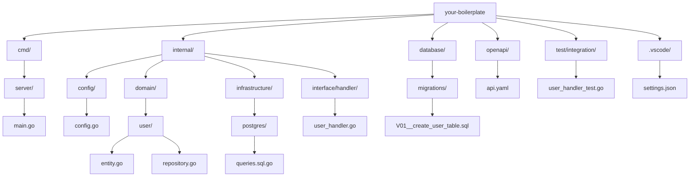

# go-boilerplate

Golang × Echo × OpenAPI × PostgreSQL × Onion Architecture によるベースプロジェクトです。
`uber/fx` による DI や `sqlc`, `golang-migrate`, `oapi-codegen` などを採用しています。

## 利用ツール(サポートバージョン)

- Go(1.24.4)
- Docker Desktop
- Github CLI

## 構成スタック

- **言語**: Go
- **Webフレームワーク**: Echo
- **DI**: uber/fx
- **API定義**: OpenAPI
  - **コード生成**: oapi-codegen
- **DB**: PostgreSQL
- **ORM/Query**: sqlc
- **マイグレーション**: golang-migrate
  - **マイグレーション統合**: tern
- **開発補助**:
  - godotenv
  - zap
  - testify
  - cobra（CLI）
  - air（ホットリロード）
  - Docker / docker-compose

## ディレクトリ構成

<details>
<summary>展開する</summary>



</details>

---

## 開発開始手順

```bash

```
