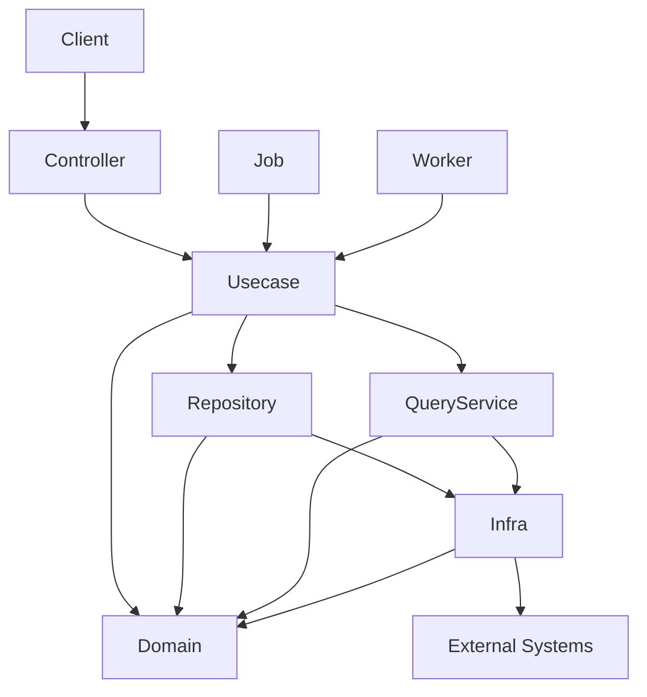

# go-boilerplate


English | [日本語](README.ja.md)

A backend base project built with **Golang × Echo × OpenAPI × PostgreSQL × Onion Architecture**.

It integrates widely used OSS — `uber/fx` (DI), `sqlc` (type-safe SQL), `golang-migrate`
(migrations), `oapi-codegen` (OpenAPI codegen) and OpenTelemetry — into a **contract-driven,
type-safe, layered backend** with production-grade concerns (background processing,
reliability, observability) already wired.

> This README is intentionally minimal. Each topic links out to the README / design doc that
> owns it — see the [Documentation Map](#documentation-map). Those documents are the source of
> truth; this page is only the entry point.

## Capabilities

Each item is a thin seam you extend; follow the link for the design and rules.

- **Onion Architecture + OpenAPI-first** — [docs/architecture.md](docs/architecture.md) / [docs/development-flow.md](docs/development-flow.md)
- **Background workers** (pull-ack, graceful drain) — [docs/design/worker.md](docs/design/worker.md)
- **Transactional Outbox** (relay / replay / GC) — [docs/design/outbox.md](docs/design/outbox.md)
- **Idempotent request handling** — [docs/design/idempotency.md](docs/design/idempotency.md)
- **Application jobs** — [docs/design/job.md](docs/design/job.md)
- **REST reliability** (timeouts / body limit / deadline budget / tx retry) — [docs/design/rest.md](docs/design/rest.md)
- **Observability** (OpenTelemetry traces / metrics / logs, config-driven) — [docs/design/observability.md](docs/design/observability.md)
- **Object storage** (vendor-neutral boundary behind an S3-compatible adapter; local container, seeding and public read delivery included) — [internal/usecase/boundary/README.md](internal/usecase/boundary/README.md) / [storage/README.md](storage/README.md)
- **Single self-contained binary** (env + migrations embedded → one image) — [docker/README.md](docker/README.md)

## Prerequisites

The following tools must be installed before running:

- [mise](https://mise.jdx.dev) — tool / runtime version manager (**required**; must be activated in your shell)
- Docker Desktop — runs PostgreSQL and other services via Docker Compose
- Make — development command entry point
- GitHub CLI (`gh`) — GitHub automation (optional but recommended)
- Visual Studio Code (recommended) — with Go / OpenAPI extensions

### Supported Platforms

This project assumes a **Unix-like development environment** (`make`, `mise`, `lefthook`,
Docker bind-mount performance all depend on POSIX shells and Linux paths).

- **macOS / Linux** — primary, supported.
- **Windows** — use **WSL2 + the Remote-WSL VSCode extension**. Native Windows is **not
  supported**. Inside WSL2 the project behaves identically to Linux.

## Quick Start

Starting from a clean machine (mise not yet installed):

```bash
git clone https://github.com/Tomy-ch/go-boilerplate.git
cd go-boilerplate

# 1. Install mise (https://mise.jdx.dev/getting-started.html), then activate it in your
#    shell — mandatory, the Make targets resolve tools through mise shims.
echo 'eval "$(mise activate zsh)"' >> ~/.zshrc   # bash: append `mise activate bash` to ~/.bashrc
# then open a new terminal (or reload your shell) so the mise shims are on PATH

# 2. Install the pinned Go runtime + dev tools, and wire git hooks.
make go-update
make install-tools
make activate-tools

# 3. Start locally (API + PostgreSQL + otel-lgtm) and initialize the DBs.
make serve
make tools
make db-init
```

`make serve` starts the API on <http://localhost:8080> and Grafana on <http://localhost:3000>.
Full setup (incl. module localization) is in
[docs/get-started/setup-repository.md](docs/get-started/setup-repository.md); every target is in
[.makefiles/README.md](.makefiles/README.md). Worker / relay / job entry points are
`make worker`, `make outbox-relay`, `make job`.

> **`mise` is the single source of truth for tool & runtime versions.** Every version (Go,
> `golangci-lint`, `sqlc`, `oapi-codegen`, `mockgen`, `lefthook`, …) is pinned in
> [`mise.toml`](mise.toml); the Dockerfiles, the local installer, and CI all install from that
> same file via `mise install <tool>`, so local and CI stay identical. `make sync-versions`
> propagates it to `go.mod` and the Dockerfile `FROM` lines.

## Example API

```bash
curl http://localhost:8080/health
```

```json
{
  "status": "ok"
}
```

## Getting Started

Before development, follow the setup steps: [docs/get-started/setup-repository.md](docs/get-started/setup-repository.md).

## Architecture Overview

This project adopts **Onion Architecture**: dependencies always point inward, the domain stays
pure and side-effect free, infrastructure implements domain interfaces, and controllers hold no
business logic.

```txt
controller → usecase → domain ← infrastructure
```



Boundaries are enforced in CI (`golangci-lint` depguard), not just documented. Full detail:
[docs/architecture.md](docs/architecture.md) and [docs/rules.md](docs/rules.md).

## Documentation Map

The source of truth lives close to the code. Start here and follow the link that owns your topic.

### Core

- [docs/index.md](docs/index.md) — documentation index
- [docs/architecture.md](docs/architecture.md) — system structure & layer responsibilities
- [docs/rules.md](docs/rules.md) — non-negotiable rules (layer deps, generated code, DTO, tx, errors)
- [docs/development-flow.md](docs/development-flow.md) — how to perform a change (API / DB / logic)
- [docs/adr/](docs/adr/README.md) — architecture decision records (ADR); technology rationale
- [docs/testing-conventions.md](docs/testing-conventions.md) — testing conventions
- [docs/project/versioning.md](docs/project/versioning.md) — versioning policy

### Subsystem design

- [docs/design/README.md](docs/design/README.md) — index
- [rest](docs/design/rest.md) · [worker](docs/design/worker.md) · [job](docs/design/job.md) · [outbox](docs/design/outbox.md) · [idempotency](docs/design/idempotency.md) · [observability](docs/design/observability.md)

### Layer READMEs (`internal/`, `pkg/`)

- [domain](internal/domain/README.md) · [usecase](internal/usecase/README.md) · [controller](internal/controller/README.md) · [infrastructure](internal/infrastructure/README.md) · [di](internal/di/README.md)
- [pkg](pkg/README.md) — shared, framework-agnostic utilities

### Contracts, data & tooling

- [openapi/README.md](openapi/README.md) — API contracts (OpenAPI-first)
- [database/README.md](database/README.md) — migrations & SQL (sqlc)
- [env/README.md](env/README.md) — environment variables (embedded per-environment)
- [.makefiles/README.md](.makefiles/README.md) — every `make` target
- [docker/README.md](docker/README.md) — images, compose profiles, single-container operation

## Directory Structure

```txt
.
├── cmd/            # Application entrypoint (Cobra subcommands)
├── internal/       # Application code (Onion Architecture)
│   ├── domain/
│   ├── usecase/
│   ├── infrastructure/
│   ├── controller/
│   ├── observability/
│   └── di/
├── pkg/            # Shared, framework-agnostic utilities
├── openapi/        # API contracts
├── database/       # Migrations & SQL (sqlc)
├── storage/        # Objects seeded into the bucket (directory layout = key layout)
├── env/            # Per-environment variables (embedded into the binary)
├── docker/
├── docs/
├── .makefiles/     # make target registry
└── makefile
```

## Stack

| Category | Technology |
| --- | --- |
| Language | Go |
| Web Framework | Echo |
| Dependency Injection | uber/fx |
| API Definition | OpenAPI + oapi-codegen |
| Database | PostgreSQL |
| Object Storage | S3-compatible (AWS SDK v2; Garage for local) |
| Query | sqlc |
| Migration | golang-migrate |
| Logging | zap (+ OpenTelemetry via otelzap) |
| Observability | OpenTelemetry (OTLP) / Prometheus |
| Testing | testify |
| CLI | cobra |
| Dev Tools | Docker / docker-compose / air |

## Branch Strategy

This repository uses a **release-centric branching model**: feature branches are cut from
`release/*`, protected branches (`develop` / `staging` / `production`) accept changes only via
release branches, and all changes go through Pull Requests. Rules: [docs/rules.md](docs/rules.md).

## Design Intent

### Why it exists

Backend projects tend to re-litigate architecture, library choice, directory layout and
workflow every time. This boilerplate provides a **baseline that reduces initial design cost**
so teams start safely and quickly. Its value is not any single library but **the integration of
widely used OSS into a coherent, replaceable architecture**.

### AI-assisted development

Constraints (enforced layering, generated-code separation, release-based branching,
OpenAPI-first, domain purity) are intentional: they keep architectural drift from AI-assisted
changes in check while remaining fully maintainable **without** AI tools. See [docs/rules.md](docs/rules.md).

### Intended system types

Designed for new backend products, PoC → early-scale phases, strict layered team development,
and systems with strong domain rules — as a **modular monolith**. Less suited to single-file
micro APIs, architecture-less prototypes, ultra-low-latency systems, or strong microservice
decomposition.

### Vendor neutrality & extensibility

Observability and tooling are OSS-first and vendor-neutral. Components under `internal/` are
loosely coupled, so DI allows infrastructure, implementations and middleware to be replaced per
runtime environment.

## Maintainer Policy / Disclaimer

This repository is **independently maintained by the author** and is not affiliated with any
organization. It is provided in good faith, but **no guarantees are made regarding security,
stability, or suitability**. Before use, verify dependency vulnerabilities, security
configuration and operational compatibility yourself.

Libraries are selected for active maintenance, community adoption, replaceability and avoidance
of strong framework lock-in. The maintainer may provide dependency updates, security fixes and
architectural improvements, but issue-response deadlines, guaranteed bug fixes and long-term
maintenance commitments are **not guaranteed**.

Planned future releases: Frontend / Infrastructure / Observability boilerplates.

## License

This project's own source code is released under the **MIT License** — see [LICENSE](LICENSE).

The container images the project ships bundle third-party OS packages from their base images —
for example the production `runtime` image is built on `alpine:3.23`, whose base packages
(`busybox`, `apk-tools`, `alpine-baselayout`, `ssl_client`, …) are licensed under
**GPL-2.0-only**. These are included as *mere aggregation*: they run as independent programs and
are **not** linked into the Go binary, so their copyleft terms do not extend to this project's
code and do **not** restrict commercial use. The only obligation is the ordinary one for
redistributing any Linux base image — make the corresponding package sources available, which
upstream Alpine already does. Image details: [docker/README.md](docker/README.md).
