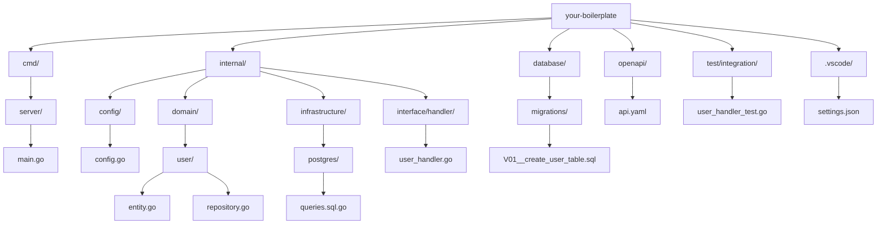

# go-boilerplate

Golang × Echo × OpenAPI × PostgreSQL × Onion Architecture によるベースプロジェクトです。
`uber/fx` による DI や `sqlc`, `golang-migrate`, `oapi-codegen` などを採用しています。

## 利用ツール(サポートバージョン)

- Go(1.24.4)
- Docker Desktop
- Github CLI
- Postman

<details>
<summary>手動インストール先のURL</summary>

下記のサイトからダウンロードして進めてください。

- [Golang](https://go.dev/dl/)
- [Docker Desktop](https://docs.docker.com/desktop/setup/install/windows-install/)
- [Github CLI](https://cli.github.com/)
- [Postman](https://www.postman.com/downloads/)

</details>

<details>
<summary>brewでのインストール方法</summary>

コピペで実行できます。

```bash
# anyenvのインストール
brew install anyenv
anyenv init
echo 'eval "$(anyenv init -)"' >> ~/.zprofile

# anyenvのupdateプラグインのインストール
mkdir -p $(anyenv root)/plugins
git clone https://github.com/znz/anyenv-update.git $(anyenv root)/plugins/anyenv-update
anyenv update

# goenvのインストール
anyenv install goenv
goenv install "$(cat .go-version)"

# dockerのインストール
brew install --cask docker

# Github CLIのインストール
brew install gh

# Postmanのインストール
brew install --cask postman
```

</details>

## 構成スタック

- **言語**: Go
- **Webフレームワーク**: Echo
- **DI**: uber/fx
- **API定義**: OpenAPI
  - **コード生成**: oapi-codegen
- **DB**: PostgreSQL
- **ORM/Query**: sqlc
- **マイグレーション**: golang-migrate
  - **マイグレーション統合**: tern
- **開発補助**:
  - godotenv
  - zap
  - testify
  - cobra（CLI）
  - air（ホットリロード）
  - Docker / docker-compose

## ディレクトリ構成

<details>
<summary>展開する</summary>



</details>

---

## 開発開始手順

```bash

```
