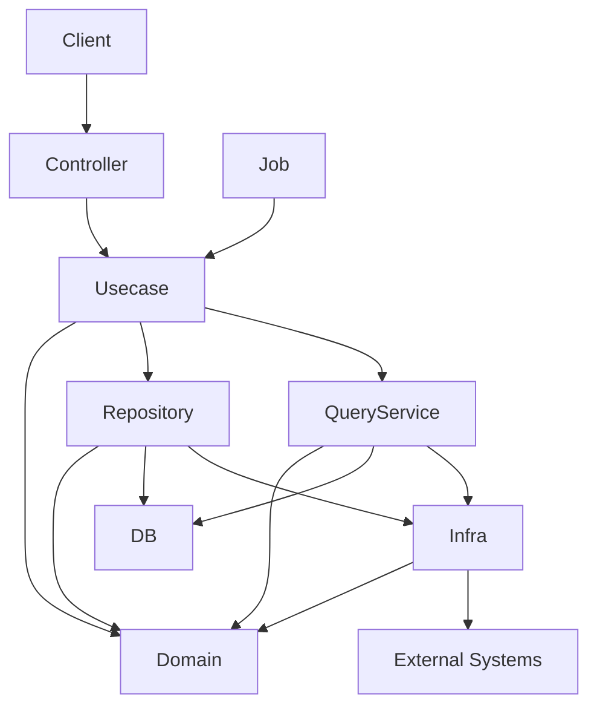

# go-boilerplate


English | [日本語](README.ja.md)

A backend base project built with **Golang × Echo × OpenAPI × PostgreSQL × Onion Architecture**.

This boilerplate integrates:

- `uber/fx` (Dependency Injection)
- `sqlc` (Type-safe SQL)
- `golang-migrate` (Schema migrations)
- `oapi-codegen` (OpenAPI code generation)

to provide a **contract-driven, type-safe, layered backend architecture**.

## Prerequisites

This project requires the following tools to be installed before running:

- Visual Studio Code (recommended)
- Docker Desktop
- Make
- GitHub CLI (gh)

### Prerequisites Notes

- Docker Desktop is required to run PostgreSQL and other services via Docker Compose.
- Make is used to simplify development commands (e.g. build, test, generate).
- GitHub CLI is used for interacting with GitHub workflows and automation (optional but recommended).
- Visual Studio Code is recommended for development, especially with Go and OpenAPI extensions.

### Supported Platforms

This project assumes a **Unix-like development environment**. The tooling (`make`, `mise`, `lefthook`, Docker bind-mount performance, etc.) depends on POSIX shells and Linux file paths.

- **macOS / Linux** — supported as primary development environments.
- **Windows** — please use **WSL2 + the Remote-WSL VSCode extension**. Running natively on Windows is **not supported**: `make`, the `mise` shim layout, and `lefthook`'s POSIX hooks all assume a Unix shell, and Docker I/O is significantly slower without the WSL2 filesystem.

Inside WSL2 the project behaves identically to Linux, including the `.vscode/settings.json` paths that reference `~/.local/share/mise/shims/`.

## Quick Start

Run the project locally in a few commands.

```bash
git clone https://github.com/Tomy-ch/go-boilerplate.git
cd go-boilerplate

make install-tools
make activate-tools
make tidy-lib
make serve
make tools
```

Initialize database:

```bash
make db-init
```

Other commands are available, see [Make Target List](.makefiles/README.md).

The API server will start locally.

## Example API

Example request:

```bash
curl http://localhost:8080/health
```

Example response:

```json
{
  "status": "ok"
}
```

## Getting Started

Before starting development, make sure to follow the setup steps.

[See Setup Instructions](./docs/get-started/setup-repository.md)

## Why This Boilerplate Exists

In backend development, each project often requires designing from scratch:

- Architecture
- Library selection
- Directory structure
- Development workflow

As a result, the same design discussions and trial-and-error processes tend to be repeated across projects.

This boilerplate provides a **baseline architecture that reduces initial design cost and enables teams to start development safely and quickly**.

It combines:

- Onion Architecture
- OpenAPI-first development
- Type-safe SQL with sqlc
- Dependency Injection
- Structural checks via CI

to provide a **contract-driven, type-safe, layered backend architecture**.

The value of this boilerplate is not tied to any specific library, but to **the integration of widely used OSS tools into a coherent architecture**.

## Architecture Overview

This project adopts **Onion Architecture**.

```txt
controller → usecase → domain ← infrastructure
```

Principles:

- Dependencies always point inward
- Domain remains pure and side-effect free
- Infrastructure implements domain interfaces
- Controllers do not contain business logic



See [docs/architecture.md](docs/architecture.md) for detailed documentation.

## API Development Policy (OpenAPI First)

This project follows an **OpenAPI-first** workflow.

API changes must follow this sequence:

1. Modify OpenAPI definition (`openapi/`)
2. Generate code

    ```sh
    make gen-api
    ```

3. Implement handler / usecase

Generated files **must never be edited manually**.

## Branch Strategy

This repository uses a **release-centric branching model**.

Rules:

- Feature branches must be created from `release/*`
- `develop`, `staging`, `production` accept changes only via release branches
- Direct commits to protected branches are prohibited
- All changes must go through Pull Requests

Benefits:

- Version consistency
- Safer release workflows
- Reduced risk when using AI-assisted development

## Directory Structure

```txt
.
├── cmd/            # Application entrypoint
├── internal/       # Application code (Onion Architecture)
│   ├── domain/
│   ├── usecase/
│   ├── infrastructure/
│   ├── controller/
│   └── di/
├── database/       # Migrations & SQL (sqlc)
├── openapi/        # API contracts
├── pkg/            # Shared utilities
├── docker/
├── docs/
└── makefile
```

## Stack

|Category|Technology|
|----------|------------|
|Language|Go|
|Web Framework|Echo|
|Dependency Injection|uber/fx|
|API Definition|OpenAPI + oapi-codegen|
|Database|PostgreSQL|
|Query|sqlc|
|Migration|golang-migrate|
|Logging|zap|
|Testing|testify|
|CLI|cobra|
|Dev Tools|Docker / docker-compose / air|

## AI-Safe Design

This boilerplate is designed for **AI-assisted development**.

Constraints are intentionally introduced to prevent unintended architectural drift.

Key mechanisms:

- Enforced layering
- Generated code separation
- Release-based branching
- OpenAPI-first API design
- Domain layer purity

These constraints help AI agents generate safer code.

## Documentation

Detailed documentation is available in `docs/`.

- [Architecture](docs/architecture.md)  
- [Development Workflow](docs/development-flow.md)  
- [Architectural Rules](docs/rules.md)  
- [Design Decisions](docs/decisions.md)  
- [Versioning Policy](docs/project/versioning.md)  

```txt
docs/
```

## Intended System Types

Designed for:

- New backend products
- PoC → early scale phase
- Strict layered team development
- Systems with strong domain rules
- Long-term maintainable backends

Not ideal for:

- Single-file micro APIs
- Rapid prototypes without architecture
- Ultra-low latency systems
- Strong microservice decomposition

This template assumes a **modular monolith architecture**.

## SaaS / Vendor Neutrality

This project intentionally avoids lock-in to specific SaaS vendors.

Observability and tooling are designed to support:

- OSS-first tooling
- Vendor-neutral architecture

## Extensibility

Components under `internal/` are loosely coupled.

Dependency Injection enables replacement of:

- Infrastructure
- Implementations
- Middleware

depending on runtime environments.

## Maintainer Policy / Disclaimer

This repository is **independently maintained by the author**.

It is not affiliated with any organization.

While provided in good faith, **no guarantees are made regarding security, stability, or suitability for specific use cases**.

Users are responsible for verifying:

- Dependency vulnerabilities
- Security configuration
- Operational compatibility

before using this template.

## Library Selection Policy

Libraries are selected based on:

- Active maintenance
- Community adoption
- Replaceability
- Avoiding strong framework lock-in

The architecture assumes **replaceable components**.

## Maintenance Policy

The maintainer may provide:

- Dependency updates
- Security fixes
- Architectural improvements

However, the following are **not guaranteed**:

- Issue response deadlines
- Guaranteed bug fixes
- Long-term maintenance commitments

## Future Boilerplates

Planned future releases:

- Frontend Boilerplate
- Infrastructure Boilerplate
- Observability Boilerplate

## AI-Agent Documentation

This repository includes documentation designed for AI agents.

However, the project remains fully maintainable **without AI tools**.

## License

MIT License

See:

```txt
LICENSE
```

## Reference

- [versioning.md](docs/project/versioning.md)
- [architecture-index.md](docs/index.md)
  - [architecture.md](docs/architecture.md)
  - [development-flow.md](docs/development-flow.md)
  - [decisions.md](docs/decisions.md)
  - [rules.md](docs/rules.md)
- [go-upgrade.md](docs/maintenance/go-upgrade.md)
- [Make Commands](.makefiles/README.md)
