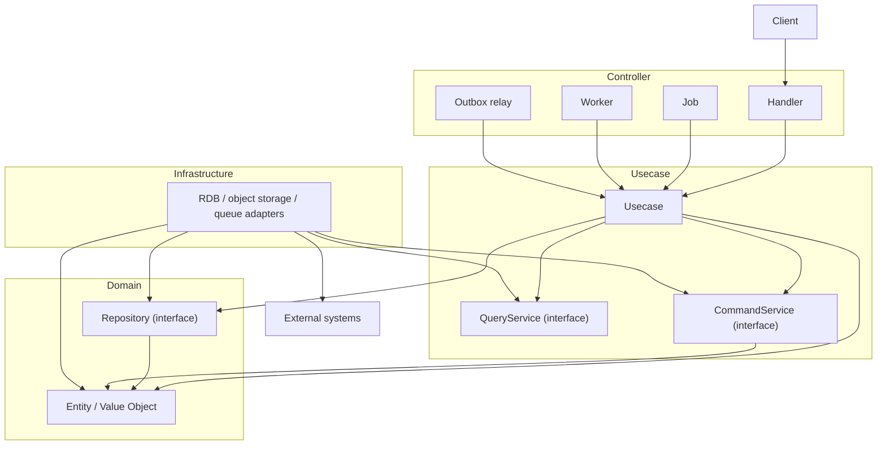

# go-boilerplate


English | [日本語](README.ja.md)

A backend base project built with **Golang × Echo × OpenAPI × PostgreSQL × Onion Architecture**.

It integrates widely used OSS — `uber/fx` (DI), `sqlc` (type-safe SQL), `golang-migrate`
(migrations), `oapi-codegen` (OpenAPI codegen) and OpenTelemetry — into a **contract-driven,
type-safe, layered backend** with production-grade concerns (background processing,
reliability, observability) already wired.

> This README is intentionally minimal. Each topic links out to the README / design doc that
> owns it — see the [Documentation Map](#documentation-map). Those documents are the source of
> truth; this page is only the entry point.
>
> **Almost every directory carries its own README.** Read the one that owns the area before
> implementing in it or investigating it — it states the responsibilities and the prohibitions that
> bound a change. **A README does not inventory what is on disk** — an editor already shows that. It
> carries what a name cannot: why a set of directories is drawn the way it is, and the convention that
> explains the rest.

## Capabilities

Each item is a thin seam you extend; follow the link for the design and rules.

- **Onion Architecture + OpenAPI-first** — [docs/architecture.md](docs/architecture.md) / [docs/development-flow.md](docs/development-flow.md)
- **Background workers** (pull-ack, graceful drain) — [docs/design/worker.md](docs/design/worker.md)
- **Transactional Outbox** (relay / replay / GC) — [docs/design/outbox.md](docs/design/outbox.md)
- **Idempotent request handling** — [docs/design/idempotency.md](docs/design/idempotency.md)
- **Application jobs** — [docs/design/job.md](docs/design/job.md)
- **REST reliability** (timeouts / body limit / deadline budget / tx retry) — [docs/design/rest.md](docs/design/rest.md)
- **Authentication** (resource-server-side JWT / JWKS verification, with a development OIDC provider) — [docs/design/auth.md](docs/design/auth.md) / [mock-auth-server/README.md](mock-auth-server/README.md)
- **Observability** (OpenTelemetry traces / metrics / logs, config-driven) — [docs/design/observability.md](docs/design/observability.md)
- **Object storage** (vendor-neutral boundary behind an S3-compatible adapter; local container, seeding and public read delivery included) — [internal/usecase/boundary/README.md](internal/usecase/boundary/README.md) / [storage/README.md](storage/README.md)
- **Single self-contained binary** (env + migrations embedded → one image) — [docker/README.md](docker/README.md)

## Scope & Non-goals

Who and what this architecture is *for* is stated in
[docs/project/scope.md](docs/project/scope.md) (and in *Intended system types* below). This section
covers the other half — what a backend eventually needs and this project **deliberately does not
ship**. None of it is unfinished work:

- **Deployment and IaC** — only a workflow skeleton; the platform is the adopter's choice
- **Rate limiting** — belongs at the infrastructure edge, because per-instance in-memory counters cannot enforce a global limit
- **Caching layer** — added as a decorator behind the existing Repository interface, so no separate cache abstraction exists to degrade into a TTL map
- **RBAC / audit logging / retention policy / PII encryption** — determined by the domain, not guessable by a template
- **Scheduled-job concurrency control** — left to the scheduler; the bundled jobs are concurrency-safe by design

Full list with the reasoning: [docs/project/out-of-scope.md](docs/project/out-of-scope.md). The
architectural non-choices are additionally recorded as ADRs tagged `setup-review`, so a new project
reviews them as one set rather than discovering them one at a time.

Authentication and authorization are the one gap that is **enforced rather than documented**:
outside `local` / `ci` / `test` the DI providers are fail-closed, so the application refuses to
start until real implementations are wired ([docs/design/auth.md](docs/design/auth.md)).

## Prerequisites

The following tools must be installed before running:

- [mise](https://mise.jdx.dev) — tool / runtime version manager (**required**; must be activated in your shell)
- Docker Desktop — runs PostgreSQL and other services via Docker Compose
- Make — development command entry point
- GitHub CLI (`gh`) — GitHub automation (optional but recommended)
- Visual Studio Code (recommended) — with Go / OpenAPI extensions

### Supported Platforms

This project assumes a **Unix-like development environment** (`make`, `mise`, `lefthook`,
Docker bind-mount performance all depend on POSIX shells and Linux paths).

- **macOS / Linux** — primary, supported.
- **Windows** — use **WSL2 + the Remote-WSL VSCode extension**. Native Windows is **not
  supported**. Inside WSL2 the project behaves identically to Linux.

## Quick Start

Starting from a clean machine (mise not yet installed):

```bash
git clone https://github.com/Tomy-ch/go-boilerplate.git
cd go-boilerplate

# 1. Install mise (https://mise.jdx.dev/getting-started.html), then activate it in your
#    shell — mandatory, the Make targets resolve tools through mise shims.
echo 'eval "$(mise activate zsh)"' >> ~/.zshrc   # bash: append `mise activate bash` to ~/.bashrc
# then open a new terminal (or reload your shell) so the mise shims are on PATH

# 2. Install the pinned Go runtime + dev tools, and wire git hooks.
make go-update
make install-tools
make activate-tools

# 3. Start locally (API + PostgreSQL + otel-lgtm) and initialize the DBs.
make serve
make tools
make db-init
```

`make serve` starts the API on <http://localhost:8080> and Grafana on <http://localhost:3000>.
Full setup (incl. module localization) is in
[docs/get-started/setup-repository.md](docs/get-started/setup-repository.md); every target is in
[.makefiles/README.md](.makefiles/README.md). Worker / relay / job entry points are
`make worker`, `make outbox-relay`, `make job`.

> **`mise` is the single source of truth for tool & runtime versions.** Every version (Go,
> `golangci-lint`, `sqlc`, `oapi-codegen`, `mockgen`, `lefthook`, …) is pinned in
> [`mise.toml`](mise.toml); the Dockerfiles, the local installer, and CI all install from that
> same file via `mise install <tool>`, so local and CI stay identical. `make sync-versions`
> propagates it to `go.mod` and the Dockerfile `FROM` lines. Tools published to PyPI are the one
> exception: they are declared and hash-locked in [`python/`](python/README.md), since a version
> pin alone would leave their dependencies unpinned.

## Example API

```bash
curl http://localhost:8080/health
```

```json
{
  "status": "ok"
}
```

## Getting Started

Before development, follow the setup steps: [docs/get-started/setup-repository.md](docs/get-started/setup-repository.md).

<!-- boilerplate-only:begin -->
## Using This as a Template

Fork it and localize it. The setup is a **scripted, gated sequence** rather than a search and
replace — [docs/get-started/setup-repository.md](docs/get-started/setup-repository.md) walks the
phases in order, and the summary below is only there to show what kind of work it is.

- **Localizing identity is verified, not trusted.** The `make setup-replace-*` targets rewrite the
  module path, repository references, app metadata, licence holder and CODEOWNERS; `make
  setup-verify` fails while any upstream identifier survives, and deletes the one-shot tooling only
  once it passes — so a half-finished localization cannot go unnoticed.
- **Two removal passes, deliberately separate.** `make setup-remove-boilerplate-identity` strips
  what holds only while this *is* the upstream template, and `make setup-remove-sample-api` strips
  the sample feature set. A fork may reasonably do one without the other: keeping the sample keeps
  the one place where the layering rules exist as working code rather than prose.
- **The decisions the template refuses to make for you** are numbered phases, not TODOs left in the
  code — authn / authz implementations, the deployment target, the dependency-licence threshold,
  whether to keep the DAST and credential-bearing scanners, and the exclusion ADRs to re-baseline.

Which statements stop being true the moment you fork, and how they are marked so a script can
remove them, is documented in
[docs/get-started/boilerplate-only-conventions.md](docs/get-started/boilerplate-only-conventions.md).

<!-- boilerplate-only:end -->
## Development Workflow

The local loop and CI run the same gates, so a green run locally means the same thing it means in
a pull request.

| Step | Command | Notes |
| --- | --- | --- |
| Generate | `make gen` | OpenAPI → server code / mocks, SQL → type-safe Go, then the docs. Generated files are never hand-edited; CI regenerates and fails on a diff. |
| Auto-fix | `make fix` | Go formatting and lint auto-fix. `make md-fix` / `make sql-fix` for Markdown and SQL. |
| Static analysis | `make lint` | golangci-lint, including the depguard rules that make the layer boundaries a build error. |
| Test | `make test` | Go tests with coverage. Run `make db-init` first — the suite expects a DB that is migrated **and** seeded. |

What is checked mechanically, so review does not have to:

- **Layer boundaries** — depguard rejects a forbidden import, and `internal/architest` asserts the structural rules as ordinary tests
- **Contract-first** — the OpenAPI document and the SQL files are the inputs; CI fails when a committed generated artifact differs from what regeneration produces
- **Commit hygiene** — lefthook runs the gates on `pre-commit` / `commit-msg` / `pre-push`, and how much runs locally is sized from the number of open worktrees, with everything deferred re-run identically in CI ([load bands](.makefiles/README.md))

Conventions: [docs/development-flow.md](docs/development-flow.md) ·
[docs/testing-conventions.md](docs/testing-conventions.md) ·
[CONTRIBUTING.md](CONTRIBUTING.md). Every target is in
[.makefiles/README.md](.makefiles/README.md); every workflow in
[.github/workflows/README.md](.github/workflows/README.md).

## Architecture Overview

This project adopts **Onion Architecture**: dependencies always point inward, the domain stays
pure and side-effect free, infrastructure implements domain interfaces, and controllers hold no
business logic.

```txt
controller → usecase → domain ← infrastructure
```

Every arrow below is a **dependency**, and each box sits in the layer that owns it:



Persistence is split into three interfaces, and they are deliberately not owned by the same
layer. `Repository` is an aggregate's own contract, so the domain owns it — and it is the only
persistence contract the domain has. `QueryService` (a read model) and `CommandService` (a
transaction tool for writes that cannot be expressed as load-modify-save) are usecase concerns
and live there.

The read and write sides are asymmetric on purpose, which is why only one of them has an arrow
into the domain: `QueryService` returns DTOs and never touches a domain type, whereas
`CommandService` receives the decided aggregate. The discriminator between all three is in
[ADR-0031 (lightweight-cqrs)](docs/adr/0031-lightweight-cqrs.md).

Boundaries are enforced in CI (`golangci-lint` depguard), not just documented. Full detail:
[docs/architecture.md](docs/architecture.md) and [docs/rules.md](docs/rules.md).

## Documentation Map

The source of truth lives close to the code. Start here and follow the link that owns your topic.

### Core

- [docs/index.md](docs/index.md) — documentation index
- [docs/architecture.md](docs/architecture.md) — system structure & layer responsibilities
- [docs/rules.md](docs/rules.md) — non-negotiable rules (layer deps, generated code, DTO, tx, errors)
- [docs/development-flow.md](docs/development-flow.md) — how to perform a change (API / DB / logic)
- [docs/adr/](docs/adr/README.md) — architecture decision records (ADR); technology rationale
- [docs/testing-conventions.md](docs/testing-conventions.md) — testing conventions
- [docs/tutorial/build-user-feature.md](docs/tutorial/build-user-feature.md) — worked example: one feature end to end
- [docs/spec/glossary.md](docs/spec/glossary.md) — business vocabulary (ubiquitous language)
- [CONTRIBUTING.md](CONTRIBUTING.md) — how to propose and land a change (branch, commit, gates, review)
- [docs/get-started/troubleshooting.md](docs/get-started/troubleshooting.md) — setup & local-run failures, and what each one actually means
- [docs/project/scope.md](docs/project/scope.md) · [docs/project/out-of-scope.md](docs/project/out-of-scope.md) — intended scope, and what is deliberately excluded
- [docs/project/policy.md](docs/project/policy.md) · [docs/project/versioning.md](docs/project/versioning.md) · [docs/project/roadmap.md](docs/project/roadmap.md) — maintenance, versioning, direction
- [docs/reference/dependencies.md](docs/reference/dependencies.md) — direct dependency inventory, one responsibility per entry
- [docs/maintenance/](docs/maintenance/db-worktree-pool.md) — operational runbooks (worktree DB pool, doc structure, upgrades)
- [docs/deployment/](docs/deployment/github-page.md) — deployment procedures (documentation portal via GitHub Pages)
- [docs/get-started/boilerplate-only-conventions.md](docs/get-started/boilerplate-only-conventions.md) — the statements that hold only while this is the upstream template <!-- boilerplate-only:line -->

### Subsystem design

- [docs/design/README.md](docs/design/README.md) — index
- [rest](docs/design/rest.md) · [worker](docs/design/worker.md) · [job](docs/design/job.md) · [outbox](docs/design/outbox.md) · [idempotency](docs/design/idempotency.md) · [observability](docs/design/observability.md)
- [auth](docs/design/auth.md) · [security](docs/design/security.md) · [context-map](docs/design/context-map.md) · [agent-environment](docs/design/agent-environment.md)

### Layer READMEs (`internal/`, `pkg/`)

- [domain](internal/domain/README.md) · [usecase](internal/usecase/README.md) · [controller](internal/controller/README.md) · [infrastructure](internal/infrastructure/README.md) · [di](internal/di/README.md)
- [pkg](pkg/README.md) — shared, framework-agnostic utilities

### Contracts, data & tooling

- [openapi/README.md](openapi/README.md) — API contracts (OpenAPI-first)
- [database/README.md](database/README.md) — migrations & SQL (sqlc)
- [storage/README.md](storage/README.md) — object-storage seed content (directory layout = key layout)
- [env/README.md](env/README.md) — environment variables (embedded per-environment)
- [.makefiles/README.md](.makefiles/README.md) — every `make` target
- [docker/README.md](docker/README.md) — images, compose profiles, single-container operation
- [scripts/README.md](scripts/README.md) — utility scripts & repository gates (codegen, docs, versioning, supply-chain pins, setup)
- [python/README.md](python/README.md) — PyPI-published CLI tools, declared and hash-locked
- [mock-auth-server/README.md](mock-auth-server/README.md) — development OIDC provider (TypeScript, deliberately a different runtime than the API)
- [docs-viewer/README.md](docs-viewer/README.md) — documentation portal frontend (renders the generated `docs/portal/docs.json`)
- [.github/workflows/README.md](.github/workflows/README.md) — CI workflows & the repository's security-control inventory

## Directory Structure

The top level is split by **what a directory is answerable for**, not by file type.

- `cmd/` — the entrypoint, and nothing else; each subcommand is a thin Cobra shell over `internal/cli/`
- `internal/` — the application, laid out by onion layer. Its own README states the layers and their dependency direction
- `pkg/` — utilities that do not know this application exists, so they stay framework-agnostic and reusable
- `openapi/` — the API contract, written before the code that serves it
- `database/` — migrations and the SQL that code generation reads
- `storage/` — objects seeded into the bucket; the directory layout is the key layout
- `env/` — per-environment variables, embedded into the binary
- `docker/` — one image or service per directory
- `docs/` — the canonical documentation, including ADRs and the design reference
- `scripts/` — repository tooling and the gates that enforce these rules
- `.github/` — workflows, composite actions, and repository settings
- `.makefiles/` — the make target registry; `makefile` only includes it
- `.agents/` — machine-readable artifacts shared by every AI tool, so no assistant owns them
- `.claude/` / `.codex/` — configuration for one assistant each

`mock-auth-server/`, `docs-viewer/`, and `python/` are supporting projects with their own toolchains:
a development OIDC provider, the documentation portal frontend, and the hash-locked PyPI CLI tools.

## Stack

| Category | Technology |
| --- | --- |
| Language | Go |
| Web Framework | Echo |
| Dependency Injection | uber/fx |
| API Definition | OpenAPI + oapi-codegen |
| Database | PostgreSQL (pgx) |
| Object Storage | S3-compatible (AWS SDK v2; Garage for local) |
| Message Queue | SQS-compatible (AWS SDK v2; ElasticMQ for local) |
| Authentication | JWT / JWKS verification (golang-jwt, go-jose) |
| Query | sqlc |
| Migration | golang-migrate |
| Logging | zap (+ OpenTelemetry via otelzap) |
| Observability | OpenTelemetry (OTLP) / Prometheus |
| Testing | testify / uber-go/mock |
| CLI | cobra |
| Dev Tools | Docker / docker-compose / air |

## Branch Strategy

This repository uses a **release-centric branching model**: feature branches are cut from
`release/*`, protected branches (`develop` / `staging` / `production`) accept changes only via
release branches, and all changes go through Pull Requests. Rules: [docs/rules.md](docs/rules.md).

## Security

**Reporting a vulnerability** — do not open a public issue. Use the private advisory route in
[.github/SECURITY.md](.github/SECURITY.md), which also documents how to verify a released image
before deploying it (cosign signature, build provenance, SBOM attestation) and how to make that
verification a deploy gate.

The posture, the threat model it is shaped by, and its **stated limits** are in
[docs/design/security.md](docs/design/security.md). Controls sit at four places, and each mechanism
is deliberately one of *enforcement* / *detection* / *deterrence* rather than a blur of all three:

- **What CI executes** — Actions pinned to a SHA and base images to a digest, resolved through
  lockfiles that are the single source of truth, plus a per-job egress allowlist. Fail-closed.
- **What the code links** — cooldown windows that keep a freshly published version out of reach
  until it has aged, and vulnerability scanning across several independent databases.
- **What the service does with a request** — deny-by-default at each boundary (outbound dial guard,
  error-detail exposure), with request validation and authentication driven from the OpenAPI
  document, which makes reviewing the spec diff part of reviewing the security posture.
- **What must never be committed** — two secret scanners chosen for different failure modes, and
  one rule above convenience: a detected secret's value never reaches a log, a PR comment, or an
  artifact.

Reporting and gating are split on purpose. An ordinary pull request **reports** — findings reach
code scanning without turning an unrelated change red — while promotion into `develop` / `staging`
/ `production` is **gated** by a fixed set of required checks. Which mechanism does which:
[.github/workflows/README.md](.github/workflows/README.md).

Out of reach: what runs on a developer's own machine — see *Out of scope: developer-machine
hygiene* below.

## Design Intent

<!-- boilerplate-only:begin -->
### Why it exists

Backend projects tend to re-litigate architecture, library choice, directory layout and
workflow every time. This boilerplate provides a **baseline that reduces initial design cost**
so teams start safely and quickly.

Its value is not any single library but **the integration of widely used OSS, design principles
and development constraints into a coherent whole, each kept as loosely coupled and as
replaceable as it can be**.

<!-- boilerplate-only:end -->
### Opinionated, but replaceable

This repository holds a deliberate design position, and avoids baking that position implicitly
into the code. Design intent, responsibilities, invariants and extension points are stated in
the README / Design Reference / ADR that owns them, and the boundaries that can be decided
mechanically are enforced by lint, architecture tests, and generation / drift checks.

The goal is not to forbid every other design. It is to keep it **traceable which premise
conflicts, and what has to be rewritten**, when a requirement does not fit the existing
position. Changing the design itself is possible — it is simply the most expensive kind of
extension, because the artifacts that explain and verify that design have to change with the
code.

### Making change observable

What is tracked here is not only the *result* of a change, but its **reason, blast radius, and
the properties it must preserve**. Design decisions are owned by an ADR, subsystem roles and
state transitions by the Design Reference, local contracts by a package README, and
mechanically decidable constraints by tooling.

Together they aim to make the following answerable without reading the code line by line:

- why an implementation has the shape it has
- which design decision it rests on
- what is affected when a given boundary changes
- whether the implementation or the design document is the side that drifted

### Feeding implementation back into design

A design is a hypothesis, and the constraints and breakages that surface during implementation
and review are observations against it.

A bug or an architectural deviation is therefore not only fixed where it appeared: where the
cause has recurrence value, it is investigated, triaged, and reflected back into an ADR, the
Design Reference, a README, or tooling.

Not every individual problem is promoted into a rule — **only causes that carry reuse value
across several places or implementations are kept as design assets**.

### AI-assisted development

This project assumes it can be **fully developed and maintained without AI**. There is no
AI-specific architecture: the design, contracts and verification mechanisms are written for
humans, and agents are given access to those same ones.

Layer boundaries, generated code, the OpenAPI contract, ADRs, the Design Reference and the
per-package READMEs are reused as agent context; properties that can be decided mechanically
are checked by tooling, and judgements that require reading are checked by review signal.

The aim is not to widen AI's freedom. It is to **narrow the search space deliberately within
decisions that have already been approved, and return only the changes that need a design
decision to a human** — so that the speed of AI assistance is available without making the
foundation itself depend on a particular model, vendor or agent.

See [docs/design/agent-environment.md](docs/design/agent-environment.md) /
[docs/rules.md](docs/rules.md).

#### Agent compatibility

Agent-specific configuration is treated as part of the repository's maintained development
system, not as disposable local state. Repository-owned skills, hooks and automation may therefore
need to evolve together with the code and the constraints they enforce.

**Codex CLI currently has a limitation for fully autonomous harness maintenance.** Under its
`workspace-write` sandbox, repository-local `.agents/` and `.codex/` directories are protected as
read-only paths, and there is currently no supported per-repository override that keeps the
workspace sandbox enabled while allowing those paths to be maintained by the agent.

Codex remains usable for ordinary implementation, review and other changes within the writable
workspace. However, workflows that must update repository-owned skills, Codex hooks or other
automation under `.agents/` / `.codex/` cannot currently complete end to end without additional
user intervention or broader sandbox permissions. For that reason, Codex CLI is **therefore
considered partially supported for agent-driven development: ordinary implementation workflows are
supported, while fully autonomous workflows that maintain the repository's own agent harness are
not**.

This is an agent-runtime limitation rather than an architectural dependency of this project; the
repository does not require Codex, and the restriction can be removed from this documentation once
Codex provides a safe repository-scoped mechanism for explicitly trusted writable paths.

### Intended system types

Designed for new backend products, PoC → early-scale phases, strict layered team development,
and systems with strong domain rules — as a **modular monolith**. Less suited to single-file
micro APIs, architecture-less prototypes, ultra-low-latency systems, or strong microservice
decomposition.

### Vendor neutrality & extensibility

Observability and tooling are OSS-first and vendor-neutral. Components under `internal/` are
loosely coupled, so DI allows infrastructure, implementations and middleware to be replaced per
runtime environment.

### Out of scope: developer-machine hygiene

Supply-chain defence here stops at the repository: dependency cooldown windows, pinned actions and
base images, SBOM and vulnerability scanning. What runs on a *developer's* laptop — globally
installed packages, editor and browser extensions, agent/MCP configuration — is outside a project
template's reach and belongs to whoever administers those machines.

If you need to answer "an advisory names this package and version; which of our machines match right
now?", [`perplexityai/bumblebee`](https://github.com/perplexityai/bumblebee) is a read-only endpoint
scanner built for exactly that question. It is mentioned as a pointer, not a dependency — nothing
here installs, invokes or requires it, and note that it needs an exposure catalog of its own to flag
anything.

## Maintainer Policy / Disclaimer

This repository is **independently maintained by the author** and is not affiliated with any
organization. It is provided in good faith, but **no guarantees are made regarding security,
stability, or suitability**. Before use, verify dependency vulnerabilities, security
configuration and operational compatibility yourself.

Libraries are selected for active maintenance, community adoption, replaceability and avoidance
of strong framework lock-in. The maintainer may provide dependency updates, security fixes and
architectural improvements, but issue-response deadlines, guaranteed bug fixes and long-term
maintenance commitments are **not guaranteed**.

### This repository's branch-rule exception

The template declares code-owner review and seven required status checks in
`.github/settings/branch-protection.json`. This repository applies them with single-maintainer
relaxations: no approving review or last-push approval is required, unresolved review threads do
not block, and rebase merge is allowed. The seven status checks and CODEOWNERS review remain
required. This is this repository's operational state, not a recommendation for a derived project;
replace or remove this subsection when rewriting this README during setup.

<!-- boilerplate-only:begin -->
Planned future releases: Frontend / Infrastructure / Observability boilerplates — see
[docs/project/roadmap.md](docs/project/roadmap.md).

<!-- boilerplate-only:end -->
## License

This project's own source code is released under the **MIT License** — see [LICENSE](LICENSE).

The container images the project ships bundle third-party OS packages from their base images —
for example the production `runtime` image is built on `alpine:3.24`, whose base packages
(`busybox`, `apk-tools`, `alpine-baselayout`, `ssl_client`, …) are licensed under
**GPL-2.0-only**. These are included as *mere aggregation*: they run as independent programs and
are **not** linked into the Go binary, so their copyleft terms do not extend to this project's
code and do **not** restrict commercial use. The only obligation is the ordinary one for
redistributing any Linux base image — make the corresponding package sources available, which
upstream Alpine already does. Image details: [docker/README.md](docker/README.md).
