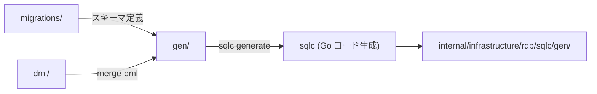

# database

[English](README.md) | 日本語

`database/` は、**データベース関連のすべての成果物**を格納するディレクトリです。

マイグレーション、sqlc 用 DML、シードデータ、および生成物を管理します。

## ディレクトリ構成

```text
database/
├── migrations/   # DDL マイグレーションファイル（golang-migrate）
├── dml/          # sqlc コード生成の元となる SQL ファイル
├── seed/         # 非本番環境向けシードデータ（トランザクション系）
└── gen/          # 自動生成された SQL（編集禁止）
```

## サブディレクトリの役割

|ディレクトリ|内容|生成コマンド|編集|
|---|---|---|---|
|`migrations/`|スキーマ定義（CREATE TABLE 等）|`make new-migrate-<name>`|手動作成|
|`dml/`|sqlc 用クエリ（SELECT / INSERT 等）|—|手動作成|
|`seed/`|開発・テスト用の初期データ|—|手動作成|
|`gen/`|`dml/` から merge-dml で生成された SQL + スキーマダンプ|`make gen-query`|**編集禁止**|

## データのライフサイクル



1. `migrations/` でスキーマを定義・適用
2. `dml/` にクエリを記述
3. `make gen-query` で `gen/` に SQL をマージし、sqlc で Go コードを生成
4. 生成コードは `internal/infrastructure/rdb/sqlc/gen/` に配置

## 関連コマンド

|コマンド|説明|
|---|---|
|`make db-migrate-up DB=<name>`|マイグレーション適用|
|`make db-migrate-down DB=<name>`|マイグレーションロールバック|
|`make new-migrate-<name>`|新規マイグレーションファイル生成|
|`make gen-query`|DML マージ + sqlc コード生成|
|`make db-seed`|シードデータ投入|

## 詳細

- [migrations/README.ja.md](migrations/README.ja.md) — マイグレーションのルールと命名規則
- [dml/README.ja.md](dml/README.ja.md) — sqlc DML の構成と記法
- [seed/README.ja.md](seed/README.ja.md) — シードデータの目的と注意点
