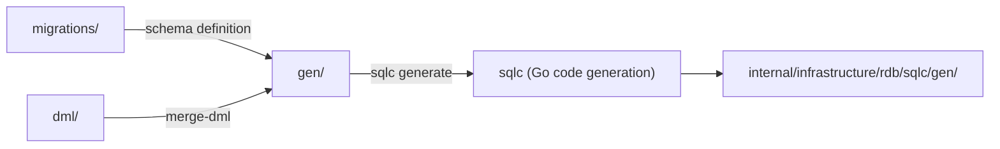

# database

English | [日本語](README.ja.md)

`database/` stores **all database-related artifacts**.

It manages migrations, sqlc DML sources, seed data, and generated outputs.

## Directory Structure

```text
database/
├── migrations/   # DDL migration files (golang-migrate)
├── dml/          # SQL source files for sqlc code generation
├── seed/         # Seed data for non-production environments (transactional)
└── gen/          # Auto-generated SQL (do not edit)
```

## Subdirectory Roles

|Directory|Content|Generation Command|Editing|
|---|---|---|---|
|`migrations/`|Schema definitions (CREATE TABLE, etc.)|`make new-migrate-<name>`|Manual|
|`dml/`|sqlc queries (SELECT / INSERT, etc.)|—|Manual|
|`seed/`|Initial data for development and testing|—|Manual|
|`gen/`|SQL merged from `dml/` via merge-dml + schema dump|`make gen-query`|**Do not edit**|

## Data Lifecycle



1. Define and apply schema in `migrations/`
2. Write queries in `dml/`
3. Run `make gen-query` to merge SQL into `gen/` and generate Go code via sqlc
4. Generated code is placed in `internal/infrastructure/rdb/sqlc/gen/`

## Related Commands

|Command|Description|
|---|---|
|`make migrate-up`|Apply migrations|
|`make migrate-down`|Rollback migrations|
|`make new-migrate-<name>`|Generate new migration files|
|`make gen-query`|Merge DML + sqlc code generation|
|`make db-seed`|Insert seed data|

## Details

- [migrations/README.md](migrations/README.md) — Migration rules and naming conventions
- [dml/README.md](dml/README.md) — sqlc DML structure and syntax
- [seed/README.md](seed/README.md) — Seed data purpose and notes
