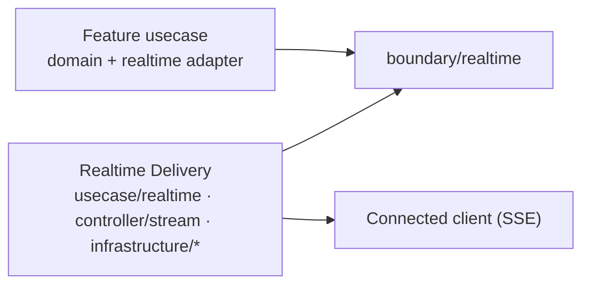

# ADR-0071: server→client のイベント配送に、独立した駆動機構 Realtime Delivery を採用する

## ステータス

accepted

## 背景

問い合わせへの返信が会話に現れる、お知らせが受信箱に届く——起きた瞬間にサーバーが接続中のクライアントへ
イベントを push する必要がある feature がある。クライアントの polling では代わりにならない。既存の駆動
アダプター（[ADR-0005]）のどれも、その機構ではない。

- **REST** は短命のリクエストを扱う。長寿命の Server-Sent Events（SSE）応答は、REST scaffold が全パスに
  掛けている request timeout、JSON 強制 middleware、汎用 request logging から逃れなければならない。
- **Worker** は queue の pull-ack consumer である。[ADR-0051] は streaming-log の消費をその port から
  除外し、「根本的に別のエンジン」に属すると述べた——そのエンジンが何であるかは述べずに。
- **Job** は listener を持たない one-shot の CLI プロセスである。

欠けている機構をどう導入するかには 2 つの圧力がかかる。1 つは、最初に必要とする feature（問い合わせ
チャット）の内側に作ること。これはチャットの形をした機構を生み、次の feature（お知らせ、告知）が作り直す
ことになる。もう 1 つは、新しい**層**として導入すること——機構が永続化・メッセージング・HTTP に同時に
触れるからと、usecase 層と infrastructure の間に `core` / `platform` / `foundation` package を置くこと。
責務ではなく容器の名で呼ばれる層は、[ADR-0002] が onion から外している構造そのものである。

3 つ目の圧力はより見えにくい。この機構は crash 後に instance ごとの resource を回収するために instance の
生存記録を必要とし、生存記録は [ADR-0111] が意図的に延期した lease に似ている。realtime 配送のために
それを作ることが、あの決定を再開したと読まれてはならない。

## 決定

feature が commit 済みのイベントを受け取り、接続中のクライアントへ配送し、切断後の replay を提供する
機構——**Realtime Delivery**——を、REST / Worker / Job と並ぶ **第 4 の駆動機構** として採用する。
既存の onion の内側に置き、新しい層は設けない。

機構は何をするかで名付ける。容器名（`core`、`base`、`common`、`shared`、`platform`、`foundation`）は、
この機構にも、それが導入するどの package にも使わない。

### 配置

| 責務 | package |
| --- | --- |
| feature 非依存の契約: `DeliveryEvent`、stream ごとの sequence allocator、event-log / stream-ticket / instance-lease の store、失効 seam | `internal/usecase/boundary/realtime/` |
| transport を要しない orchestration: ticket の発行 / 検証、cursor 検証、replay 読み出し、lease と cleanup | `internal/usecase/realtime/` |
| 長寿命 transport: connection registry、replay と catch-up のスケジューリング、heartbeat、backpressure、drain、control-event protocol | `internal/controller/stream/` |
| store と fan-out substrate | `internal/infrastructure/eventlog/`、`internal/infrastructure/streamticket/`、`internal/infrastructure/instancelease/`、`internal/infrastructure/realtime/` |

イベントを配送してほしい feature は、自分の domain / usecase package（`internal/domain/<aggregate>`、
`internal/usecase/<feature>`）をそのまま持ち、自分の側に **realtime adapter**（`internal/usecase/<feature>/`）
を足す。adapter は feature の commit 済み変更を destination 宛ての `DeliveryEvent` に変換し、同じ業務
transaction の中で機構の allocator から stream-local sequence を得て（sequence 行は outbox 行と並ぶ機構の
状態であり、feature の aggregate の field には決してならない）、transactional outbox（[ADR-0054]）経由で
emit する。
Realtime Delivery は feature の語彙を決して知らない: `thread`、`message`、`notice`、`operator`、event type
による `switch` は、その型・分岐・package 名のどこにも現れない。見えるのは event、destination、stream、
subject、sequence、opaque な payload だけである。

### 依存方向は機械的に強制する

feature 側は `boundary/realtime` を import する。Realtime Delivery は `internal/domain/<feature>` も
`internal/usecase/<feature>` も import しない。この方向は `depguard` と architecture test が機械的に検査する
——ここに書くだけではない。

### instance lease は lease 再設計ではない

Realtime Delivery は serve instance ごとの生存（heartbeat、expiry、conditional write による cleanup 所有権）
を記録し、instance が自分のために作った queue と subscription を crash 後に回収できるようにする。その記録
——`boundary/realtime` の `InstanceLeaseStore`——は realtime infrastructure の lifecycle のためだけに存在
する。distributed lock でも、leader election でも、singleton-execution primitive でもなく、import できるのは
realtime package 群、realtime DI module、orphan-cleanup job の入口だけである（architecture test が
allowlist を強制する）。

したがってこれは、outbox relay を lease-based claim へ再設計する前に [ADR-0111] が待つ運用エビデンスには
**数えない**。2 つの機構は別の resource（instance ごとの queue と outbox 行）を別の障害（instance の死と
2 つの relay による同一行 claim）から守っており、片方が存在することは、もう片方が必要かどうかについて
何も言わない。

## 影響

### ポジティブな影響

- 2 つ目の realtime feature——お知らせ、告知——は、自分の側の新しい adapter・event schema・ticket 発行
  endpoint で済む。`realtime/` と `stream/` の下は何も変わらず、変えようとすれば architecture test が落ちる。
- 最初にこの機構を使う sample feature は、機構を残したまま削除できる。adapter が 0 件なら serve graph は
  stream runtime を起動せず、event-log と fan-out substrate を要求しない。
- [ADR-0051] の開いていた一文が閉じる。push / streaming 配送のための「根本的に別のエンジン」はこの機構
  であり、worker port はあの決定が意図したとおり狭いままでいられる。
- onion は 4 層のまま。機構を読むのに新しい層の語彙は要らない。

### ネガティブな影響

- 機構は 3 層と 4 つの infrastructure package に跨るため、端から端まで理解するには複数の package README を
  読むことになる。その narrative を担うために design reference がある。
- feature 非依存の代償は feature 側が払う。consumer ごとに adapter、event schema、ticket 発行の認可を自前で
  書き、チャット形の既定を継承することはない。
- `InstanceLeaseStore` の import allowlist は守り続けるべき規則であり、汎用 lease を欲しがる将来の読者は
  「再利用するな」と言われた lease 形の型を見つけることになる。

## 検討した代替案

### worker port を streaming 消費へ拡張する

[ADR-0051] が却下済みで、理由もそこにある: pull-ack と streaming を覆う port は protocol 詳細を漏らすか、
worker engine が依拠する Ack / Nack / Extend の保証を弱める。本 ADR が、あの決定が指し示した別のエンジン
である。

### `core` / `platform` 層を導入する

却下。その名はコードがどこに置かれるかを言い、何に責任を持つかを言わない。[ADR-0002] の onion にそのような
輪は無く、後続のどの機構にも輪を足す前例を与えてしまう。

### 最初の feature の内側に機構を作る

却下。チャット形の event log、ticket、stream は、コピーするか後から一般化するかしないと次の feature で
再利用できない——そして後からの一般化こそが、`thread` という語を知ってはならない package に `thread` が
入り込む経路である。

### 生存記録を lease / lock / leader-election primitive へ一般化する

却下。[ADR-0111] と [ADR-0109] を、どちらも求める運用エビデンス無しに再開することになり、realtime の
cleanup に使う以上に広い API を与えることになる。狭い store と import allowlist が、扉を機械的に閉じる。

## 備考

- 設計正本: `docs/design/realtime-delivery.md`（役割理論、状態遷移、配置計画、integrator 契約、機構の用語集）。
- 対の決定: [ADR-0072]（現在状態は PostgreSQL、replay は有限の event log）、[ADR-0073]（serve instance
  への fan-out）、[ADR-0074]（stream 認証）。
- 関連: [ADR-0005]（REST / Worker / Job は駆動アダプター）、[ADR-0002]（onion）、[ADR-0051]（本機構が
  解消する worker port の除外）、[ADR-0111]（outbox relay hardening の延期。instance lease はその trigger
  と無関係）、[ADR-0109]（job の並行制御は scheduler へ。orphan-cleanup job もそれに従う）。
- 追跡: 実装は親 issue の各フェーズに分かれる。architecture test と import allowlist は runtime と一緒に入る。

[ADR-0002]: 0002-onion-architecture.ja.md
[ADR-0005]: 0005-driving-adapters-not-split-axis.ja.md
[ADR-0051]: 0051-out-of-scope-push-streaming-brokers.ja.md
[ADR-0054]: 0054-transactional-outbox.ja.md
[ADR-0072]: 0072-postgres-state-dynamodb-eventlog.ja.md
[ADR-0073]: 0073-sns-sqs-instance-fanout.ja.md
[ADR-0074]: 0074-query-ticket-stream-authentication.ja.md
[ADR-0109]: 0109-scheduled-job-concurrency-delegated.ja.md
[ADR-0111]: 0111-outbox-relay-hardening-delegated.ja.md
