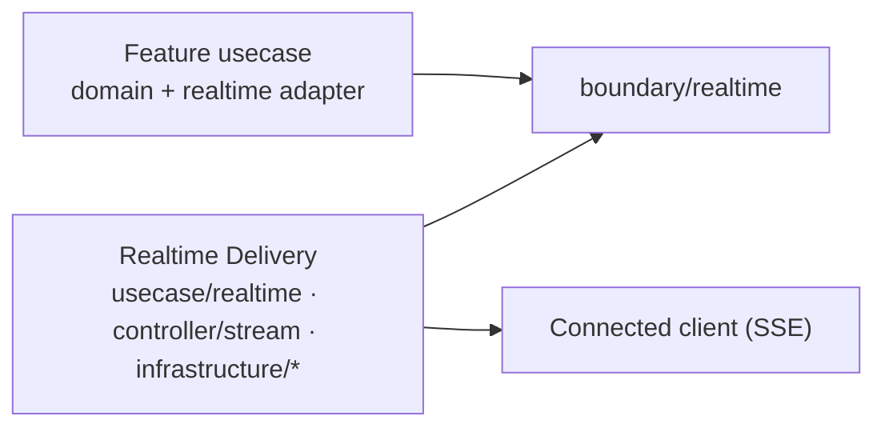

# ADR-0071: Adopt Realtime Delivery as an independent driving mechanism for server-to-client event delivery

## Status

accepted

## Context

Some features need the server to push an event to a connected client the moment it happens — a
reply appearing in a support conversation, a notice landing in an inbox — instead of the client
polling for it. None of the existing driving adapters ([ADR-0005]) is that mechanism:

- **REST** serves short-lived requests. A long-lived Server-Sent Events (SSE) response has to escape
  the request timeout, the JSON-forcing middleware, and the generic request logging that the REST
  scaffold applies to every path.
- **Worker** is a pull-ack consumer of a queue. [ADR-0051] already excludes streaming-log
  consumption from that port and names "a fundamentally different engine" as where it belongs —
  without saying what that engine is.
- **Job** is a one-shot CLI process with no listener at all.

Two pressures shape how the missing mechanism is introduced. The first is to build it inside the
first feature that needs it (a support chat), which produces a chat-shaped mechanism that the next
feature (notices, announcements) has to rebuild. The second is to introduce it as a new *layer* —
a `core` / `platform` / `foundation` package that sits between the usecase layer and the
infrastructure — because the mechanism touches persistence, messaging, and HTTP at once. A layer
named for a container rather than for a responsibility is exactly the structure [ADR-0002] leaves
out of the onion.

A third pressure is subtler: the mechanism needs an instance-liveness record to reclaim
per-instance resources after a crash, and a liveness record looks like the lease that
[ADR-0111] deliberately deferred. Building one for realtime delivery must not read as having
reopened that decision.

## Decision

We adopt **Realtime Delivery** — the mechanism that takes an event a feature has already committed
and delivers it to connected clients, with replay after disconnection — as the **fourth driving
mechanism** beside REST, Worker, and Job. It is placed inside the existing onion; no new layer is
introduced.

The mechanism is named for what it does. Container names (`core`, `base`, `common`, `shared`,
`platform`, `foundation`) are not used for it or for any package it introduces.

### Placement

| Responsibility | Package |
| --- | --- |
| Feature-neutral contracts: `DeliveryEvent`, the event-log, stream-ticket, and instance-lease stores, the revocation seam | `internal/usecase/boundary/realtime/` |
| Orchestration that needs no transport: ticket issue / verify, cursor validation, replay reads, lease and cleanup | `internal/usecase/realtime/` |
| The long-lived transport: connection registry, replay and catch-up scheduling, heartbeat, backpressure, drain, the control-event protocol | `internal/controller/stream/` |
| The stores and the fan-out substrate | `internal/infrastructure/eventlog/`, `internal/infrastructure/streamticket/`, `internal/infrastructure/instancelease/`, `internal/infrastructure/realtime/` |

A feature that wants its events delivered keeps its own domain and usecase packages
(`internal/domain/<aggregate>`, `internal/usecase/<feature>`) and adds a **realtime adapter** on
its own side — in `internal/usecase/<feature>/` — that turns the feature's committed change into
a `DeliveryEvent` addressed to a destination, allocates the stream-local sequence inside the same
business transaction, and emits it through the transactional outbox ([ADR-0054]). Realtime Delivery
never learns the feature's vocabulary: no `thread`, `message`, `notice`, `operator`, or event-type
`switch` appears in its types, branches, or package names. It sees an event, a destination, a
stream, a subject, a sequence, and an opaque payload.

### Dependency direction, enforced

The feature side imports `boundary/realtime`. Realtime Delivery imports no `internal/domain/<feature>`
and no `internal/usecase/<feature>`. This direction is checked mechanically — by `depguard` and the
architecture tests — not only described here.

### The instance lease is not a lease redesign

Realtime Delivery records each serve instance's liveness (heartbeat, expiry, cleanup ownership via a
conditional write) so that the queue and subscription an instance created for itself can be
reclaimed after a crash. That record — `InstanceLeaseStore` in `boundary/realtime` — exists only
for realtime infrastructure lifecycle. It is not a distributed lock, not a leader election, not a
singleton-execution primitive, and it may be imported only by the realtime packages, the realtime
DI module, and the orphan-cleanup job entry point (an allowlist the architecture tests enforce).

It therefore does **not** count as the operational evidence [ADR-0111] waits for before the outbox
relay is redesigned around a lease-based claim. The two mechanisms guard different resources
(per-instance queues versus outbox rows) against different failures (an instance dying versus two
relays claiming one row); one existing says nothing about whether the other is needed.

## Consequences

### Positive Consequences

- A second realtime feature — notices, announcements — is a new adapter, a new event schema, and a
  new ticket-issuing endpoint on its own side. It changes nothing under `realtime/` or `stream/`;
  the architecture tests fail if it tries to.
- The sample feature that first uses the mechanism can be removed without removing the mechanism:
  with zero adapters wired, the serve graph does not start the stream runtime and does not require
  the event-log or fan-out substrate.
- [ADR-0051]'s open sentence is closed: the "fundamentally different engine" for pushed and
  streamed delivery is this mechanism, so the worker port stays exactly as narrow as that decision
  intended.
- The onion keeps four layers. Reading the mechanism requires no new layering vocabulary.

### Negative Consequences

- The mechanism spans three layers and four infrastructure packages, so understanding it end to end
  means reading more than one package README; the design reference exists to carry that narrative.
- Feature neutrality is paid for on the feature side: each consumer writes its own adapter, its own
  event schema, and its own authorization for ticket issuance rather than inheriting a chat-shaped
  default.
- The import allowlist around `InstanceLeaseStore` is a rule that has to be kept, and a future
  reader who wants a general lease will find a lease-shaped type they are told not to reuse.

## Alternatives Considered

### Extend the worker port to streaming consumption

Rejected by [ADR-0051], and for the reason it gives: a port covering pull-ack and streaming leaks
protocol details or weakens the Ack / Nack / Extend guarantees the worker engine relies on. This
ADR is the separate engine that decision pointed at.

### Introduce a `core` / `platform` layer

Rejected. The name would say where the code sits, not what it is responsible for; [ADR-0002]'s
onion has no such ring, and every later mechanism would have a precedent for adding one.

### Build the mechanism inside the first feature

Rejected. A chat-shaped event log, ticket, and stream cannot be reused by the next feature without
either copying it or generalizing it after the fact — and generalizing after the fact is how a
`thread` ends up in a package that should not know the word.

### Generalize the liveness record into a lease / lock / leader-election primitive

Rejected. It would reopen [ADR-0111] and [ADR-0109] without the operational evidence either asks
for, and it would give the realtime cleanup a wider API than it uses. The narrow store plus an
import allowlist keeps the door closed mechanically.

## Notes

- Design reference: `docs/design/realtime-delivery.md` (role theory, state transitions, planned
  implementation locations, the integrator contract, and the mechanism glossary).
- Companion decisions: [ADR-0072] (current state in PostgreSQL, replay in a bounded event log),
  [ADR-0073] (fan-out to serve instances), [ADR-0074] (stream authentication).
- Related: [ADR-0005] (REST / Worker / Job as driving adapters), [ADR-0002] (onion),
  [ADR-0051] (the worker port's exclusion this mechanism resolves), [ADR-0111] (outbox relay
  hardening deferred; the instance lease is unrelated to its trigger), [ADR-0109] (job
  concurrency delegated to the scheduler; the orphan-cleanup job follows it).
- Tracking: implementation is split across the phases of the parent issue; the architecture tests
  and the import allowlist land with the runtime.

[ADR-0002]: 0002-onion-architecture.md
[ADR-0005]: 0005-driving-adapters-not-split-axis.md
[ADR-0051]: 0051-out-of-scope-push-streaming-brokers.md
[ADR-0054]: 0054-transactional-outbox.md
[ADR-0072]: 0072-postgres-state-dynamodb-eventlog.md
[ADR-0073]: 0073-sns-sqs-instance-fanout.md
[ADR-0074]: 0074-query-ticket-stream-authentication.md
[ADR-0109]: 0109-scheduled-job-concurrency-delegated.md
[ADR-0111]: 0111-outbox-relay-hardening-delegated.md
