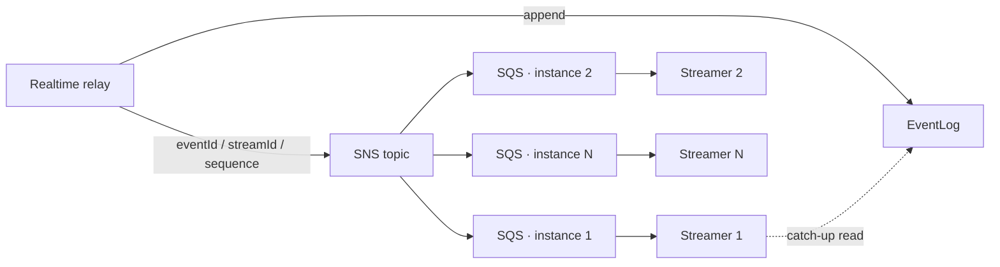

# ADR-0073: realtime の wakeup は SNS から instance ごとの SQS queue へ fan-out する

## ステータス

accepted

## 背景

EventLog（[ADR-0072]）へ event を append する serve instance と、その event を受け取るべき SSE 接続を
持つ instance は、一般に別である。したがって全 instance が「stream S に sequence N 以降がある」を速やかに
知る必要があり、機構は subscription を登録したまま instance が死ぬことにも耐えなければならない。

この通知が *何でないか* が決定の形を決める。配送経路ではない: クライアントに配るのは EventLog だけであり、
通知の欠落や重複は無害でなければならない。user ごとの channel でもない: browser ごとの queue は resource 数を
接続数に連動させ、crash 後の cleanup は何千もの queue を探して削除することになる。

## 決定

**standard SNS → standard SQS、serve instance ごとに queue と subscription を 1 組。**

- realtime relay は EventLog への append が成功するたびに 1 つの SNS topic へ publish する。通知に載せるのは
  `eventId / streamId / sequence` だけで、payload は載せない。
- 各 serve instance は起動時に自分の SQS queue を作って topic に subscribe し（`RawMessageDelivery=true`、
  queue policy はその topic の ARN だけを許可）、稼働中は消費し、停止時に unsubscribe して削除する。
- 通知は **wakeup** である:「stream S を、持っている cursor の後から読み直せ」。状態を運ばないので、
  重複は同じ catch-up read に畳まれ、欠落は periodic catch-up（全 active stream に対して 30 秒ごと、
  jitter 付き）が覆う。どちらにも inbox や dedup record は要らない。
- 各 instance は **instance lease** を heartbeat し（30 秒 heartbeat、2 分 expiry）、crash した instance が
  残した queue と subscription を検出・回収できるようにする——5 分の safety margin の後、DynamoDB の
  conditional update で取った cleanup 所有権の下で、unsubscribe → queue 削除 → lease 削除の順に。lease は
  この回収のためだけに存在する（[ADR-0071] がその範囲と import allowlist を固定する）。

ローカルの substrate はこの機構専用の SNS/SQS emulator であり、worker 自身の queue emulator は共有しない。
emulator が SDK と wire 互換でない箇所は、その呼び出しだけに local compatibility implementation を足し、
第 2 の protocol adapter は作らない。

## 影響

### ポジティブな影響

- 1 回の publish が全 instance に届く。作り、監視し、回収する対象の数は instance 数であって接続数ではない。
- 通知の欠落は latency を最大 catch-up 間隔 1 回分悪化させるだけで、event を失うことはない。
- inbox table も dedup store も consumer 側の idempotency record も無い。wakeup の意味が重複を無料にする。
- cleanup せずに死んだ instance が残す resource は、有界で、所有権のある、順序付きの手順で回収され、
  蓄積しない。

### ネガティブな影響

- topic は event ごとに 1 publish を見る。event rate が高いと fan-out のコストは event 数 × instance 数で
  伸びる。機構は wakeup のバッチ化を提供しない。
- queue と subscription の lifecycle が serve の起動と停止の一部になる。起動は subscription の存在を待って
  から ready を報告し、停止は consumer を止める前に SSE を drain しなければならない。serve instance は
  REST だけのものより両端でやることが増える。
- orphan-cleanup job とその lease は、operator が知るべき scheduled process と table を 1 つずつ増やす。
- ローカル emulator は shared infrastructure profile のコンテナを 1 つ増やす。

## 検討した代替案

### user ごと / browser ごとの queue

却下。resource 数が接続数に連動し、crash 後の cleanup がそれらを列挙することになり、queue policy を
subscriber ごとに template 化しなければならない。

### 通知に payload を載せる

却下。message 本文を保持期間と暗号化の問題を別に持つ第 2 の store に置き、EventLog が既に持つものを
重複させ、consumer が log ではなく queue から配りたくなる——それは replay の順序を壊す（[ADR-0072]）。

### wakeup のための inbox / dedup table

却下。吸収すべきものが無い: 重複 wakeup は同じ read を生むだけである。table を足すのは、重複に敏感な
副作用を持たない consumer のために [ADR-0057] と [ADR-0062] を再開することになる。

### cleanup のための汎用 lease / lock / leader election

却下。cleanup に要るのは「この crash した instance の resource を 1 つの cleaner が所有する」ことであり、
lease 行への conditional write がそれを提供する。それ以上の一般化は [ADR-0109]（scheduled job の並行制御は
scheduler に属する）と [ADR-0111]（lease-based の relay hardening は延期）に衝突し、本決定が考量して
いない用途に再利用される。

### worker の queue emulator をローカルで共用する

却下。worker port とこの機構は lifecycle も resource の命名も違う。1 つの emulator を共有すると、
それ以外では出会わない 2 つの subsystem が結合する。

## 備考

- 設計正本: `docs/design/realtime-delivery.md` §2（serve lifecycle、lease の状態機械）と §4（deployment が
  用意すべきもの: topic、queue policy、DLQ、暗号化、IAM）。
- 関連: [ADR-0071]、[ADR-0072]、[ADR-0057] と [ADR-0062]（本機構が発動させる必要のない idempotency の
  決定）、[ADR-0109]、[ADR-0111]、[ADR-0106]（deployment は vendor-neutral のまま: topic、queue、IAM は
  ここで provisioning せず契約として文書化する）。

[ADR-0057]: 0057-message-id-idempotency-propagation.ja.md
[ADR-0062]: 0062-single-tx-at-most-once-idempotency.ja.md
[ADR-0071]: 0071-realtime-delivery-driving-mechanism.ja.md
[ADR-0072]: 0072-postgres-state-dynamodb-eventlog.ja.md
[ADR-0106]: 0106-vendor-neutral-deploy-skeleton.ja.md
[ADR-0109]: 0109-scheduled-job-concurrency-delegated.ja.md
[ADR-0111]: 0111-outbox-relay-hardening-delegated.ja.md
