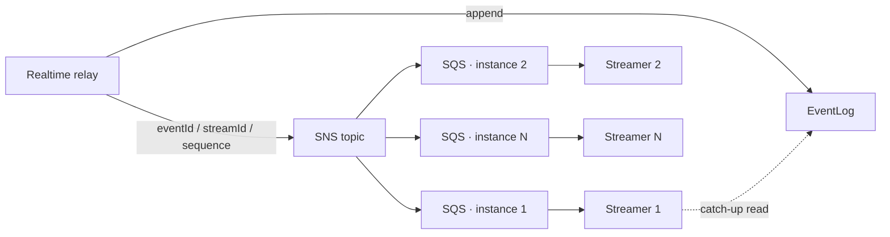

# ADR-0073: Fan out realtime wakeups to serve instances with SNS to per-instance SQS queues

## Status

accepted

## Context

The serve instance that appends an event to the EventLog ([ADR-0072]) is, in general, not the
instance holding the SSE connection that should receive it. Every instance therefore needs to learn
"stream S has something after sequence N" promptly, and the mechanism needs to survive an
instance dying with its subscription still registered.

Two things this notification is *not* shape the decision. It is not the delivery path: the
EventLog is the only source a client is ever served from, so a lost or duplicated notification
must be harmless. And it is not a per-user channel: a queue per browser would make the resource
count track the connection count, and the cleanup after a crash would have to find and delete
thousands of them.

## Decision

**Standard SNS → standard SQS, one queue and one subscription per serve instance.**

- The realtime relay publishes to one SNS topic after each successful EventLog append. The
  notification carries only `eventId / streamId / sequence` — never the payload.
- Each serve instance creates its own SQS queue and subscribes it to the topic at startup
  (`RawMessageDelivery=true`; the queue policy admits only that topic's ARN), consumes it while
  running, and unsubscribes and deletes it at shutdown.
- A notification is a **wakeup**: "re-read stream S after the cursor you hold". It carries no
  state, so a duplicate collapses into the same catch-up read and a missing one is covered by the
  periodic catch-up (every 30 seconds with jitter, for every active stream). Neither case needs an
  inbox or a deduplication record.
- Each instance heartbeats an **instance lease** (30 s heartbeat, 2 min expiry) so that a queue and
  subscription left behind by a crashed instance are detected and reclaimed — after a 5 min safety
  margin, under a cleanup ownership taken by a DynamoDB conditional update, in the order
  unsubscribe → delete queue → delete lease. The lease exists for this reclaim and nothing else
  ([ADR-0071] fixes its scope and its import allowlist).

Locally the substrate is an SNS/SQS emulator dedicated to this mechanism; the worker's own queue
emulator is not shared with it. Where the emulator is not wire-compatible with the SDK, a local
compatibility implementation is added for the incompatible call only, never a second protocol
adapter.

## Consequences

### Positive Consequences

- One publish reaches every instance; the count of things to create, monitor, and reclaim is the
  instance count, not the connection count.
- A lost notification degrades latency by at most one catch-up interval; it never loses an event.
- No inbox table, no deduplication store, and no consumer-side idempotency record: the wakeup's
  meaning makes duplicates free.
- An instance that dies without cleanup leaves resources that are reclaimed by a bounded, owned,
  ordered procedure rather than accumulating.

### Negative Consequences

- The topic sees one publish per event; at high event rates the fan-out cost scales with events ×
  instances. The mechanism offers no batching of wakeups.
- Queue and subscription lifecycle is now part of serve startup and shutdown: startup waits for the
  subscription to exist before reporting ready, and shutdown must drain SSE before the consumer
  stops. A serve instance has more to do at both ends than a REST-only one.
- The orphan-cleanup job and its lease are one more scheduled process and one more table for an
  operator to know about.
- The local emulator is another container in the shared infrastructure profile.

## Alternatives Considered

### A queue per user or per browser

Rejected. Resource count tracks connections, cleanup after a crash must enumerate them, and the
queue policy would have to be templated per subscriber.

### Carrying the payload in the notification

Rejected. It puts message bodies in a second store with its own retention and encryption
questions, duplicates what the EventLog already holds, and tempts a consumer to serve from the
queue instead of the log — which breaks replay ordering ([ADR-0072]).

### An inbox / deduplication table for wakeups

Rejected. There is nothing to absorb: a duplicate wakeup produces the same read. Adding the table
would reopen [ADR-0057] and [ADR-0062] for a consumer that has no duplicate-sensitive effect.

### A general lease, lock, or leader election for the cleanup

Rejected. The cleanup needs "one cleaner owns this crashed instance's resources", which a
conditional write on the lease row provides. Anything more general conflicts with [ADR-0109]
(scheduled-job concurrency belongs to the scheduler) and [ADR-0111] (lease-based relay hardening
deferred), and would be reused for purposes this decision did not weigh.

### Reusing the worker's queue emulator locally

Rejected. The worker port and this mechanism have different lifecycles and different resource
naming; sharing one emulator couples two subsystems that otherwise never meet.

## Notes

- Design reference: `docs/design/realtime-delivery.md` §2 (serve lifecycle, lease state machine)
  and §4 (what a deployment must provision: topic, queue policy, DLQ, encryption, IAM).
- Related: [ADR-0071], [ADR-0072], [ADR-0057] and [ADR-0062] (the idempotency decisions this
  mechanism does not need to invoke), [ADR-0109], [ADR-0111], [ADR-0106] (deployment stays
  vendor-neutral: the topic, queues, and IAM are documented as a contract, not provisioned here).

[ADR-0057]: 0057-message-id-idempotency-propagation.md
[ADR-0062]: 0062-single-tx-at-most-once-idempotency.md
[ADR-0071]: 0071-realtime-delivery-driving-mechanism.md
[ADR-0072]: 0072-postgres-state-dynamodb-eventlog.md
[ADR-0106]: 0106-vendor-neutral-deploy-skeleton.md
[ADR-0109]: 0109-scheduled-job-concurrency-delegated.md
[ADR-0111]: 0111-outbox-relay-hardening-delegated.md
