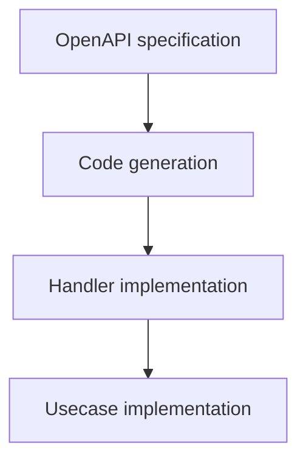
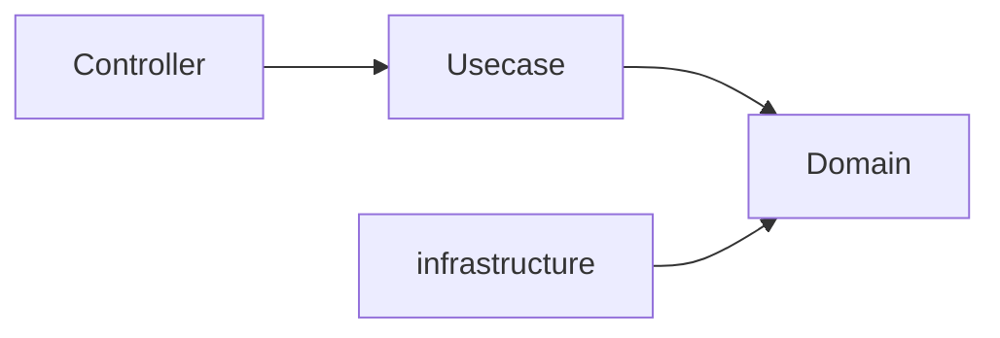
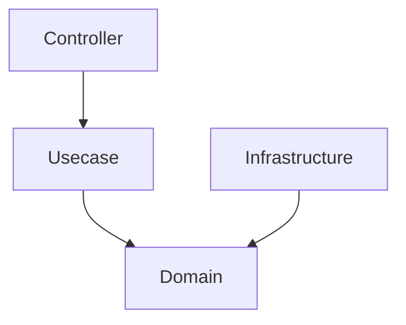
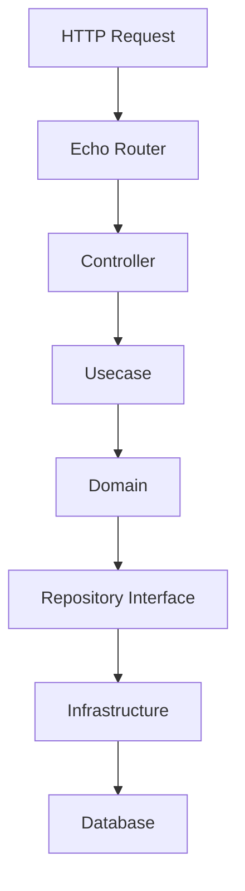
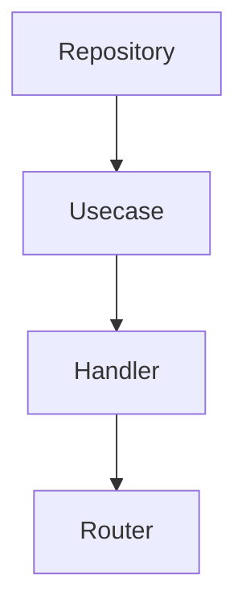

# アーキテクチャ

## 概要

このプロジェクトは、以下の3つの主要な目的に基づいた  
Goアプリケーション向けバックエンドアーキテクチャです。

- **契約駆動開発（Contract-driven development）**
- **型安全性（Type safety）**
- **明確なレイヤ分離（Clear layer separation）**

このアーキテクチャは、以下のアプローチを組み合わせています。

- Pragmatic Onion Architecture
- OpenAPI-first 開発
- SQL-first データアクセス
- Dependency Injection
- CIによる構造的安全性の担保

これらの要素により、  
**保守性・予測可能性・構造的安全性**を重視したバックエンド基盤を提供します。

このアーキテクチャはすべてのシステムに適しているわけではありません。  
特に以下のようなシステムで効果を発揮します。

- **業務システム**
- **長期間運用されるバックエンドサービス**

## アーキテクチャ原則

このアーキテクチャは、いくつかの設計原則に基づいています。

### Contract-first API

API契約は **OpenAPI** を使用して定義されます。

コード生成により、実装がAPI仕様と常に一致するようにします。

典型的な開発フロー：



生成コードは **手動で編集してはいけません**。

### Dependency Inversion

依存関係は常に **内側のレイヤに向かう** 必要があります。



重要な考え方：

- 内側のレイヤは外側に依存しない
- Domain はフレームワークに依存しない
- Infrastructure は Domain のインターフェースを実装する

このルールにより、**コアドメインの安定性**が保たれます。

### SQL-first Data Access

データアクセスは **ORMではなくSQL中心** に設計されています。

SQLクエリは明示的に定義され、`sqlc` により型安全なGoコードへ変換されます。

利点：

- クエリの完全な制御
- コンパイル時の型安全性
- 明確なパフォーマンス特性

### Structural Safety

このプロジェクトは、暗黙的な慣習ではなく、**構造的安全性（Structural Safety）** を重視します。

コードレビューやチームルールのみに依存するのではなく、  
ツールによって安全性を担保します。

例：

- コード生成
- Lintルール
- CI検証
- レイヤ境界の制約

これらの仕組みにより、  
アーキテクチャ違反を防ぐことができます。

### Vendor Neutrality

このプロジェクトは、特定のSaaSやプロプライエタリツールへの  
強い依存を避けています。

可能な限り以下を優先します。

- OSSベースのツール
- 交換可能なコンポーネント
- ベンダーニュートラルな統合

これにより、長期的な柔軟性を確保します。

## システムアーキテクチャ

このシステムは **Pragmatic Onion Architecture** を採用しています。



特徴：

- 外側のレイヤは内側に依存する
- Domain が最も安定したレイヤ
- Infrastructure は Domain のインターフェースを実装する

この構造により、外部システムが変更されても  
ドメインロジックは安定したまま維持できます。

## レイヤ責務

### Controller

Controller レイヤは **HTTPトランスポート層** を担当します。

責務：

- HTTPリクエスト / レスポンス処理
- 入力バリデーション
- エラー変換
- Usecase 呼び出し

Controller には **ビジネスロジックを含めてはいけません**。

### Usecase

Usecase レイヤは **アプリケーションレベルの処理** を実装します。

責務：

- アプリケーションワークフロー
- ドメインオブジェクトの協調
- トランザクション境界
- Domain と Infrastructure の調整

Usecase はドメインの振る舞いをオーケストレーションしますが、  
低レベルなインフラ詳細は扱いません。

### Domain

Domain レイヤは **ビジネスロジックの中核** を表します。

責務：

- Entity
- Value Object
- ドメインルール
- Repository Interface

Domain コードは **フレームワークから完全に独立**している必要があります。

### Infrastructure

Infrastructure レイヤは外部システムとの統合を担当します。

責務：

- データベースアクセス
- 外部サービス連携
- Repository 実装

Infrastructure は Domain レイヤで定義されたインターフェースを実装します。

## リクエストフロー

典型的なリクエストは以下の流れで処理されます。



この構造により、

- HTTPロジックは Controller に
- アプリケーション制御は Usecase に
- ビジネスロジックは Domain に

それぞれ明確に分離されます。

## Dependency Injection

このプロジェクトでは **Uber Fx** をDIコンテナとして使用しています。

DIコンテナの役割：

- コンポーネント初期化
- 依存関係解決
- ライフサイクル管理

典型的な依存関係の組み立て順：



DIを利用することで、レイヤ間の結合度を低く保つことができます。

## コード生成

コード生成はこのアーキテクチャの重要な要素です。

以下のコンポーネントで生成が利用されています。

- OpenAPI server interface (`oapi-codegen`)
- SQL query binding (`sqlc`)

ルール：

- 生成コードを手動で編集してはいけません
- 生成コードは常に再生成可能である必要があります
- CI により生成コードの整合性が検証されます

## プロジェクト構成

主要ディレクトリ：

```txt
cmd/
アプリケーションのエントリポイント

internal/
アプリケーションコード

database/
SQLクエリとマイグレーション

openapi/
API契約

docs/
ドキュメント
```

`internal/` ディレクトリにはレイヤ構造のアプリケーションコードが配置されます。

## Modular Monolith 戦略

このプロジェクトは **モジュラーモノリスアーキテクチャ** を前提としています。

特徴：

- 単一のデプロイ可能アプリケーション
- 内部モジュール境界
- 厳格なレイヤ分離

マイクロサービスは **主目的ではありません**。

ただし明確なモジュール境界を持つため、  
将来的なサービス分割は可能です。

## 拡張性

`internal/` 配下のコンポーネントは  
Dependency Injection によって接続されています。

これにより以下の差し替えが比較的容易になります。

- repository
- middleware
- infrastructure integration

このアーキテクチャは  
**ドメインロジックを変更せずにインフラを変更できること**  
を前提に設計されています。

## AI支援開発

AI 支援開発はこのプロジェクトの**標準開発経路**です。手動開発も技術的には可能ですが、同等の開発者体験を保証しない、推奨されない互換経路として扱います。[ADR-0007 (agents-md-operational-contract)](adr/0007-agents-md-operational-contract.ja.md) を参照してください。

アーキテクチャ制約により、  
AI生成コードが設計ルールを破ることを防ぎます。

AIエージェントはコード生成前に以下を参照してください。

- `rules.md`
- `architecture.md`

### アーキテクチャが依存しないもの

開発を AI-first にすることは、**アプリケーション**を AI 依存にすることを意味しません。以下は AI 非依存を保ち、AI サービスやエージェントが利用できなくても成立しなければなりません。

- アプリケーションランタイムと本番ランタイム
- ビルドとテスト
- アーキテクチャそのもの、およびドメインモデル
- API コントラクトとデータベーススキーマ
- 通常の CI 検査

AI 依存は、その周囲の開発ワークフロー — ナビゲーション、自動化、フィードバック、レビュー — に限定します。結果として得られるシステムは AI ベンダーなしで運用でき、実際にリスクを持つのはその性質です。

### 構造は人間に読めるまま保つ

AI-first は、機械にしか辿れない構造への作り替えを許可しません。このプロジェクトは、**エージェントが辿れる明示的な構造と、人間が読める明示的な構造は強く相関する**という前提を置きます。上で述べた責務分離、明示的な命名、レイヤ境界、ドキュメント構造が、その共有基盤です。

したがって AI 向けのコンテキスト・スキル・自動化は、その構造を正確に探索・利用するための制御面としてその *上に* 追加するものであり、置き換えではありません。

## Non-Goals

このプロジェクトは以下を目的としていません。

- マイクロサービスフレームワーク
- 超低レイテンシアーキテクチャ
- あらゆるシステムに適用可能な万能アーキテクチャ

このプロジェクトの目的は、  
**一般的な業務システム向けに保守性と構造安全性を備えたバックエンド基盤を提供すること**です。
