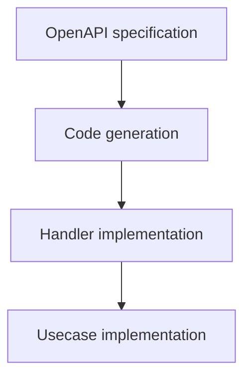
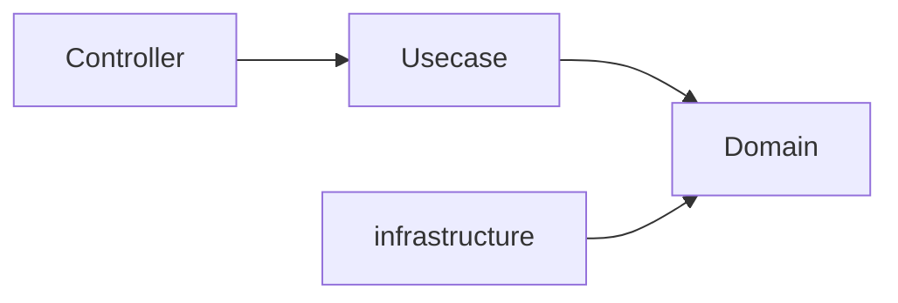
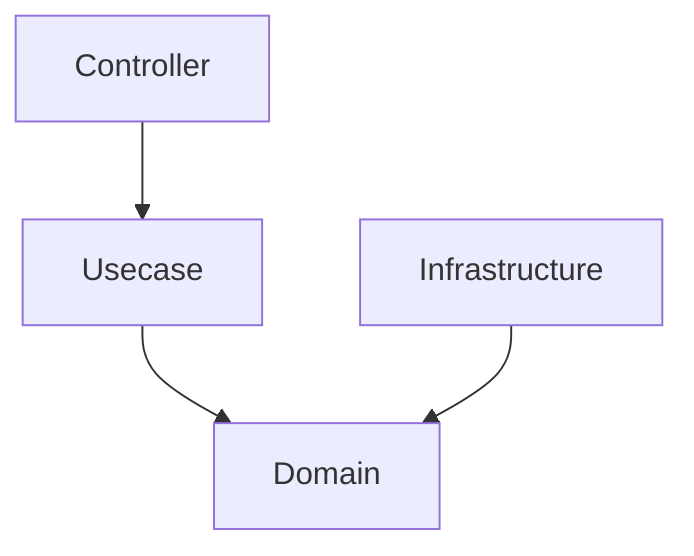
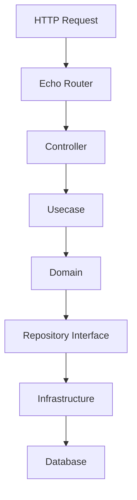
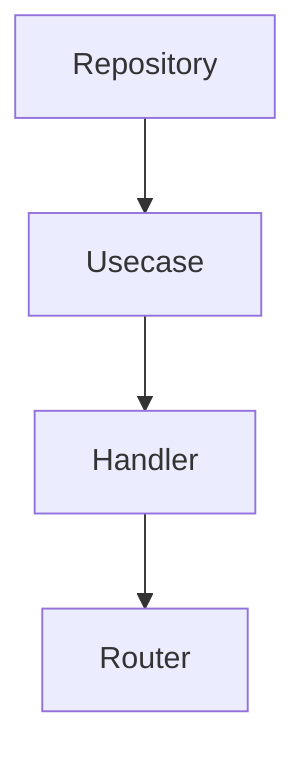

# Architecture

## Overview

This project is a backend architecture for Go applications based on the following three primary objectives.

- **Contract-driven development**
- **Type safety**
- **Clear layer separation**

This architecture combines the following approaches.

- Pragmatic Onion Architecture
- OpenAPI-first development
- SQL-first data access
- Dependency Injection
- Structural safety guaranteed by CI

With these elements,  
it provides a backend foundation that emphasizes **maintainability, predictability, and structural safety**.

This architecture is not suitable for all systems.  
It is particularly effective for the following types of systems.

- **Business systems**
- **Backend services operated over a long period**

## Architectural Principles

This architecture is based on several design principles.

### Contract-first API

API contracts are defined using **OpenAPI**.

Through code generation, the implementation is always kept consistent with the API specification.

Typical development flow:



Generated code **must not be edited manually**.

### Dependency Inversion

Dependencies must always point **toward inner layers**.



Key ideas:

- Inner layers do not depend on outer layers
- Domain does not depend on frameworks
- Infrastructure implements interfaces of the Domain

This rule ensures **core domain stability**.

### SQL-first Data Access

Data access is designed to be **SQL-centric rather than ORM-based**.

SQL queries are explicitly defined and converted into type-safe Go code by `sqlc`.

Benefits:

- Full control over queries
- Compile-time type safety
- Clear performance characteristics

### Structural Safety

This project emphasizes **structural safety**, rather than implicit conventions.

Instead of relying only on code reviews or team rules,  
safety is ensured by tools.

Examples:

- Code generation
- Lint rules
- CI validation
- Layer boundary constraints

With these mechanisms,  
architectural violations can be prevented.

### Vendor Neutrality

This project avoids strong dependencies on specific SaaS or proprietary tools.

As much as possible, the following are prioritized.

- OSS-based tools
- Replaceable components
- Vendor-neutral integrations

This ensures long-term flexibility.

## System Architecture

This system adopts a **Pragmatic Onion Architecture**.



Characteristics:

- Outer layers depend on inner layers
- Domain is the most stable layer
- Infrastructure implements Domain interfaces

With this structure, even if external systems change,  
domain logic can remain stable.

## Layer Responsibilities

### Controller

The Controller layer is responsible for the **HTTP transport layer**.

Responsibilities:

- HTTP request / response handling
- Input validation
- Error transformation
- Calling Usecase

Controller **must not contain business logic**.

### Usecase

The Usecase layer implements **application-level processing**.

Responsibilities:

- Application workflows
- Coordination of domain objects
- Transaction boundaries
- Coordination between Domain and Infrastructure

Usecase orchestrates domain behavior,  
but does not handle low-level infrastructure details.

### Domain

The Domain layer represents the **core of business logic**.

Responsibilities:

- Entity
- Value Object
- Domain rules
- Repository Interface

Domain code must be **completely independent of frameworks**.

### Infrastructure

The Infrastructure layer is responsible for integration with external systems.

Responsibilities:

- Database access
- External service integration
- Repository implementation

Infrastructure implements interfaces defined in the Domain layer.

## Request Flow

A typical request is processed in the following flow.



With this structure:

- HTTP logic is handled in Controller
- Application control is handled in Usecase
- Business logic is handled in Domain

Each is clearly separated.

## Dependency Injection

This project uses **Uber Fx** as the DI container.

Role of the DI container:

- Component initialization
- Dependency resolution
- Lifecycle management

Typical dependency assembly order:



By using DI, coupling between layers can be kept low.

## Code Generation

Code generation is an important element of this architecture.

It is used in the following components.

- OpenAPI server interface (`oapi-codegen`)
- SQL query binding (`sqlc`)

Rules:

- Generated code must not be edited manually
- Generated code must always be reproducible
- CI verifies consistency of generated code

## Project Structure

Main directories:

```txt
cmd/
Application entry point

internal/
Application code

database/
SQL queries and migrations

openapi/
API contracts

docs/
Documentation
```

The `internal/` directory contains application code with a layered structure.

## Modular Monolith Strategy

This project assumes a **modular monolith architecture**.

Characteristics:

- Single deployable application
- Internal module boundaries
- Strict layer separation

Microservices are **not the primary goal**.

However, because clear module boundaries exist,  
future service decomposition is possible.

## Extensibility

Components under `internal/`  
are connected through Dependency Injection.

This makes the following replacements relatively easy.

- repository
- middleware
- infrastructure integration

This architecture is designed with the premise that  
**infrastructure can be changed without modifying domain logic**.

## AI-assisted Development

This project is designed to safely integrate with AI-assisted development tools.

Architectural constraints prevent  
AI-generated code from violating design rules.

AI agents should refer to the following before generating code.

- `rules.md`
- `architecture.md`

## Non-Goals

This project does not aim to be:

- A microservices framework
- An ultra low-latency architecture
- A universal architecture applicable to all systems

The goal of this project is  
**to provide a backend foundation with maintainability and structural safety for general business systems**.
