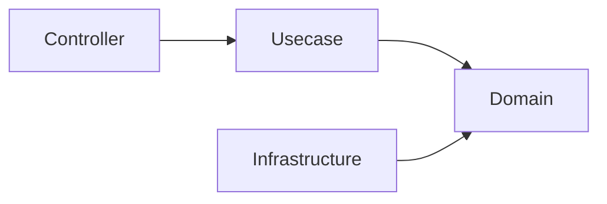

# Architecture Decisions

This document explains the **reasons behind the technology choices** adopted in this project.

The purpose here is not to claim that these technologies are always the best,  
but to clarify **why they were adopted in this architecture**.

These technology choices are made based on the following design goals.

## Design Goals

This project prioritizes the following.

- Maintainability
- Structural safety
- Type safety
- Replaceable infrastructure
- Long-term operability

Performance and minimization of abstraction are  
**not the primary goals** of this template.

## Why Onion Architecture

### Intent (Onion Architecture)

To separate business logic from infrastructure and framework dependencies.

### Decision (Onion Architecture)

This project adopts **Pragmatic Onion Architecture**.

In this structure, the direction of dependencies is enforced as follows.

The Domain layer maintains independence from external systems.

### Benefits (Onion Architecture)

- Clear separation of responsibilities
- Ease of testing
- Replaceable infrastructure
- Stable domain core

### Alternatives Considered (Onion Architecture)

#### Layered MVC

It is simple, but tends to mix domain logic and infrastructure logic.

#### Clean Architecture

Conceptually very similar,  
but it tends to introduce additional abstraction layers.

This project adopts a **more practical simplified version**.

## Why OpenAPI-first

### Intent (OpenAPI-first)

To clearly define API contracts before implementation.

### Decision (OpenAPI-first)

API specifications are defined using **OpenAPI**,  
and server code is generated using `oapi-codegen`.

### Benefits (OpenAPI-first)

- Clear API contracts
- Type-safe request/response structures
- Consistency with frontend
- Automatic generation of API documentation

### Alternatives Considered (OpenAPI-first)

#### Code-first API

Generating OpenAPI from code  
can lead to unclear API contracts.

#### GraphQL-first

GraphQL is powerful, but may introduce high complexity in general backend services.

## Why SQL-first

### Intent (SQL-first)

To treat SQL explicitly as a contract rather than hiding it behind an ORM.

### Decision (SQL-first)

Queries are written directly in SQL, and Go code is generated using `sqlc`.

### Benefits (SQL-first)

- Full control over queries
- Clear performance characteristics
- Explicit data access patterns

### Alternatives Considered (SQL-first)

#### Full ORM

ORMs are convenient, but  
can obscure query behavior and performance.

#### Query Builder

SQL visibility decreases, and additional abstraction may increase complexity.

## Why sqlc

### Intent (sqlc)

To combine explicit SQL with **type-safe Go code**.

### Decision (sqlc)

`sqlc` is used to generate Go code from SQL queries.

### Benefits (sqlc)

- Compile-time type safety
- Clear SQL definitions
- Minimal runtime abstraction

### Alternatives Considered (sqlc)

#### GORM

A convenient ORM, but  
introduces ORM abstraction and implicit query generation.

#### Ent

A schema-first approach that requires a different development workflow.

## Why Echo

### Intent (Echo)

To provide a lightweight and predictable HTTP framework.

### Decision (Echo)

**Echo** is used for HTTP routing and middleware.

### Benefits (Echo)

- Simple and clear middleware structure
- Low abstraction
- Good performance

### Alternatives Considered (Echo)

#### Gin

A very similar framework, but Echo has a slightly simpler middleware structure.

#### Chi

An excellent router, but Echo provides more complete framework features.

## Why Fx

### Intent (Fx)

To provide structured dependency resolution and  
application lifecycle management.

### Decision (Fx)

**Uber Fx** is adopted as the dependency injection container.

### Benefits (Fx)

- Explicit dependency wiring
- Application lifecycle management
- Organized module structure

### Alternatives Considered (Fx)

#### Manual DI

Effective for small systems, but becomes difficult to manage as systems grow.

#### Google Wire

Compile-time DI, but does not provide runtime lifecycle management.

## Why a broker-agnostic worker scaffold (pull-ack only)

### Intent (worker scaffold)

Provide a way to consume queue messages as **another driving adapter into the Usecase layer** (message-in), on par with the HTTP handler, without inventing a new architectural layer.

### Decision (worker scaffold)

- The engine (`internal/controller/worker`) depends only on a minimal seam (`Consumer` / `Handler` / `FailureHandler`) defined in `internal/usecase/boundary/worker`, and is **completed against an in-memory fake** — all engine invariants are tested without a real broker.
- The seam is **scoped to the pull-ack class**, with the interface designed first for **AWS SQS** and **GCP Pub/Sub (pull)**. Other pull-ack platforms fit by writing an adapter; only fundamentally different models require changing the interface.
- **Push-type brokers (RabbitMQ) and streaming-log (Kafka / Kinesis) are out of scope.** Push delivery is the HTTP controller's domain; a streaming-log consumer (offset commit / consumer-group / partition) is a different engine, not an extension of this port.
- Permanent failures route through a `FailureHandler` (dead-letter) seam; broker-specific redrive (SQS `maxReceiveCount` → DLQ) is IaC configuration, not application code.
- Backpressure is a 3-state **circuit breaker on the intake side** (stop pulling on continued downstream failure, self-heal via half-open). This is distinct from per-message `Nack` delay and from `Fatal` (which stops the engine).
- The reference broker adapter (SQS) lives in `internal/infrastructure/queue/sqs` and is **not wired into the default `cmd` build**, so `aws-sdk-go-v2` is not linked into the shipped binary (dependency isolation).

### Benefits (worker scaffold)

- The same Usecase / domain code is reachable from HTTP and from queues without duplication.
- Broker independence: switching or adding a pull-ack broker is an adapter change; the engine and its tests do not change.
- A fake-first engine keeps the behavioral contract (ack discipline, ordering, drain, backpressure) verifiable in fast unit tests.

### Alternatives Considered (worker scaffold)

- **A general multi-broker abstraction (incl. push / streaming).** Rejected: the lowest-common-denominator port would leak or weaken guarantees; Kafka-style consumers belong to a separate engine.
- **Wiring SQS by default.** Rejected: it would force `aws-sdk-go-v2` into every binary (including `serve`), so the adapter is opt-in.
- **Build tags for dependency isolation.** Rejected: there is no precedent in this repo and a single binary makes module separation insufficient; not importing the adapter from `cmd` achieves isolation without tags.

## Library Selection Policy

### Intent (Library Selection)

To keep the dependency surface auditable and replaceable, every third-party library should map to a single, nameable responsibility.

### Decision (Library Selection)

A library is adopted only when it satisfies **one responsibility = one concern, ideally bound to a single upstream ecosystem**.

Libraries that stand between **two independently-versioned upstreams** (a framework/library *and* OpenTelemetry) are **bridge / instrumentation** libraries. They deviate from the single-responsibility criterion and are documented individually as exceptions in the next section.

Direct dependencies, grouped by responsibility:

|Area|Library|Responsibility|
|------|---------|----------------|
|Web / API|`labstack/echo/v4`|HTTP web framework (see *Why Echo*)|
|Web / API|`oapi-codegen/echo-middleware`|OpenAPI request validation middleware for Echo|
|Web / API|`oapi-codegen/runtime`|Runtime support for oapi-codegen generated code|
|Web / API|`getkin/kin-openapi`|OpenAPI 3 document model / loader|
|Config|`caarlos0/env/v11`|Env var → struct decoding|
|Config|`joho/godotenv`|Loading `.env` files|
|Database|`jackc/pgx/v5`|PostgreSQL driver|
|Database|`golang-migrate/migrate/v4`|Schema migration runner|
|Errors / utils|`cockroachdb/errors`|Error wrapping with stack traces|
|Errors / utils|`google/uuid`|UUID generation|
|Errors / utils|`golang.org/x/crypto`|Cryptographic primitives|
|Errors / utils|`golang.org/x/sync`|Concurrency primitives (errgroup, etc.)|
|DI / logging / CLI|`go.uber.org/fx`|Dependency injection container (see *Why Fx*)|
|DI / logging / CLI|`go.uber.org/zap`|Structured logging|
|DI / logging / CLI|`spf13/cobra`|CLI command framework|
|Testing|`go.uber.org/mock`|Mock generation runtime|
|Testing|`stretchr/testify`|Assertions|
|Messaging / worker|`aws/aws-sdk-go-v2`|AWS API client core (worker adapter, opt-in)|
|Messaging / worker|`aws/aws-sdk-go-v2/service/sqs`|SQS client (pull-ack worker)|
|Metrics exposition|`prometheus/client_golang`|Prometheus-format metrics endpoint + custom collectors|
|Observability (otel core)|`go.opentelemetry.io/otel` (+ `trace` / `metric` / `sdk` / `sdk/metric`)|OpenTelemetry API & SDK|
|Observability (otel core)|`exporters/otlp/otlptrace/{otlptracehttp,otlptracegrpc}`|OTLP trace exporters (built explicitly from `OBS_*` config)|
|Observability (otel core)|`exporters/otlp/otlpmetric/{otlpmetrichttp,otlpmetricgrpc}`|OTLP metric exporters (built explicitly from `OBS_*` config)|
|Observability (otel core)|`exporters/otlp/otlplog/{otlploghttp,otlploggrpc}`|OTLP log exporters (built explicitly from `OBS_*` config)|
|Observability (otel core)|`contrib/instrumentation/runtime`|Go runtime metrics|

> The otel core group includes pre-v1.0 (`v0.x`) modules, but each couples to a **single** upstream (OpenTelemetry itself), not two. They are therefore in-policy and not treated as exceptions.
>
> The OTLP exporters are constructed **explicitly from typed config** (`internal/observability/provider.go`) rather than via `contrib/exporters/autoexport`. autoexport reads the spec-standard `OTEL_*` environment variables directly from the process environment; routing exporter settings through the project's own `OBS_*` typed config (single source of truth) is incompatible with that, so autoexport was dropped in favour of a small explicit constructor. See *Why config-driven observability gating* below.

## Why config-driven observability gating

### Intent (observability gating)

To make observability a single, typed, config-driven switch so that lightweight environments construct **no** OpenTelemetry providers, exporters, or instrumentation bridges.

### Decision (observability gating)

- Exporter settings live in the typed `OBS_*` config subsystem (`OBS_TRACES_EXPORTER` / `OBS_METRICS_EXPORTER` / `OBS_LOGS_EXPORTER` / `OBS_OTLP_ENDPOINT` / `OBS_OTLP_PROTOCOL`), **not** in the spec-standard `OTEL_*` environment read behind the app's back by autoexport.
- There is **no dedicated enable flag**. Observability is *derived* as enabled when any of `OBS_TRACES_EXPORTER` / `OBS_METRICS_EXPORTER` / `OBS_LOGS_EXPORTER` is a non-empty, non-`none` value. This unifies what were previously two disconnected control planes (the old `OBSERVABILITY_ENABLED` flag gated only trace-log correlation; `OTEL_*` env gated emission).
- Gating is applied at **construction time**: when a signal is disabled its exporter / batcher / reader / runtime collector is not built (no network, no goroutines), the Echo otelecho middleware degrades to a pass-through, and the otelzap log core is not Tee'd into the zap logger (`logging.WithCore` skips a nil core). The trace/metric/log SDK provider shells remain (cheap, inert); the toggle is **runtime disabling**, not build-time removal of the dependency.

### Benefits (observability gating)

- One typed source of truth, consistent with every other subsystem; no second control plane.
- Lightweight environments pay no observability cost (no exporters, readers, runtime collector, or per-request spans).
- Portability is preserved: sending to any OTLP backend (otel-lgtm, a Datadog Agent OTLP receiver, an OTel Collector) is still just `OBS_*_EXPORTER=otlp` + an endpoint — only switching to a non-OpenTelemetry SDK (e.g. dd-trace-go) would change the signal.

### Alternatives Considered (observability gating)

- **Keep `OTEL_*` + autoexport.** Rejected: the exporter settings would not be represented in the typed config, leaving a second source of truth read directly from the environment.
- **A dedicated `OBSERVABILITY_ENABLED` flag alongside the exporter settings.** Rejected: redundant with "is any exporter configured", and prone to conflicting states (`ENABLED=true` with no exporter).
- **Build-tag removal of the otel/bridge dependencies.** Rejected for now: runtime disabling is sufficient for the lightweight goal; build-time removal adds two wiring variants for hot-path-wired instrumentation (otelecho / otelpgx) without a current requirement.

### Exceptions: instrumentation / bridge libraries

The following stand between **two independently-versioned upstreams** (a framework/library × OpenTelemetry), so they fall outside "one concern, one upstream."

They are accepted on the following common grounds:

- **Re-implementing the glue by hand** would couple tightly to the target's internal lifecycle (Echo / pgx / zap) and increase maintenance debt rather than reduce it.
- Each is **small and Apache-2.0 licensed**, so as a last resort it can be vendored / forked into this repository. The worst-case fork cost is bounded to the production line counts in the table below (tests not counted, but they can be absorbed too).
- All ship on **otel-contrib's monthly release train**, kept lockstep with OpenTelemetry itself. The only residual drift surface is the framework-side interface, and those interfaces (`echo.MiddlewareFunc` / pgx `QueryTracer` / `zapcore.Core`) are stable (v1).

Versions and line counts below are **as investigated on 2026-06-25**; "Prod. LOC" counts non-test `.go` files only.

|Library|Coupling|Role|Version (investigated)|Prod. LOC|Status|
|---------|----------|------|------------------------|-----------|--------|
|`contrib/instrumentation/.../otelecho`|Echo `MiddlewareFunc` × otel trace|Root server span per request (status / path normalization / W3C propagation extract); the trace-first entry point in `httpstack/observability`|`v0.69.0`|1,186 (incl. ~891 in `internal/semconv`)|Adopted|
|`exaring/otelpgx`|pgx `QueryTracer` × otel trace|SQL query spans via the pgx tracer hook (`rdb/driver/query_tracer.go`)|`v0.11.1`|1,154 (incl. `tracer.go` 675)|Adopted|
|`contrib/bridges/otelzap`|zap `zapcore.Core` × otel/log|Bridges zap records into OTel log records for OTLP export; the only practical path to ship application logs to the OTLP backend (Tee'd into the zap logger via `logging.WithCore`, gated on `OBS_LOGS_EXPORTER`)|`v0.19.0`|735 (3 files)|Adopted|

For `otelzap` specifically, the moving upstream is only **`otel/log` (v0.x)**; the zap side (`zapcore.Core`) is a stable v1 interface, so even an abandoned bridge keeps compiling against newer zap. The worst-case fork cost is bounded to the three files (735 lines) above.

## Future Evolution

These technology choices are **not immutable**.

They may change in the following cases.

- Evolution of the ecosystem
- Emergence of better tools
- Changes in architectural constraints

However, even when changes are made,  
the **design goals of this template** must be preserved.
