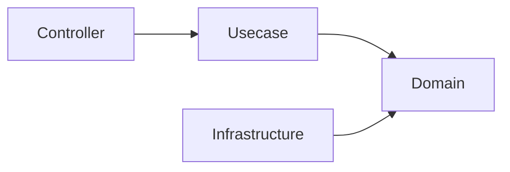

# Architecture Decisions

This document explains the **reasons behind the technology choices** adopted in this project.

The purpose here is not to claim that these technologies are always the best,  
but to clarify **why they were adopted in this architecture**.

These technology choices are made based on the following design goals.

## Design Goals

This project prioritizes the following.

- Maintainability
- Structural safety
- Type safety
- Replaceable infrastructure
- Long-term operability

Performance and minimization of abstraction are  
**not the primary goals** of this template.

## Why Onion Architecture

### Intent (Onion Architecture)

To separate business logic from infrastructure and framework dependencies.

### Decision (Onion Architecture)

This project adopts **Pragmatic Onion Architecture**.

In this structure, the direction of dependencies is enforced as follows.

The Domain layer maintains independence from external systems.

### Benefits (Onion Architecture)

- Clear separation of responsibilities
- Ease of testing
- Replaceable infrastructure
- Stable domain core

### Alternatives Considered (Onion Architecture)

#### Layered MVC

It is simple, but tends to mix domain logic and infrastructure logic.

#### Clean Architecture

Conceptually very similar,  
but it tends to introduce additional abstraction layers.

This project adopts a **more practical simplified version**.

## Why OpenAPI-first

### Intent (OpenAPI-first)

To clearly define API contracts before implementation.

### Decision (OpenAPI-first)

API specifications are defined using **OpenAPI**,  
and server code is generated using `oapi-codegen`.

### Benefits (OpenAPI-first)

- Clear API contracts
- Type-safe request/response structures
- Consistency with frontend
- Automatic generation of API documentation

### Alternatives Considered (OpenAPI-first)

#### Code-first API

Generating OpenAPI from code  
can lead to unclear API contracts.

#### GraphQL-first

GraphQL is powerful, but may introduce high complexity in general backend services.

## Why SQL-first

### Intent (SQL-first)

To treat SQL explicitly as a contract rather than hiding it behind an ORM.

### Decision (SQL-first)

Queries are written directly in SQL, and Go code is generated using `sqlc`.

### Benefits (SQL-first)

- Full control over queries
- Clear performance characteristics
- Explicit data access patterns

### Alternatives Considered (SQL-first)

#### Full ORM

ORMs are convenient, but  
can obscure query behavior and performance.

#### Query Builder

SQL visibility decreases, and additional abstraction may increase complexity.

## Why sqlc

### Intent (sqlc)

To combine explicit SQL with **type-safe Go code**.

### Decision (sqlc)

`sqlc` is used to generate Go code from SQL queries.

### Benefits (sqlc)

- Compile-time type safety
- Clear SQL definitions
- Minimal runtime abstraction

### Alternatives Considered (sqlc)

#### GORM

A convenient ORM, but  
introduces ORM abstraction and implicit query generation.

#### Ent

A schema-first approach that requires a different development workflow.

## Why Echo

### Intent (Echo)

To provide a lightweight and predictable HTTP framework.

### Decision (Echo)

**Echo** is used for HTTP routing and middleware.

### Benefits (Echo)

- Simple and clear middleware structure
- Low abstraction
- Good performance

### Alternatives Considered (Echo)

#### Gin

A very similar framework, but Echo has a slightly simpler middleware structure.

#### Chi

An excellent router, but Echo provides more complete framework features.

## Why Fx

### Intent (Fx)

To provide structured dependency resolution and  
application lifecycle management.

### Decision (Fx)

**Uber Fx** is adopted as the dependency injection container.

### Benefits (Fx)

- Explicit dependency wiring
- Application lifecycle management
- Organized module structure

### Alternatives Considered (Fx)

#### Manual DI

Effective for small systems, but becomes difficult to manage as systems grow.

#### Google Wire

Compile-time DI, but does not provide runtime lifecycle management.

## Why a broker-agnostic worker scaffold (pull-ack only)

### Intent (worker scaffold)

Provide a way to consume queue messages as **another driving adapter into the Usecase layer** (message-in), on par with the HTTP handler, without inventing a new architectural layer.

### Decision (worker scaffold)

- The engine (`internal/controller/worker`) depends only on a minimal seam (`Consumer` / `Handler` / `FailureHandler`) defined in `internal/usecase/boundary/worker`, and is **completed against an in-memory fake** — all engine invariants are tested without a real broker.
- The seam is **scoped to the pull-ack class**, with the interface designed first for **AWS SQS** and **GCP Pub/Sub (pull)**. Other pull-ack platforms fit by writing an adapter; only fundamentally different models require changing the interface.
- **Push-type brokers (RabbitMQ) and streaming-log (Kafka / Kinesis) are out of scope.** Push delivery is the HTTP controller's domain; a streaming-log consumer (offset commit / consumer-group / partition) is a different engine, not an extension of this port.
- Permanent failures route through a `FailureHandler` (dead-letter) seam; broker-specific redrive (SQS `maxReceiveCount` → DLQ) is IaC configuration, not application code.
- Backpressure is a 3-state **circuit breaker on the intake side** (stop pulling on continued downstream failure, self-heal via half-open). This is distinct from per-message `Nack` delay and from `Fatal` (which stops the engine).
- The reference broker adapter (SQS) lives in `internal/infrastructure/queue/sqs` and is **not wired into the default `cmd` build**, so `aws-sdk-go-v2` is not linked into the shipped binary (dependency isolation).

### Benefits (worker scaffold)

- The same Usecase / domain code is reachable from HTTP and from queues without duplication.
- Broker independence: switching or adding a pull-ack broker is an adapter change; the engine and its tests do not change.
- A fake-first engine keeps the behavioral contract (ack discipline, ordering, drain, backpressure) verifiable in fast unit tests.

### Alternatives Considered (worker scaffold)

- **A general multi-broker abstraction (incl. push / streaming).** Rejected: the lowest-common-denominator port would leak or weaken guarantees; Kafka-style consumers belong to a separate engine.
- **Wiring SQS by default.** Rejected: it would force `aws-sdk-go-v2` into every binary (including `serve`), so the adapter is opt-in.
- **Build tags for dependency isolation.** Rejected: there is no precedent in this repo and a single binary makes module separation insufficient; not importing the adapter from `cmd` achieves isolation without tags.

## Future Evolution

These technology choices are **not immutable**.

They may change in the following cases.

- Evolution of the ecosystem
- Emergence of better tools
- Changes in architectural constraints

However, even when changes are made,  
the **design goals of this template** must be preserved.
