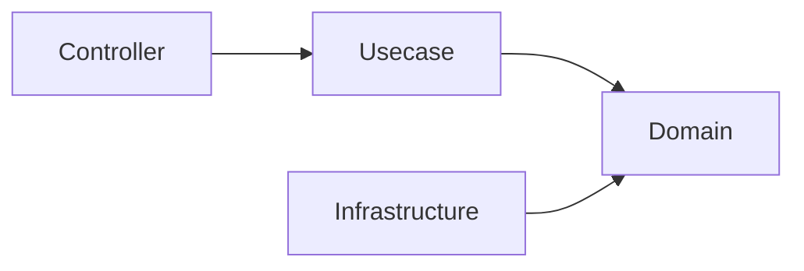

# Architecture Decisions

This document explains the **reasons behind the technology choices** adopted in this project.

The purpose here is not to claim that these technologies are always the best,  
but to clarify **why they were adopted in this architecture**.

These technology choices are made based on the following design goals.

## Design Goals

This project prioritizes the following.

- Maintainability
- Structural safety
- Type safety
- Replaceable infrastructure
- Long-term operability

Performance and minimization of abstraction are  
**not the primary goals** of this template.

## Why Onion Architecture

### Intent (Onion Architecture)

To separate business logic from infrastructure and framework dependencies.

### Decision (Onion Architecture)

This project adopts **Pragmatic Onion Architecture**.

In this structure, the direction of dependencies is enforced as follows.

The Domain layer maintains independence from external systems.

### Benefits (Onion Architecture)

- Clear separation of responsibilities
- Ease of testing
- Replaceable infrastructure
- Stable domain core

### Alternatives Considered (Onion Architecture)

#### Layered MVC

It is simple, but tends to mix domain logic and infrastructure logic.

#### Clean Architecture

Conceptually very similar,  
but it tends to introduce additional abstraction layers.

This project adopts a **more practical simplified version**.

## Why OpenAPI-first

### Intent (OpenAPI-first)

To clearly define API contracts before implementation.

### Decision (OpenAPI-first)

API specifications are defined using **OpenAPI**,  
and server code is generated using `oapi-codegen`.

### Benefits (OpenAPI-first)

- Clear API contracts
- Type-safe request/response structures
- Consistency with frontend
- Automatic generation of API documentation

### Alternatives Considered (OpenAPI-first)

#### Code-first API

Generating OpenAPI from code  
can lead to unclear API contracts.

#### GraphQL-first

GraphQL is powerful, but may introduce high complexity in general backend services.

## Why SQL-first

### Intent (SQL-first)

To treat SQL explicitly as a contract rather than hiding it behind an ORM.

### Decision (SQL-first)

Queries are written directly in SQL, and Go code is generated using `sqlc`.

### Benefits (SQL-first)

- Full control over queries
- Clear performance characteristics
- Explicit data access patterns

### Alternatives Considered (SQL-first)

#### Full ORM

ORMs are convenient, but  
can obscure query behavior and performance.

#### Query Builder

SQL visibility decreases, and additional abstraction may increase complexity.

## Why sqlc

### Intent (sqlc)

To combine explicit SQL with **type-safe Go code**.

### Decision (sqlc)

`sqlc` is used to generate Go code from SQL queries.

### Benefits (sqlc)

- Compile-time type safety
- Clear SQL definitions
- Minimal runtime abstraction

### Alternatives Considered (sqlc)

#### GORM

A convenient ORM, but  
introduces ORM abstraction and implicit query generation.

#### Ent

A schema-first approach that requires a different development workflow.

## Why Echo

### Intent (Echo)

To provide a lightweight and predictable HTTP framework.

### Decision (Echo)

**Echo** is used for HTTP routing and middleware.

### Benefits (Echo)

- Simple and clear middleware structure
- Low abstraction
- Good performance

### Alternatives Considered (Echo)

#### Gin

A very similar framework, but Echo has a slightly simpler middleware structure.

#### Chi

An excellent router, but Echo provides more complete framework features.

## Why Fx

### Intent (Fx)

To provide structured dependency resolution and  
application lifecycle management.

### Decision (Fx)

**Uber Fx** is adopted as the dependency injection container.

### Benefits (Fx)

- Explicit dependency wiring
- Application lifecycle management
- Organized module structure

### Alternatives Considered (Fx)

#### Manual DI

Effective for small systems, but becomes difficult to manage as systems grow.

#### Google Wire

Compile-time DI, but does not provide runtime lifecycle management.

## Future Evolution

These technology choices are **not immutable**.

They may change in the following cases.

- Evolution of the ecosystem
- Emergence of better tools
- Changes in architectural constraints

However, even when changes are made,  
the **design goals of this template** must be preserved.
