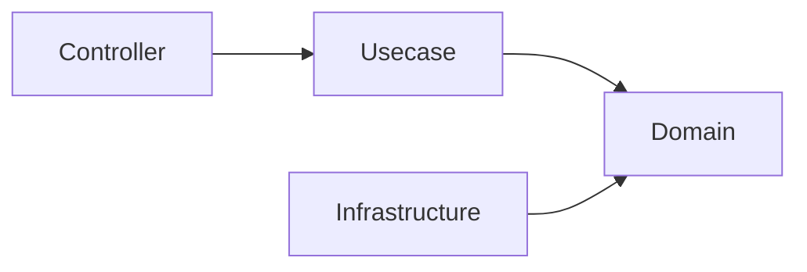

# ADR-0002: Adopt pragmatic onion architecture

## Status

accepted

## Context

The template needs business logic to stay independent of infrastructure and framework
choices so that infrastructure is replaceable (see [ADR-0001](0001-avoid-lock-in.md)) and
the domain core stays stable and testable over the long term. The driving design goals are
maintainability, structural safety, type safety, replaceable infrastructure, and long-term
operability — not raw performance or minimal abstraction.

## Decision

Adopt a **pragmatic onion architecture**. Dependencies point inward:

The domain layer holds no dependency on frameworks, infrastructure, or external systems;
infrastructure implements domain-defined interfaces. This is a deliberately simplified form
of the concentric-layers idea, not a full Clean Architecture with extra abstraction layers.

## Consequences

### Positive Consequences

- Clear separation of responsibilities.
- Ease of testing (the domain core is pure and needs no infrastructure to test).
- Replaceable infrastructure behind domain interfaces.
- A stable domain core insulated from external change.

### Negative Consequences

- More layers and mapping (DTO ↔ entity conversion at boundaries) than a flat structure.
- Contributors must learn the dependency-direction discipline; it is enforced in CI (depguard) rather than left to review.

## Alternatives Considered

### Layered MVC

Simple, but tends to mix domain logic and infrastructure logic, eroding the stable core
this project prioritizes.

### Clean Architecture

Conceptually very similar, but tends to introduce additional abstraction layers. This
project adopts a more practical, simplified version instead.

## Notes

- Enforced by the layer dependency rules in [`docs/rules.md`](../../rules.md) (dependencies point inward; domain purity; DTO/type boundary conversion), which are the day-to-day *consequences* of this decision.
- Migrated from `docs/decisions.md` (§ "Why Onion Architecture").
