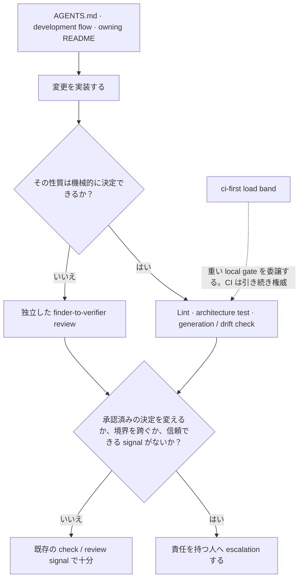

> この文書は英語正本 [agent-environment.md](agent-environment.md) から同期する日本語訳です。単独では編集しません。

# エージェント環境

この文書は、リポジトリのエージェント環境が宣言済みの性質を日々の作業へどう反映するかを説明する。[ADR-0008](../adr/0008-agent-environment-alignment.md) の解釈であり、チェックリストや規則の第二の正本ではない。

## 行動前に導く

[AGENTS.md](../../AGENTS.md)、development flow、対象に最も近い package README が、行動前の governing / local context を与える。`CLAUDE.md` は AGENTS.md の symlink であり別契約ではない。skill は反復する手順を明示するが、これら同じ正本を読んでリンクし、置き換えない。

## 行動後に修正する

決定できる性質は機械的に失敗させる。`depguard` と architecture test は層境界を、generator と drift check は派生成果物を、対象を絞った lint は workflow と文書の規約を保護する。読解を要する判断は [ADR-0090](../adr/0090-multi-model-adversarial-review.md) の finder-to-verifier で独立 review に残す。

## escalation と負荷を考慮した検証

承認済みの決定を変える、アーキテクチャ境界を跨ぐ、または既存 check から再浮上しない事柄は escalation する。既存機構が同じ状態を確実に報告するだけなら、永続的な task を作らない。

`ci-first` load band は、host の飽和により失敗が信頼できなくなるとき、重い local gate を CI へ委譲する。検証を省略する許可ではない。権威ある check は remote で実行し、local 作業では速く信頼できる check を保つ。

## 解釈を最新に保つ

これは describing 文書である。説明する関係まで変わる場合だけ更新する。governing 文書と accepted ADR は実装 drift から黙って修正しない。衝突は [docs/rules.md](../rules.md) が定めるとおり提起する。
