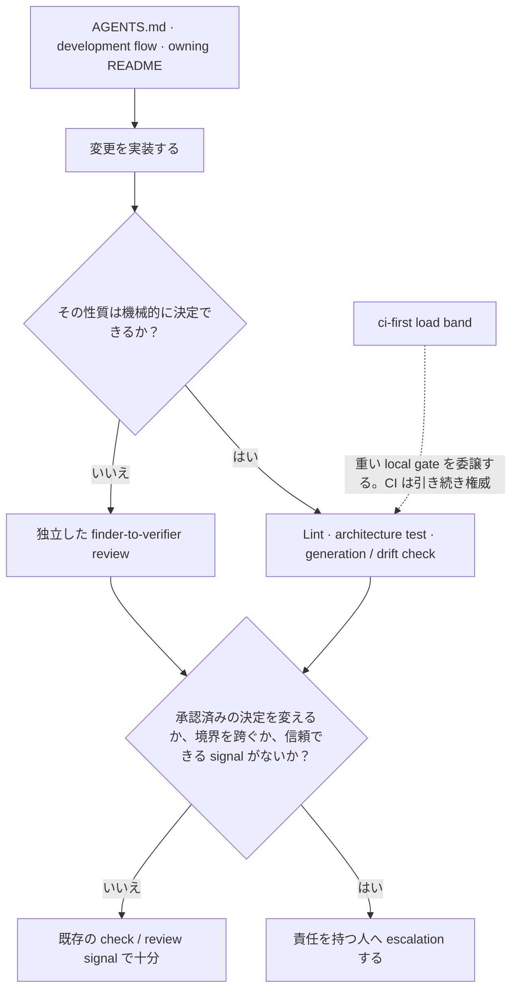
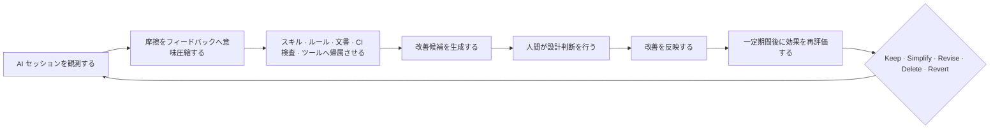

> この文書は英語正本 [agent-environment.md](agent-environment.md) から同期する日本語訳です。単独では編集しません。

# エージェント環境

この文書は、リポジトリのエージェント環境が宣言済みの性質を日々の作業へどう反映するかを説明する。[ADR-0008](../adr/0008-agent-environment-alignment.md) の解釈 — 制御が満たすべき性質と、後にそれを退役させるループの両方 — であり、チェックリストや規則の第二の正本ではない。そもそもなぜ AI 支援が標準経路なのかは [ADR-0007](../adr/0007-agents-md-operational-contract.md)。

## 行動前に導く

[AGENTS.md](../../AGENTS.md)、development flow、対象に最も近い package README が、行動前の governing / local context を与える。`CLAUDE.md` は AGENTS.md の symlink であり別契約ではない。skill は反復する手順を明示するが、これら同じ正本を読んでリンクし、置き換えない。

## 行動後に修正する

決定できる性質は機械的に失敗させる。`depguard` と architecture test は層境界を、generator と drift check は派生成果物を、対象を絞った lint は workflow と文書の規約を保護する。読解を要する判断は [ADR-0092](../adr/0092-multi-model-adversarial-review.md) の finder-to-verifier で独立 review に残す。

## escalation と負荷を考慮した検証

承認済みの決定を変える、アーキテクチャ境界を跨ぐ、または既存 check から再浮上しない事柄は escalation する。既存機構が同じ状態を確実に報告するだけなら、永続的な task を作らない。

`ci-first` load band は、host の飽和により失敗が信頼できなくなるとき、重い local gate を CI へ委譲する。検証を省略する許可ではない。権威ある check は remote で実行し、local 作業では速く信頼できる check を保つ。

## 環境そのものを改善する

ここまでは 1 つの変更についての記述である。それを導き検査する環境自体も、固有のループの下にある。制御は退役させるよりはるかに容易に追加されるからだ。誰も起動しないスキルも、もう起こらないケースのルールも、何の失敗も生まない。退役させるべきというシグナルは、シグナルの不在そのものである。

実務上、このループは 3 方向から境界づけられる。

- **観測するのは摩擦であって活動ではなく、置き場はリポジトリの外である。** 圧縮された所見 — 何にぶつかったか、どの制御に帰属するか、その制御への変更が測定上どう効いたか — は issue へ送られ、コミットにはならない。per-run の叙述はそもそも保持せず、[`.agents/`](../../.agents/README.md) が持つのはループの設定だけである。どちらの線も [ADR-0009](../adr/0009-long-running-agent-state.md) が引く。
- **判断するのは人間である。** 候補がアーキテクチャ・ドメイン・ポリシーに触れる限り、ループは判断と選択肢を surface するだけで、判断そのものは行わない。
- **編集してよい範囲は他の変更と同じである。** AI ツール設定ディレクトリはエージェントの既定スコープの外に留まり、[AGENTS.md](../../AGENTS.md) の skill-execution 例外の下で明示的に起動されたスキル経由でのみ到達でき、そのスキル自身の手順に境界づけられる。`AGENTS.md` 自体は人間が保守し、この経路で編集されることはない。

スキルも他の制御と同じライフサイクルを持ち、起動頻度、適用され得たのにされなかった機会、スキル自身が生んだ摩擦、直近の変更の測定された効果で棚卸しする。

## 解釈を最新に保つ

これは describing 文書である。説明する関係まで変わる場合だけ更新する。governing 文書と accepted ADR は実装 drift から黙って修正しない。衝突は [docs/rules.md](../rules.md) が定めるとおり提起する。
