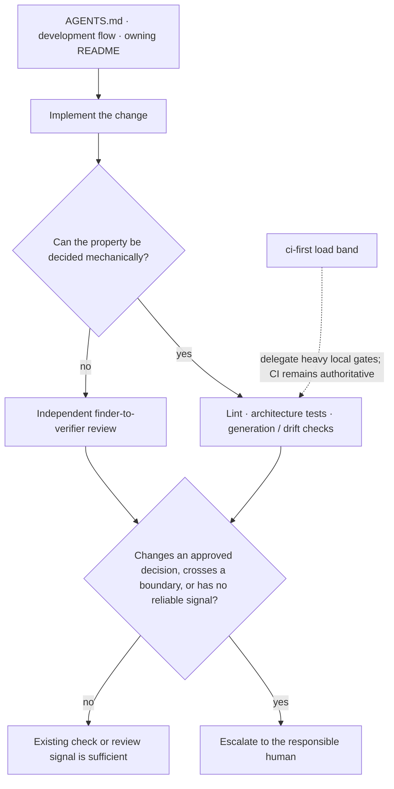
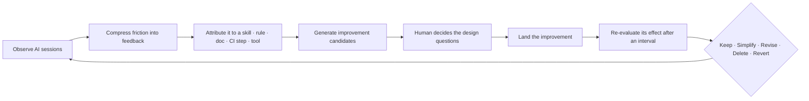

# Agent Environment

日本語: [agent-environment.ja.md](agent-environment.ja.md)

This document explains how the repository's agent environment turns its declared properties into daily practice. It is an interpretation of [ADR-0008 (agent-environment-alignment)](../adr/0008-agent-environment-alignment.md) — both the properties a control must satisfy and the loop that later retires it — not a checklist or a second source of rules. Why AI assistance is the standard path at all is [ADR-0007 (agents-md-operational-contract)](../adr/0007-agents-md-operational-contract.md).

## Guide before action

[AGENTS.md](../../AGENTS.md), the development flow, and the package README nearest to the target provide the governing and local context before an action. `CLAUDE.md` is AGENTS.md's symlink, not a second contract. Skills make recurring procedures explicit, but read and link to these same sources rather than replacing them.

## Correct after action

Decidable properties fail mechanically: `depguard` and architecture tests protect layer boundaries; generators and drift checks protect derived artifacts; focused linters protect workflow and documentation conventions. Reading-comprehension judgments remain independent review, using the finder-to-verifier shape in [ADR-0093 (multi-model-adversarial-review)](../adr/0093-multi-model-adversarial-review.md).

## Escalation and load-aware verification

Escalate a matter when it changes an approved decision, crosses an architectural boundary, or cannot reappear through an existing check. Do not create a durable task merely because a mechanism already reports the same condition reliably.

The `ci-first` load band delegates heavy local gates to CI when host saturation would make their failures unreliable. It does not permit verification to be skipped: the authoritative check still runs remotely, while local work keeps fast, trustworthy checks.

## Improving the environment itself

The steps above describe one change. The environment that guides and checks it is under a loop of
its own, because a control is added far more readily than it is removed: a skill nobody invokes and
a rule whose case no longer occurs both produce no failure, so the signal to retire them is the
absence of a signal.

In practice the loop is bounded on three sides:

- **What is observed** is friction, not activity, and it is kept **outside the repository** — the
  compressed finding (what was hit, which control it implicates, what the change to that control
  measurably did) goes to its issue, never to a commit. A per-run narrative is not kept at all, and
  [`.agents/`](../../.agents/README.md) holds only the loop's configuration;
  [ADR-0009 (long-running-agent-state)](../adr/0009-long-running-agent-state.md) draws both lines.
- **Who decides** is a human wherever the candidate touches architecture, domain, or policy. The
  loop surfaces the decision and its options; it does not take one.
- **What may be edited** follows the same scope as any other change. The AI-tool configuration
  directories stay outside an agent's default scope and are reachable only through an explicitly
  invoked skill, bounded by that skill's own procedure, per the skill-execution exception in
  [AGENTS.md](../../AGENTS.md). `AGENTS.md` itself is human-maintained and is never edited this way.

Skills carry the same lifecycle as any other control, inventoried on how often they are invoked, the
occasions on which they would have applied but were not, the friction they themselves caused, and
the measured effect of the last change to them.

## Keeping this interpretation current

This is a describing document. Update it only when the relationship it describes changes. Governing documents and accepted ADRs are not silently corrected from implementation drift; raise conflicts as [docs/rules.md](../rules.md) requires.
