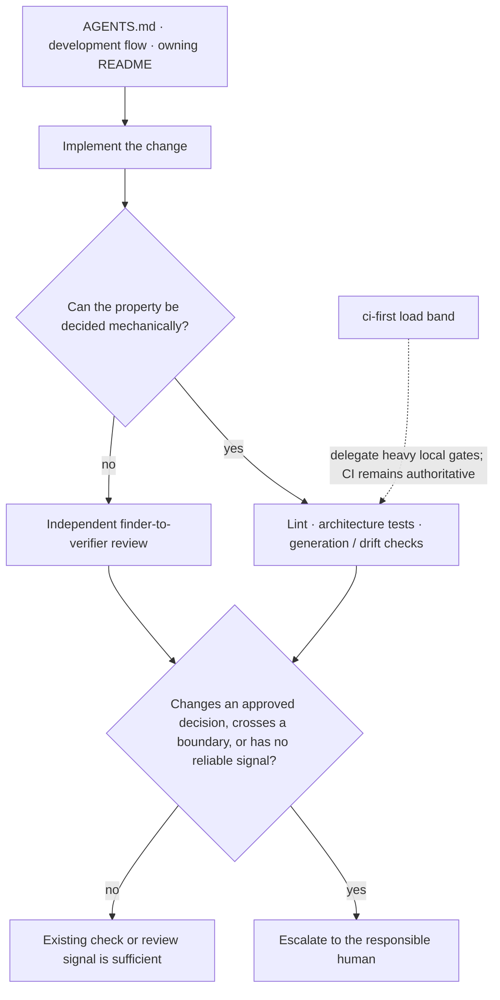

# Agent Environment

日本語: [agent-environment.ja.md](../ja/design/agent-environment.ja.md)

This document explains how the repository's agent environment turns its declared properties into daily practice. It is an interpretation of [ADR-0008 (agent-environment-alignment)](../adr/0008-agent-environment-alignment.md), not a checklist or a second source of rules.

## Guide before action

[AGENTS.md](../../AGENTS.md), the development flow, and the package README nearest to the target provide the governing and local context before an action. `CLAUDE.md` is AGENTS.md's symlink, not a second contract. Skills make recurring procedures explicit, but read and link to these same sources rather than replacing them.

## Correct after action

Decidable properties fail mechanically: `depguard` and architecture tests protect layer boundaries; generators and drift checks protect derived artifacts; focused linters protect workflow and documentation conventions. Reading-comprehension judgments remain independent review, using the finder-to-verifier shape in [ADR-0090 (multi-model-adversarial-review)](../adr/0090-multi-model-adversarial-review.md).

## Escalation and load-aware verification

Escalate a matter when it changes an approved decision, crosses an architectural boundary, or cannot reappear through an existing check. Do not create a durable task merely because a mechanism already reports the same condition reliably.

The `ci-first` load band delegates heavy local gates to CI when host saturation would make their failures unreliable. It does not permit verification to be skipped: the authoritative check still runs remotely, while local work keeps fast, trustworthy checks.

## Keeping this interpretation current

This is a describing document. Update it only when the relationship it describes changes. Governing documents and accepted ADRs are not silently corrected from implementation drift; raise conflicts as [docs/rules.md](../rules.md) requires.
