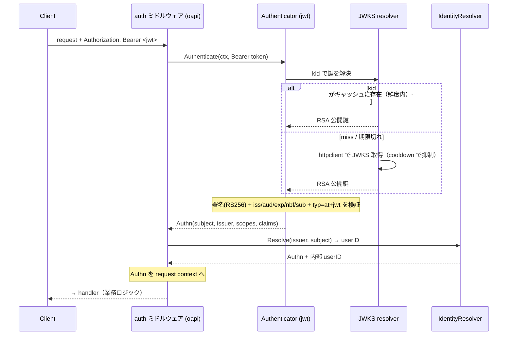
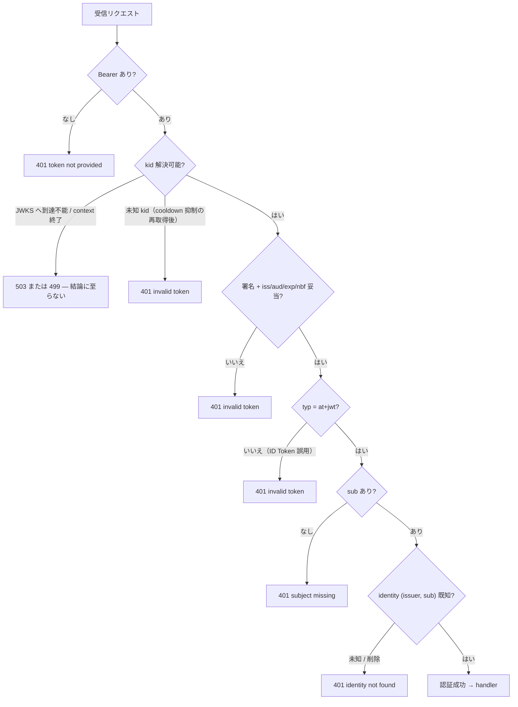
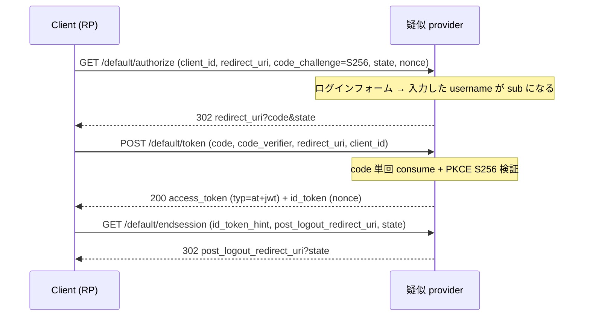

# 認証サブシステム 設計リファレンス

[jwt README](../../internal/infrastructure/auth/jwt/README.ja.md) | [docker README](../../docker/README.ja.md) | English: [auth.md](auth.md)

本ドキュメントは認証サブシステムの **役割理論・状態遷移（通常版 / 異常版）・実装配置・インテグレーターが実装すること・用語解説** を、実装の精読から導いて1ページに統合する。本サブシステムは1つの契約 — **JWKS 鍵セット** と **access token の claim 形状** — で出会う2つの半身から成る:

- **Resource Server 側** — Go API が受け取った access token を *検証* する。発行はしない。
- **Provider 側** — 上流イメージ（`ghcr.io/navikt/mock-oauth2-server`）で動く疑似 OIDC プロバイダがローカル開発用にトークンを *発行* し、OIDC ログインフローを実装する。

検証コアは [jwt README](../../internal/infrastructure/auth/jwt/README.ja.md)、Provider の配線と設定は [docker README](../../docker/README.ja.md) を参照。その HTTP 表面は素の OIDC Core であり、本リポジトリはその写しを持たない——他人の実装の spec は腐る spec だからである。本ページは両者を結ぶ横断ナラティブである。

---

## 1. 役割理論（何を、何のために）

ここでの認証とは、**Resource Server（Go API）は、信頼できる JWKS エンドポイントから取得した公開鍵で署名と標準 claim を検証して初めて access token を信頼する**こと。RS は何も発行しない。本番ではこのエンドポイントは実 IdP（Cognito / Auth0 / Keycloak / Entra ID）、ローカル開発では疑似プロバイダ。発行側と検証側は**意図的に異なる実装**（Nimbus を使う JVM プロバイダ vs Go）で、単一の JOSE ライブラリ由来のバグが相殺し合わないようにしている。

責務分担（誰が何を持つか）:

| コンポーネント | 側 | 責務 | 持たないもの |
| --- | --- | --- | --- |
| **auth ミドルウェア**（`httpstack/oapi` + `oapi/auth`） | RS / controller | 保護ルートで `security:` を強制: `Bearer` 抽出→Authenticator→IdentityResolver を**リクエストの** context 下で実行、`Authn` を context へ、資格情報を拒否した場合は `401`、検証を遂行できなかった場合は分類に応じたステータス | 検証ロジック・業務ロジック |
| **Authenticator**（`infrastructure/auth/jwt`） | RS / infrastructure | 署名（RS256 allowlist）+ claim（`iss`/`aud`/`exp`/`nbf`/`sub`）+ `typ=at+jwt` を検証、`kid` で鍵解決 | 鍵発行・identity・HTTP ポリシー |
| **JWKS resolver**（`jwt/jwks.go`） | RS / infrastructure | 回復力のある `httpclient` 経由で JWK Set を取得、`kid → RSA 鍵` を TTL キャッシュ、miss 時に cooldown 下で再取得 | claim 検証 |
| **IdentityResolver**（`usecase/boundary/auth`） | RS / usecase 境界 | `(issuer, subject)` → 内部 `userID`、未知/削除は `401` | トークン検証 |
| **疑似 provider** | provider（dev） | access/id token 発行、JWKS + discovery 提供、Authorization Code Flow + PKCE | 本番利用。RS 自身のテストが決定的に駆動しなければならないもの |
| **`AUTH_*` config** | config | issuer / audience / JWKS URL / アルゴリズム / clock-skew / cache-TTL | ロジック |

設計原則（不変条件）:

- **Fail-closed。** どのエラーもアクセスを許可しない。資格情報について結論を出した検証*失敗*は `apperror.ErrUnauthenticated`（`401`）へ正規化し、原因はログ/トレース用にエラーチェーンへ保持する。検証を*遂行できなかった*ことは別の事実であり、分類を保つ —— 署名鍵を取得できない場合やリクエストの context が終了した場合、エラーは `apperror.ErrUnavailable`（`503`）/ `apperror.ErrCanceled`（`499`）のまま返る。トークンについて何も述べていないためで、`401` にすると誰も検査していない資格情報を直すようクライアントへ伝えることになる。いずれも拒否であり、違うのは報告する理由だけ。
- **標準コアのみ。** RS256 allowlist（`alg=none` と `HS256` は常に拒否 — 鍵混同攻撃対策）、`iss`/`aud`/`exp`/`nbf`/`sub`、`typ=at+jwt`（RFC 9068）で ID Token 誤用を拒否。IdP 方言（Cognito `token_use`、Azure `scp`）は**拡張ポイント**で組み込まない。
- **Split-horizon。** `issuer`（token の `iss`、ホスト/ブラウザ解決可能）と **JWKS 取得 URL**（コンテナ内部）を分離する。`AUTH_JWKS_URL` を内部 URL に設定し、`iss` はホスト解決可能なまま鍵取得はコンテナ名を使う。
- **Provider は dev 限定。** compose の `development` / `auth` プロファイル経由でしか到達できず、デプロイされる環境には決して含まれない。
- **契約であって実装ではない。** RS が依存するのは JWKS の形と access token の claim 形状（`typ=at+jwt` / `iss` / `aud` / `sub` / `exp`）で、それを `docker/mock-auth-server/config.json` が固定する。この契約さえ満たせば実 IdP を含め何でも **config 変更のみ**で差し替わる — Go 変更不要。

---

## 2. ユーザーの有効性と失格（誰が・どう無効化するか）

認証（IdP が呼び出し元が *誰か* を表明）と、**この系での有効性**（そのユーザーがここで今も有効なメンバーか）は**別の軸**である。リクエストが通るのは**両方**成立するときのみ — RS が**毎リクエスト**評価する論理 AND:

> **実効アクセス = ( トークン検証 — IdP 側 ) AND ( この系で有効: soft-delete されていない + roles 許可 — RS 側 )**

構造的に妥当な JWT でも十分でない理由がこれ。Provider の削除済みユーザー fixture（Charlie / Frank）は完全に妥当・正しく署名されたトークンを持つが拒否される — **「JWT 有効 ≠ この系で利用可能」**。

どの無効化を誰が持つか:

| 無効化 | 所有者 | 効果 | 配置（本リポジトリ） |
| --- | --- | --- | --- |
| **アカウント無効化**（もう認証できない） | IdP | *新規*トークンの発行を止める。既発行 JWT は `exp` まで有効なまま | 外部 IdP — mock には**無い**（アカウント lifecycle を持たないトークン stub） |
| **メンバーシップ無効化**（soft-delete: 退会 / BAN） | この RS | トークンに関係なく毎リクエスト拒否 | `IdentityResolver` の実装 → `401` |
| **認可**（roles） | この RS | アクションごとに許可 / 拒否 | ロールストア + `Authorizer` の実装 |

誤解されやすい点:

- **実行時の横断クエリは無い。** JWT + JWKS では RS は AND を**ローカル**に評価する: IdP 側の項は JWT そのもの（*キャッシュ済み* JWKS で署名検証 — IdP への毎リクエスト通信は無い）、有効性の項はこのサービス自身の `deleted_at` / roles。RS はリクエスト時に IdP にも他サービスにも「削除状態」を問い合わせない。（毎リクエストで IdP を参照するのは opaque token の **introspection** — 本スタックが採らない別設計。）
- **グローバルでなくサービスごと。** 各 Resource Server が自分の `deleted_at` を所有する。サービス A で退会したユーザーがサービス B では有効たりうる。RS が polling する共有「削除状態」サービスは無く、IdP がアプリ横断のメンバーシップを集約することもない。
- **stateless の帰結 → だから RS がローカルに見る。** JWT は自己完結のため、IdP のアカウント無効化は既発行トークンを失効させない（`exp` まで受理される）。毎リクエストの `deleted_at` 検査が、トークン寿命に依らない *即時* 失効を与える。

無効性を *立てる* provisioning の 2 経路 — 上記の enforcement（*読む*だけ）とは別:

- **アプリ主導**（退会 / BAN）: このサービスが自分のユーザーレコードを soft-delete する。これが主たる実行時経路。これを駆動する退会エンドポイントは別 PBI。
- **IdP 主導**（deprovisioning）: 実 IdP がユーザーを無効化し、それをここへ反映したい場合は、このサービスの deactivate 経路を呼ぶ**薄い ingress アダプタ**（SCIM / webhook 受け口、またはイベント consumer）を足す。mock はそのイベントを発行せず、伝播プロトコルは IdP 依存のため、**この seam は意図的に未実装**のまま — enforcement 側（soft-delete を尊重する `IdentityResolver` の実装）は、何がそれを立てても消費できる状態にある。IdP が *トリガ* し、RS が *enforce* する。

---

## 3. 状態遷移

### 3.1 RS のトークン検証 — 通常パス



### 3.2 RS のトークン検証 — 異常パス（結論を出した失敗はすべて `401` に正規化）



これら `401` 分岐はすべて `internal/integration/jwt_auth_test.go` が決定的に駆動する。同テストはインプロセスで生成した鍵から自分でトークンを鋳造する——期限切れ、有効化前、issuer 不一致、audience 不一致、subject 欠落、未知の `kid`、撤去済みの鍵、非対応アルゴリズム、access token の位置に置かれた ID Token。この網を疑似プロバイダ経由にしないのは意図的である。*正しい*トークンを出すのが仕事のプロバイダは、*不正な*トークンが拒まれることを示す道具としては貧しく、それに頼ると RS の異常系が第三者の機能セットに縛られる。

### 3.3 Provider の Authorization Code Flow + PKCE — 通常パス

エンドポイントのパスは issuer の discovery 文書が広告するものです。以下の `default` は
`docker/mock-auth-server/config.json` の `issuerId` で、JWKS の `kid` も兼ねます。



ブラウザを介さずトークンを鋳造することもでき、スクリプトからの確認や DAST スキャンはこちらを使います
——`POST /default/token` に `grant_type=password` と `username` を渡すと、ログインフォームと同じく
プロバイダがそれを `sub` へ写します。この経路に特権はありません。標準のトークンエンドポイントそのもの
であり、返るトークンの形はログインフローが出すものと同じです。旧プロバイダが持っていた専用の試験口は
これで置き換わります。

`sub` はログインフォーム（または password grant）に渡した `username` そのものなので、seed が
`user_identities` に登録した値でなければなりません。そうでないと検証は成功し、その先の identity
解決で拒まれます。**ロールはトークンに載りません。** ロールはこのサービスの DB（`user_roles`）に
あり `GET /v1/users/me/roles` が返します。IdP がたまたまロールを知っているのは特定デプロイの性質で
あって契約ではないため、管理者に何を見せるかを決めるクライアントは API を読みます。

### 3.3.1 なぜ `aud` を多値にするか

プロバイダは発行する 2 つのトークンに同じ claim 集合を適用するため、`aud` をトークン種別ごとに
変えられません。ところが 2 つは異なる audience を求めます——access token の `aud` はリソース
サーバーを指し、ID Token の `aud` はクライアントを指します（OIDC Core 3.1.3.7）。`aud` を設定
しなければ ID Token は正しくなりますが、access token からは `aud` が丸ごと消え、RS が拒否します。

そこで `docker/mock-auth-server/config.json` は**両方**を入れます——`aud: ["go-boilerplate-api",
"go-boilerplate-client"]` と `azp: "go-boilerplate-client"`。双方が自分の関心のある側で検証を
通せます。RS は自分の audience が `aud` に*含まれる*ことを要求し、クライアントは `aud` が自分の
`client_id` を*含む*こと（§3）と、`aud` が多値なら `azp`（§4）を検証します。`AUTH_AUDIENCE` は
リソースサーバーの audience のままで、これは実 IdP に設定することになる値そのものです。

> **プロバイダを上流イメージにしたことの帰結が 3 つあり、いずれも意図して受け入れています。**
>
> 1. **ここでは ID Token と access token を区別できません。** claim 集合も `typ` ヘッダも両者で 1 つ
>    なので、RS が要求する `typ=at+jwt`（RFC 9068）は ID Token にも刻まれ、上の `aud` も共有されます。
>    したがってローカルでは ID Token を API に提示しても通ってしまいます——実 IdP の ID Token は
>    `aud=<client_id>` だけを持つので拒まれるところです。RS がその誤用を拒む挙動自体は本物で、
>    `internal/integration/jwt_auth_test.go` が固定しています。失われるのはこのプロバイダ相手に
>    それを*実演*できることだけです。
> 2. **プロバイダ自身の `/userinfo` は使えません。** JOSE の型として `at+jwt` を拒否するためです。
>    ローカルでプロフィール claim が要るクライアントは UserInfo を呼ばず ID Token を読むべきで、
>    OIDC クライアントライブラリの既定の振る舞いもそれです。
>
> 3. **`redirect_uri` は登録制ではありません。** プロバイダは任意の値を受け付けます。実 IdP は登録済み
>    リストと照合し、それが code flow におけるオープンリダイレクトの主たる防御になります。この緩さは、
>    各々別ポートに載る複数の worktree が、スロットごとにクライアントを登録し直さずフローを回せるように
>    するためのものです。クライアント登録は実 IdP 側でインテグレーターが設定するものと捉えてください。
>    RS は `redirect_uri` を見ないため、RS 側は何も依存していません。
>
> いずれも RS の `at+jwt` 要求を明け渡すには値しません。あの要求は本番の挙動であり、ローカルだけ緩めると
> 開発者に最も近い環境が検証経路を最も通らない環境になってしまいます。

### 3.4 鍵ローテーション（JWKS のフェーズ）

ローテーションは **公開鍵セット**（JWKS で配る鍵）と **署名鍵 1 本**の分離で定義されます。古典的な 3 フェーズは次のとおりです。

```text
Phase 1  JWKS: [key-a]         Signing: key-a   (initial)
Phase 2  JWKS: [key-a, key-b]  Signing: key-b   (add-key + promote key-b)
Phase 3  JWKS: [key-b]         Signing: key-b   (retire key-a)
```

RS 側の JWKS リゾルバは、リクエストごとの再取得なしでこれを乗り切ります。

- **既知の `kid` → キャッシュヒット**で取得なし（ローテーションがリクエストごとのコストを増やさない）。
- **未知の `kid` → 1 回だけ再取得**（cooldown で抑制し、同時取得は 1 本にまとまる）。ローテーション途中で発行された `key-b` の token もこれで拾える。
- **ネガティブキャッシュ**: 現在のキャッシュ世代で*実際に取得した結果*として不在が確認された `kid` を記憶し、でたらめな `kid` の連打が毎回再取得を起こさないようにする。取得成功で公開鍵セットが変われば破棄され、stale なキャッシュや（取得せず）抑制されただけの `kid` には適用されない — ローテーションで追加された `kid` は次回の取得（キャッシュ TTL の範囲）で解決され、恒久的に拒否されることはない。
- **撤去済みの鍵 → `401`**: キャッシュ世代が更新されて公開鍵セットから `key-a` が消えると、その鍵で署名された token は「`kid` を解決できるか」の分岐で落ちる。

状態遷移の end-to-end は `internal/integration/jwks_rotation_test.go` が決定的に押さえており、`internal/integration/testdata/` 配下の golden JWKS / PEM に対して、実際の HTTP 境界越しに各フェーズを駆動します。

> **疑似プロバイダはローテーションを再現できません。** JWKS の `kid` を `issuerId` から導出し、issuer あたり 1 本だけ公開するため、1 つの JWKS に 2 つの `kid` を載せることも、その間で署名鍵を移すことも、到達可能などの設定でもできません。したがって上のフェーズはテスト自身の fixture だけで駆動され、その fixture はプロバイダと共有せずテストが所有します。これは意図的な取引です——ローテーションは RS 側リゾルバの性質であり、テストが検証しているのはそのリゾルバだからです。

---

## 4. 実装配置

| 観点 | 配置 |
| --- | --- |
| auth 強制（ミドルウェア・priority 6） | `internal/controller/httpstack/oapi/oapi.go`, `oapi/auth/auth.go` |
| Authenticator 境界インタフェース | `internal/usecase/boundary/auth/{authenticator,credential,auth,resolver}.go` |
| JWT 検証コア | `internal/infrastructure/auth/jwt/auth_jwt.go` |
| JWKS 解決（`kid` lookup・TTL キャッシュ・refresh cooldown） | `internal/infrastructure/auth/jwt/jwks.go` |
| dev 限定スタブ（`Bearer debug:<subject>`、`ci` / `test` env） | `internal/infrastructure/auth/local/auth_local.go` |
| identity 解決（`sub` → 内部 `userID`） | `internal/infrastructure/auth/` 配下のプロジェクト固有の `IdentityResolver`。基盤の既定は `internal/infrastructure/auth/identity/` の passthrough |
| DI 配線（env 駆動の authenticator 選択・JWKS downstream profile） | `internal/di/module/core/auth.go`, `internal/di/module/auth.go` |
| スキャン用の実 JWT 実行文脈（`dast` env: mock provider へ http で JWKS backed authenticator を配線） | `env/.env.dast`, `.github/workflows/zap-api-scan.yaml` |
| config（`AUTH_*`） | `internal/config/envspec.go`, `internal/config/model.go` |
| ops-path / metrics の auth 例外 | `internal/controller/httpstack/oapi/skipper/`, ADR [0018](../adr/0018-metrics-endpoint-auth-exception.md) |
| 開発用 OIDC provider | `docker-compose.yaml`（`mock_auth_server`）+ `docker/mock-auth-server/config.json`。イメージの digest は `docker/images-pin.toml` が固定 |

---

## 5. インテグレーターが実装すること

1. **config で RS を IdP に向ける。** `AUTH_ISSUER`（token の `iss` と一致必須）・`AUTH_AUDIENCE`・`AUTH_JWKS_URL`（IdP の `jwks_uri`）。ローカルでは `env/.env` がこれらを疑似プロバイダに向け、`AUTH_JWKS_URL` は split-horizon でコンテナ内部ホストを指す。任意: `AUTH_ALLOWED_ALGORITHMS`（既定 `RS256`）・`AUTH_CLOCK_SKEW`（`60s`）・`AUTH_JWKS_CACHE_TTL`（`5m`）。
2. **mock を実 IdP に差し替える**のは上記 env 値の変更のみ — JWKS + claim 契約はバイト等価なので Go 変更は不要。`iss` はホスト解決可能に、`AUTH_JWKS_URL` は API コンテナから到達可能に保つ。
3. **IdP 方言を追加**する（標準コアから外れる場合）— Cognito `token_use` / `aud`→`client_id`、Azure `scp` / `roles`、EC 鍵、opaque token — は [jwt README](../../internal/infrastructure/auth/jwt/README.ja.md) の拡張ポイントで。
4. **identity 解決**は `(issuer, subject)` を内部ユーザーに対応づける。自前のユーザーストア向けに `IdentityResolver` の実装を用意する。用意しない場合 DI は passthrough 既定を配線し、内部 UserID は未解決のまま通る — つまりここでは未知・無効化された subject を拒否しない。

> **前方注記（`#584` / PR #618・本ブランチ未収録）:** RS 側の OIDC *discovery* — `AUTH_JWKS_URL` を空にして issuer の `/.well-known/openid-configuration` から `jwks_uri` を導出（issuer 厳密一致 + same-origin + https）し、`AUTH_JWKS_DISCOVERY_TTL` / `AUTH_JWKS_UNKNOWN_KID_COOLDOWN` を伴う — は別途着地する。本ブランチでは RS は `AUTH_JWKS_URL` から JWKS URL を**静的**に解決する。疑似プロバイダは到達された issuer URL で discovery 文書を提供する。

---

## 6. 用語解説

| 用語 | 意味 |
| --- | --- |
| **Access token** | RS がリクエスト認証のために検証する JWT。`typ=at+jwt`（RFC 9068）を持つ。 |
| **ID Token** | エンドユーザーに関する OIDC トークン（`token_use=id`、`aud=client_id`、`typ=JWT`）。access token として使っては**ならない** — RS は `typ` 検査で拒否する。 |
| **JWKS** | JSON Web Key Set。RS が署名検証のために取得する公開鍵群（RFC 7517）。 |
| **`kid`** | JWT ヘッダの Key ID。どの JWKS 鍵で署名を検証するかを選ぶ。 |
| **OIDC discovery** | `issuer` / `jwks_uri` / endpoint を広告する `/.well-known/openid-configuration` 文書。Provider が提供し、RS が消費するのは `#584` discovery モード時のみ。 |
| **`issuer` / `iss`** | トークン発行者識別子。RS は厳密一致を要求する。 |
| **`audience` / `aud`** | 想定受信者。RS は設定の audience を要求する。 |
| **PKCE (S256)** | Proof Key for Code Exchange（RFC 7636）: `code_challenge = base64url(sha256(code_verifier))`。token endpoint が再計算して照合する。`plain` は受理しない。 |
| **Authorization code** | 認可エンドポイントが発行する短命・単回使用のクレデンシャル。トークンエンドポイントで1回だけ交換される。 |
| **Split-horizon** | ブラウザ/ホスト向けの `issuer` URL と、コンテナ内部の JWKS 取得 URL を分離すること。`iss` はホスト解決可能なまま鍵取得は内部ホスト名を使う。 |
| **Authn** | 検証済み（identity は任意で未解決）の結果（`subject`・`issuer`・`scopes`・`claims`、identity 解決後は内部 `userID`）。 |
| **identity 解決** | `(issuer, subject)` を内部アプリの `userID` に対応づけること。トークン検証とは別の関心事。 |
| **Fail-closed** | 検証エラーは常に拒否に倒し、default-allow にしない。資格情報を拒否した場合は `401`、結論に至らなかった場合は `503` / `499`。 |
| **アルゴリズム allowlist** | 受理する署名アルゴリズム集合（既定 `RS256`）。`alg=none` / `HS256` は鍵混同防止のため常に拒否。 |
