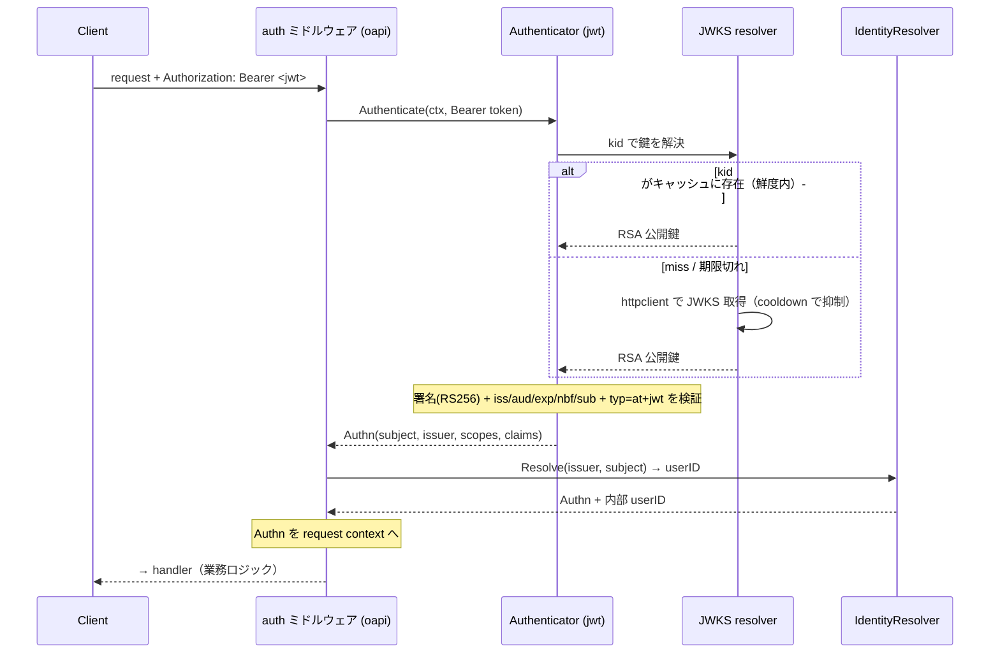
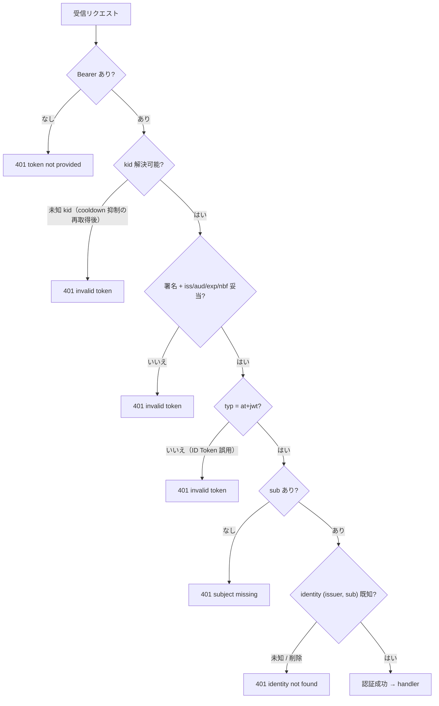
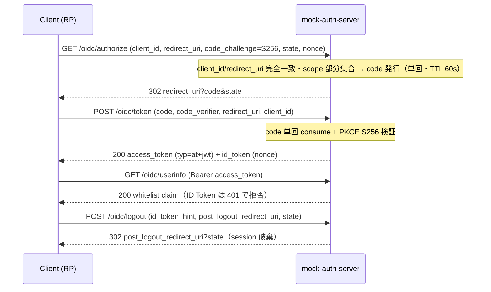

# 認証サブシステム 設計リファレンス

[jwt README](../../internal/infrastructure/auth/jwt/README.ja.md) | [mock-auth-server README](../../mock-auth-server/README.ja.md) | English: [auth.md](auth.md)

本ドキュメントは認証サブシステムの **役割理論・状態遷移（通常版 / 異常版）・実装配置・インテグレーターが実装すること・用語解説** を、実装の精読から導いて1ページに統合する。本サブシステムは1つの契約 — **JWKS 鍵セット** と **access token の claim 形状** — で出会う2つの半身から成る:

- **Resource Server 側** — Go API が受け取った access token を *検証* する。発行はしない。
- **Provider 側** — 別ランタイムの TypeScript サービス `mock-auth-server` がローカル開発用にトークンを *発行* し、OIDC ログインフローを実装する。

検証コアは [jwt README](../../internal/infrastructure/auth/jwt/README.ja.md)、Provider の HTTP 表面とフローは [mock-auth-server README](../../mock-auth-server/README.ja.md) を参照。本ページは両者を結ぶ横断ナラティブである。

---

## 1. 役割理論（何を、何のために）

ここでの認証とは、**Resource Server（Go API）は、信頼できる JWKS エンドポイントから取得した公開鍵で署名と標準 claim を検証して初めて access token を信頼する**こと。RS は何も発行しない。本番ではこのエンドポイントは実 IdP（Cognito / Auth0 / Keycloak / Entra ID）、ローカル開発では `mock-auth-server`。発行側と検証側は**意図的に異なるランタイム**（TypeScript vs Go）で、単一ライブラリ由来のバグが相殺し合わないようにしている。

責務分担（誰が何を持つか）:

| コンポーネント | 側 | 責務 | 持たないもの |
| --- | --- | --- | --- |
| **auth ミドルウェア**（`httpstack/oapi` + `oapi/auth`） | RS / controller | 保護ルートで `security:` を強制: `Bearer` 抽出→Authenticator→IdentityResolver、`Authn` を context へ、失敗は `401` | 検証ロジック・業務ロジック |
| **Authenticator**（`infrastructure/auth/jwt`） | RS / infrastructure | 署名（RS256 allowlist）+ claim（`iss`/`aud`/`exp`/`nbf`/`sub`）+ `typ=at+jwt` を検証、`kid` で鍵解決 | 鍵発行・identity・HTTP ポリシー |
| **JWKS resolver**（`jwt/jwks.go`） | RS / infrastructure | 回復力のある `httpclient` 経由で JWK Set を取得、`kid → RSA 鍵` を TTL キャッシュ、miss 時に cooldown 下で再取得 | claim 検証 |
| **IdentityResolver**（`usecase/boundary/auth`） | RS / usecase 境界 | `(issuer, subject)` → 内部 `userID`、未知/削除は `401` | トークン検証 |
| **mock-auth-server** | provider（dev） | access/id token 発行、JWKS + discovery 提供、Authorization Code Flow + PKCE、dev-gate、本番拒否 | 本番利用 |
| **`AUTH_*` config** | config | issuer / audience / JWKS URL / アルゴリズム / clock-skew / cache-TTL | ロジック |

設計原則（不変条件）:

- **Fail-closed。** すべての検証失敗を `apperror.ErrUnauthenticated`（`401`）に正規化する。原因はログ/トレース用にエラーチェーンへ保持し、呼び出し側は正規化された `401` のみを見る。
- **標準コアのみ。** RS256 allowlist（`alg=none` と `HS256` は常に拒否 — 鍵混同攻撃対策）、`iss`/`aud`/`exp`/`nbf`/`sub`、`typ=at+jwt`（RFC 9068）で ID Token 誤用を拒否。IdP 方言（Cognito `token_use`、Azure `scp`）は**拡張ポイント**で組み込まない。
- **Split-horizon。** `issuer`（token の `iss`、ホスト/ブラウザ解決可能）と **JWKS 取得 URL**（コンテナ内部）を分離する。`AUTH_JWKS_URL` を内部 URL に設定し、`iss` はホスト解決可能なまま鍵取得はコンテナ名を使う。
- **Provider は dev 限定。** `/bypass/*` ・ `/admin/*` は dev-gate、`NODE_ENV=production` では起動拒否。
- **バイト等価契約。** mock の JWKS バイト列と access token の claim 形状（`typ=at+jwt` / `iss` / `aud` / `sub` / `exp`）は RS が期待するものと一致するため、mock は **config 変更のみ**で実 IdP に差し替え可能 — Go 変更不要。

---

## 2. ユーザーの有効性と失格（誰が・どう無効化するか）

認証（IdP が呼び出し元が *誰か* を表明）と、**この系での有効性**（そのユーザーがここで今も有効なメンバーか）は**別の軸**である。リクエストが通るのは**両方**成立するときのみ — RS が**毎リクエスト**評価する論理 AND:

> **実効アクセス = ( トークン検証 — IdP 側 ) AND ( この系で有効: soft-delete されていない + roles 許可 — RS 側 )**

構造的に妥当な JWT でも十分でない理由がこれ。Provider の削除済みユーザー fixture（Charlie / Frank）は完全に妥当・正しく署名されたトークンを持つが拒否される — **「JWT 有効 ≠ この系で利用可能」**。

どの無効化を誰が持つか:

| 無効化 | 所有者 | 効果 | 配置（本リポジトリ） |
| --- | --- | --- | --- |
| **アカウント無効化**（もう認証できない） | IdP | *新規*トークンの発行を止める。既発行 JWT は `exp` まで有効なまま | 外部 IdP — mock には**無い**（アカウント lifecycle を持たないトークン stub） |
| **メンバーシップ無効化**（soft-delete: 退会 / BAN） | この RS | トークンに関係なく毎リクエスト拒否 | `IdentityResolver` の実装 → `401` |
| **認可**（roles） | この RS | アクションごとに許可 / 拒否 | ロールストア + `Authorizer` の実装 |

誤解されやすい点:

- **実行時の横断クエリは無い。** JWT + JWKS では RS は AND を**ローカル**に評価する: IdP 側の項は JWT そのもの（*キャッシュ済み* JWKS で署名検証 — IdP への毎リクエスト通信は無い）、有効性の項はこのサービス自身の `deleted_at` / roles。RS はリクエスト時に IdP にも他サービスにも「削除状態」を問い合わせない。（毎リクエストで IdP を参照するのは opaque token の **introspection** — 本スタックが採らない別設計。）
- **グローバルでなくサービスごと。** 各 Resource Server が自分の `deleted_at` を所有する。サービス A で退会したユーザーがサービス B では有効たりうる。RS が polling する共有「削除状態」サービスは無く、IdP がアプリ横断のメンバーシップを集約することもない。
- **stateless の帰結 → だから RS がローカルに見る。** JWT は自己完結のため、IdP のアカウント無効化は既発行トークンを失効させない（`exp` まで受理される）。毎リクエストの `deleted_at` 検査が、トークン寿命に依らない *即時* 失効を与える。

無効性を *立てる* provisioning の 2 経路 — 上記の enforcement（*読む*だけ）とは別:

- **アプリ主導**（退会 / BAN）: このサービスが自分のユーザーレコードを soft-delete する。これが主たる実行時経路。これを駆動する退会エンドポイントは別 PBI。
- **IdP 主導**（deprovisioning）: 実 IdP がユーザーを無効化し、それをここへ反映したい場合は、このサービスの deactivate 経路を呼ぶ**薄い ingress アダプタ**（SCIM / webhook 受け口、またはイベント consumer）を足す。mock はそのイベントを発行せず、伝播プロトコルは IdP 依存のため、**この seam は意図的に未実装**のまま — enforcement 側（soft-delete を尊重する `IdentityResolver` の実装）は、何がそれを立てても消費できる状態にある。IdP が *トリガ* し、RS が *enforce* する。

---

## 3. 状態遷移

### 3.1 RS のトークン検証 — 通常パス



### 3.2 RS のトークン検証 — 異常パス（すべて `401` に正規化）



Provider の **異常系 bypass Profile**（`expired` / `wrong-issuer` / `wrong-audience` / `missing-subject` / `invalid-signature` / `unsupported-algorithm` / `id-token`）は、まさにこれら RS の各 `401` 分岐をテストで決定的に駆動するために存在する。

### 3.3 Provider の Authorization Code Flow + PKCE — 通常パス



### 3.4 Provider — 異常 / エラーパス

```mermaid
flowchart TD
    AZ["/oidc/authorize"] --> C1{"client_id / redirect_uri 完全一致?"}
    C1 -- いいえ --> AE1["400（リダイレクト不能）"]
    C1 -- はい --> C2{"response_type=code, scope⊆client, code_challenge, S256?"}
    C2 -- いいえ --> AE2["302 error redirect（state 反映）"]
    C2 -- はい --> AOK["302 with code"]
    TK["/oidc/token"] --> T1{"code 有効 & 未使用（単回）?"}
    T1 -- "再利用 / 期限切れ" --> TE1["400 invalid_grant"]
    T1 -- はい --> T2{"client_id/redirect_uri 一致 & PKCE S256 OK?"}
    T2 -- いいえ --> TE2["400 invalid_grant"]
    T2 -- はい --> TOK["200 access + id token"]
    UI["/oidc/userinfo"] --> U1{"Bearer access token, typ=at+jwt?"}
    U1 -- "欠如 / ID Token / 不正" --> UE["401 invalid_token"]
    U1 -- はい --> UOK["200 whitelist claim"]
```



### 3.5 鍵ローテーション（JWKS のフェーズ）

Provider は **公開鍵セット**（JWKS で配る鍵）と **署名鍵 1 本**を分けて保持するため、ローテーションを再現して RS 側を検証できます。`POST /admin/keys/rotate` は宣言的な `{action, kid}`（`add-key` / `promote` / `retire`）を受け取り、`POST /admin/reset` で Phase 1 へ戻ります。アクションを連ねると古典的な 3 フェーズを再現できます。

```text
Phase 1  JWKS: [key-a]         Signing: key-a   (initial)
Phase 2  JWKS: [key-a, key-b]  Signing: key-b   (add-key + promote key-b)
Phase 3  JWKS: [key-b]         Signing: key-b   (retire key-a)
```

RS 側の JWKS リゾルバは、リクエストごとの再取得なしでこれを乗り切ります。

- **既知の `kid` → キャッシュヒット**で取得なし（ローテーションがリクエストごとのコストを増やさない）。
- **未知の `kid` → 1 回だけ再取得**（cooldown で抑制し、同時取得は 1 本にまとまる）。ローテーション途中で発行された `key-b` の token もこれで拾える。
- **ネガティブキャッシュ**: 現在のキャッシュ世代で*実際に取得した結果*として不在が確認された `kid` を記憶し、でたらめな `kid` の連打が毎回再取得を起こさないようにする。取得成功で公開鍵セットが変われば破棄され、stale なキャッシュや（取得せず）抑制されただけの `kid` には適用されない — ローテーションで追加された `kid` は次回の取得（キャッシュ TTL の範囲）で解決され、恒久的に拒否されることはない。
- **撤去済みの鍵 → `401`**: キャッシュ世代が更新されて公開鍵セットから `key-a` が消えると、その鍵で署名された token は「`kid` を解決できるか」の分岐で落ちる。

状態遷移の end-to-end は `internal/integration/jwks_rotation_test.go` が決定的に押さえており、Provider とバイト単位で共有した JWKS / PEM に対して、実際の HTTP 境界越しに各フェーズを駆動します。

---

## 4. 実装配置

| 観点 | 配置 |
| --- | --- |
| auth 強制（ミドルウェア・priority 6） | `internal/controller/httpstack/oapi/oapi.go`, `oapi/auth/auth.go` |
| Authenticator 境界インタフェース | `internal/usecase/boundary/auth/{authenticator,credential,auth,resolver}.go` |
| JWT 検証コア | `internal/infrastructure/auth/jwt/auth_jwt.go` |
| JWKS 解決（`kid` lookup・TTL キャッシュ・refresh cooldown） | `internal/infrastructure/auth/jwt/jwks.go` |
| dev 限定スタブ（`Bearer debug:<subject>`、`ci` / `test` env） | `internal/infrastructure/auth/local/auth_local.go` |
| identity 解決（`sub` → 内部 `userID`） | `internal/infrastructure/auth/` 配下のプロジェクト固有の `IdentityResolver`。基盤の既定は `internal/infrastructure/auth/identity/` の passthrough |
| DI 配線（env 駆動の authenticator 選択・JWKS downstream profile） | `internal/di/module/core/auth.go`, `internal/di/module/auth.go` |
| スキャン用の実 JWT 実行文脈（`dast` env: mock provider へ http で JWKS backed authenticator を配線） | `env/.env.dast`, `.github/workflows/zap-api-scan.yaml` |
| config（`AUTH_*`） | `internal/config/envspec.go`, `internal/config/model.go` |
| ops-path / metrics の auth 例外 | `internal/controller/httpstack/oapi/skipper/`, ADR [0018](../adr/0018-metrics-endpoint-auth-exception.md) |
| 開発用 OIDC provider | `mock-auth-server/`（`src/routes/oidc.ts`, `tokens.ts`, `pkce.ts`, `keys.ts`, `store.ts`） |

---

## 5. インテグレーターが実装すること

1. **config で RS を IdP に向ける。** `AUTH_ISSUER`（token の `iss` と一致必須）・`AUTH_AUDIENCE`・`AUTH_JWKS_URL`（IdP の `jwks_uri`）。ローカルでは `env/.env` がこれらを `mock-auth-server` に向け、`AUTH_JWKS_URL` は split-horizon でコンテナ内部ホストを指す。任意: `AUTH_ALLOWED_ALGORITHMS`（既定 `RS256`）・`AUTH_CLOCK_SKEW`（`60s`）・`AUTH_JWKS_CACHE_TTL`（`5m`）。
2. **mock を実 IdP に差し替える**のは上記 env 値の変更のみ — JWKS + claim 契約はバイト等価なので Go 変更は不要。`iss` はホスト解決可能に、`AUTH_JWKS_URL` は API コンテナから到達可能に保つ。
3. **IdP 方言を追加**する（標準コアから外れる場合）— Cognito `token_use` / `aud`→`client_id`、Azure `scp` / `roles`、EC 鍵、opaque token — は [jwt README](../../internal/infrastructure/auth/jwt/README.ja.md) の拡張ポイントで。
4. **identity 解決**は `(issuer, subject)` を内部ユーザーに対応づける。自前のユーザーストア向けに `IdentityResolver` の実装を用意する。用意しない場合 DI は passthrough 既定を配線し、内部 UserID は未解決のまま通る — つまりここでは未知・無効化された subject を拒否しない。

> **前方注記（`#584` / PR #618・本ブランチ未収録）:** RS 側の OIDC *discovery* — `AUTH_JWKS_URL` を空にして issuer の `/.well-known/openid-configuration` から `jwks_uri` を導出（issuer 厳密一致 + same-origin + https）し、`AUTH_JWKS_DISCOVERY_TTL` / `AUTH_JWKS_UNKNOWN_KID_COOLDOWN` を伴う — は別途着地する。本ブランチでは RS は `AUTH_JWKS_URL` から JWKS URL を**静的**に解決する。`mock-auth-server` はその将来の消費者と標準準拠のため discovery 文書を既に提供している。

---

## 6. 用語解説

| 用語 | 意味 |
| --- | --- |
| **Access token** | RS がリクエスト認証のために検証する JWT。`typ=at+jwt`（RFC 9068）を持つ。 |
| **ID Token** | エンドユーザーに関する OIDC トークン（`token_use=id`、`aud=client_id`、`typ=JWT`）。access token として使っては**ならない** — RS は `typ` 検査で拒否する。 |
| **JWKS** | JSON Web Key Set。RS が署名検証のために取得する公開鍵群（RFC 7517）。 |
| **`kid`** | JWT ヘッダの Key ID。どの JWKS 鍵で署名を検証するかを選ぶ。 |
| **OIDC discovery** | `issuer` / `jwks_uri` / endpoint を広告する `/.well-known/openid-configuration` 文書。Provider が提供し、RS が消費するのは `#584` discovery モード時のみ。 |
| **`issuer` / `iss`** | トークン発行者識別子。RS は厳密一致を要求する。 |
| **`audience` / `aud`** | 想定受信者。RS は設定の audience を要求する。 |
| **PKCE (S256)** | Proof Key for Code Exchange（RFC 7636）: `code_challenge = base64url(sha256(code_verifier))`。token endpoint が再計算して照合する。`plain` は受理しない。 |
| **Authorization code** | `/oidc/authorize` が発行する短命（60s）・単回使用のクレデンシャル。`/oidc/token` で1回だけ交換される。 |
| **Split-horizon** | ブラウザ/ホスト向けの `issuer` URL と、コンテナ内部の JWKS 取得 URL を分離すること。`iss` はホスト解決可能なまま鍵取得は内部ホスト名を使う。 |
| **Authn** | 検証済み（identity は任意で未解決）の結果（`subject`・`issuer`・`scopes`・`claims`、identity 解決後は内部 `userID`）。 |
| **identity 解決** | `(issuer, subject)` を内部アプリの `userID` に対応づけること。トークン検証とは別の関心事。 |
| **dev-gate** | `MOCK_AUTH_DEV_ENDPOINTS` スイッチ。無効時に `/bypass/*` ・ `/admin/*` を `404` で隠す。 |
| **Fail-closed** | 検証エラーは常に拒否（`401`）に倒す。default-allow にしない。 |
| **アルゴリズム allowlist** | 受理する署名アルゴリズム集合（既定 `RS256`）。`alg=none` / `HS256` は鍵混同防止のため常に拒否。 |
