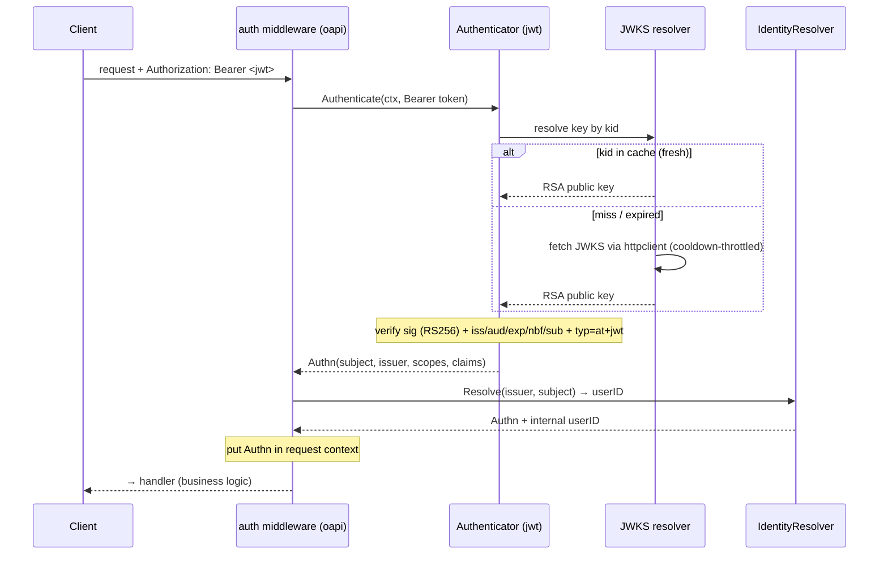
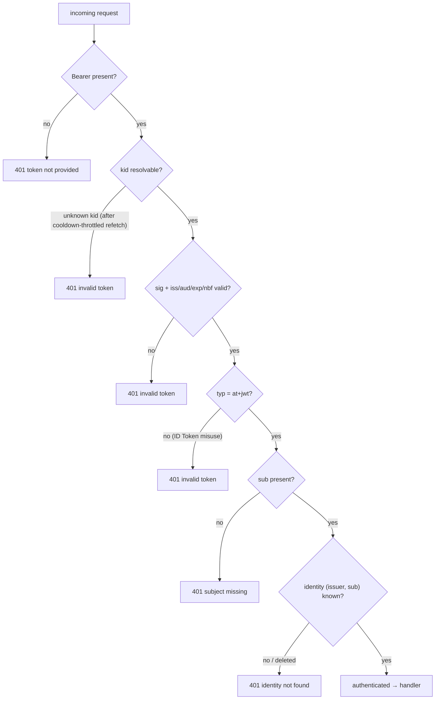
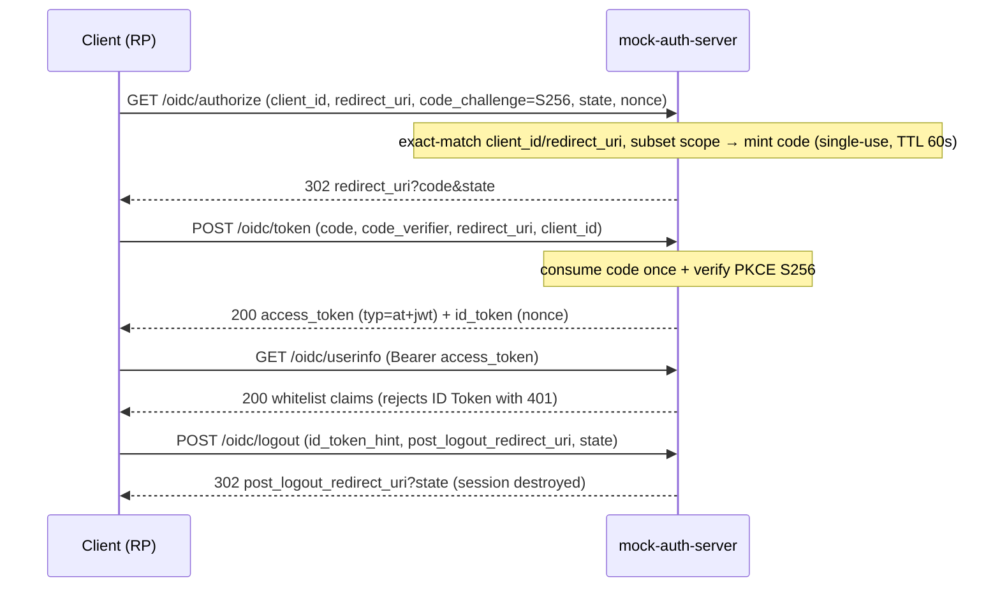
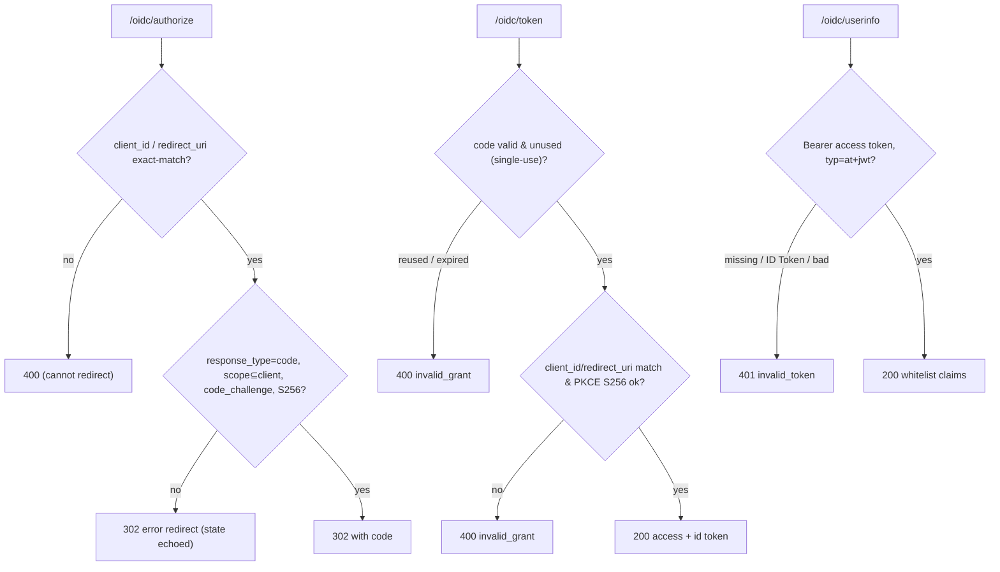

# Authentication Subsystem Design Reference

[jwt README](../../internal/infrastructure/auth/jwt/README.md) | [mock-auth-server README](../../docker/mock-auth-server/README.md) | 日本語: [auth.ja.md](../ja/design/auth.ja.md)

This document consolidates the authentication subsystem's **role theory, state transitions (normal + error), implementation locations, what an integrator must implement, and glossary** into a single reference, derived from a close reading of the implementation. The subsystem has two halves that meet at one contract — a **JWKS key set** and an **access-token claim shape**:

- **Resource-Server side** — the Go API *verifies* an incoming access token. It never mints one.
- **Provider side** — `mock-auth-server`, a separate TypeScript service, *issues* tokens for local development and implements the OIDC login flow.

For the verification core see the [jwt README](../../internal/infrastructure/auth/jwt/README.md); for the provider's HTTP surface and flows see the [mock-auth-server README](../../docker/mock-auth-server/README.md). This page is the cross-component narrative that ties them together.

---

## 1. Role theory (what, and what for)

Authentication here means: **the Resource Server (Go API) trusts an access token only after verifying its signature and standard claims against a public key it fetches from a trusted JWKS endpoint.** The RS mints nothing. In production that endpoint is a real IdP (Cognito / Auth0 / Keycloak / Entra ID); in local development it is `mock-auth-server`. The issuer and the verifier are **deliberately different runtimes** (TypeScript vs Go) so a bug in one library cannot cancel out a bug in the other.

Responsibility split (who owns what):

| Component | Side | Responsibility | Does NOT hold |
| --- | --- | --- | --- |
| **auth middleware** (`httpstack/oapi` + `oapi/auth`) | RS / controller | enforce `security:` on protected routes: extract `Bearer`, call Authenticator → IdentityResolver, put `Authn` in context, `401` on failure | verification logic, business logic |
| **Authenticator** (`infrastructure/auth/jwt`) | RS / infrastructure | verify signature (RS256 allowlist) + claims (`iss`/`aud`/`exp`/`nbf`/`sub`) + `typ=at+jwt`; resolve the key by `kid` | key issuance, identity, HTTP policy |
| **JWKS resolver** (`jwt/jwks.go`) | RS / infrastructure | fetch the JWK Set via the resilient `httpclient` substrate, cache `kid → RSA key` (TTL), refresh on miss under a cooldown | claim verification |
| **IdentityResolver** (`usecase/boundary/auth`) | RS / usecase boundary | map `(issuer, subject)` → internal `userID`; `401` on unknown / deleted | token verification |
| **mock-auth-server** | provider (dev) | issue access / id tokens, serve JWKS + discovery, run Authorization Code Flow + PKCE, dev-gate, refuse production | production use |
| **`AUTH_*` config** | config | issuer / audience / JWKS URL / algorithms / clock-skew / cache-TTL | logic |

Design principles (invariants):

- **Fail-closed.** Every verification failure normalizes to `apperror.ErrUnauthenticated` (`401`). The underlying cause is preserved in the error chain for logs/traces; callers only ever see a normalized `401`.
- **Standard core only.** RS256 allowlist (`alg=none` and `HS256` always rejected — key-confusion defense); `iss` / `aud` / `exp` / `nbf` / `sub`; `typ=at+jwt` (RFC 9068) to reject ID-Token misuse. IdP dialects (Cognito `token_use`, Azure `scp`) are **extension points**, not built in.
- **Split-horizon.** The `issuer` (the token's `iss`, host/browser-resolvable) is separated from the **JWKS fetch URL** (container-internal). `AUTH_JWKS_URL` is set to the internal URL so `iss` stays host-resolvable while key fetching uses the container hostname.
- **Provider is dev-only.** `/bypass/*` · `/admin/*` are dev-gated; the mock refuses to start when `NODE_ENV=production`.
- **Byte-equal contract.** The mock's JWKS bytes and access-token claim shape (`typ=at+jwt` / `iss` / `aud` / `sub` / `exp`) are what the RS expects, so the mock can be replaced by a real IdP with **config changes only** — no Go change.

---

## 2. State transitions

### 2.1 RS token verification — normal path

### 2.2 RS token verification — error paths (all normalize to `401`)

The provider's **anomaly bypass profiles** (`expired` / `wrong-issuer` / `wrong-audience` / `missing-subject` / `invalid-signature` / `unsupported-algorithm` / `id-token`) exist precisely to drive each of these RS `401` branches deterministically in tests.

### 2.3 Provider Authorization Code Flow + PKCE — normal path

### 2.4 Provider — error / abnormal paths

---

## 3. Implementation locations

| Aspect | Location |
| --- | --- |
| Auth enforcement (middleware, priority 6) | `internal/controller/httpstack/oapi/oapi.go`, `oapi/auth/auth.go` |
| Authenticator boundary interface | `internal/usecase/boundary/auth/{authenticator,credential,auth,resolver}.go` |
| JWT verification core | `internal/infrastructure/auth/jwt/auth_jwt.go` |
| JWKS resolution (`kid` lookup, TTL cache, refresh cooldown) | `internal/infrastructure/auth/jwt/jwks.go` |
| Dev-only stub (`Bearer debug:<subject>`, CI/test env) | `internal/infrastructure/auth/local/auth_local.go` |
| Identity resolution (`sub` → internal `userID`) | `internal/infrastructure/auth/useridentity/` |
| DI wiring (env-driven authenticator selection, JWKS downstream profile) | `internal/di/module/core/auth.go`, `internal/di/module/auth.go` |
| Config (`AUTH_*`) | `internal/config/envspec.go`, `internal/config/model.go` |
| Ops-path / metrics auth exception | `internal/controller/httpstack/oapi/skipper/`, ADR [0016](../adr/0016-metrics-endpoint-auth-exception.md) |
| Development OIDC provider | `docker/mock-auth-server/` (`src/routes/oidc.ts`, `tokens.ts`, `pkce.ts`, `keys.ts`, `store.ts`) |

---

## 4. What an integrator implements

1. **Point the RS at an IdP via config.** `AUTH_ISSUER` (must equal the token's `iss`), `AUTH_AUDIENCE`, and `AUTH_JWKS_URL` (the IdP's `jwks_uri`). Locally, `env/.env` points these at `mock-auth-server` — with `AUTH_JWKS_URL` at the container-internal host per split-horizon. Optional knobs: `AUTH_ALLOWED_ALGORITHMS` (default `RS256`), `AUTH_CLOCK_SKEW` (`60s`), `AUTH_JWKS_CACHE_TTL` (`5m`).
2. **Swap the mock for a real IdP** by changing only those env values — the JWKS + claim contract is byte-equal, so no Go change is required. Keep `iss` host-resolvable and `AUTH_JWKS_URL` reachable from the API container.
3. **Add IdP dialects** when your IdP deviates from the standard core — Cognito `token_use` / `aud`→`client_id`, Azure `scp` / `roles`, EC keys, opaque tokens — at the extension points listed in the [jwt README](../../internal/infrastructure/auth/jwt/README.md).
4. **Identity resolution** maps `(issuer, subject)` to an internal user; provide a resolver for your user store (the sample uses `useridentity`).

> **Forward note (`#584` / PR #618, not on this branch):** OIDC *discovery* on the RS side — leaving `AUTH_JWKS_URL` empty and deriving `jwks_uri` from the issuer's `/.well-known/openid-configuration` (issuer strict-match + same-origin + https), with `AUTH_JWKS_DISCOVERY_TTL` / `AUTH_JWKS_UNKNOWN_KID_COOLDOWN` — lands separately. On this branch the RS resolves the JWKS URL **statically** from `AUTH_JWKS_URL`; `mock-auth-server` already serves the discovery document for that future consumer and for standard-compliance.

---

## 5. Glossary

| Term | Meaning |
| --- | --- |
| **Access token** | The JWT the RS verifies to authenticate a request. Carries `typ=at+jwt` (RFC 9068). |
| **ID Token** | An OIDC token about the end-user (`token_use=id`, `aud=client_id`, `typ=JWT`). **Must not** be used as an access token — the RS rejects it via the `typ` check. |
| **JWKS** | JSON Web Key Set — the public keys the RS fetches to verify signatures (RFC 7517). |
| **`kid`** | Key ID in the JWT header; selects which JWKS key verifies the signature. |
| **OIDC discovery** | The `/.well-known/openid-configuration` document that advertises `issuer` / `jwks_uri` / endpoints. Served by the provider; consumed by the RS only in the `#584` discovery mode. |
| **`issuer` / `iss`** | The token issuer identifier; the RS requires an exact match. |
| **`audience` / `aud`** | The intended recipient; the RS requires its configured audience. |
| **PKCE (S256)** | Proof Key for Code Exchange (RFC 7636): `code_challenge = base64url(sha256(code_verifier))`; the token endpoint re-derives and compares. `plain` is not accepted. |
| **Authorization code** | A short-lived (60s), single-use credential from `/oidc/authorize`, exchanged once at `/oidc/token`. |
| **Split-horizon** | Separating the browser/host-facing `issuer` URL from the container-internal JWKS fetch URL, so `iss` stays host-resolvable while key fetching uses the internal hostname. |
| **Authn** | The verified-but-optionally-unresolved result (`subject`, `issuer`, `scopes`, `claims`, and — after identity resolution — internal `userID`). |
| **Identity resolution** | Mapping `(issuer, subject)` to an internal application `userID`; a concern separate from token verification. |
| **dev-gate** | The `MOCK_AUTH_DEV_ENDPOINTS` switch that hides `/bypass/*` · `/admin/*` behind a `404` when disabled. |
| **Fail-closed** | Any verification error results in denial (`401`), never a default-allow. |
| **Algorithm allowlist** | The set of accepted signature algorithms (default `RS256`); `alg=none` / `HS256` are always rejected to prevent key-confusion. |
