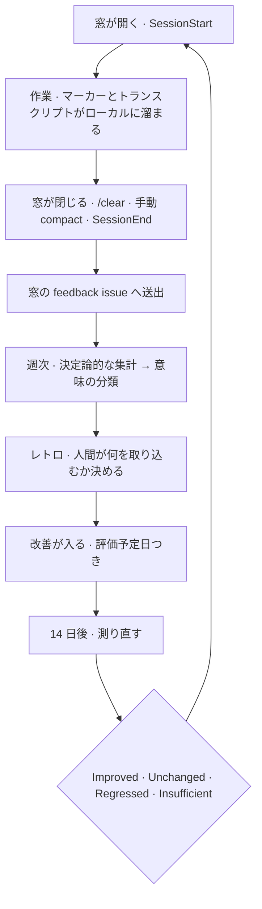

> この文書は英語正本 [closed-loop.md](closed-loop.md) から同期する日本語訳です。単独では編集しません。

# Closed Loop

この文書は、AI フィードバックの閉じたループが日々どう動くのかを説明する。[ADR-0008 (agent-environment-alignment)](../adr/0008-agent-environment-alignment.md)（エージェント環境は足すだけでなくループで改善すると決めたもの）と、[ADR-0010 (development-window-as-feedback-unit)](../adr/0010-development-window-as-feedback-unit.md)（ループが何を 1 つと数えるかを決めたもの）の解釈であり、規則の第二の正本ではない。

## 何がどこにあるか

| 関心 | 置き場 | 理由 |
| --- | --- | --- |
| 設定 — Usage Class、Opportunity 述語、どのコメント投稿者が機械か | `.agents/closed-loop/` | 他の宣言と同じくコミットされレビューされる |
| branch → work item の索引 | `.agents/private/`（ignored） | マシンローカルなキャッシュ。再生成できるので失っても損しない |
| 窓のマーカーとバッファされたイベント | `tmp/closed-loop/`（ignored） | per-run・per-checkout。[ADR-0009](../adr/0009-long-running-agent-state.ja.md) がそこと定める |
| 所見そのもの | issue tracker | git 操作なしで編集・削除でき、作業を引き継ぐ同僚から見える |

リポジトリの中に所見の正本は無い。これは意図的である。維持にコミットを要する保管場所は維持されなくなる場所であり、ループは所見を絶えず訂正し退役させるからである。

## 何を、誰が観測するか

強みの異なる 2 層があり、ループは両方を必要とする。

**マーカーは意味を運ぶ。**ワークフローはフェーズ境界を跨ぐ瞬間を打刻する。その境界は他のどこにも存在しないからである — トランスクリプトは全ターンを記録するが、そのターンがどのフェーズに属していたかを知らない。マーカーはシェルなので、どのアシスタントの下でも同じに振る舞う。弱点は網羅性で、誰かが書かなければマーカーは存在しない。

**トランスクリプトは網羅を運ぶ。**全ツール呼出、全ターンとその所要時間、全エラーと中断が、誰かが記録しようと思ったかに関わらず記録される。弱点は意味で、そのターンが何の*ため*だったかを言えない。

ゆえにマーカーが第一、トランスクリプトが fallback である。マーカーが欠けている箇所は値をトランスクリプトから導出し、導出値であることを併せ持たせる — 最初の編集から復元した実装開始時刻は持つ価値があり、それが復元値だと分かっていることにも価値がある。

瞬間そのものと各マーカーの根拠は `.agents/closed-loop/marks.sh` にある。そこが本来の場所である。後の読み手が「なぜこのマーカーがあるのか」と思ったとき開くのはそのスクリプトだからである。

## 決定論が先、モデルが後

ループが報告することの大半にモデルは要らない。スキル呼出、ツールの失敗、中断、ターン所要時間、フェーズ区間、レビューとマージの待ち時間 — いずれも数えるのであって解釈するのではない。この層はオフラインで動き、費用はかからず、その数字は監査できる。

モデルが要るのはただ 1 つ、「誰が何に困ったか」を言うことである。その読解はローカルではなく CI で行うので、セッションが止まることも課金されることもない。しかも corpus 全体ではなく絞り込まれた入力を渡す — 決定論的なパスが、モデルが何かを見る前に読む価値のあるターンを選別する。両方が要る。絞り込みが読解を賄えるものにし、読解が絞り込みを行う価値を生む。

所見はどちらの半分が生んだかを記録する。数えた値と読解した値は同じ強さの根拠ではなく、両者を混ぜた報告には反論できない。

## issue と PR のコメントも入力である

レビュアーの指摘は、問題がついに言葉になる場所であり、セッションログには一切現れない。だからループは窓が触れた issue と PR のコメントを読む。そして絞り込む。このリポジトリではコメントの大半が指摘ではなくスキャナの出力だからである。機械の投稿者の宣言リストは `.agents/closed-loop/comment-authors.yaml` にあり、そこに無い投稿者は人間として扱う。ノイズを入れると報告の質が落ちるだけだが、人の指摘を落とすと所見そのものが失われるからである。

コメントを読むことは、実装速度では説明できないリードタイムの半分も供給する。早く開いて遅くマージされた PR は、遅く開いた PR と同じだけカレンダーを消費しており、速く働いて直るのは片方だけである。

## スキルはクラスに照らして判断する

呼ばれなかったスキルが、それゆえ無用だということにはならない。このリポジトリのスキルの大半は situational か lifecycle であり、機会を待っている。ある週に機会が来なかったことは、そのスキルについて何も語らない。呼出回数だけで判断すれば、新しい endpoint が無かった最初の 1 か月で scaffold 一式が退役する。

そこで各スキルはクラスを宣言し、書ける場合は「その窓がそれを使えたはずか」を述べる述語を持つ。使った数 / 使えたはずの数 ＝ カバレッジこそが意味を持つ尺度であり、述語を正直に書けたスキルについてのみ存在する。機会を観測する汎用の方法は無い。表現できないものはそう印を付け、別のもので判断する。宣言は `.agents/closed-loop/skill-meta.yaml` にある。

現時点でこれらの述語は散文であり、読んで評価する機構は無い。ゆえにループが実際に報告するのは呼出回数と、呼ばれなかったスキルの一覧であって、そこには「回数だけでは退役の根拠にならない」という但し書きが付く。issue と PR のコメントを読む部分も同じ状態にある。機械投稿者のリストは存在するが、それを参照するはずの集計はまだコメントを取得していない。どちらもここに書いてあるのは、欠けていること自体が見えるべきだからであって、動いているものとして書いてあるのではない。

## ループがしてはならないこと

ループは surface するのであって決定しない。どの改善を取り込むかは人間の判断であり、効かなかった改善を簡素化するか撤回するかそれでも残すかも同じである。AI ツール設定ディレクトリはエージェントの既定スコープの外に留まり、それを所有するスキル経由でのみ到達できる。

変更後に測り直す段は、これが蓄積装置に堕ちるのを防ぐ唯一の仕掛けである。それを飛ばせば、ループは [ADR-0008](../adr/0008-agent-environment-alignment.ja.md) が防ぐために採用したもの — 増える一方の環境 — そのものに退化する。

## 解釈を最新に保つ

これは describing 文書である。説明している関係が変わったときに更新するのであって、実装の細部が動いたときではない。governing 文書と accepted な ADR は実装ドリフトから黙って修正しない。衝突は [docs/rules.md](../rules.ja.md) が定めるとおり提起する。
