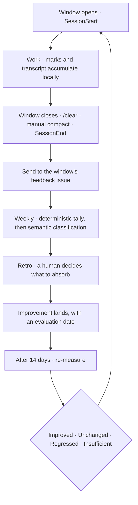

# Closed Loop

日本語: [closed-loop.ja.md](closed-loop.ja.md)

This document explains how the AI-feedback closed loop actually runs, day to day. It is an
interpretation of [ADR-0008 (agent-environment-alignment)](../adr/0008-agent-environment-alignment.md)
— which decides that the agent environment is improved in a loop rather than only added to — and of
[ADR-0010 (development-window-as-feedback-unit)](../adr/0010-development-window-as-feedback-unit.md),
which decides what the loop counts as one of. It is not a second source of rules.

## Where each thing lives

| Concern | Home | Why there |
| --- | --- | --- |
| Configuration — usage classes, opportunity predicates, which comment authors are machines | `.agents/closed-loop/` | Committed and reviewed like any other declaration |
| The branch-to-work-item index | `.agents/private/` (ignored) | Machine-local cache. Regenerable, so losing it costs nothing |
| A window's marks and buffered events | `tmp/closed-loop/` (ignored) | Per-run, per-checkout. [ADR-0009](../adr/0009-long-running-agent-state.md) puts it there |
| The findings themselves | The issue tracker | Editable and deletable without a git operation, and visible to a colleague picking the work up |

Nothing in the repository is the source of truth for a finding. That is deliberate: a store whose
upkeep costs a commit is a store that stops being kept up, and the loop corrects and retires
findings constantly.

## What is observed, and by whom

Two layers, with different strengths, and the loop needs both.

**Marks carry meaning.** A workflow stamps the moment it crosses a phase boundary, because that
boundary exists nowhere else — a transcript records every turn without knowing which phase the turn
belonged to. Marks are shell, so they behave identically under every assistant. Their weakness is
coverage: a mark only exists if something wrote it.

**The transcript carries completeness.** Every tool call, every turn and its duration, every error
and interruption, recorded whether or not anyone thought to record it. Its weakness is meaning: it
cannot say what a turn was *for*.

So marks are primary and the transcript is the fallback. Where a mark is missing, the value is
derived from the transcript and labelled as derived — an implementation start recovered from the
first edit is worth having, and worth knowing it was recovered.

The moments themselves and the reasoning for each are in `.agents/closed-loop/marks.sh`, which is
where they belong: the script is what a later reader will open when they wonder why a mark exists.

## Deterministic first, model second

Most of what the loop reports needs no model at all. Skill invocations, tool failures,
interruptions, turn durations, phase intervals, review and merge latency — all of it is counted,
not interpreted. That layer runs offline, costs nothing, and its numbers are auditable.

A model is needed for exactly one thing: saying what someone found hard. It is given a narrowed
input rather than the whole corpus — the deterministic pass selects the turns worth reading before
a model sees any of them. Both halves matter: the narrowing is what makes the reading affordable,
and the reading is what makes the narrowing worth doing.

**That reading happens on the machine that produced the transcript**, not on a runner, and the
reason is where the transcript lives. It sits under the developer's home, which no runner can
reach, so putting the reading in CI would mean publishing the selected turns verbatim to a public
issue first — creating an outbound path for anything a person pasted into a session
([security.md](security.md)). Reading locally publishes only the resulting prose. It also gives the
model more to work with, since the amount that can be shown to a local model is bounded by prompt
length rather than by what one is willing to make public.

CI keeps the fallback, because a machine may have no model available at all. A window that could
not be read locally is labelled as such and carries its excerpts, and only those windows are read
by a runner. The cost of that route is the publication above, which is why it is the exception.

Findings record which half produced them. A count and a reading are not equally strong evidence,
and a report that blurs them cannot be argued with.

## Issue and pull request comments are part of the input

A reviewer's remark is where a problem is finally stated in words, and it appears in no session
log. The loop therefore reads the comments on the issues and pull requests a window touched — and
filters them, because on this repository most comments are scanner output rather than remarks. The
declared list of machine authors is in `.agents/closed-loop/comment-authors.yaml`; an author not on
it is treated as human, since admitting noise degrades a report while dropping a person's remark
loses the finding entirely.

Reading them also supplies the half of lead time that implementation speed cannot explain. A pull
request that opens quickly and merges slowly consumed the same calendar as one that opened slowly,
and only one of those is fixed by working faster.

## Skills are judged against their class

A skill that nobody called is not thereby useless. Most of this repository's skills are
situational or lifecycle — they wait for an occasion, and an occasion that did not arise in a
given week says nothing about the skill. Judging on call count alone would retire the entire
scaffolding suite the first month without a new endpoint.

So each skill declares a class and, where one can be written, a predicate that says when a window
*could* have used it. Coverage — used over could-have-used — is the measure that would mean
something, and it exists only for the skills whose predicate could be written honestly. There is
no general way to observe an opportunity; the ones that cannot be expressed are marked as such and
judged on something else. The declarations are in `.agents/closed-loop/skill-meta.yaml`.

Today those predicates are prose and no evaluator reads them, so what the loop actually reports is
the call count and which skills went uncalled — with the warning that a count alone is not grounds
to retire anything. Reading the comments on issues and pull requests is in the same state: the
machine-author list exists, and the aggregation that would consult it does not yet fetch comments.
Both are named here because the gap is worth seeing; neither is named as if it were running.

## What the loop may not do

It surfaces; it does not decide. Which improvement to absorb is a human's call, and so is whether
a landed improvement that did not work should be simplified, reverted, or kept anyway. The AI-tool
configuration directories stay outside an agent's default scope and are reached only through the
skill that owns them.

The re-measurement after a change is the step that keeps this from becoming an accumulator. Skipped,
the loop degrades into the thing [ADR-0008](../adr/0008-agent-environment-alignment.md) adopted it
to prevent: an environment that only grows.

## Keeping this interpretation current

This is a describing document. Update it when the relationship it describes changes, not when an
implementation detail moves. Governing documents and accepted ADRs are not silently corrected from
implementation drift; raise conflicts as [docs/rules.md](../rules.md) requires.
