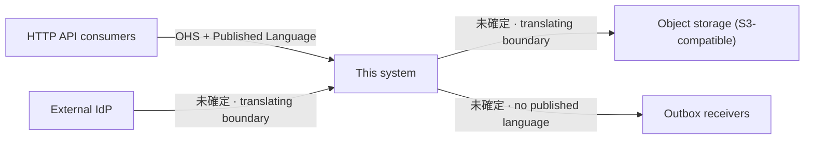

# Context Map

日本語: [context-map.ja.md](../ja/design/context-map.ja.md)

This page characterises every place this system exchanges a model with something it does not own,
using Evans's relationship vocabulary for the edges. It is about **relationships**, not mechanics:
how each integration works belongs to its own design reference, linked from the table.

Maintained by [`/context-map`](../../.claude/skills/context-map/SKILL.md); drift is detected by
[`/context-map-audit`](../../.claude/skills/context-map-audit/SKILL.md).

## An undecided edge is an entry, not a blank

Several of Evans's relationships are distinguished by facts that do not exist in a codebase. On a
downstream edge, what separates Customer-Supplier from the alternatives is whether the upstream will
take our requirements — a fact about the two organisations, not about the code. The code shows what
was built at the boundary; it cannot show whether anyone on the other side would have listened.

An edge whose settling fact is not available is therefore recorded as `未確定`, carrying its
evidence and the question that would settle it, rather than left blank or guessed at. An unlabelled
edge leaves the question open for whoever can answer it; a wrongly labelled one closes it before
they see it.

> Upstream-only: why `未確定` is a terminal state here rather than an open task — [boilerplate-only conventions](../get-started/boilerplate-only-conventions.md). <!-- boilerplate-only:line -->

## What counts as a contact point

A model crossing out of this system. A boundary port with no external counterpart — the clock, the
transaction manager, the job and worker runners — is not a contact point, however much it looks like
one in the port list.

Both directions count. A map with only outbound edges would claim this system is nobody's upstream.

## Edges

| Counterpart | Direction | Relationship | Evidence | If the other side moves |
| --- | --- | --- | --- | --- |
| HTTP API consumers | this system is upstream | **Open Host Service + Published Language** | `openapi/openapi.gen.yaml` is committed as a consumable artifact and kept fresh by a drift gate; the surface is one protocol for all consumers rather than per-consumer endpoints | Consumers break only when the published contract changes, and the gate makes that change visible in review |
| External IdP | this system is downstream | `未確定` | The adapter translates the token into this system's own `Authn` (`internal/infrastructure/auth/jwt/auth_jwt.go:243`), deriving subject / issuer / scopes in this system's terms. The raw claim map is carried through as an opaque payload and has no production reader, so the external vocabulary crosses but is never consumed — a translating boundary is in place | An issuer or claim change is absorbed by the adapter; a protocol change is not |
| Object storage (S3-compatible) | this system is downstream | `未確定` | The port is stated in this system's vocabulary and `internal/usecase/boundary/README.md:144` declares that vendor vocabulary (bucket / region / etag) never crosses the boundary | A vendor swap is confined to the adapter; the port is unaffected |
| Outbox receivers | this system is upstream | `未確定` | The publish boundary carries a substrate-agnostic envelope, but no payload schema is published — [ADR-0053](../adr/0053-message-id-idempotency-propagation.md) defines only the transport convention. See [`outbox.md`](outbox.md) | A receiver's expectations are not protected by any artifact this system publishes |

## The open questions

Each `未確定` edge above is waiting on one thing. Answering it is a decision, not a lookup.

- **External IdP** — can this system's requirements reach whoever runs the IdP? If yes the edge is
  Customer-Supplier. If not, the translating boundary already in place makes it an Anticorruption
  Layer.

  **Conformist is not a candidate on either of these two edges, and the reason is worth stating.**
  Conformist means declining to build a translation layer and taking the upstream model as it comes;
  Anticorruption Layer means building one. They are the two answers to the same situation, not a
  label and an accessory to it. An edge whose own evidence is a translating adapter cannot be
  Conformist — offering both would be reading Evans's vocabulary as if the relationship and the
  remedy were independent axes, and they are not.
- **Object storage** — the same question, with the same translating boundary already in place, so
  the same two candidates. The substitutability the boundary buys suggests the relationship is not
  load-bearing, but that is a reading of intent, not evidence of one.
- **Outbox receivers** — are the receivers a known set whose requirements shape the payload
  (Customer-Supplier), or an open set consuming what is emitted (Open Host Service)? The asymmetry
  with the synchronous side is recorded in [`outbox.md`](outbox.md) §4: the language is not published.

<!-- sample-api:replace-begin -->
## Sample-derived contact points

The sample feature set adds outbound gateways to external web APIs. **They disappear when the sample
is removed**, and are listed separately so this map does not keep describing edges that no longer
exist:

- Address lookup gateway and exchange-rate gateway (`internal/infrastructure/webapi/**`), each behind
  a semantic port in the usecase boundary.

What survives their removal is the pattern they demonstrate: a `<service>.Gateway` port stated in
this system's vocabulary, with transport and vendor failure modes translated at the adapter. A real
integration added later occupies the same shape and earns its own row in the table above.
<!-- sample-api:replace-with -->
<!-- = ## Outbound contact points -->
<!-- = -->
<!-- = An outbound integration is a `<service>.Gateway` port stated in this system's vocabulary, with -->
<!-- = transport and vendor failure modes translated at the adapter. Each one added occupies that -->
<!-- = shape and earns its own row in the table above. -->
<!-- sample-api:replace-end -->

## Diagram

## What this map does not cover

- **The database.** It stores this system's own model rather than owning one, so no model crosses
  out of the system at that edge.
- **Ports with no external counterpart** — clock, transaction manager, job and worker runners.
- **How any integration works.** Mechanics live in the per-subsystem references under
  [`docs/design/`](README.md) and the package READMEs; this page only says how the two sides relate.
