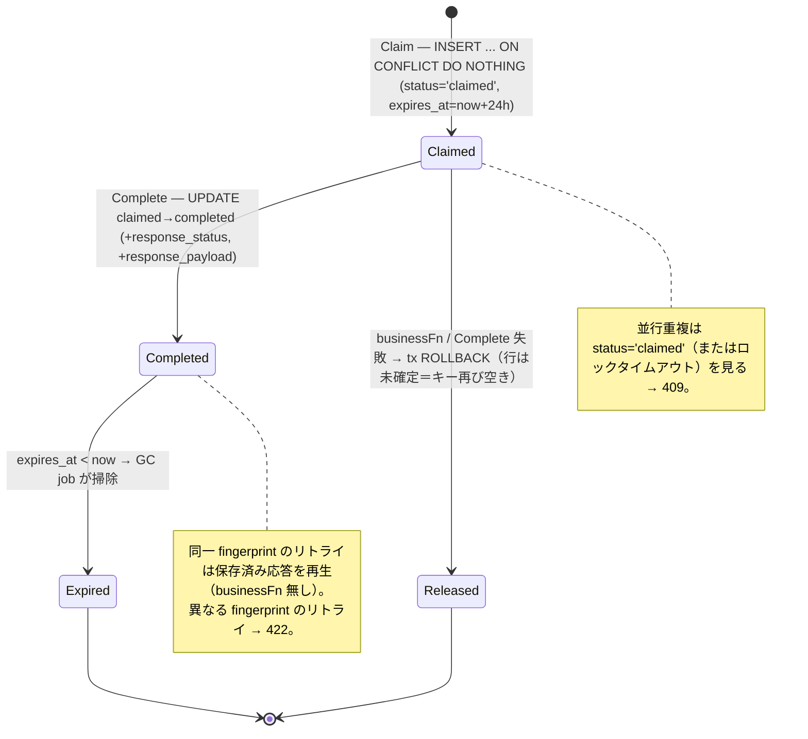
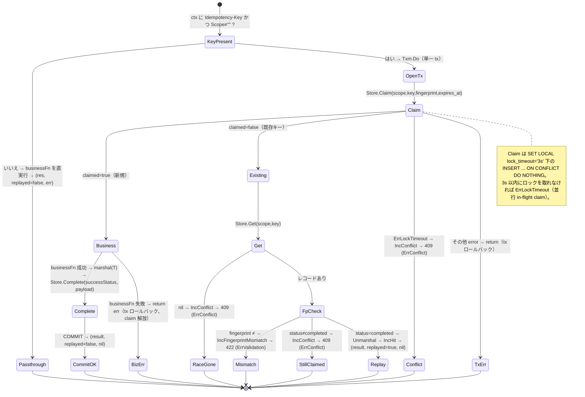
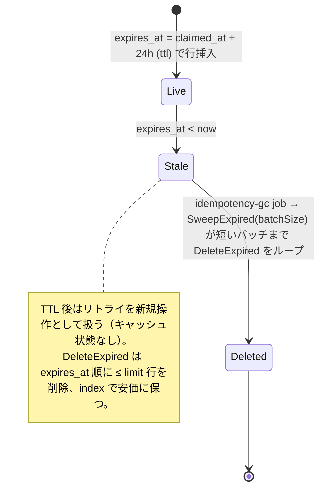
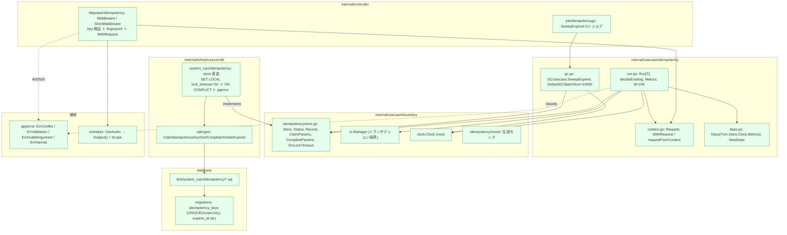
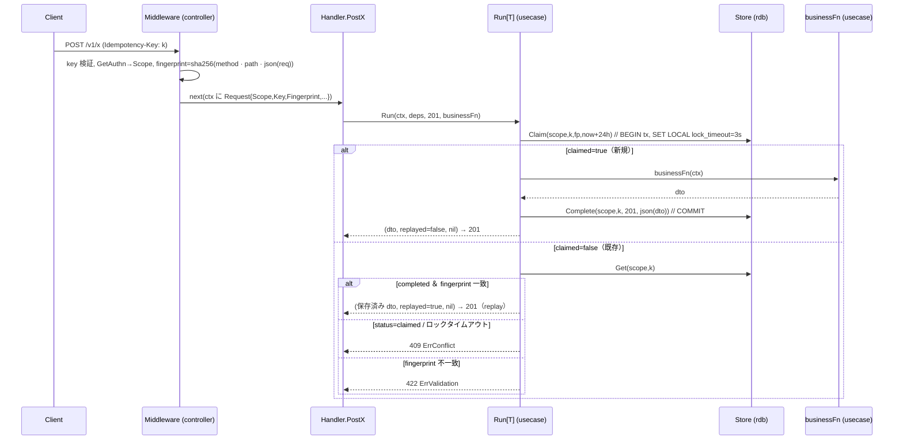
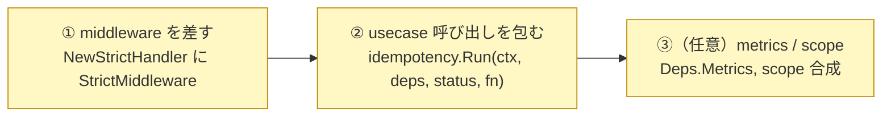

# 冪等性サブシステム設計リファレンス

[Idempotency README（日本語）](../../internal/usecase/idempotency/README.ja.md) | English: [idempotency.md](idempotency.md)

本書は冪等性（`Idempotency-Key`）サブシステムの **役割論・状態遷移・実装箇所・integrator が書く箇所・用語** を、実装を精査して 1 枚にまとめた参照資料です。概要は README、接続先の HTTP 経路は [rest.ja.md](rest.ja.md)、GC 側は [job](job.ja.md) として動きます。

---

## 1. 役割論（なにが・なんのために）

DB トランザクションは **1 リクエスト内**の原子性を保証するが、クライアントのリトライ（ネットワークタイムアウト・二重送信・自動リトライ）を**重複排除しない**。自然な一意キーを持たない書き込み（自前で id を採番する `POST`・残高加算・課金・メール送信）では、リトライが副作用を**もう一度**実行してしまう。

冪等性はクライアント供給の **`Idempotency-Key` ヘッダ**でこれを安全にする。副作用は**高々 1 回**、完了済み操作のリトライは**保存済み応答を再生**する。入口 middleware → usecase オーケストレーション → 永続化にまたがる横断機構で、**handler 単位のオプトイン**、楽観ロック（lost-update 防止）やレート制限（エッジの関心事）とは**直交**する。

責務の分担（誰が何を持つか）:

| 構成要素 | 層 | 責務 | 持たないもの |
| --- | --- | --- | --- |
| **middleware**（`httpstack/idempotency`） | controller | `Idempotency-Key` の抽出・検証、認証必須化、**fingerprint** 計算、`Request` を ctx へ載せる | tx・永続化・replay 判定 |
| **Run[T]** オーケストレータ | usecase（`usecase/idempotency`） | `claim → businessFn → complete` を**単一 tx**で / replay・409・422 振り分け / TTL 付与 / metrics | HTTP 解釈・SQL・業務ルール |
| **Store**（seam） | usecase/boundary | 永続化契約：`Claim` / `Get` / `Complete` / `DeleteExpired` ＋ `Status` / `Record` / `ErrLockTimeout` | 実装・業務方針 |
| **store** 実装 | infrastructure（`rdb/system_cqrs`） | sqlc ラップ / `SET LOCAL lock_timeout` / `ON CONFLICT DO NOTHING` / `pgerror.NormalizeError` | replay 判定・HTTP |
| **GCUsecase ＋ `idempotencygc` job** | usecase ＋ controller/job | 失効キーの一括削除（TTL 後始末） | リクエスト経路 |
| **`idempotency_keys` テーブル** | database | 保存状態（scope / key / fingerprint / status / response / `expires_at`） | — |

設計原則（不変）:

- **`(scope, key)` ごとに高々 1 回。** Claim・`businessFn`・Complete は**単一 tx**を共有するため、業務失敗は claim ごとロールバックされ、キーは**自動解放**されてクリーンに再試行できる。
- **scope 必須。** `Store` の全メソッドが `scope`（認証プリンシパル）を取り、**id 単独 lookup を持たない**ため越境（IDOR）を防ぐ。DB は `UNIQUE(scope, idempotency_key)` を強制。
- **fail-closed な fingerprint。** リクエストを marshal できない場合、弱い fingerprint を作らずエラーを返す。

---

## 2. 状態遷移図

### 2.1 レコードのライフサイクル（`idempotency_keys` の 1 行）

### 2.2 リクエスト 1 件の判定（`Run[T]`）

> 分岐 → ステータス対応：**409 `ErrConflict`** ＝ 並行／in-flight claim（ロックタイムアウト・`status='claimed'`・claim 衝突直後に消えた行）、**422 `ErrValidation`** ＝ 同一キーを別ボディで再利用、**replay** ＝ 完了済み操作への同一キー＋同一 fingerprint（応答復元、`businessFn` 未実行）。`Run` は `(T, replayed bool, error)` を返し、replay 時は保存済みボディ `T` のみ復元し保存済みステータスコードは伝播しない（操作は単一成功ステータス前提、例: 201）。

### 2.3 TTL ＆ GC

---

## 3. 実装箇所（このアーキテクチャ上のどこに・どう作用するか）

### 3.1 パッケージ配置と依存方向

> 依存方向は内向き（`controller→usecase`、`infrastructure→usecase/boundary`）。オーケストレータ（`Run`）は SQL を知らず、`Store` seam と `tx.Manager` のみに依存する。RDB `store` が `Store` を実装し、sqlc と `pgerror` に触れる唯一の場所。

### 3.2 リクエスト 1 件の作用シーケンス（冪等性を採用した `POST`）

---

## 4. integrator が実装する箇所（採用はオプトイン・2 ステップ）

本プロジェクトは **middleware・`Run[T]` オーケストレータ・`Store` seam ＋ RDB 実装・スキーマ・GC usecase/job・参考採用例**（`POST /v1/users`）を提供する。handler が冪等になるのは**両ステップを行ったときのみ**——でなければ通常動作のまま。

| # | 必要な実装 | 置き場 | 参考 |
| --- | --- | --- | --- |
| ① | handler の `NewStrictHandler` の middleware スライスへ `idempotency.StrictMiddleware[gen.StrictHandlerFunc]()` を追加、`BindHandler` で `idempotency.Deps` を受け取る | `internal/controller/handler/<path>/*_handler.go` | `v1/users` handler |
| ② | usecase 呼び出しを包む：`idempotency.Run(ctx, s.idem, http.StatusCreated, func(ctx) (T, error) { return s.uc.Create(...) })` | 同 handler メソッド | `v1/users` `PostUsers` |
| ③（任意） | o11y バックエンドがあれば `Deps.Metrics` を注入、エンドポイント単位で隔離したければ middleware で `Scope` を拡張（例 `subject:operationID`） | DI / middleware | `NewDeps`, `WithRequest` |

運用上の注意（ルート単位の設定フラグは無く、すべてコード定数）:

- **TTL = 24h**、**ヘッダ = `Idempotency-Key`**、**キー ≤ 255 印字可能 ASCII**、**GC 既定バッチ = 10,000**（ジョブの `--batch-size=N` で上書き可）。
- GC をスケジュール：外部 cron / k8s CronJob で `<binary> job idempotency-gc --batch-size=10000`（24h TTL なら毎時で十分）。
- **PII 注意:** 応答ボディは JSON で保存される。PII を含む DTO ではダンプ／バックアップに露出する（24h TTL で緩和）。

---

## 5. 用語集

| 用語 | 意味 |
| --- | --- |
| **Idempotency-Key** | クライアント供給のリクエストヘッダ（≤255 印字可能 ASCII）。scope 内で 1 つの論理操作を識別。 |
| **scope** | キー一意性の名前空間 ＝ 認証プリンシパル（`authn.Subject()`）。`UNIQUE(scope, key)` で越境（IDOR）を防ぐ。`Store` の全呼び出しで必須。 |
| **fingerprint** | `SHA-256(method + "\n" + path + "\n" + json(request))`。同一キーの別ボディ再利用を検出（→ 422）。middleware が fail-closed で計算。 |
| **Claim** | `SET LOCAL lock_timeout='3s'` 下の `INSERT ... ON CONFLICT DO NOTHING`。`claimed=true`（新規）/ `false`（既存）/ `ErrLockTimeout` を返す。業務 tx 内で実行。 |
| **claimed / completed** | 2 つの `status` 値。`claimed` ＝ 予約済み・結果未保存、`completed` ＝ `businessFn` 成功・応答保存済み。 |
| **Complete** | `UPDATE claimed→completed` し `response_status` ＋ `response_payload`（`T` の JSON）を同一 tx で保存。 |
| **replay** | 同一 `(scope,key,fingerprint)` の完了済み操作へ保存済み応答を返す。`businessFn` は走らない。`Run` は `replayed=true`。カウンタ `IncHit`。 |
| **409 `ErrConflict`** | 並行／in-flight claim——ロックタイムアウト・`status='claimed'`・claim 衝突後に消えた行。後で再試行。カウンタ `IncConflict`。 |
| **422 `ErrValidation`** | 同一キーを別ボディで再利用（fingerprint 不一致）。クライアントのバグ。カウンタ `IncFingerprintMismatch`。 |
| **ErrLockTimeout** | 3s 以内に行ロックを取れなかったときの `Claim` の境界 sentinel。usecase が 409 へマップ。 |
| **Run[T]** | オーケストレータ。`Run(ctx, deps, successStatus, businessFn) (T, bool, error)`。ctx にキー無し（または scope 空）→ `businessFn` を直実行。 |
| **Deps** | `Run` の注入束：`Txm`（`tx.Manager`）/ `Store` / `Clock` / 任意 `Metrics`（nil ＝ no-op）。 |
| **Request（context）** | middleware が載せる in-flight メタ：`Scope` / `Key` / `Fingerprint` / `Method` / `Path` / `OperationID`。 |
| **ttl** | `24 * time.Hour`。`expires_at = now + ttl`。経過後はリトライを新規操作として扱う。 |
| **GCUsecase / idempotencygc** | `SweepExpired(batchSize)` が短いバッチまで `Store.DeleteExpired` をループ。同梱 [job](job.ja.md) から実行。既定バッチ 10,000。 |
| **Store** | 永続化 seam（`internal/usecase/boundary/idempotency`）：`Claim` / `Get` / `Complete` / `DeleteExpired`、すべて scope 必須。 |
| **Metrics** | `operationID` ラベルの任意 o11y カウンタ：`IncHit` / `IncMiss` / `IncConflict` / `IncFingerprintMismatch` / `IncClaimFailure` / `IncCompleteFailure`。既定 no-op。 |
