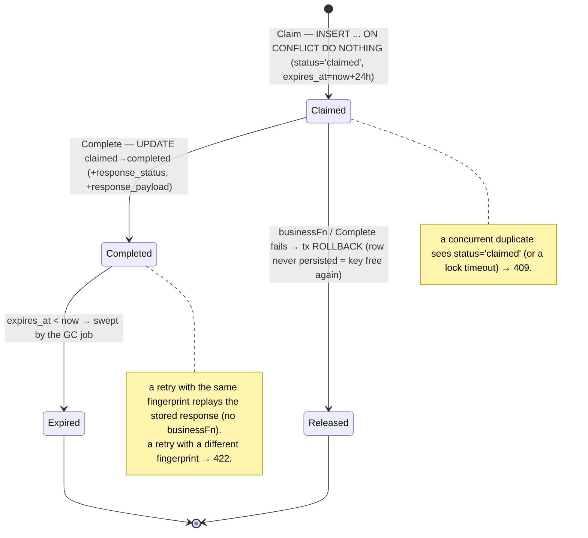
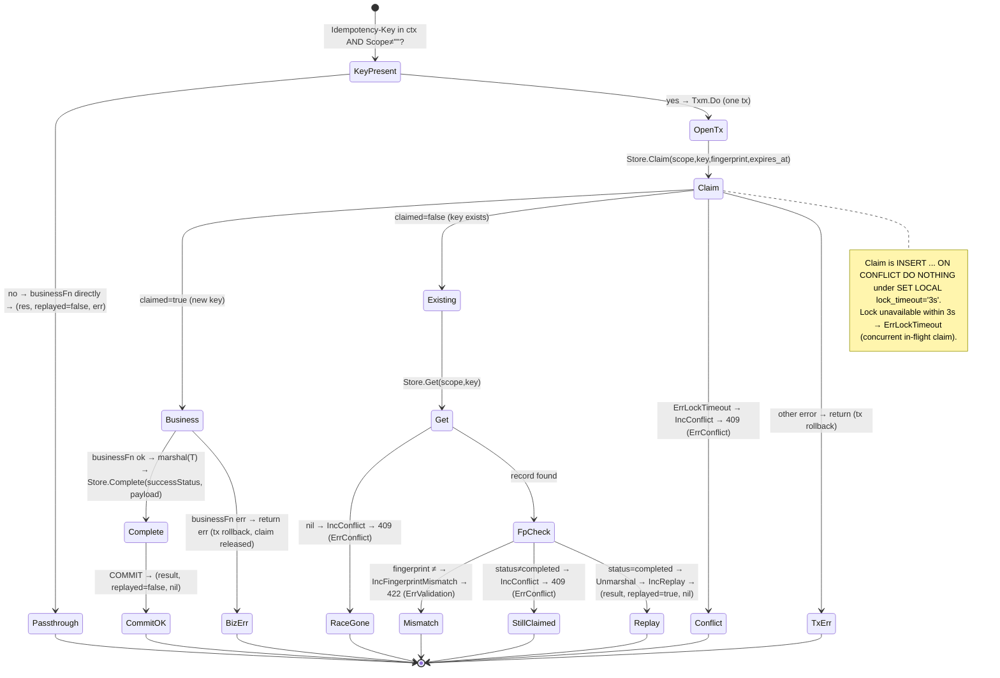
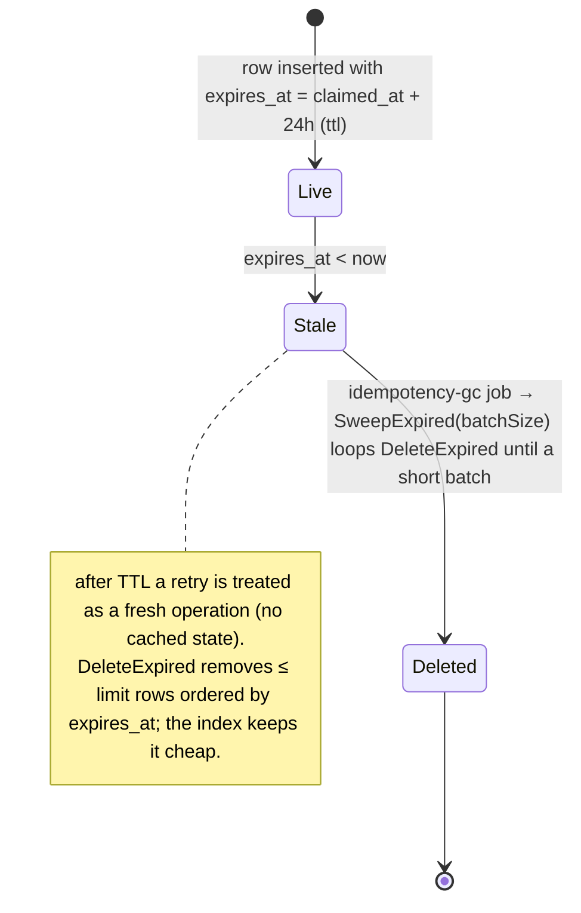
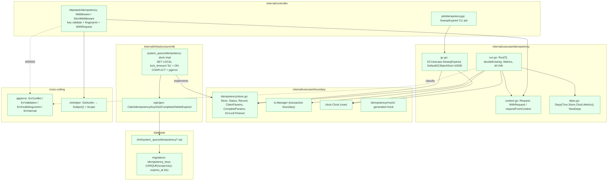
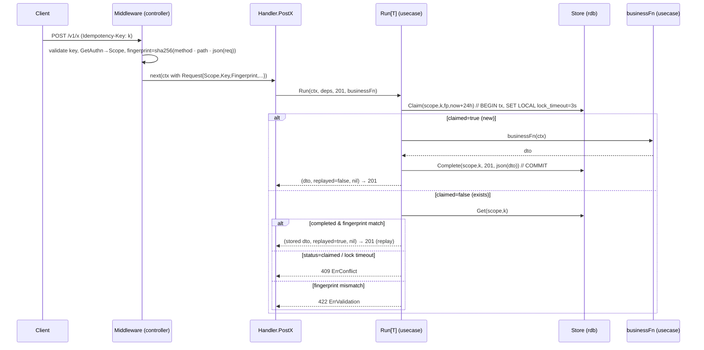
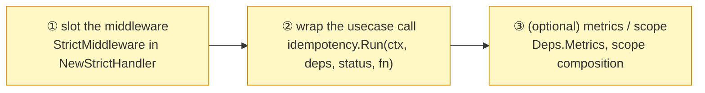

# Idempotency Subsystem Design Reference

[Idempotency README](../../internal/usecase/idempotency/README.md) | 日本語: [idempotency.ja.md](../ja/design/idempotency.ja.md)

This document consolidates the idempotency (`Idempotency-Key`) subsystem's **role theory, state transitions, implementation locations, what an integrator must implement, and glossary** into a single reference, derived from a close reading of the implementation. For the overview see the README; for the HTTP path it plugs into see [rest.md](rest.md), and the GC side runs as a [job](job.md).

---

## 1. Role theory (what, and what for)

A database transaction guarantees atomicity **within one request**; it does **not** deduplicate client retries (network timeout, double-submit, auto-retry). When a write has no natural unique key — a `POST` that allocates its own id, a balance increment, a charge, an email send — a retry runs the side effect **again**.

Idempotency makes such writes safe via a client-supplied **`Idempotency-Key` header**: the side effect runs **at most once**, and a retry of a completed operation **replays the stored response**. It is a cross-layer mechanism (entry middleware → usecase orchestration → persistence), **opt-in per handler**, and **orthogonal** to optimistic locking (lost-update prevention) and rate limiting (edge concern).

Responsibility split (who owns what):

| Component | Layer | Responsibility | Does NOT hold |
| --- | --- | --- | --- |
| **middleware** (`httpstack/idempotency`) | controller | extract + validate `Idempotency-Key`, require authn, compute the request **fingerprint**, thread `Request` into ctx | transaction, persistence, replay decision |
| **Run[T]** orchestrator | usecase (`usecase/idempotency`) | `claim → businessFn → complete` in **one tx** / replay·409·422 routing / TTL stamping / metrics | HTTP parsing, SQL, business rules |
| **Store** (seam) | usecase/boundary | persistence contract: `Claim` / `Get` / `Complete` / `DeleteExpired` + `Status` / `Record` / `ErrLockTimeout` | implementation, business policy |
| **store** impl | infrastructure (`rdb/system_query`) | sqlc wrap / `SET LOCAL lock_timeout` / `ON CONFLICT DO NOTHING` / `pgerror.NormalizeError` | replay decision, HTTP |
| **GCUsecase + `idempotencygc` job** | usecase + controller/job | batch-delete expired keys (TTL housekeeping) | the request path |
| **`idempotency_keys` table** | database | persisted state (scope / key / fingerprint / status / response / `expires_at`) | — |

Design principles (invariants):

- **At most once per `(scope, key)`.** Claim, `businessFn`, and Complete share **one transaction**, so a business failure rolls the claim back too — the key is **auto-released** for a clean retry.
- **Scope is mandatory.** Every `Store` method takes `scope` (the authenticated principal); there is **no id-only lookup**, which prevents cross-scope key collision / IDOR. The DB enforces `UNIQUE(scope, idempotency_key)`.
- **Fail-closed fingerprint.** If the request cannot be marshalled the middleware returns an error rather than forging a weak fingerprint.

---

## 2. State transitions

### 2.1 record lifecycle (one row in `idempotency_keys`)

### 2.2 per-request decision (`Run[T]`)

> Branch → status mapping: **409 `ErrConflict`** = a concurrent/in-flight claim (lock timeout, `status='claimed'`, or a vanished record); **422 `ErrValidation`** = same key reused with a different request body; **replay** = same key + same fingerprint on a completed op (response restored, `businessFn` not called). `Run` returns `(T, replayed bool, error)`; on replay only the saved body `T` is restored, not the stored status code (the op is assumed single-success-status, e.g. 201).

### 2.3 TTL & GC

---

## 3. Implementation locations (where in the architecture it lives and acts)

### 3.1 Package placement and dependency direction

> Dependencies point inward (`controller→usecase`, `infrastructure→usecase/boundary`). The orchestrator (`Run`) knows nothing about SQL — it depends only on the `Store` seam and the `tx.Manager`; the RDB `store` implements `Store` and is the only place that touches sqlc and `pgerror`.

### 3.2 Per-request action sequence (a `POST` adopting idempotency)

---

## 4. What an integrator implements (adoption is opt-in, two steps)

The scaffold provides the **middleware, `Run[T]` orchestrator, `Store` seam + RDB impl, schema, GC usecase/job, and a reference adoption** (`POST /v1/users`). A handler is idempotent **only if both steps are done** — otherwise it behaves normally.

| # | Required implementation | Location | Reference |
| --- | --- | --- | --- |
| ① | add `idempotency.StrictMiddleware[gen.StrictHandlerFunc]()` to the handler's `NewStrictHandler` middleware slice; take `idempotency.Deps` in `BindHandler` | `internal/controller/handler/<path>/*_handler.go` | `v1/users` handler |
| ② | wrap the usecase call: `idempotency.Run(ctx, s.idem, http.StatusCreated, func(ctx) (T, error) { return s.uc.Create(...) })` | same handler method | `v1/users` `PostUsers` |
| ③ (opt) | inject `Deps.Metrics` when an o11y backend exists; widen `Scope` (e.g. `subject:operationID`) in the middleware if per-endpoint isolation is wanted | DI / middleware | `NewDeps`, `WithRequest` |

Operational notes (no per-route config flags — these are coded constants):

- **TTL = 24h**, **header = `Idempotency-Key`**, **key ≤ 255 printable-ASCII chars**, **GC default batch = 10,000** (overridable via the job's `--batch-size=N`).
- Schedule the GC: `<binary> job idempotency-gc --batch-size=10000` on an external cron / k8s CronJob (hourly is plenty for a 24h TTL).
- **PII caveat:** the response body is stored as JSON; for PII-bearing DTOs, dumps/backups expose it (mitigated by the 24h TTL).

---

## 5. Glossary

| Term | Meaning |
| --- | --- |
| **Idempotency-Key** | Client-supplied request header (≤255 printable-ASCII chars) identifying one logical operation within a scope. |
| **scope** | The namespace for key uniqueness = the authenticated principal (`authn.Subject()`). `UNIQUE(scope, key)` prevents cross-user collision / IDOR. Every `Store` call requires it. |
| **fingerprint** | `SHA-256(method + "\n" + path + "\n" + json(request))`. Detects the same key reused with a different body (→ 422). Computed fail-closed by the middleware. |
| **Claim** | `INSERT ... ON CONFLICT DO NOTHING` under `SET LOCAL lock_timeout='3s'`. Returns `claimed=true` (new), `false` (exists), or `ErrLockTimeout`. Runs inside the business tx. |
| **claimed / completed** | The two `status` values. `claimed` = reserved, result not yet saved; `completed` = `businessFn` succeeded and the response is stored. |
| **Complete** | `UPDATE claimed→completed` saving `response_status` + `response_payload` (JSON of `T`), in the same tx. |
| **replay** | Returning the stored response for a same-`(scope,key,fingerprint)` completed op; `businessFn` is not run. `Run` returns `replayed=true`. Counter `IncReplay`. |
| **409 `ErrConflict`** | A concurrent / in-flight claim — lock timeout, `status='claimed'`, or a record that vanished after a claim collision. Client should retry later. Counter `IncConflict`. |
| **422 `ErrValidation`** | Same key reused with a different request body (fingerprint mismatch). Client bug. Counter `IncFingerprintMismatch`. |
| **ErrLockTimeout** | Boundary sentinel from `Claim` when the row lock is unavailable after 3s; the usecase maps it to 409. |
| **Run[T]** | The orchestrator. `Run(ctx, deps, successStatus, businessFn) (T, bool, error)`. No key in ctx (or empty scope) → `businessFn` runs directly. |
| **Deps** | Injected bundle for `Run`: `Txm` (`tx.Manager`), `Store`, `Clock`, optional `Metrics` (nil = no-op). |
| **Request (context)** | In-flight metadata threaded by the middleware: `Scope` / `Key` / `Fingerprint` / `Method` / `Path` / `OperationID`. |
| **ttl** | `24 * time.Hour`. `expires_at = now + ttl`. After it, a retry is a fresh op. |
| **GCUsecase / idempotencygc** | `SweepExpired(batchSize)` loops `Store.DeleteExpired` until a short batch; run from the bundled CLI [job](job.md). Default batch 10,000. |
| **Store** | The persistence seam (`internal/usecase/boundary/idempotency`): `Claim` / `Get` / `Complete` / `DeleteExpired`, all scope-mandatory. |
| **Metrics** | Optional o11y counters labelled by `operationID`: `IncReplay` / `IncConflict` / `IncFingerprintMismatch`. Default no-op. |
