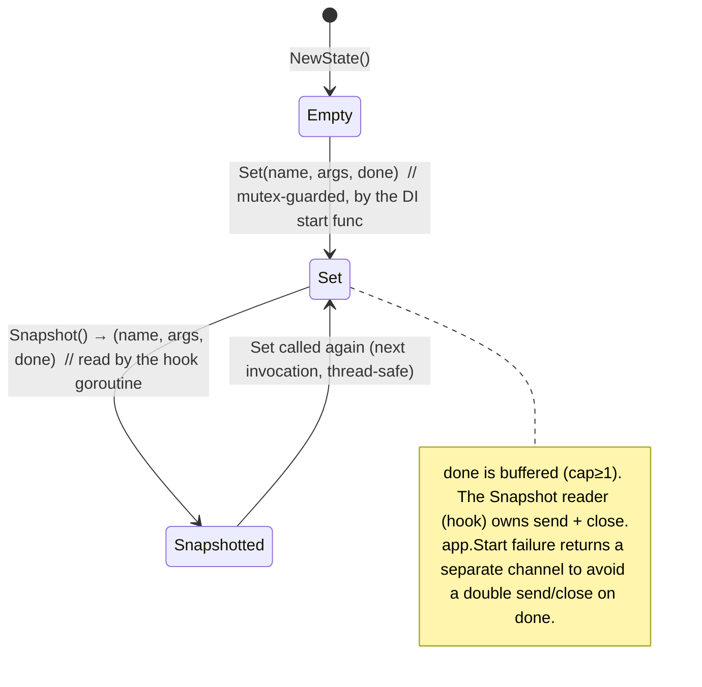
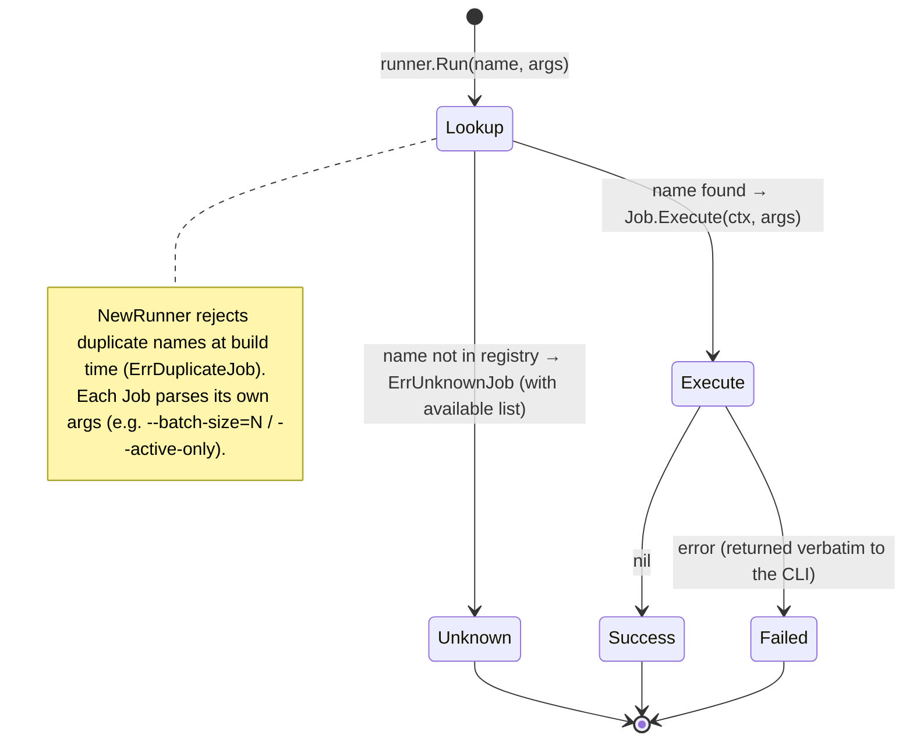
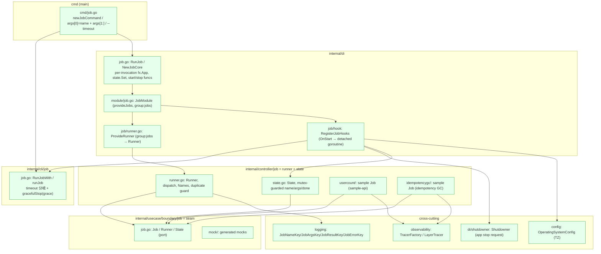
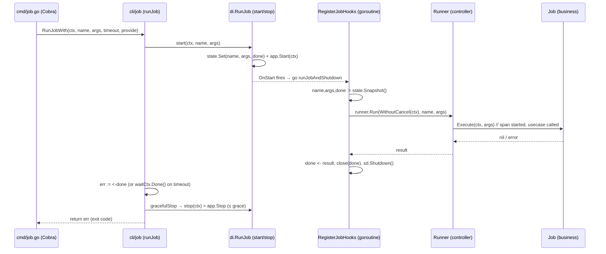
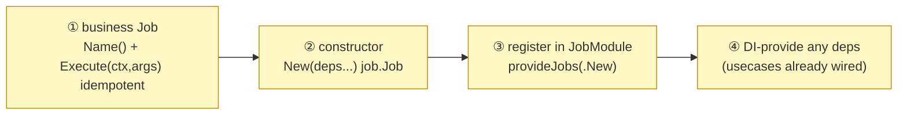

# Job Subsystem Design Reference

[Job README](../../internal/controller/job/README.md) | 日本語: [job.ja.md](job.ja.md)

This document consolidates the job scaffold's **role theory, state transitions, implementation locations, what an integrator must implement, and glossary** into a single reference, derived from a close reading of the implementation. For the overview see the README; the worker is its async sibling — see [worker.md](worker.md).

---

## 1. Role theory (what, and what for)

A job is a **"command-in driving adapter," a peer of the HTTP handler and the worker**. It is not a new architectural layer but **another entry point into the Usecase layer**, this time via the CLI (Cobra). If HTTP is "the mouth that takes a synchronous request" and the worker is "the mouth that takes a queue message," the job is "the mouth that takes a one-shot CLI invocation and exits."

Responsibility split (who owns what):

| Component | Layer | Responsibility | Does NOT hold |
| --- | --- | --- | --- |
| **runner** (`Runner`) | controller | name → `Job` registry / dispatch by name / duplicate-name rejection / `Names()` listing | business logic, arg interpretation |
| **state** (`State`) | controller | thread-safe holder of the selected run (name / args / `done` channel) for the lifecycle-hook hand-off | job execution, arg interpretation |
| **seam** (`Job`/`Runner`/`State`) | usecase/boundary | the contract between the CLI lifecycle and the business jobs | implementations |
| **Job** (business) | implemented by the integrator (calls usecases) | one-shot processing for a single invocation (**idempotent recommended**) | dispatch, lifecycle, shutdown |
| **DI / cli / cmd** | di / cli / cmd(main) | per-invocation `fx.App` composition / subcommand / timeout & graceful stop / detached goroutine / shutdown request | business logic |
| **OperatingSystemConfig** | config | time zone for structured job logs | job behavior |

Design principle (invariant): **the runner and state depend only on the seam (`job.Job` / `job.Runner` / `job.State`) and never import implementations.** Each invocation builds a **fresh `fx.App`** (no resident process), runs exactly one job, then requests shutdown. Unlike the worker there is **no broker, no circuit breaker, no drain, and no health listener** — a job's failure is simply returned to the CLI as a non-zero exit.

---

## 2. State transitions

### 2.1 invocation lifecycle (`cli/job.RunJobWith` / `runJob` + DI hook)

```mermaid
stateDiagram-v2
    [*] --> Idle: RunJobWith(provide) → (StartFunc, StopFunc)
    Idle --> Started: start(ctx, name, args) — state.Set + app.Start(ctx)
    Started --> Running: RegisterJobHooks OnStart spawns runJobAndShutdown goroutine
    Running --> Completed: runner.Run(name, args) → Job.Execute returns; result sent to done
    Running --> TimedOut: timeout>0 and waitCtx done first (DeadlineExceeded / parent Canceled)
    Completed --> Stopping: gracefulStop → app.Stop (grace = APP_SHUTDOWN_TIMEOUT)
    TimedOut --> Stopping: gracefulStop → app.Stop (grace = APP_SHUTDOWN_TIMEOUT)
    Stopping --> Stopped: sd.Shutdown requested + app.Stop done
    Stopped --> [*]: runJob returns err (job result / waitCtx.Err())

    note right of Running
      the job runs on a detached goroutine via context.WithoutCancel(startCtx),
      so OnStart completion does not cancel the job.
      done==nil (no job selected) → log "No job to run" → shutdown.
    end note
    note right of TimedOut
      stop uses a fresh context, not the expired waitCtx, to grant a grace window.
    end note
```

### 2.2 state hand-off (`controller/job/state.go`)

### 2.3 dispatch (`run.Run`, registry lookup)

---

## 3. Implementation locations (where in the architecture it lives and acts)

### 3.1 Package placement and dependency direction

> Green = implemented here. Dependencies always point inward (`controller→usecase/boundary`). The runner/state hold no business logic and no infrastructure imports; jobs reach data only through the usecase layer.

### 3.2 Per-invocation action sequence

---

## 4. What an integrator implements (the parts this project does not provide)

This project provides the **runner, state, lifecycle hook, DI wiring, and two reference jobs** (`usercount`, `idempotencygc`). To add a job, supply the following (jobs are registered explicitly — there is no auto-discovery).

| # | Required implementation | Location (recommended) | Reference |
| --- | --- | --- | --- |
| ① | business `Job`: `Name()` (kebab-case) + `Execute(ctx, args)` (parse args, call usecase, log) | `internal/controller/job/<name>/` | `usercount` / `idempotencygc` |
| ② | `New(...) job.Job` DI constructor (takes logging / tracer factory / usecases) | same file as ① | `usercount.New` |
| ③ | add the constructor to `provideJobs(...)` in `JobModule()` | `internal/di/module/job.go` | same shape as `provideWorkers` |
| ④ | `fx.Provide` any extra dependency the job needs (usecases are already provided) | `internal/di/module/` | existing usecase providers |

> Invocation is `<binary> job <name> [args...] [--timeout 30s]`. `cmd/job.go` already routes `args[0]` to the job name and `args[1:]` to the job; no per-job CLI wiring is needed.

---

## 5. Glossary

| Term | Meaning |
| --- | --- |
| **seam** | The port set that forms the boundary between the CLI lifecycle and business jobs. `internal/usecase/boundary/job`. |
| **port** | The interfaces that make up the seam: `Job` / `Runner` / `State`. |
| **Job** | A unit of work invoked once from the CLI. `Name()` + `Execute(ctx, args)`. Should be idempotent (it may be re-run by an operator). |
| **runner** | The registry that maps a job name to its `Job` and dispatches `Execute`. Rejects duplicate names at build time. |
| **State** | The thread-safe holder of the selected run (`name` / `args` / `done`). The DI start func `Set`s it; the hook goroutine `Snapshot`s it. |
| **done channel** | Buffered (`chan error`, cap≥1) channel the hook sends the job result on, then closes. Owned by the hook reader. |
| **StartFunc / StopFunc** | The start/stop pair returned by `di.RunJob`. `start` does `state.Set` + `app.Start` and returns `done`; `stop` is `app.Stop`. |
| **RunJobWith** | The `cli/job` facade that makes the provider swappable, then delegates to `runJob` (timeout branch + graceful stop). |
| **runJobAndShutdown** | The detached goroutine spawned by `RegisterJobHooks` OnStart. Snapshots state, runs the job, sends the result, requests shutdown. |
| **context.WithoutCancel** | Used so the job's context is not cancelled when the fx OnStart hook returns (the job runs past OnStart). |
| **timeout (`--timeout`)** | Optional CLI deadline. `>0` → wait for the job or the deadline (whichever first); `≤0` → wait indefinitely. |
| **gracefulStop / stopTimeout** | On completion or timeout, `app.Stop` is given a fresh context (not the expired one) bounded by the shutdown grace (`APP_SHUTDOWN_TIMEOUT`, default 65s) to finish cleanup. |
| **Shutdowner** | The fx shutdown requester the hook calls after the job finishes, so the app exits. |
| **provideJobs / `group:"jobs"`** | The Fx aggregation that collects all job constructors into the slice `NewRunner` consumes. |
| **ErrUnknownJob / ErrDuplicateJob** | Dispatch-time unknown-name error (lists available jobs) / build-time duplicate-name error. |
| **idempotencygc** | A bundled job that sweeps expired idempotency keys (`--batch-size=N`). See [idempotency.md](idempotency.md). |
