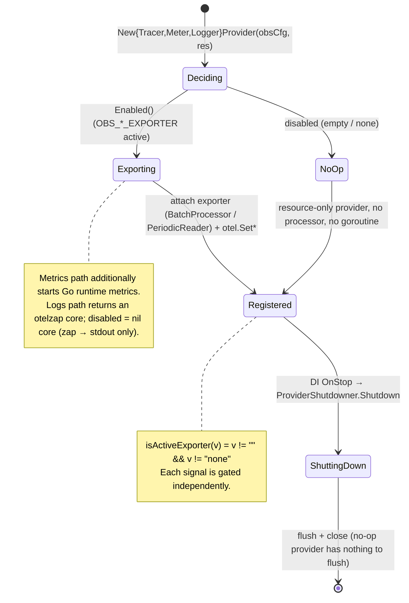
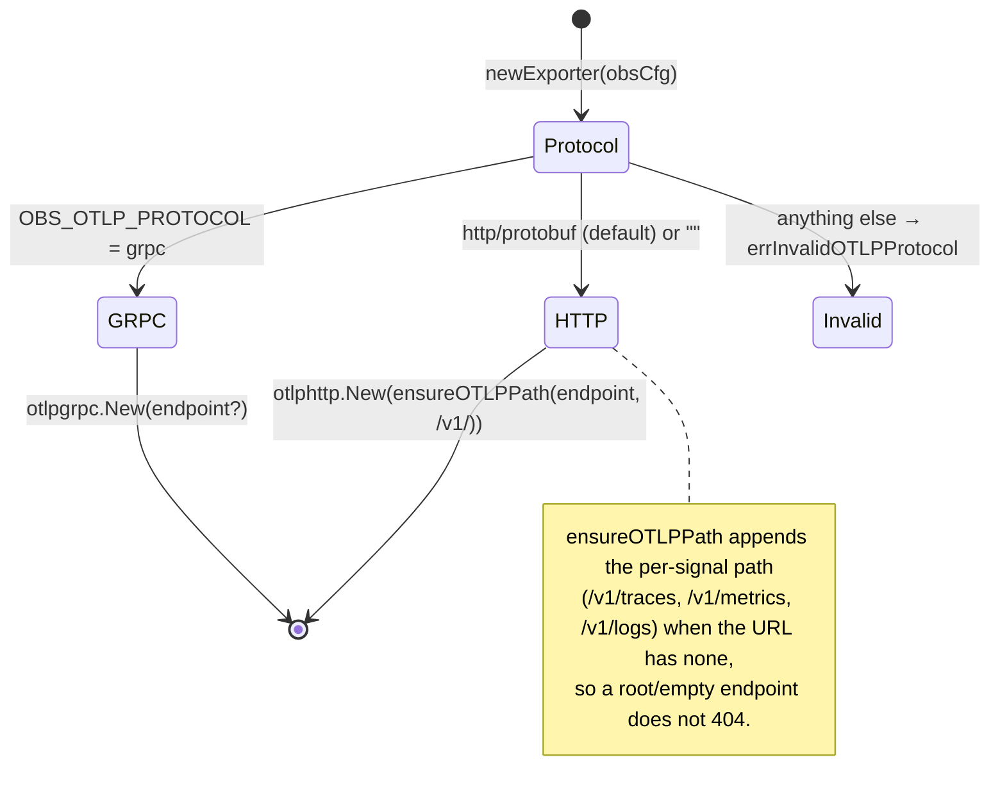
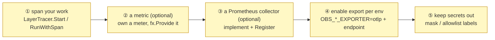

# Observability Subsystem Design Reference

[Observability README](../../internal/observability/README.md) | 日本語: [observability.ja.md](../ja/design/observability.ja.md)

This document consolidates the observability subsystem's **role theory, signal lifecycles, implementation locations, provided capabilities, what an integrator must implement, and glossary** into a single reference, derived from a close reading of the implementation. For the package-level API overview see the README; for the subsystems it instruments see [worker.md](worker.md), [outbox.md](outbox.md), [idempotency.md](idempotency.md), and [rest.md](rest.md).

---

## 1. Role theory (what, and what for)

Observability is **not a layer** — it is a **cross-cutting substrate** that every layer draws on to emit the three OpenTelemetry signals (**traces / metrics / logs**) without any layer learning the OTel SDK. Application code depends only on the small `LayerTracer` / helper surface; the SDK is **encapsulated inside `internal/observability`**.

Two design invariants shape everything below:

- **Vendor-neutral OTLP only.** The package wires the plumbing to speak OTLP to a Collector / Agent sidecar. Vendor specifics (Grafana / Datadog / New Relic) live in that Collector, never here.
- **Config-driven, independently gated, fail-safe.** Each signal is turned on by its own `OBS_*_EXPORTER` value; when off, a no-op fallback runs (no exporter, no goroutine). A failure in observability must never affect business processing.

Responsibility split (who owns what):

| Component | Layer | Responsibility | Does NOT hold |
| --- | --- | --- | --- |
| **providers** (`TracerProvider` / `MeterProvider` / `LoggerProvider`) | observability | build the SDK pipeline per signal, gated on config | export destination policy, vendor knobs |
| **`TracerFactory` / `LayerTracer`** | observability | per-layer span namespaces + span-event structured logging | business logic |
| **meter instruments** (`OutboxMetrics` / `WorkerMetrics` / `IdempotencyMetrics` / `HTTPClientMetrics`) | observability | own a meter, expose typed record methods | when/what to record (the owning subsystem decides) |
| **Prometheus collectors** (`buildinfo` / `queue`) | observability | expose process/broker state on the scrape endpoint | push over OTLP |
| **application code** (handlers / usecases / repositories) | controller / usecase / infra | `Start` a span, `record` a metric at the right moment | provider construction, exporter selection |
| **DI wiring** (`ObservabilityModule` + shutdown hook) | di | provide the providers, register `Shutdown` | business logic |
| **`ObservabilityConfig`** | config | the `OBS_*` typed settings (exporter toggles, endpoint, protocol, masking, target status codes) | vendor-specific OTLP keys |

Design principle (invariant): **the providers are lifecycle-agnostic** — they return the concrete SDK providers (which expose `Shutdown`) and let the DI hook own shutdown registration, so `observability` never imports `di/lifecycle`.

---

## 2. Signal lifecycles (state transitions)

### 2.1 Provider construction (per signal, config-gated)

Each provider follows the same shape: enabled → build an OTLP exporter and attach it; disabled → return a no-op provider that runs no background goroutine.

### 2.2 Exporter selection (protocol switch, shared endpoint)

All three signals share `OBS_OTLP_ENDPOINT` and `OBS_OTLP_PROTOCOL`. The transport is OTLP only.

- **Sampling** is the SDK default `ParentBased(AlwaysSample)`; it is **not** currently env-configurable.
- **Propagation** is a composite of W3C `TraceContext` + `Baggage`, registered globally via `otel.SetTextMapPropagator` — required for cross-service trace continuity (HTTP inbound/outbound, worker `traceparent`).

---

## 3. Implementation locations (where in the architecture it lives and acts)

### 3.1 Package placement and dependency direction

```mermaid
flowchart TD
    subgraph cfgL["internal/config"]
        OBSCFG["ObservabilityConfig<br/>OBS_* (exporter toggles / endpoint / protocol / masking)"]
    end
    subgraph obsL["internal/observability = substrate"]
        PROV["provider.go: NewResource / NewTracerProvider / NewMeterProvider"]
        LOGP["log_provider.go: NewLoggerProvider / NewLogCore (otelzap)"]
        TF["tracer_factory.go / layer_tracer.go: TracerFactory → LayerTracer"]
        HELP["helper.go: RunWithSpan / StartSpanWithParent / ShouldLogWithSpan"]
        PGX["pgx_tracer.go: NewPgxTracer (otelpgx)"]
        HC["http_client_*.go: transport + RED metrics"]
        MET["outbox / worker / idempotency / httpclient meter instruments"]
        PROM["metrics/buildinfo + metrics/queue (Prometheus collectors)"]
        SD["shutdown.go: ProviderShutdowner"]
    end
    subgraph diL["internal/di"]
        DIM["module/observability.go: ObservabilityModule"]
        HOOK["server/hook: RegisterObservabilityShutdownHooks"]
    end
    subgraph appL["application layers (consumers)"]
        CTRL["controller: handlers, outbox relay, worker engine"]
        UC["usecase"]
        INFRA["infrastructure: rdb (pgx), external HTTP clients"]
    end
    subgraph exitL["exit paths"]
        OTLP["OTLP → Collector/Agent (traces/metrics/logs)"]
        SCRAPE["/metrics (promhttp default registry)"]
    end

    OBSCFG --> PROV
    OBSCFG --> LOGP
    DIM --> PROV
    DIM --> LOGP
    DIM --> TF
    DIM --> PGX
    DIM --> HC
    DIM --> PROM
    DIM --> HOOK
    SD --> HOOK
    CTRL --> TF
    UC --> TF
    INFRA --> PGX
    INFRA --> HC
    CTRL --> MET
    PROV --> OTLP
    LOGP --> OTLP
    PGX --> OTLP
    MET --> OTLP
    PROM --> SCRAPE

    classDef done fill:#e6ffed,stroke:#2da44e;
    class OBSCFG,PROV,LOGP,TF,HELP,PGX,HC,MET,PROM,SD,DIM,HOOK,CTRL,UC,INFRA,OTLP,SCRAPE done;
```

> Dependencies always point **into** `observability` from the outer layers; `observability` itself depends only on `config` / `system` / `pkg` and the OTel SDK. It never imports `di/lifecycle` (shutdown is inverted via `ProviderShutdowner`).

### 3.2 Two metric exit paths (this is deliberate)

| Path | Instruments | How it leaves the process |
| --- | --- | --- |
| **OTLP push** (OTel meter) | `outbox` / `worker` / `idempotency` / `httpclient` + Go runtime + `otelpgx` DB metrics | `MeterProvider` `PeriodicReader` → Collector, only when `MetricsEnabled()` |
| **Prometheus scrape** | `app_build_info` (buildinfo), `worker_queue_*` (queue) | registered to the default registry, served at `/metrics` via `promhttp`, independent of `OBS_*` |

The scrape path exists for values that are naturally *pull* (build identity resolved once at wiring time; broker queue depth polled per scrape) and does not require an OTLP exporter to be enabled.

---

## 4. Provided capabilities (what observability gives you)

The substrate ships the following ready-to-use instrumentation. An integrator mostly **consumes** these; adding new ones is section 5.

| Capability | Surface | Notes |
| --- | --- | --- |
| **Per-layer tracing** | `TracerFactory.Controller()/Usecase()/Infra()` → `LayerTracer.Start` | span name `layer.package.function`; auto start/end + `trace_id`/`span_id` structured logs |
| **Ad-hoc span helper** | `RunWithSpan` / `StartSpanWithParent` / `StartWithSuffix` | span any function without a layer tracer; suffix to disambiguate multiple spans in one function |
| **HTTP root spans** | `otelecho` middleware | per-request root span (the controller-layer span largely duplicates it — see README §Design Policy 5) |
| **DB tracing + metrics** | `NewPgxTracer` (`otelpgx`) | connection details suppressed from attributes |
| **Outbound HTTP RED metrics** | `NewHTTPClientTransport` + `HTTPClientMetrics` | requests / errors / latency + retries / in-flight / breaker-state gauge |
| **Subsystem metrics** | `OutboxMetrics` / `WorkerMetrics` / `IdempotencyMetrics` | lag & dead / engine RED + DLQ / idempotency result & GC; low-cardinality labels only |
| **Runtime metrics** | `runtime.Start` | Go GC / mem / goroutine metrics, only when `MetricsEnabled()` |
| **Build-info gauge** | `metrics/buildinfo` → `app_build_info` | same source of truth as `/version` |
| **Queue-depth gauge** | `metrics/queue` → `worker_queue_depth` | pulled from the broker adapter per scrape (approximate on SQS) |
| **OTLP log export** | `NewLoggerProvider` + `NewLogCore` (otelzap) | bridges `zap` → OTLP; disabled ⇒ nil core, stdout only |
| **Context propagation** | `NewTextMapPropagator` (W3C TraceContext + Baggage) | cross-service / cross-worker trace continuity |
| **Test doubles** | `NewNoopTracerFactory`, `NewMock*LayerTracer`, `NewStubSpanContext` | deterministic, no real exporter |

---

## 5. What an integrator implements (the parts you add)

The substrate provides the pipeline and the shared instruments. To observe a new feature you add the following.

| # | Required implementation | Location (recommended) | Reference |
| --- | --- | --- | --- |
| ① | wrap new work in a span | handler / usecase / repository | existing `LayerTracer.Start` call sites; `RunWithSpan` for arbitrary code |
| ② | a new metric | a meter-owning struct like `WorkerMetrics`, `fx.Provide`d in `ObservabilityModule`, recorded from the owning subsystem | `outbox_metrics.go` / `worker_metrics.go` |
| ③ | a new pull metric | `prometheus.Collector` + a `Register` invoke | `metrics/buildinfo` / `metrics/queue` |
| ④ | turn export on for the environment | `OBS_TRACES/METRICS/LOGS_EXPORTER=otlp` + `OBS_OTLP_ENDPOINT` (+ `OBS_OTLP_PROTOCOL`) | `env/.env.*`, `env/README.md` |
| ⑤ | keep secrets/PII out of spans & labels | everywhere instrumentation touches user input | `OBS_MASKED_DB_QUERY_ARGS`, the `IdempotencyMetrics` label allowlist, `otelpgx` connection-detail suppression |

> Enabling export is a **config/IaC** action, not a code change: the same binary runs no-op locally (`OBS_*_EXPORTER` empty) and pushes OTLP in staging/prod.

---

## 6. Glossary

| Term | Meaning |
| --- | --- |
| **signal** | One of the three telemetry kinds: traces, metrics, logs. Each has its own provider and `OBS_*_EXPORTER` toggle. |
| **OTLP** | OpenTelemetry Protocol. The only export transport here (`http/protobuf` default, or `grpc`). |
| **exporter / `isActiveExporter`** | The per-signal toggle. Active when the `OBS_*_EXPORTER` value is non-empty and not `none`. |
| **no-op fallback** | A resource-only provider used when a signal is disabled: no exporter, no batch processor / periodic reader, no goroutine. |
| **resource** | The shared OTel identity (`service.name` / `deployment.environment` / `service.version` / `service.revision` / `service.build_date`) built by `NewResource` from app config + `system.BuildInfo`. |
| **`TracerFactory` / `LayerTracer`** | Factory yielding a per-layer tracer; the layer tracer produces spans named `layer.package.function` and emits start/end structured logs. |
| **`RunWithSpan`** | Helper that runs an arbitrary function inside a span + observability log, layer-agnostic. |
| **propagator** | The W3C `TraceContext` + `Baggage` composite that carries trace context across service / worker boundaries. |
| **otelzap core** | The `NewLogCore` bridge that exports `zap` logs over OTLP. `nil` when `LogsEnabled()` is false. |
| **`ProviderShutdowner`** | An otel-agnostic shutdown handle so the DI hook can register `Shutdown` without `observability` depending on `di/lifecycle`. |
| **meter instrument** | An OTel counter / histogram / gauge owned by a subsystem struct (`OutboxMetrics` etc.), exported over OTLP. |
| **RED** | Requests / Errors / Duration — the metric shape used for the HTTP client and worker engine. |
| **info gauge** | A Prometheus gauge whose value is always `1`, carrying identity in labels (`app_build_info`). |
| **`PeriodicReader` / `BatchProcessor`** | The metric / span background exporters. Only constructed when the signal is enabled. |
| **runtime metrics** | Go GC / memory / goroutine metrics started via `runtime.Start`, only when `MetricsEnabled()`. |
| **`otelpgx`** | The pgx instrumentation (DB spans + metrics) wired with explicit providers and connection details suppressed. |
| **`/metrics`** | The `promhttp` scrape endpoint (default registry) exposing the Prometheus collectors, independent of the OTLP toggles. |
