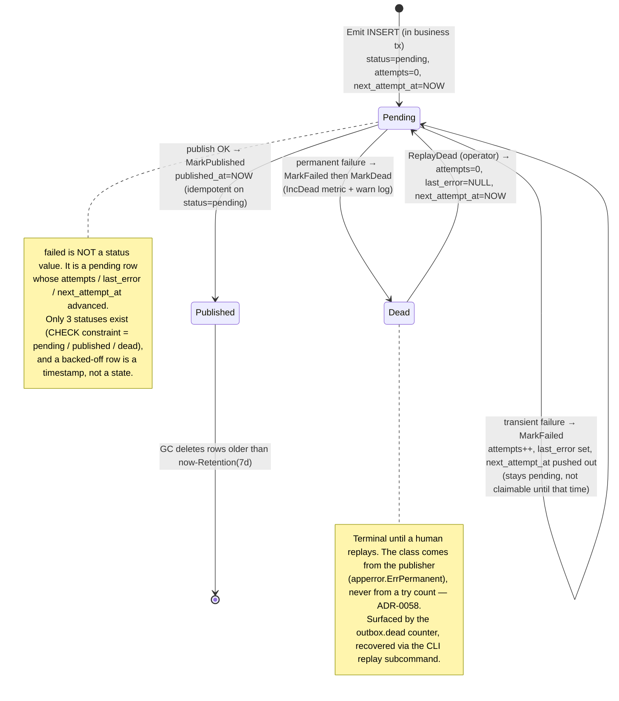
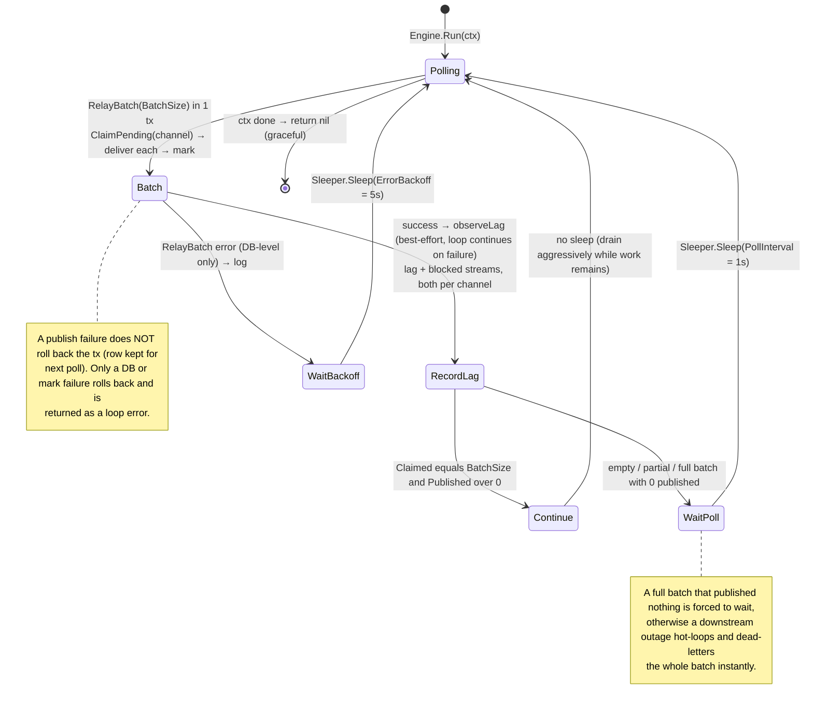
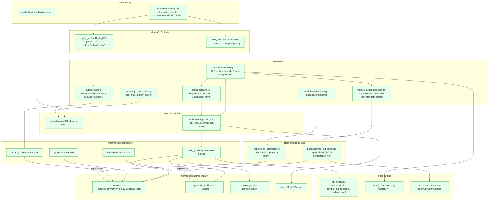
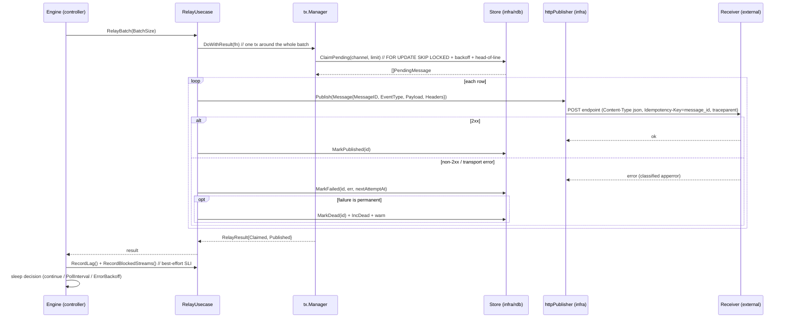
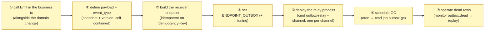

# Outbox Subsystem Design Reference

This document consolidates the transactional outbox subsystem's **role theory, state transitions, implementation locations, what an integrator must implement, and glossary** into a single reference, derived from a close reading of the implementation. For per-package overviews see the READMEs; for the adoption rationale see the outbox ADRs ([ADR-0054 (transactional-outbox)](../adr/0054-transactional-outbox.md) onward); for the decision to ship the balanced relay and defer hardening to operational evidence (with the full multi-layer blueprint) see [ADR-0111 (outbox-relay-hardening-delegated)](../adr/0111-outbox-relay-hardening-delegated.md).

---

## 1. Role theory (what, and what for)

The transactional outbox exists to **eliminate the dual-write anomaly**: when a request both changes domain state *and* must notify the outside world, writing to the DB and publishing to an external endpoint are two separate failures-points. If publish happens after commit it can be lost; if it happens before commit it can be a phantom. The outbox folds the "intent to publish" into **the same DB transaction as the domain change** (one outbox row INSERT), then a separate **relay** asynchronously delivers those rows with **at-least-once** semantics.

So the subsystem splits into two halves that never run in the same breath:

- **emit** — synchronous, inside the caller's business transaction. Records the event as a row.
- **relay / gc / replay** — asynchronous, in a dedicated long-running process. Drains, prunes, and recovers rows.

Responsibility split (who owns what):

| Component | Layer | Responsibility | Does NOT hold |
| --- | --- | --- | --- |
| **EmitUsecase** (`emit.go`) | usecase | INSERT one row in the caller's tx; capture `traceparent` into headers | transaction control (caller owns it), delivery |
| **RelayUsecase** (`relay.go`) | usecase | for **one delivery channel**: per-batch claim → publish → mark (`published` / backed-off `pending` / `dead`) in one tx; record lag and blocked streams | loop cadence, broker specifics |
| **GCUsecase** / **ReplayUsecase** (`gc.go` / `replay.go`) | usecase | prune old `published` rows / return `dead` rows to `pending` | scheduling, CLI parsing |
| **Store** / **Publisher** / **tx.Manager** | usecase/boundary | the seam: persistence port / send port / transaction port | implementations |
| **Engine** (`controller/outbox/relay.go`) | controller | poll-loop orchestration: cadence, sleep/backoff, drain on ctx done, span | claim/publish/mark business (delegated to usecase) |
| **outbox-gc job** (`controller/job/outboxgc`) | controller | one-shot GC entry point for an external scheduler | the loop (it is a cron, not a daemon) |
| **httpPublisher** (`infrastructure/publisher`) | infrastructure | `Publisher` HTTP impl: POST + `Idempotency-Key` + non-standard client profile | retry (the poll loop is the retry) |
| **outbox store** (`infrastructure/rdb/system_cqrs/outbox`) | infrastructure | `Store` impl over sqlc gen + `pgerror.NormalizeError` | business decisions |
| **DI / cli / cmd** | di / cli / cmd(main) | relay-process composition / subcommands / lifecycle | business logic |
| **OutboxConfig** | config | relay tuning (`OUTBOX_*`) | broker/endpoint internals |

Design invariants:

- **Dual-write avoidance**: `Emit` is called *inside* the same `tx.Manager.Do` as the domain change, so a rolled-back business tx discards its outbox row too — no lost and no phantom events.
- **At-least-once, retry-by-poll**: a failed publish is **not** rolled back; the row stays `pending` and its `next_attempt_at` moves forward, and the *poll after that time is the retry*. Transport-level retry is therefore disabled (`MaxAttempts=1`, D10) to avoid double-retry.
- **Dead by kind, not by count**: a row becomes `dead` only when the publisher classifies the failure as permanent ([ADR-0058](../adr/0058-outbox-dead-on-permanent-error.md)). A transient failure retries with an exponential backoff capped at 60 s and never dead-letters, so a downstream outage costs latency rather than a backlog to replay by hand.
- **Channel isolation**: every row carries a `delivery_channel`, and one relay process drains exactly one channel. Claim and failure progression never cross channels, so a stalled channel cannot hold up another.
- **Ordering within a stream**: a row may carry an `ordering_key` (the stream) and an `ordering_sequence` (its position). The claim predicate refuses a row while an earlier sequence on the same key is unpublished, so what a consumer sees on a stream is a contiguous prefix with no holes ([ADR-0072](../adr/0072-postgres-state-dynamodb-eventlog.md)). Rows without an ordering key are unaffected.
- **Multi-instance safety**: `ClaimPending` uses `FOR UPDATE SKIP LOCKED` and the whole claim→publish→mark runs in one tx, so a row's lock is held until delivery settles — two relay instances never publish the same row.
- **Receiver idempotency**: each row carries a stable `message_id` (assigned at INSERT), propagated as the HTTP `Idempotency-Key`; at-least-once on the send side is made exactly-once-effect by the receiver deduping on it.
- **Trace continuity**: `Emit` captures the current span's `traceparent` into `headers`; the publisher replays it so the receiver joins the originating trace.

---

## 2. State transitions

### 2.1 Outbox row lifecycle (`status` column: `pending` / `published` / `dead`)

### 2.2 Relay poll loop (`Engine.Run` + `RelayUsecase.RelayBatch`)

---

## 3. Implementation locations (where in the architecture it lives and acts)

### 3.1 Package placement and dependency direction

> Green = provided by the subsystem. Dependencies point inward: `controller`/`infrastructure` → `usecase`/`boundary`, never the reverse. The relay's non-standard HTTP profile (`MaxAttempts=1`, `PropagateTrace=false`, `AllowPrivateNetwork=false`) is contributed by `outboxPublisherModule`, which is **nested inside `OutboxRelayModule`** so it cannot leak into other processes.

### 3.2 Per-batch action sequence (relay process)

---

## 4. What an integrator implements (the parts the subsystem does not provide)

The subsystem ships the **full machinery**: emit/relay/gc/replay usecases, the RDB `Store`, the HTTP `Publisher`, the relay `Engine`, the GC job, DI wiring, and the `outbox-relay` / `replay` / `job outbox-gc` entry points. No event flows by default — the integrator wires the two open ends (the producing call and the consuming endpoint) and operates the processes.

> **Departure from Evans — no Published Language on this side.** The synchronous HTTP surface has one:
> OpenAPI is committed as a resolved contract that a consumer in another repository can read without
> this repository's toolchain, and a drift gate keeps it honest. The asynchronous surface has none.
> [ADR-0057 (message-id-idempotency-propagation)](../adr/0057-message-id-idempotency-propagation.md) fixes a *transport* convention
> (`Idempotency-Key`), not a language: nothing here defines or publishes the schema of the event
> payloads or the vocabulary of `event_type`, so a receiver learns both by reading this repository's
> source. The asymmetry is deliberate to the extent that item ② below hands payload and `event_type`
> to the integrator — nothing can publish a language for events it does not own. What is *not*
> yet provided is the shape that publication should take once the integrator defines those events.

| # | Required implementation | Location / how | Reference |
| --- | --- | --- | --- |
| ① | call `EmitUsecase.Emit` inside the same `tx.Manager.Do` as the domain write, naming the `Channel` (there is no default; an ordered channel also supplies `OrderingKey` + `OrderingSequence`) | the usecase that mutates the aggregate | `emit.go` `EmitInput` |
| ② | choose `EventType` (`+version`) and marshal a **self-contained snapshot** payload; do NOT put `Authorization`/`Cookie` in `Headers` (a denylist drops known-sensitive names before send, but that is defense-in-depth, not the contract) | caller of `Emit` | `EmitInput.Payload` / `.Headers` doc |
| ③ | a receiving endpoint that **dedupes on `Idempotency-Key`** (= `message_id`) and returns 2xx only on durable accept | external service | `httpPublisher.Publish` |
| ④ | `ENDPOINT_OUTBOX` (required; empty/invalid URL = relay refuses to start) + optional `OUTBOX_POLL_INTERVAL` / `OUTBOX_ERROR_BACKOFF` / `OUTBOX_BATCH_SIZE` | `env/` & IaC | `OutboxConfig` defaults |
| ⑤ | run `cmd outbox-relay --channel=<channel>` as a resident process, one per delivery channel in use (it stays up until SIGTERM, drains on stop) | deployment / IaC | `cmd/outbox_relay.go` |
| ⑥ | schedule `cmd job outbox-gc [--batch-size=N]` (k8s CronJob / cron) to prune `published` rows past retention | scheduler | `controller/job/outboxgc` |
| ⑦ | alert on `outbox.dead`, on `outbox.lag_seconds` per channel (the age alert that replaces the old try-count backstop, [ADR-0058](../adr/0058-outbox-dead-on-permanent-error.md)) and on `outbox.blocked_streams`, then run `outbox-relay replay [--message-id=<uuid>]` to recover | runbook | `cmd outbox-relay replay` |

> The relay, GC, and replay all reuse the shared infra wiring; only the resident relay process carries the non-standard HTTP publisher profile. The GC job lives in the main server's job group, so `cmd job outbox-gc` is available from the same binary — it does not run on its own.

---

## 5. Glossary

| Term | Meaning |
| --- | --- |
| **transactional outbox** | The pattern of recording "intent to publish" as a DB row in the same tx as the domain change, then delivering it asynchronously. Avoids the dual-write anomaly. |
| **emit** | The synchronous half: `EmitUsecase.Emit` INSERTs one row inside the caller's business tx (`internal/usecase/outbox/emit.go`). |
| **relay** | The asynchronous half: a resident `Engine` poll loop that claims, publishes, and marks pending rows (`controller/outbox` + `usecase/outbox/relay.go`). |
| **Store** | The persistence port for the outbox table (`usecase/boundary/outbox`). Implemented over sqlc gen in `infrastructure/rdb/system_cqrs/outbox`. |
| **Publisher** | The send port (`usecase/boundary/publisher`). The HTTP impl POSTs to `ENDPOINT_OUTBOX`. |
| **status** | The row's lifecycle column — exactly `pending` / `published` / `dead` (CHECK-constrained). There is no `failed` status; a failed publish stays `pending`. |
| **attempts / last_error** | Publish try count and latest failure reason. `MarkFailed` advances both; `attempts` is kept for diagnosis only and is the criterion for nothing. |
| **next_attempt_at** | The earliest time a row may be claimed again. A transient failure pushes it out by an exponential backoff with full jitter, capped at 60 s; the claim predicate simply skips a row whose time has not come, so a backed-off row is never locked. |
| **delivery channel** | The lane a row is delivered on (`delivery_channel`, `NOT NULL`, no default — `http` / `realtime`). One relay process drains exactly one channel; nothing is shared across channels. |
| **ordering key / ordering sequence** | The stream a row belongs to and its position in it (both `NULL` for channels that do not order). |
| **head-of-line blocking** | The claim rule that holds a stream's order: a row is claimable only when no earlier sequence on its ordering key is still unpublished. |
| **blocked stream** | A stream whose head row is `dead`, so nothing behind it can be claimed. Counted by `outbox.blocked_streams`; recovered by replaying the head. |
| **dead** | A row whose failure the publisher classified as permanent ([ADR-0058](../adr/0058-outbox-dead-on-permanent-error.md)). Terminal until an operator replays it. Counted by `outbox.dead`. |
| **replay** | Returning `dead` rows to `pending` (`attempts=0`, `last_error=NULL`, `next_attempt_at=NOW`). `ReplayUsecase` / `outbox-relay replay [--message-id]`. |
| **GC (SweepPublished)** | Deleting `published` rows older than `Retention` (`DefaultRetention = 7d`) in batches of `DefaultGCBatchSize = 10000`. Run via `cmd job outbox-gc`. |
| **message_id** | The stable per-row UUID (assigned at INSERT). Propagated as the HTTP `Idempotency-Key` for receiver dedup. |
| **traceparent** | W3C trace context captured into `headers` at emit time and replayed by the publisher, so the receiver joins the originating trace. |
| **FOR UPDATE SKIP LOCKED** | The claim mechanism that makes multi-instance relay safe — a locked row is skipped by other instances until the holding tx settles. |
| **retry-by-poll** | The relay's at-least-once mechanism: a publish failure is left `pending` and retried on the first poll after `next_attempt_at`. Transport retry is disabled (`MaxAttempts=1`) to avoid doubling it (D10). |
| **PollInterval / ErrorBackoff** | Sleep after a non-progressing poll (`OUTBOX_POLL_INTERVAL = 1s`) / after a DB-level `RelayBatch` error (`OUTBOX_ERROR_BACKOFF = 5s`). A full-but-zero-published batch is forced to wait. |
| **BatchSize** | Rows claimed per poll (`OUTBOX_BATCH_SIZE = 100`; clamped to `DefaultBatchSize = 100` if ≤ 0). |
| **outbox.lag_seconds / outbox.dead / outbox.blocked_streams** | The subsystem's own SLIs (meter `go-boilerplate/outbox`), each carrying a `channel` attribute: age of the oldest pending row / count of rows dead-lettered / number of streams stalled behind a dead head. Publish latency/errors come from the `httpclient` downstream=`outbox` instrumentation. |
| **SupervisedRunner** | The lifecycle helper (`di/lifecycle`) that runs the relay loop on OnStart and cancels + drains it on OnStop. |
| **OutboxRelayModule** | The fx module for the relay-only process, built for one channel; nests `outboxPublisherModule` so the non-standard HTTP profile never leaks elsewhere, and refuses to start for a channel no publisher implementation serves. |
