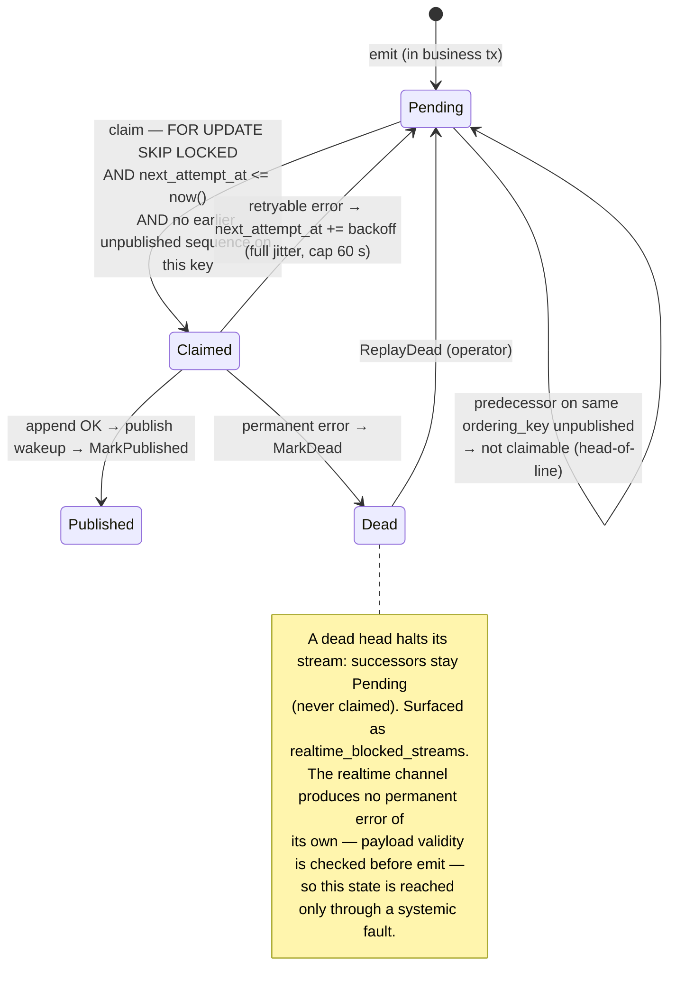
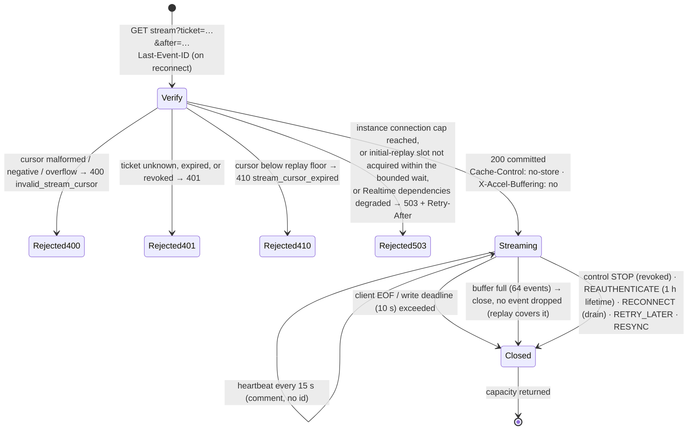
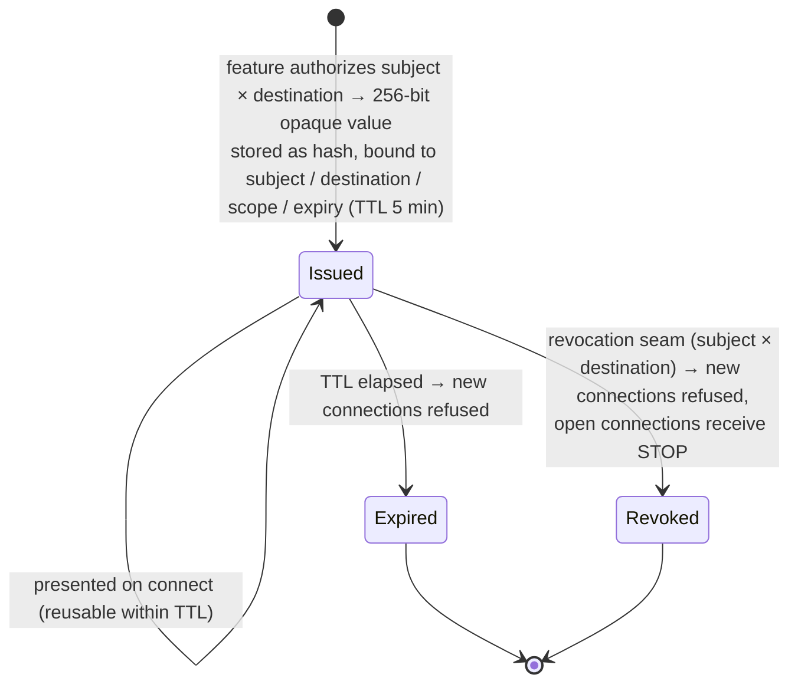
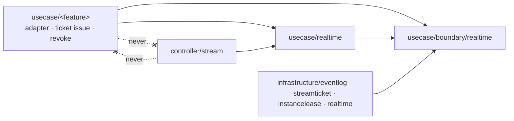

# Realtime Delivery サブシステム設計リファレンス

本書は Realtime Delivery サブシステムの**役割理論・状態遷移・実装位置・integrator が実装すべきもの・用語集**を 1 つのリファレンスに統合したものである。このディレクトリの他の設計リファレンスと違い、**実装より前に**書かれた。実装がこれに合わせて作られる設計であり、§3 は既存コードの読解ではなく配置の計画を記す。本書がシンボル名・既定値・手順の順序を挙げている箇所は意図された具体として扱い、それが属する機構——ordering chain、connection の状態機械、ticket の契約——が統べる。採択の根拠は realtime の ADR 4 本: [ADR-0071 (realtime-delivery-driving-mechanism)](../adr/0071-realtime-delivery-driving-mechanism.ja.md)、[ADR-0072 (postgres-state-dynamodb-eventlog)](../adr/0072-postgres-state-dynamodb-eventlog.ja.md)、[ADR-0073 (sns-sqs-instance-fanout)](../adr/0073-sns-sqs-instance-fanout.ja.md)、[ADR-0074 (query-ticket-stream-authentication)](../adr/0074-query-ticket-stream-authentication.ja.md)。outbox 行が dead になる条件は [ADR-0058 (outbox-dead-on-permanent-error)](../adr/0058-outbox-dead-on-permanent-error.ja.md)。

---

## 1. 役割理論（何を、何のために）

Realtime Delivery は、**feature が commit 済みの event を、それを待っているクライアントへ push し、切断されていたクライアントが喪失も重複もなく追いつけるようにする**ために存在する。REST / Worker / Job と並ぶ第 4 の駆動機構——短命の request でも queue consumer でも one-shot プロセスでもなく、長寿命の Server-Sent Events（SSE）応答——であり、既存の onion の内側に新しい層なしで置かれる。

これは意図的に、チャット機構でも通知機構でも event-sourcing 基盤でも**ない**。見えるのは **destination** 宛ての、**stream** 上の、**subject** のための、**sequence** 位置の、opaque な **payload** を持つ **event** である。会話・メッセージ・operator・受信箱——それらの語は event を emit する feature に属し、このサブシステムの型・分岐・package 名には決して現れない。

機構は同時には走らない 3 つの半身に分かれる。

- **emit** — 同期。feature の業務 transaction の内側。feature の realtime adapter が stream-local sequence を採番し、destination ごとに 1 行の outbox 行を書く。
- **relay** — 非同期。realtime relay がそれらの行を順序どおり EventLog へ流し、全 serve instance を起こす。
- **stream** — 長寿命。serve instance が SSE 接続を保持し、各クライアントの cursor から EventLog を replay し、届いたものを push する。

責務の分割（誰が何を持つか）:

| 部品 | 層 | 責務 | 持たないもの |
| --- | --- | --- | --- |
| **realtime adapter**（`usecase/<feature>/`） | usecase（feature 側） | commit 済みの feature の変更を `DeliveryEvent` に変換し、destination を選び、業務 tx の中で sequence allocator から stream-local sequence を得て、outbox 経由で emit する | transport、replay、connection の状態、sequence そのもの（機構の状態であり feature の aggregate の field には決してならない） |
| **ticket 発行 usecase**（`usecase/<feature>/`） | usecase（feature 側） | subject × destination を認可してから Realtime Delivery に ticket を求める | ticket の形式や保存 |
| **boundary/realtime** | usecase/boundary | 継ぎ目: `DeliveryEvent`、`SequenceAllocator`、`EventLogStore`、`StreamTicketStore`、`InstanceLeaseStore`、`RevocationNotifier` | 実装、feature の語彙 |
| **usecase/realtime** | usecase | ticket の発行 / 検証、cursor の検証と失効、replay の読み出し、lease heartbeat、orphan cleanup の所有権 | HTTP transport、poll loop |
| **realtime relay**（`controller/outbox` + realtime publisher） | controller / infrastructure | realtime channel の行を stream 順に claim し、EventLog へ append し、wakeup を publish する | 業務判断、[ADR-0058] を超える retry 方針 |
| **Streamer**（`controller/stream/`） | controller | connection registry（subject で索引）、capacity gate、replay / catch-up のスケジューリング、heartbeat、backpressure、drain、control-event protocol | 認可、feature の語彙 |
| **EventLog / ticket / lease store**（`infrastructure/eventlog`、`streamticket`、`instancelease`） | infrastructure | boundary store の DynamoDB 実装 | 業務判断 |
| **fan-out substrate**（`infrastructure/realtime/`） | infrastructure | SNS publish、instance ごとの SQS queue / subscription の lifecycle、consumer loop | wakeup の意味 |
| **orphan-cleanup job** | controller/job + cli | crash した instance の queue / subscription / lease を conditional な所有権の下で回収する | スケジューリング（scheduler が持つ。[ADR-0109 (scheduled-job-concurrency-delegated)](../adr/0109-scheduled-job-concurrency-delegated.ja.md)） |
| **DI module** | di | feature adapter が 1 つ以上あるときだけ runtime を結線する | 業務ロジック |
| **RealtimeConfig** | config | deployment 依存の knob のみ（§3.3） | 固定の protocol 値 |

設計の不変条件:

- **ordering chain は 1 つ。** feature の commit 順 → outbox → EventLog 可視化 → client cursor は単一の不変条件である（[ADR-0072]）: sequence に gap は無く、client-visible な sequence は連続 prefix を成し、terminal failure は sequence を飛ばさず stream を止める。
- **クライアントに配るのは EventLog だけ。** wakeup は状態を運ばない。重複 wakeup は同じ catch-up read であり、欠落は periodic catch-up が覆う。
- **feature 非依存は依頼ではなく強制。** Realtime Delivery は `internal/domain/<feature>` も `internal/usecase/<feature>` も import しない。`depguard` と architecture test が build を落とす。
- **adapter ゼロなら runtime ゼロ。** feature adapter が結線されていなければ、serve graph は Streamer を起動せず EventLog も fan-out substrate も要求しない——sample feature は機構を残したまま削除できる。
- **認可は端で行い、Streamer では行わない。** feature が ticket 発行時に認可し、identity resolver が全 REST request を認可する。Streamer は ticket を検証し失効に従うだけである。
- **capacity は instance ごとに守り、rate は守らない。** connection と replay の capacity はプロセス内で有界にする。クライアントがどれだけ頻繁に再接続してよいかは edge の関心である（[ADR-0108 (no-in-app-rate-limiter)](../adr/0108-no-in-app-rate-limiter.ja.md)）。

---

## 2. 状態遷移

### 2.1 配送の lifecycle（1 つの event の端から端まで）

```mermaid
flowchart LR
  cmd["Feature command<br/>(business tx)"]
  seq["allocate sequence<br/>UPDATE sequence row (system_cqrs) … RETURNING<br/>lock held to commit"]
  outbox["outbox row<br/>delivery_channel=realtime<br/>ordering_key / ordering_sequence"]
  relay["realtime relay<br/>claim in stream order"]
  log["EventLog append<br/>conditional on (streamId, sequence)"]
  sns["SNS publish<br/>eventId / streamId / sequence"]
  sqs["SQS · one queue per serve instance"]
  streamer["Streamer<br/>coalesce wakeup → read after cursor"]
  sse["SSE write<br/>id: sequence"]
  cmd --> seq --> outbox --> relay --> log --> sns --> sqs --> streamer --> sse
  streamer -. "periodic catch-up (30 s + jitter)" .-> log
```

- sequence は機構の **sequence allocator** が採番する——Realtime Delivery が所有する `system_cqrs` の table に stream ごと 1 行を持ち、feature 自身の書き込みと同じ transaction の中で `UPDATE … RETURNING` し、行ロックを commit まで保持する。この行は outbox 行と並ぶ機構の状態であり、sequence を field に持つ aggregate も採番する Repository も無い。したがって採番順 = commit 順で、rollback は増分を戻す: **gap なし**。
- 複数の destination（たとえば会話 stream と operator feed）に届ける feature は、同じ transaction で destination ごとに 1 行の outbox 行を emit する。各行は自分の ordering key と sequence を持ち、機構は 1 つの event を複数 stream に分割しない。
- EventLog の append は `(streamId, sequence)` が存在しないことを条件とするので、部分的な失敗の後の outbox retry は冪等である。

### 2.2 ordering chain を状態機械として（stream ごと、outbox 内）

retryable か permanent かは attempt 回数ではなく error 分類で決まる（[ADR-0058]）。backoff 中の行は claim 述語に選ばれないだけで、lock されることがないため `SKIP LOCKED` の意味論は変わらない。

### 2.3 connection の lifecycle（1 つの SSE 接続）

cursor の解決順: 有効な `Last-Event-ID` が勝つ。無ければ `after`。それも無ければ ticket の初期 cursor。初期 cursor は開始位置であって認可の下限ではない — client は replay floor がまだ覆う範囲なら、それより前の位置からも再開できる。可視範囲を狭めたい feature は destination を分ける。cursor は ticket の destination 以外に対して決して有効ではない。

拒否できるものはすべて response の commit **前**に拒否する。commit 後にクライアントへ戻る経路は in-band の control event と close だけである（§4.3）。

### 2.4 ticket の lifecycle

ticket の TTL は *新しい* 接続を開始できる期限を定める。確立済みの接続は別途 **maximum connection lifetime（1 時間）**で有界であり、到達するとサーバーは `REAUTHENTICATE` を送って閉じる。クライアントは feature の認可経路で新しい ticket を得る。この service 内での失効（membership の soft-delete、destination アクセスの剥奪）は即時——ticket を無効化し、fan-out 経由で該当接続を閉じる。identity provider での失効は観測せず、lifetime だけで収束する（[ADR-0074]、`auth.md` §2）。

### 2.5 serve instance の lifecycle と instance lease

```mermaid
stateDiagram-v2
    [*] --> Provisioning: Start — verify EventLog reachable
    Provisioning --> Subscribed: create SQS queue → subscribe to SNS topic → start consumer
    Subscribed --> Ready: HTTP listen; lease heartbeat every 30 s (expiry 2 min)
    Ready --> Draining: Stop — refuse new connections; send SERVER_DRAINING / RECONNECT; drain SSE
    Draining --> Unsubscribing: stop consumer → unsubscribe → delete queue → delete lease
    Unsubscribing --> [*]: HTTP shutdown
    Ready --> Crashed: process dies without Stop
    Crashed --> Orphaned: lease expires (2 min) + safety margin (5 min)
    Orphaned --> Reclaimed: orphan-cleanup job takes ownership by conditional update<br/>unsubscribe → delete queue → delete lease
```

起動順は provisioning → subscription → consumer → HTTP listen / ready。停止はその逆順で、SSE の drain を consumer 停止と `http.Server.Shutdown` の**前**に行うため、長寿命接続が shutdown を塞ぐことはない。

### 2.6 degraded 時の動作

| 条件 | 新規 SSE 接続への影響 | 既存接続への影響 | `/ready` への影響 |
| --- | --- | --- | --- |
| 起動時に EventLog または fan-out へ到達不能 | runtime は起動しない。起動は fail-fast | — | not ready |
| 稼働中に EventLog または fan-out へ到達不能 | `503` + `Retry-After` | 維持する。依存が戻れば periodic catch-up が配送を再開する（一斉 `RETRY_LATER` は回復を reconnect storm に変えるため送らない） | REST は healthy のまま。realtime は degraded として報告。これだけを理由に instance を load balancer から外さ**ない** |
| instance の connection 上限到達 | `503` + `Retry-After` | 影響なし | 変わらない |
| replay の並行数が飽和 | 初回 replay は有界時間待ってから `503` | catch-up は順番を待つ（cancellation を尊重） | 変わらない |

---

## 3. 実装位置（どこに置く予定か）

本節は**計画された**配置を述べる。依存方向と allowlist が統べる部分で、package 名は意図された具体である。

### 3.1 package の配置と依存方向

| package | 内容 |
| --- | --- |
| `internal/usecase/boundary/realtime/` | `DeliveryEvent`（eventId / streamId / 10 進文字列の sequence / type / occurredAt / schemaVersion / payload ≤ 64 KiB）、`SequenceAllocator`（`Allocate(streamID)` — 次の sequence、行ロックは commit まで / `Current(streamID)` — stream の現在位置。History の cursor に使う）、`EventLogStore`（conditional append、cursor 以降の `ConsistentRead` 読み出し、降順 1 件の latest）、`StreamTicketStore`（hash 化 ticket、bind、無効化）、`InstanceLeaseStore`（heartbeat、expiry、conditional な cleanup 所有権）、`RevocationNotifier`（subject が destination を失ったことを全 instance へ伝える） |
| `internal/usecase/realtime/` | ticket の発行 / 検証、失効 seam `AccessRevoker`（ticket を無効化してから通知）、cursor の検証と replay floor の導出、replay の読み取り、lease の heartbeat と orphan cleanup の引き受け |
| `internal/controller/stream/` | subject で索引する connection registry、capacity gate、初回 replay の admission、replay / catch-up の semaphore と jitter 付き scheduler、heartbeat、write deadline、buffer と満杯時 close、drain、control-event writer、非 strict の SSE handler |
| `internal/infrastructure/rdb/system_cqrs/realtime/` | PostgreSQL の `system_cqrs` table（`stream_id`、`last_sequence`）上の `SequenceAllocator`——outbox / idempotency の table と同じ区分（[ADR-0033 (system-cqrs-dml-category)](../adr/0033-system-cqrs-dml-category.ja.md)） |
| `internal/infrastructure/eventlog/dynamodb/`、`internal/infrastructure/streamticket/dynamodb/`、`internal/infrastructure/instancelease/dynamodb/` | DynamoDB の store。idempotent な one-shot table initializer（application 起動時には作らない） |
| `internal/infrastructure/realtime/aws/` | realtime publisher（EventLog append → SNS publish）、instance ごとの SQS queue / subscription の lifecycle、consumer loop。`…/local/` は emulator の wire 非互換が判明した呼び出しだけ |
| `internal/controller/job/<orphan-cleanup>/` + `internal/cli/` | cleanup job の入口 |
| `internal/di/module/realtime.go` | feature adapter が 1 つ以上 provide されたときだけ結線する |
| `internal/usecase/<feature>/` | feature の realtime adapter と ticket 発行 usecase |

architecture rule（`internal/architest/realtime_isolation_test.go` が機械的に検査する）:

1. `boundary/realtime`、`usecase/realtime`、`controller/stream`、4 つの infrastructure package は `internal/domain/<feature>` も `internal/usecase/<feature>` も import しない。
2. `InstanceLeaseStore` を import できるのは realtime package 群、realtime DI module、orphan-cleanup job の入口だけ。

### 3.2 このサブシステムが依拠する outbox の追加

outbox の delivery-channel の作業で追加され、全 channel で共有される。

- `delivery_channel` — `NOT NULL`、default なし（channel を忘れた emit は黙って HTTP に落ちるのではなく失敗する）。
- `ordering_key` / `ordering_sequence` — nullable。順序を持たない channel は `NULL`。
- `next_attempt_at` — message ごとの backoff（[ADR-0058]）。
- channel ごとに 1 つの relay 実行 loop。claim 述語は channel、`next_attempt_at <= now()`、§2.2 の head-of-line 規則を加える。

### 3.3 設定と固定値

| 種別 | 値 |
| --- | --- |
| **typed config**（deployment 依存） | EventLog endpoint / region / table、ticket と lease の table、credentials（空 → SDK default chain）、SNS topic、SQS resource prefix、**instance あたりの最大 SSE 接続数**、**replay / catch-up の並行数** |
| **code 上の固定値**（それぞれ単一の正規定義） | write deadline 10 s、heartbeat 15 s、connection ごとの buffer 64、catch-up 間隔 30 s、jitter 比率、ticket TTL 5 分、maximum connection lifetime 1 時間、lease heartbeat 30 s / expiry 2 分 / cleanup margin 5 分、payload 上限 64 KiB、EventLog 保持 7 日、backoff 上限 60 s |

### 3.4 observability の契約

metric は feature 非依存（`realtime_*`）で、subject / user / stream / destination / event / message / trace / ticket の識別子を label に**持たない**。個別の相関は trace と structured log で行う。

| 群 | metric |
| --- | --- |
| connection | active、accepted、rejected（capacity）、reconnect（`Last-Event-ID` または `after` を伴う接続）、duration、slow-client disconnect（通常の close と区別） |
| replay / catch-up | replay 実行数、replay した event 数、replay depth、catch-up 実行数、catch-up lag、並行数の飽和 |
| delivery | EventLog append 数、append 失敗数、**delivery latency** = `occurredAt` → SSE write 成功（2 つの instance を跨ぐため clock skew を含む。構造上の近似値）、**EventLog lag** = outbox `created_at` → append、delivery 失敗、recovery の成功 / 失敗、**blocked stream**（先頭が dead） |
| cleanup | heartbeat 失敗、expired instance の検出、cleanup 実行、成功 / 失敗 |
| outbox | delivery channel ごとの lag、channel ごとの最古 pending 行の age（attempt 回数に代わる alert。[ADR-0058]） |

trace: command → outbox → relay → EventLog は outbox header を通じて 1 つの trace を共有する。長寿命接続は元の command の child span にはならない。各 delivery / replay 操作は短い span で、event の origin trace へ span link を張る。公式の OpenTelemetry semantic convention のみを使う（[ADR-0077 (official-otel-semconv)](../adr/0077-official-otel-semconv.ja.md)）。payload、ticket、query credential は span attribute にも log field にも決して現れない。

---

## 4. integrator が実装するもの（サブシステムが提供しない部分）

### 4.1 feature 側

| 成果物 | 契約 |
| --- | --- |
| **destination の対応付け** | この feature にとって stream が*何であるか*を決める（会話、user ごとの受信箱、組織の feed）。サブシステムは何も解釈しない。 |
| **event type と payload schema** | `<feature>.<noun>.<verb>.vN` + `schemaVersion`。どちらも維持する。client generator が型付けできるよう OpenAPI component として宣言する。payload は 64 KiB 以下で自己完結し、credential・token・ticket・cookie・binary・feature が既に公開している範囲を超える生の個人情報を含まない。 |
| **sequence の採番** | 業務 transaction の中で `SequenceAllocator.Allocate(streamID)` を呼ぶ——機構自身の stream 行を `UPDATE … RETURNING` し、commit まで lock を保持する。aggregate に sequence の field を持たせず、Repository で採番しない。 |
| **emit** | destination ごとに 1 行の outbox 行。`delivery_channel = realtime`、`ordering_key` = stream、`ordering_sequence` = 採番した sequence。 |
| **ticket 発行 endpoint** | subject × destination を認可してから ticket を得る。destination の種類ごとに 1 endpoint。scope は feature が定義する。 |
| **正規の recovery 経路** | 返す行と整合する `streamCursor` を response に持つ読み出し endpoint（History、一覧）。cursor を**先に**読み（`SequenceAllocator.Current`）、次に `sequence <= cursor` の行を読む: 採番が行ロックを commit まで保持するため、読めた cursor 以下の行はすべて commit 済みで、それより上は除外される——既定の `READ COMMITTED` のままで単一 snapshot と等価になり、分離レベルの変更も単一 SQL の join も要らない。`RESYNC` と `410` はどちらもクライアントをここへ送る。 |
| **失効の呼び出し** | feature が subject の destination アクセスを取り消すとき、および membership の soft-delete 経路から、失効 seam を呼ぶ。 |
| **command の idempotency** | timeout 後のクライアント再送で効果が重複する変更 endpoint を idempotency middleware に opt-in する。 |

### 4.2 deployment 側

- **DynamoDB**: 3 table（`occurredAt` 由来の失効で TTL 7 日の EventLog、TTL 付きの StreamTicket、InstanceLease）。partition = stream。at-rest 暗号化。point-in-time recovery、backup、alarm はこの repository の外で provisioning する（[ADR-0106 (vendor-neutral-deploy-skeleton)](../adr/0106-vendor-neutral-deploy-skeleton.ja.md)）。単一の hot stream は 1 partition と 1 PostgreSQL 行で有界であり、機構はそれを shard しない。
- **SNS / SQS**: 1 topic。その topic ARN だけを許可する policy を持つ instance ごとの queue。`RawMessageDelivery=true`。long polling。visibility timeout。DLQ への redrive。暗号化。create / subscribe / receive / delete の最小 IAM action。
- **edge**: HTTPS。固定の CORS origin。クライアントの CSP `connect-src`。load balancer / proxy の idle timeout は heartbeat 間隔より長く、stream path では response buffering を無効化。reconnect の rate limiting があるなら edge で。**stream path の query string を edge / proxy / load balancer の access log から除外または redact する**——ticket は query parameter で運ばれ、プロセス内の除去はプロセス外で書かれる log には届かない。
- **local**: shared infrastructure profile の DynamoDB Local と SNS/SQS emulator。table は idempotent な initializer が作り、table 名は worktree ごとに prefix する。

### 4.3 クライアントの契約

クライアントはこの状態機械を実装しなければならない。サーバーはそれを前提にする。

```mermaid
stateDiagram-v2
    [*] --> Connecting: EventSource(stream?ticket=…&after=…)
    Connecting --> Connected: 200
    Connecting --> Backoff: 503 → wait Retry-After (+ jitter)
    Connecting --> Resync: 410 → re-read canonical state, new streamCursor
    Connecting --> Authenticating: 401 → new ticket
    Connected --> Reconnecting: EOF / network error (Last-Event-ID kept by the browser)
    Connected --> Reconnecting: control RECONNECT
    Connected --> Backoff: control RETRY_LATER (retryAfterMs, advisory; add jitter)
    Connected --> Authenticating: control REAUTHENTICATE
    Connected --> Resync: control RESYNC
    Connected --> Stopped: control STOP
    Reconnecting --> Connecting
    Backoff --> Connecting
    Authenticating --> Connecting: new ticket obtained
    Resync --> Connecting: after=streamCursor, new ticket
```

- control event は `event: control`、JSON 本文 `{action, reason, retryAfterMs?}`、**SSE `id` なし**。business event だけが sequence を `id` に持つので、`Last-Event-ID` が control plane に汚されることはない。`retryAfterMs` は milliseconds、commit 前の `Retry-After` header は秒。
- `STOP`、`REAUTHENTICATE`、`RESYNC` は**同期的に**処理しなければならない: クライアントはサーバーの EOF が届く前に自分で `EventSource` を閉じる。さもなければブラウザが自動再接続して reconnect loop になる。
- reason code は安定した machine-readable な値（`SERVER_DRAINING`、`TEMPORARILY_OVERLOADED`、`AUTH_REFRESH_REQUIRED`、`AUTHORIZATION_REVOKED`、`CURSOR_TOO_OLD`、`STREAM_RECOVERY_FAILED`）。クライアントは human-readable な message で分岐しない。feature 固有の reason はこの層には存在せず、feature が自分の event payload で表現する。
- control event の配送は保証されない。クライアントは裸の EOF からも回復しなければならない——control event は回復を改善するものであり、その correctness ではない。
- 試験専用の Go 参照クライアントを integration test に置き、この契約を固定する。出荷する SDK ではない。

---

## 5. 用語集

| 語 | 意味 |
| --- | --- |
| **Realtime Delivery** | このサブシステム: emit → relay → stream、replay 付き。何をするかで名付ける。`core`、`platform` 等の容器名では呼ばない。 |
| **DeliveryEvent** | feature 非依存の封筒: `eventId`（= outbox `message_id`）、`streamId`、`sequence`、`type`、`occurredAt`、`schemaVersion`、`payload`。 |
| **destination** | stream が*何のためか*。feature が決める（会話、受信箱、feed）。サブシステムは何も解釈しない。 |
| **stream** | 順序と replay の単位。`streamId` は EventLog の partition key。1 つの event はちょうど 1 つの stream に属する。 |
| **subject** | ticket が bind され connection registry が索引する feature 非依存の principal。サブシステムはそれが user か operator かを知らない。 |
| **sequence** | feature の業務 transaction で採番される、stream-local で gap の無い単調増加の event 位置。wire では 10 進文字列。 |
| **sequence 行** | 機構が stream ごとに持つ行（`stream_id`、`last_sequence`）。`system_cqrs` の table にあり、feature の transaction の中で allocator が更新し commit まで lock する。outbox 行と並ぶ機構の状態で、aggregate の一部ではない。 |
| **ordering key / ordering sequence** | relay が head-of-line 規則を保てるよう stream と sequence を運ぶ outbox の列。 |
| **head-of-line blocking** | claim 規則: 同じ ordering key でより小さい sequence が未 published の間、行は claim できない。 |
| **contiguous prefix** | クライアントが stream 上で見られるものはすべて穴の無い `1..N` である、という不変条件。 |
| **cursor** | クライアントが見た sequence。ブラウザ再接続時は `Last-Event-ID`、明示的な resume 時は `after`。 |
| **replay** | 接続が開いたときに cursor 以降の EventLog を読むこと。 |
| **catch-up** | wakeup を受けて、または periodic（30 s、jitter 付き）schedule で、現在の cursor 以降の EventLog を読むこと。 |
| **replay floor** | まだ replay できる最古の sequence。保存せず導出する: `cursor + 1` が無く後続が存在する、または存在しても retention より古い、または cursor 自身の item が無い（初期 cursor を除く）→ `410`。 |
| **wakeup** | SNS → SQS の通知「stream S を cursor の後から読み直せ」。状態を持たず、重複は畳まれ、欠落は catch-up が覆う。 |
| **blocked stream** | 先頭行が dead の stream。replay されるまで停止。`realtime_blocked_streams` で数える。 |
| **ticket** | 接続時に提示する opaque な 256-bit credential。hash で保存し、subject / destination / scope / expiry に bind し、5 分の TTL の間は再利用可。 |
| **connection maximum lifetime** | 確立済み接続の 1 時間の上限。到達で `REAUTHENTICATE` を送る。ticket TTL とは独立。 |
| **grant** | 検証を通った ticket が接続に与える束縛（`boundary/realtime.StreamGrant`）: subject、destination、scope、initial cursor。ticket は credential、grant はそれを検証して得られるもので、request の context に載せて stream handler へ渡す。 |
| **revocation seam** | この service 内で subject が destination へのアクセスを失ったときに feature が呼ぶ呼び出し（`usecase/realtime.AccessRevoker`）。先に ticket を無効化し、次に fan-out（`boundary/realtime.RevocationNotifier`）経由で接続を閉じる。 |
| **control event** | `event: control`、`id` なし。action は `RECONNECT` / `RETRY_LATER` / `REAUTHENTICATE` / `RESYNC` / `STOP`。 |
| **instance lease** | serve instance の生存記録（heartbeat 30 s、expiry 2 分）。crash 後に queue と subscription を回収するためだけに使う。lock でも leader election でもない。 |
| **orphan** | instance lease が safety margin を超えて失効した queue / subscription。 |
| **capacity protection** | instance ごとの connection と並行 replay 読み出しの上限。commit 前に `503` で強制する。edge の関心である rate limiting とは別物。 |
