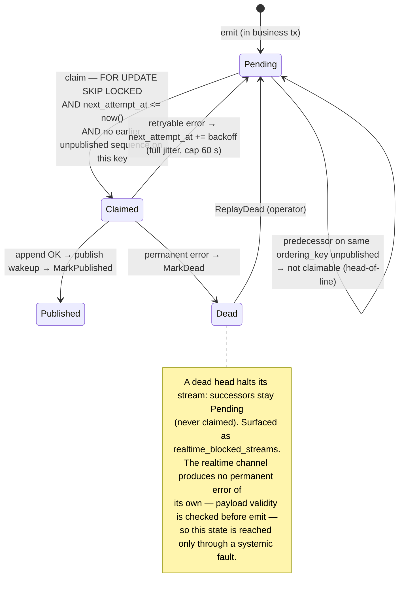
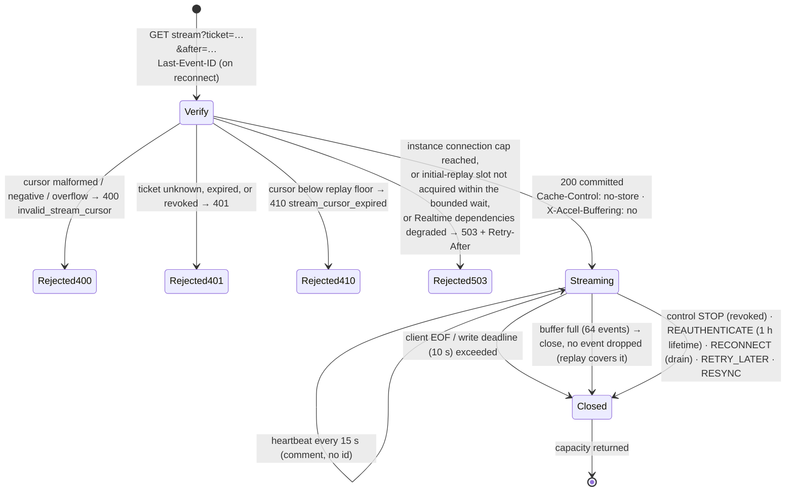
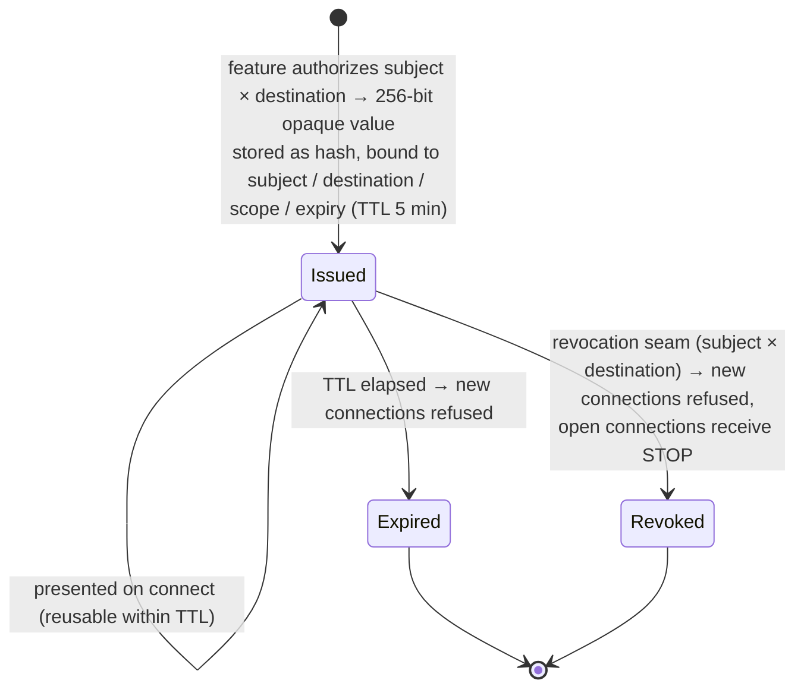
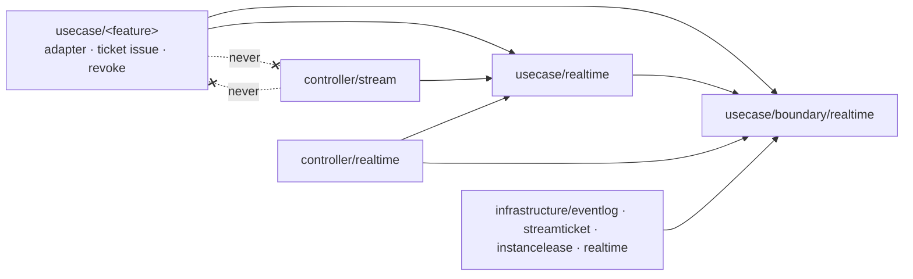

# Realtime Delivery Subsystem Design Reference

This document consolidates the Realtime Delivery subsystem's **role theory, state transitions, implementation locations, what an integrator must implement, and glossary** into a single reference. It is the design the implementation is built to, and §3 is a reading of the code as it stands. Where a statement here names a symbol, a default value, or a step order, treat it as the intended particular; the mechanism it belongs to — the ordering chain, the connection state machine, the ticket contract — governs. For the adoption rationale see the four realtime ADRs: [ADR-0071 (realtime-delivery-driving-mechanism)](../adr/0071-realtime-delivery-driving-mechanism.md), [ADR-0072 (postgres-state-dynamodb-eventlog)](../adr/0072-postgres-state-dynamodb-eventlog.md), [ADR-0073 (sns-sqs-instance-fanout)](../adr/0073-sns-sqs-instance-fanout.md), [ADR-0074 (query-ticket-stream-authentication)](../adr/0074-query-ticket-stream-authentication.md); and, for how an outbox row dies, [ADR-0058 (outbox-dead-on-permanent-error)](../adr/0058-outbox-dead-on-permanent-error.md).

---

## 1. Role theory (what, and what for)

Realtime Delivery exists to **push an event a feature has already committed to the clients that are watching for it, and to let a client that was disconnected catch up without loss or duplication**. It is the fourth driving mechanism beside REST, Worker, and Job — a long-lived Server-Sent Events (SSE) response instead of a short request, a queue consumer, or a one-shot process — placed inside the existing onion with no new layer.

It is deliberately **not** a chat mechanism, a notification mechanism, or an event-sourcing substrate. It sees an **event**, addressed to a **destination**, on a **stream**, for a **subject**, at a **sequence**, with an opaque **payload**. A conversation, a message, an operator, an inbox — those words belong to the feature that emits the event, and they never appear in this subsystem's types, branches, or package names.

The mechanism splits into three halves that never run in the same breath:

- **emit** — synchronous, inside the feature's business transaction. The feature's realtime adapter allocates the stream-local sequence and writes one outbox row per destination.
- **relay** — asynchronous. The realtime relay drains those rows in order into the EventLog and wakes every serve instance.
- **stream** — long-lived. A serve instance holds SSE connections, replays the EventLog from each client's cursor, and pushes what arrives.

Responsibility split (who owns what):

| Component | Layer | Responsibility | Does NOT hold |
| --- | --- | --- | --- |
| **realtime adapter** (`usecase/<feature>/`) | usecase (feature side) | turn a committed feature change into `DeliveryEvent`s; choose the destination(s); obtain the stream-local sequence from the sequence allocator inside the business tx; emit through the outbox | transport, replay, connection state, the sequence itself (it is mechanism state, never a field of the feature's aggregate) |
| **ticket-issuing usecase** (`usecase/<feature>/`) | usecase (feature side) | authorize the subject for a destination, then ask Realtime Delivery for a ticket | the ticket's format or storage |
| **boundary/realtime** | usecase/boundary | the seam: `DeliveryEvent`, `SequenceAllocator`, `EventLogStore`, `StreamTicketStore`, `InstanceLeaseStore`, `RevocationNotifier` | implementations, feature vocabulary |
| **usecase/realtime** | usecase | ticket issue / verify, the revocation seam (`AccessRevoker`), cursor validation and expiry, replay reads, lease heartbeat, orphan cleanup ownership | the HTTP transport, the poll loop |
| **realtime relay** (`controller/outbox` + realtime publisher) | controller / infrastructure | claim realtime-channel rows in stream order, append to the EventLog, publish the wakeup | business decisions, retry policy beyond [ADR-0058] |
| **Streamer** (`controller/stream/`) | controller | connection registry (indexed by subject), capacity gate, replay / catch-up scheduling, heartbeat, backpressure, drain, the control-event protocol | authorization, feature vocabulary |
| **EventLog / ticket / lease stores** (`infrastructure/eventlog`, `streamticket`, `instancelease`) | infrastructure | DynamoDB implementations of the boundary stores | business decisions |
| **fan-out substrate** (`infrastructure/realtime/`) | infrastructure | SNS publish (the realtime publisher and the revocation notifier), per-instance SQS queue / subscription lifecycle, receive and delete on the instance's own queue | what a wakeup means |
| **consumer engine** (`controller/realtime/`) | controller | drain the instance's own queue, coalesce wakeups per batch, hand them and the revocations to the Streamer's sinks; the instance-lease heartbeat loop | what to do with a wakeup (the Streamer's), the transport |
| **orphan-cleanup job** | controller/job + cli | reclaim a crashed instance's queue / subscription / lease under conditional ownership | scheduling (the scheduler owns it, [ADR-0109 (scheduled-job-concurrency-delegated)](../adr/0109-scheduled-job-concurrency-delegated.md)) |
| **DI module** | di | wire the runtime only when at least one feature adapter is present | business logic |
| **RealtimeConfig** | config | deployment-dependent knobs only (§3.3) | fixed protocol values |

Design invariants:

- **One ordering chain.** Feature commit order → outbox → EventLog visibility → client cursor is a single invariant ([ADR-0072]): sequences have no gaps, client-visible sequences form a contiguous prefix, and a terminal failure halts a stream rather than skipping a sequence.
- **The EventLog is the only thing a client is served from.** Wakeups carry no state; a duplicate wakeup is the same catch-up read, a lost one is covered by periodic catch-up.
- **Feature neutrality is enforced, not requested.** Realtime Delivery imports no `internal/domain/<feature>` and no `internal/usecase/<feature>`; `depguard` and the architecture tests fail the build otherwise.
- **Zero adapters, zero runtime.** With no feature adapter wired, the serve graph starts no Streamer and requires no EventLog or fan-out substrate — the sample feature is removable without removing the mechanism.
- **Authorization happens at the edges, never in the Streamer.** The feature authorizes at ticket issue; the identity resolver authorizes every REST request; the Streamer only verifies a ticket and honors a revocation.
- **Capacity is protected per instance, rate is not.** Connection and replay capacity are bounded inside the process; how often a client may reconnect is an edge concern ([ADR-0108 (no-in-app-rate-limiter)](../adr/0108-no-in-app-rate-limiter.md)).

---

## 2. State transitions

### 2.1 Delivery lifecycle (one event, end to end)

```mermaid
flowchart LR
  cmd["Feature command<br/>(business tx)"]
  seq["allocate sequence<br/>UPDATE sequence row (system_cqrs) … RETURNING<br/>lock held to commit"]
  outbox["outbox row<br/>delivery_channel=realtime<br/>ordering_key / ordering_sequence"]
  relay["realtime relay<br/>claim in stream order"]
  log["EventLog append<br/>conditional on (streamId, sequence)"]
  sns["SNS publish<br/>eventId / streamId / sequence"]
  sqs["SQS · one queue per serve instance"]
  streamer["Streamer<br/>coalesce wakeup → read after cursor"]
  sse["SSE write<br/>id: sequence"]
  cmd --> seq --> outbox --> relay --> log --> sns --> sqs --> streamer --> sse
  streamer -. "periodic catch-up (30 s + jitter)" .-> log
```

- The sequence is allocated by the mechanism's **sequence allocator** — one row per stream in a `system_cqrs` table owned by Realtime Delivery, updated with `UPDATE … RETURNING` inside the same transaction as the feature's own write, with the row lock held until commit. The row is mechanism state beside the outbox row; no aggregate carries a sequence field and no Repository allocates one. Allocation order therefore equals commit order and a rollback rolls the increment back: **no gaps**.
- A feature that addresses more than one destination (a conversation stream and an operator feed, say) emits one outbox row per destination in the same transaction. Each row carries its own ordering key and sequence; the mechanism never splits one event across streams.
- The EventLog append is conditional on `(streamId, sequence)` not existing, so an outbox retry after a partial failure is idempotent.

### 2.2 The ordering chain as a state machine (per stream, in the outbox)

Retryable versus permanent is decided by error classification, not by an attempt count ([ADR-0058]). A backed-off row is simply not selected by the claim predicate; it is never locked, so `SKIP LOCKED` semantics are untouched.

### 2.3 Connection lifecycle (one SSE connection)

Cursor resolution, in order: a valid `Last-Event-ID` wins; otherwise `after`; otherwise the ticket's initial cursor. The initial cursor is a starting position, not an authorization floor — a client may resume from any earlier position the replay floor still covers; a feature that must narrow the visible history separates destinations. A cursor is never valid for a destination other than the ticket's.

Everything that can be refused is refused **before** the response is committed; after commit the only channel back to the client is an in-band control event followed by close (§4.3).

### 2.4 Ticket lifecycle

The ticket TTL bounds when a *new* connection may start. An established connection is bounded separately by the **maximum connection lifetime (1 hour)**, at which point the server sends `REAUTHENTICATE` and closes; the client obtains a fresh ticket through the feature's authorization path. Revocation inside this service (membership soft-delete, destination access withdrawn) is immediate — ticket invalidated and matching connections closed via the fan-out; revocation at the identity provider is not observed and converges through the lifetime alone ([ADR-0074], `auth.md` §2).

### 2.5 Serve instance lifecycle and the instance lease

```mermaid
stateDiagram-v2
    [*] --> Provisioning: Start — verify EventLog reachable → write the instance lease
    Provisioning --> Subscribed: create SQS queue → subscribe to SNS topic → start consumer
    Subscribed --> Ready: HTTP listen; lease heartbeat every 30 s (expiry 2 min)
    Ready --> Draining: Stop — refuse new connections; send SERVER_DRAINING / RECONNECT; drain SSE
    Draining --> Unsubscribing: stop consumer → unsubscribe → delete queue → delete lease
    Unsubscribing --> [*]: HTTP shutdown
    Ready --> Crashed: process dies without Stop
    Crashed --> Orphaned: lease expires (2 min) + safety margin (5 min)
    Orphaned --> Reclaimed: orphan-cleanup job takes ownership by conditional update<br/>unsubscribe → delete queue → delete lease
```

Start order is provisioning → subscription → consumer → HTTP listen / ready, and the instance lease is written **first**, before the queue exists: a queue that outlives a process which died before any lease named it can never be reclaimed, since the orphan-cleanup job reaches resources only through expired leases. Stop order is the reverse — SSE drain **before** the consumer stops and before `http.Server.Shutdown`, so a long-lived connection never blocks shutdown, and the lease is deleted **last**, only after the queue and subscription are gone (a lease deleted ahead of a failed teardown would hide the leftovers from the cleanup job).

The instance identifier is minted afresh at each process start and never derived from a value that survives a restart (a hostname, a pod name). The per-instance queue is named `<prefix>-<instance id>` and the lease is keyed by the same identifier, so a restarted process reusing its predecessor's identifier would heartbeat the previous generation's lease and tear down the queue a still-live process may be consuming from. A new identifier per start turns the previous generation's leftovers into plain orphans, which is the only state the cleanup job can reclaim.

An instance can also lose its receiving end while it is still alive. The cleanup margin makes that
unlikely rather than impossible: a run that claimed the lease of a stalled instance deletes the queue
of a process that later resumes. The subscription reports every receive against a missing queue — and
one that was never provisioned — as the same `ErrReceivingEndGone`, because the recovery for both is
identical, and splitting them would leave a failed recreation's next round outside the recovery path.
The consumer loop then asks for a re-provision in the start order above, lease first, for the reason
the start order exists at all. That order is composed where the lease and the subscription meet — the
DI module — never inside the subscription, which does not know the lease. A failed recreation is not
retried on the spot; the next receive fails the same way and asks again, which is what carries it past
the 60 s AWS enforces between deleting a queue and creating one with that name.

### 2.6 Degraded operation

| Condition | Effect on new SSE connections | Effect on open connections | Effect on `/ready` |
| --- | --- | --- | --- |
| EventLog or fan-out unreachable at start | runtime does not start; startup fails fast | — | not ready |
| EventLog or fan-out unreachable while running | `503` + `Retry-After` | kept open; periodic catch-up resumes delivery when the dependency returns (no mass `RETRY_LATER`, which would turn recovery into a reconnect storm) | REST stays healthy; realtime reported degraded; the instance is **not** removed from the load balancer for this alone |
| Instance connection cap reached | `503` + `Retry-After` | unaffected | unchanged |
| Replay concurrency saturated | initial replay waits a bounded time, then `503` | catch-up waits its turn (cancellation respected) | unchanged |

---

## 3. Implementation locations (where it lives)

This section states the **planned** placement. The dependency direction and the allowlist are the governing part; package names are the intended particulars.

### 3.1 Package placement and dependency direction

| Package | Contents |
| --- | --- |
| `internal/usecase/boundary/realtime/` | `DeliveryEvent` (eventId / streamId / sequence as a decimal string / type / occurredAt / schemaVersion / payload ≤ 64 KiB); `SequenceAllocator` (`Allocate(streamID)` — next sequence, row locked to commit; `Current(streamID)` — the stream's current position, used as a History cursor); `EventLogStore` (conditional append, read after cursor with `ConsistentRead`, latest by descending read); `StreamTicketStore` (hashed ticket, bindings, invalidate); `InstanceLeaseStore` (heartbeat, expiry, conditional cleanup ownership); `RevocationNotifier` (tell every instance a subject lost a destination) |
| `internal/usecase/realtime/` | ticket issue / verify; the revocation seam `AccessRevoker` (invalidate the tickets, then notify); cursor validation and replay-floor derivation; replay reads; lease heartbeat and orphan cleanup ownership |
| `internal/controller/stream/` | connection registry indexed by subject; capacity gate; initial-replay admission; replay / catch-up semaphore and jittered scheduler; heartbeat; write deadline; buffer and close-on-full; drain; control-event writer; the non-strict SSE handler |
| `internal/infrastructure/rdb/system_cqrs/realtime/` | the `SequenceAllocator` over a PostgreSQL `system_cqrs` table (`stream_id`, `last_sequence`) — the same category as the outbox and idempotency tables ([ADR-0033 (system-cqrs-dml-category)](../adr/0033-system-cqrs-dml-category.md)) |
| `internal/infrastructure/eventlog/dynamodb/`, `internal/infrastructure/streamticket/dynamodb/`, `internal/infrastructure/instancelease/dynamodb/` | the DynamoDB stores; idempotent one-shot table initializer (never at application start) |
| `internal/infrastructure/realtime/aws/` | realtime publisher (EventLog append → SNS publish), the revocation notifier, per-instance SQS queue / subscription lifecycle behind the `InstanceSubscription` port (provision / receive / delete / teardown); `internal/infrastructure/realtime/local/` only for the emulator's queue-attribute set, the one call set that proved wire-incompatible |
| `internal/controller/realtime/` | the consumer engine that drains the `InstanceSubscription` and hands wakeups / revocations to the sinks `controller/stream` implements (the same driving-adapter shape as `controller/outbox` and `controller/worker`); the lease heartbeat loop |
| `internal/controller/job/<orphan-cleanup>/` + `internal/cli/` | the cleanup job entry point |
| `internal/di/module/realtime.go` | wired only when at least one feature adapter is provided; contributes the serve-lifecycle participants (startup probe, the lease + queue provisioner, the consumer and heartbeat runners) that `internal/di/server/hook` runs in the order of §2.5 |
| `internal/usecase/<feature>/` | the feature's realtime adapter and ticket-issuing usecase |

Architecture rules, both mechanically checked:

1. `boundary/realtime`, `usecase/realtime`, `controller/stream`, `controller/realtime`, and the five infrastructure packages import no `internal/domain/<feature>` and no `internal/usecase/<feature>`.
2. `InstanceLeaseStore` may be imported only by the realtime mechanism packages and the DI modules that wire them. The orphan-cleanup job reaches the lease through `OrphanSweeper`, so its entry point needs no access to the store.

Rule 1 is checked twice, deliberately: by `depguard` (`maintain_realtime_feature_neutrality`, declared in `.golangci-full.yaml` — the config `make lint` and CI actually run — and mirrored into `.golangci.yaml` so editors surface it too, per [ADR-0088 (two-layer-golangci-config)](../adr/0088-two-layer-golangci-config.md)), which fails at lint time next to the other layer rules, and by `internal/architest/realtime_isolation_test.go`, which fails at test time and additionally asserts that the package list it scans still exists — a rule whose subject has been renamed away is the one failure a linter cannot report. Rule 2 lives only in the architecture test: it constrains a single **symbol**, and `depguard` denies whole packages, so expressing it there would also reject the legitimate `EventLogStore` and `StreamTicketStore` imports from the same package.

`depguard` matches an import path by plain prefix, so the `allow` entry that returns `usecase/realtime` to the mechanism also returns any sibling whose name merely starts with those characters. That cannot be expressed away in `depguard`, so the architecture test carries the difference: `isFeatureImport` matches the mechanism exactly or under a trailing slash, and a separate check reserves the name — `internal/usecase/` may hold no package whose name begins with `realtime` other than the mechanism itself. Adding one fails both checks, which is what makes the redundancy real rather than nominal.

### 3.2 Outbox additions this subsystem relies on

Added by the outbox delivery-channel work, shared by every channel:

- `delivery_channel` — `NOT NULL`, no default (an emit that forgets the channel fails instead of silently going to HTTP).
- `ordering_key` / `ordering_sequence` — nullable; `NULL` for channels that do not order.
- `next_attempt_at` — per-message backoff ([ADR-0058]).
- One relay execution loop per channel; the claim predicate adds the channel, `next_attempt_at <= now()`, and the head-of-line rule of §2.2.

### 3.3 Configuration and fixed values

| Kind | Values |
| --- | --- |
| **Typed config** (deployment-dependent) | EventLog endpoint / region; the table suffix every store's table name is derived from (`<store>_<suffix>`, which is what lets parallel checkouts share one DynamoDB); credentials (empty → SDK default chain); fan-out endpoint; SNS topic; SQS resource prefix; DLQ (empty → no redrive); both are ARNs on AWS; **max SSE connections per instance**; **replay / catch-up concurrency** |
| **Fixed in code** (one canonical definition each) | write deadline 10 s; heartbeat 15 s; per-connection buffer = one replay page (64), so a page can never overflow it; catch-up interval 30 s; jitter ratio (a fifth of the interval); initial-replay admission wait 2 s; drain budget 10 s; the `Retry-After` hint 5 s, shared by the 503 header and `retryAfterMs`; ticket TTL 5 min; maximum connection lifetime 1 h; lease heartbeat 30 s / expiry 2 min / cleanup margin 5 min; payload cap 64 KiB; EventLog retention 7 days; backoff cap 60 s; instance queue visibility timeout 30 s / long polling 20 s / redrive `maxReceiveCount` 5 |

### 3.4 Observability contract

Metrics are feature-neutral (named `realtime.*`, which the Prometheus exporter renders as `realtime_*`) and carry **no** subject, user, stream, destination, event, message, trace, or ticket identifier as a label; per-item correlation goes through traces and structured logs. An identifier's value set is unbounded, so every new value opens a time series that is never retired; the label keys are therefore fixed to `reason` / `trigger` / `result` / `outcome`, and `internal/architest/realtime_metrics_test.go` fails any key outside that set.

A close is one metric carrying `reason`, not one metric per way of closing — a slow client and an ordinary EOF are the same series read through that label. The same holds for `result` and `outcome`: an execution and its success are not separate counters.

| Group | Metrics (`internal/observability/realtime_metrics.go`) |
| --- | --- |
| connection | `connections.active`; `connections.accepted`; `connections.rejected` (`reason`: capacity, degraded, draining); `connections.closed` (`reason`, which is where a slow client is counted); `connections.reconnects` (a connect carrying `Last-Event-ID` or `after`); `connections.duration_ms` |
| replay / catch-up | `replay.executions` (`trigger`); `replay.events`; `replay.depth`; `replay.failures`; `replay.in_flight` (the concurrency gate's occupancy); `replay.admission_timeouts` (a slot not won within the bounded wait); `catchup.lag_ms` |
| delivery | `eventlog.appends` (`result`); **`delivery.latency_ms`** = `occurredAt` → successful SSE write (spans two instances, so clock skew is included; an approximation by construction); **`eventlog.lag_ms`** = outbox `created_at` → append; `wakeup.publish_failures`; `recovery.executions` (`result`) |
| cleanup | `lease.heartbeat_failures`; `cleanup.executions` (`result`); `cleanup.instances` (`outcome`) |
| outbox | lag per delivery channel; age of the oldest pending row per channel (the alert that replaces the attempt count, [ADR-0058]). These live on the outbox meter, not the realtime one — **blocked streams** (head dead) is read from there |

Traces: command → outbox → relay → EventLog share one trace through the outbox headers. A long-lived connection is never a child span of the originating command; each delivery or replay operation is a short span with a span link to the event's origin trace. Only official OpenTelemetry semantic conventions are used ([ADR-0077 (official-otel-semconv)](../adr/0077-official-otel-semconv.md)). Payloads, tickets, and query credentials never appear in span attributes or log fields.

---

## 4. What an integrator implements (the parts the subsystem does not provide)

### 4.1 On the feature side

| Deliverable | Contract |
| --- | --- |
| **Destination mapping** | Decide what a stream *is* for this feature (a conversation, a per-user inbox, an organization feed). The subsystem interprets nothing about it. |
| **Event type and payload schema** | `<feature>.<noun>.<verb>.vN` plus `schemaVersion`; both stay. Declared as an OpenAPI component so a client generator can type it. Payload ≤ 64 KiB, self-contained, and free of credentials, tokens, tickets, cookies, binaries, and raw personal data beyond what the feature already exposes. |
| **Sequence allocation** | In the business transaction, call `SequenceAllocator.Allocate(streamID)` — the mechanism's own row for the stream is updated with `UPDATE … RETURNING` and stays locked to commit. Do not give the aggregate a sequence field and do not allocate in a Repository. |
| **Emit** | One outbox row per destination, `delivery_channel = realtime`, `ordering_key` = the stream, `ordering_sequence` = the allocated sequence. |
| **Ticket-issuing endpoint** | Authorize subject × destination, then obtain a ticket. One endpoint per destination kind; the scope is the feature's to define. |
| **Canonical recovery path** | A read endpoint (History, list) whose response carries a `streamCursor` consistent with the rows it returns. Read the cursor **first** (`SequenceAllocator.Current`), then read rows with `sequence <= cursor`: because allocation holds the row lock to commit, every row at or below a cursor you could read is already committed, and anything above it is excluded — equivalent to one snapshot under the default `READ COMMITTED`, with no isolation change and no single-statement join. `RESYNC` and `410` both send the client here. |
| **Revocation calls** | Invoke the revocation seam when the feature withdraws a subject's access to a destination, and from the membership soft-delete path. |
| **Idempotency on commands** | Opt the feature's mutating endpoints into the idempotency middleware where a client retry after a timeout would otherwise duplicate the effect. |

### 4.2 On the deployment side

- **DynamoDB**: three tables (EventLog with TTL 7 days on `occurredAt`-derived expiry, StreamTicket with TTL, InstanceLease); partition = stream; encryption at rest; point-in-time recovery, backup, and alarms are provisioned outside this repository ([ADR-0106 (vendor-neutral-deploy-skeleton)](../adr/0106-vendor-neutral-deploy-skeleton.md)). A single hot stream is bounded by one partition and one PostgreSQL row; the mechanism does not shard it.
- **SNS / SQS**: one standard topic, provisioned by the deployment and named to the application by `REALTIME_TOPIC` (locally `make realtime-init` creates it). The per-instance standard queues are the only resources the application creates itself, at serve start, as `<REALTIME_QUEUE_PREFIX>-<instance id>`, with: an access policy admitting `sqs:SendMessage` from `sns.amazonaws.com` only when `aws:SourceArn` is that topic; `RawMessageDelivery=true` on the subscription; long polling (`ReceiveMessageWaitTimeSeconds=20`); `VisibilityTimeout=30`; `SqsManagedSseEnabled=true` (a customer-managed KMS key is not a knob the mechanism exposes); and, when `REALTIME_DLQ` is set, a `RedrivePolicy` to that shared DLQ with `maxReceiveCount=5` — the DLQ itself is provisioned by the deployment and is an operational safety net, not a correctness requirement, because a lost wakeup is covered by the periodic catch-up. Minimal IAM: the relay needs `sns:Publish` on the topic; a serve instance needs `sqs:CreateQueue`, `sqs:GetQueueAttributes`, `sqs:SetQueueAttributes`, `sqs:ReceiveMessage`, `sqs:DeleteMessage` and `sqs:DeleteQueue` on `<prefix>-*`, plus `sns:Subscribe`, `sns:SetSubscriptionAttributes` and `sns:Unsubscribe` on the topic, and `sns:Publish` on the topic for revocations; the orphan-cleanup job additionally needs `sns:ListSubscriptionsByTopic` on the topic and `sqs:GetQueueUrl` on `<prefix>-*` — it reaches a dead instance's queue by name rather than from a cached URL, and a denial there is indistinguishable from "already gone", so the job would fail every run while the queue survived. Nothing needs `sns:CreateTopic`.
- **Edge**: HTTPS; a fixed CORS origin; the client's CSP `connect-src`; load-balancer / proxy idle timeout above the heartbeat interval and response buffering disabled for the stream path; reconnect rate limiting, if any, at the edge; **query strings excluded or redacted from edge / proxy / load-balancer access logs** on the stream path — the ticket travels as a query parameter, and the in-process excision does not reach logs written outside the process.
- **Local**: DynamoDB Local and an SNS/SQS emulator (GoAWS) in the shared infrastructure profile, tables and the topic created by the idempotent initializer, with the table names, the topic and the queue prefix all suffixed per worktree slot so checkouts sharing the emulators do not share state. GoAWS refuses the queue policy and does not honor the redrive / encryption attributes, so the emulator's queue-attribute set (`infrastructure/realtime/local`) sets only the timing attributes; the DI module selects it for the emulator environments and the full set from `dev` on.

**Operate.** The deployment owns the thresholds — they follow the traffic, the instance count and the
retention the business needs, none of which this repository knows — but it does not own *what to
watch*, because that follows from the mechanism. Every signal below is a metric group from §3.4; a
deployment that provisions the resources above without wiring these is running the subsystem blind.

| Signal | What it means | First runbook action |
| --- | --- | --- |
| **blocked streams** (head dead) | The ordering chain has halted on a stream: a terminal failure stopped it rather than skipping a sequence, so nothing after the dead head is delivered. The one alert that never auto-resolves. | Find the dead outbox row, fix or discard the cause, then `outbox-relay replay --message-id=<uuid>`. Until it moves, that stream is stopped for every client. |
| **EventLog lag** (outbox `created_at` → append) | The relay is behind. Clients see committed changes late, and the gap grows until the relay catches up. | Check the relay is running (`outbox-relay --channel=realtime`) and that DynamoDB is accepting appends; a relay that died shows as lag, not as an error. |
| **delivery latency** (`occurredAt` → SSE write) | Rising while EventLog lag is flat means the stream half is the bottleneck, not the relay: replay saturation, slow clients, or an instance at capacity. | Compare replay concurrency saturation and rejected-connection counts before scaling; a slow-client problem is not fixed by more instances. |
| **rejected connections** (capacity) | Instances are at `REALTIME_MAX_CONNECTIONS`. Clients are being turned away with `503`, and the edge's reconnect policy decides how hard they retry. | Add instances, or raise the per-instance cap if the process has the memory and file descriptors for it (§3.3). |
| **heartbeat failures / expired instances** | Leases are not being renewed. An instance that dies leaves its queue and subscription behind, which cost money and receive messages nobody reads. | Confirm the orphan-cleanup job is scheduled and succeeding; a rising expired count with no cleanup executions means the job is not running. |
| **cleanup failures** | The job is running but cannot reclaim. Usually IAM: it needs `sns:ListSubscriptionsByTopic` and `sqs:GetQueueUrl` on `<prefix>-*`, and a denial is indistinguishable from "already gone". | Check the job's permissions before its logic — this is the failure the IAM list above exists to prevent. |
| **append failures / recovery failures** | The EventLog itself is rejecting writes: throttling, or a table that no longer matches what the code expects. | Check DynamoDB capacity and that the table's key schema and TTL are what the initializer creates. |

A DLQ that is filling is not on this list because it is not a correctness signal: a lost wakeup is
covered by the periodic catch-up. Treat it as evidence about the fan-out's health, not as delivery
that must be replayed.

### 4.3 The client contract

A client must implement this state machine; the server assumes it.

```mermaid
stateDiagram-v2
    [*] --> Connecting: EventSource(stream?ticket=…&after=…)
    Connecting --> Connected: 200
    Connecting --> Backoff: 503 → wait Retry-After (+ jitter)
    Connecting --> Resync: 410 → re-read canonical state, new streamCursor
    Connecting --> Authenticating: 401 → new ticket
    Connected --> Reconnecting: EOF / network error (Last-Event-ID kept by the browser)
    Connected --> Reconnecting: control RECONNECT
    Connected --> Backoff: control RETRY_LATER (retryAfterMs, advisory; add jitter)
    Connected --> Authenticating: control REAUTHENTICATE
    Connected --> Resync: control RESYNC
    Connected --> Stopped: control STOP
    Reconnecting --> Connecting
    Backoff --> Connecting
    Authenticating --> Connecting: new ticket obtained
    Resync --> Connecting: after=streamCursor, new ticket
```

- A control event is `event: control` with a JSON body `{action, reason, retryAfterMs?}` and **no SSE `id`**; only business events carry the sequence as `id`, so `Last-Event-ID` is never polluted by the control plane. `retryAfterMs` is milliseconds; the pre-commit `Retry-After` header is seconds.
- `STOP`, `REAUTHENTICATE`, and `RESYNC` must be handled **synchronously**: the client closes the `EventSource` itself before the server's EOF arrives, because the browser would otherwise reconnect automatically and produce a reconnect loop.
- Reason codes are stable machine-readable values (`SERVER_DRAINING`, `TEMPORARILY_OVERLOADED`, `AUTH_REFRESH_REQUIRED`, `AUTHORIZATION_REVOKED`, `CURSOR_TOO_OLD`, `STREAM_RECOVERY_FAILED`). A client never branches on a human-readable message. Feature-specific reasons do not exist at this level; a feature expresses them in its own event payloads.
- Delivery of a control event is not guaranteed. A client must recover from a bare EOF as well — control events improve recovery, they are not its correctness.
- A test-only reference client in Go, in the integration tests, pins this contract; it is not a shipped SDK.

---

## 5. Glossary

| Term | Meaning |
| --- | --- |
| **Realtime Delivery** | The subsystem: emit → relay → stream, with replay. Named for what it does; never `core`, `platform`, or another container name. |
| **DeliveryEvent** | The feature-neutral envelope: `eventId` (= outbox `message_id`), `streamId`, `sequence`, `type`, `occurredAt`, `schemaVersion`, `payload`. |
| **destination** | What a stream is *for*, decided by the feature (a conversation, an inbox, a feed). The subsystem interprets nothing about it. |
| **stream** | The unit of ordering and replay; `streamId` is the EventLog partition key. One event belongs to exactly one stream. |
| **subject** | The feature-neutral principal a ticket is bound to and the connection registry is indexed by. The subsystem does not know whether it is a user or an operator. |
| **sequence** | The stream-local, gap-free, monotonically increasing position of an event, allocated in the feature's business transaction. Wire form is a decimal string. |
| **sequence row** | The mechanism's per-stream row (`stream_id`, `last_sequence`) in a `system_cqrs` table, updated by the allocator inside the feature's transaction and locked to commit. Mechanism state beside the outbox row; never part of an aggregate. |
| **ordering key / ordering sequence** | The outbox columns that carry the stream and sequence so the relay can hold the head-of-line rule. |
| **head-of-line blocking** | The claim rule: a row is claimable only when no earlier sequence on its ordering key is unpublished. |
| **contiguous prefix** | The invariant that everything a client can see on a stream is `1..N` with no holes. |
| **cursor** | A sequence a client has seen; `Last-Event-ID` on browser reconnect, `after` on explicit resume. |
| **replay** | Reading the EventLog after a cursor when a connection opens. |
| **catch-up** | Reading the EventLog after the current cursor because of a wakeup or on the periodic (30 s, jittered) schedule. |
| **replay floor** | The oldest sequence still replayable. Derived, not stored: `cursor + 1` absent while a later item exists, or present but older than retention, or the item at the cursor itself absent **at or below the append watermark** (cursor not initial) → `410`. A cursor *above* the watermark is not expired: the relay has simply not written that far yet, and refusing it would be unrecoverable, because re-reading the canonical state returns the same cursor. |
| **append watermark** | The highest sequence the relay has written to a stream's EventLog. Kept per stream and never rolled back, so it outlives the events themselves — which is what separates "gone with the retention" from "not written yet" once an item is missing. |
| **wakeup** | The SNS → SQS notification "re-read stream S after your cursor". Stateless; duplicates coalesce; loss is covered by catch-up. |
| **blocked stream** | A stream whose head row is dead; halted until replayed; counted by `realtime_blocked_streams`. |
| **ticket** | The opaque 256-bit credential presented on connect, stored hashed, bound to subject / destination / scope / expiry, reusable for its 5-minute TTL. |
| **connection maximum lifetime** | The 1-hour bound on an established connection, after which `REAUTHENTICATE` is sent. Independent of the ticket TTL. |
| **grant** | The bindings a verified ticket confers on a connection (`boundary/realtime.StreamGrant`): subject, destination, scope, initial cursor. The ticket is the credential; the grant is what verifying it yields, carried in the request context to the stream handler. |
| **revocation seam** | The call a feature makes when a subject loses access to a destination inside this service (`usecase/realtime.AccessRevoker`); invalidates tickets first, then closes connections via the fan-out (`boundary/realtime.RevocationNotifier`). |
| **control event** | `event: control`, no `id`; actions `RECONNECT` / `RETRY_LATER` / `REAUTHENTICATE` / `RESYNC` / `STOP`. |
| **instance lease** | A serve instance's liveness record (heartbeat 30 s, expiry 2 min) used only to reclaim its queue and subscription after a crash. Not a lock, not a leader election. |
| **orphan** | A queue / subscription whose instance lease has expired past the safety margin. |
| **capacity protection** | Per-instance bounds on connections and concurrent replay reads, enforced before commit with `503`. Distinct from rate limiting, which is an edge concern. |
