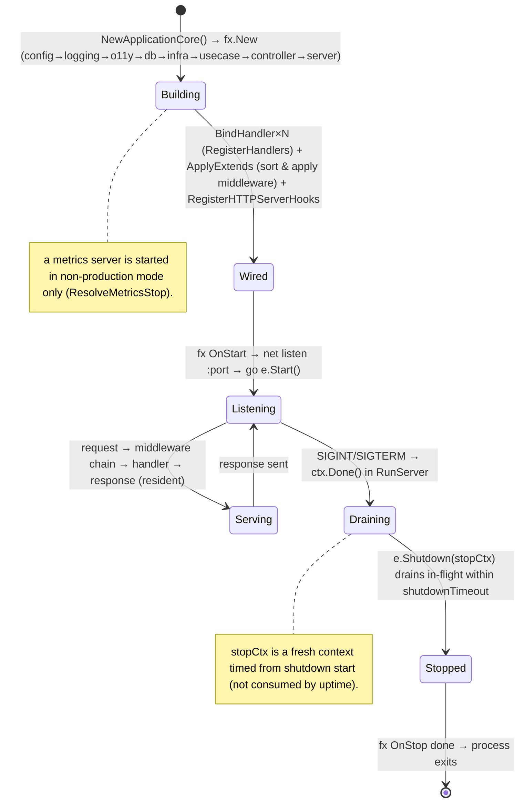
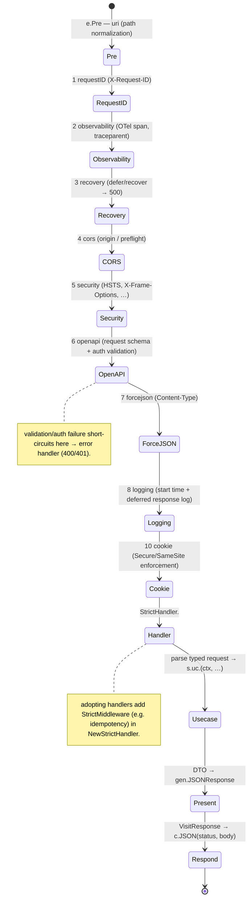
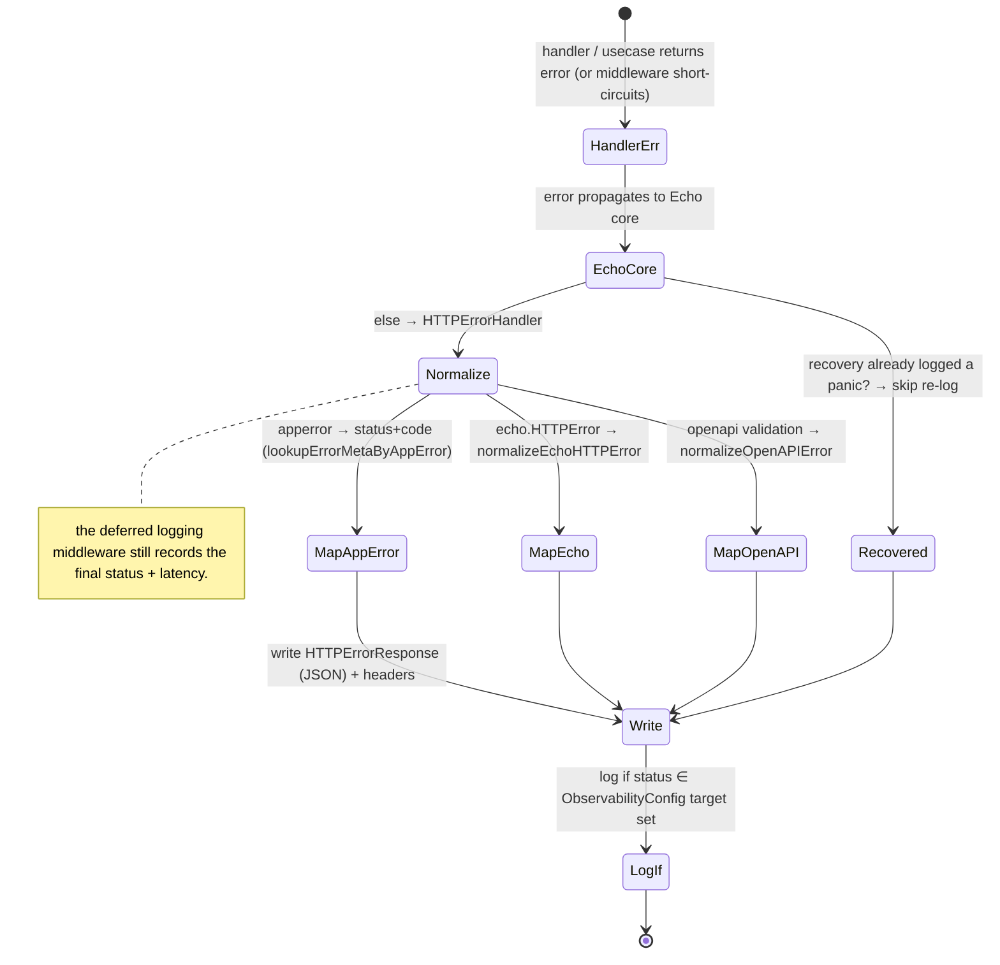
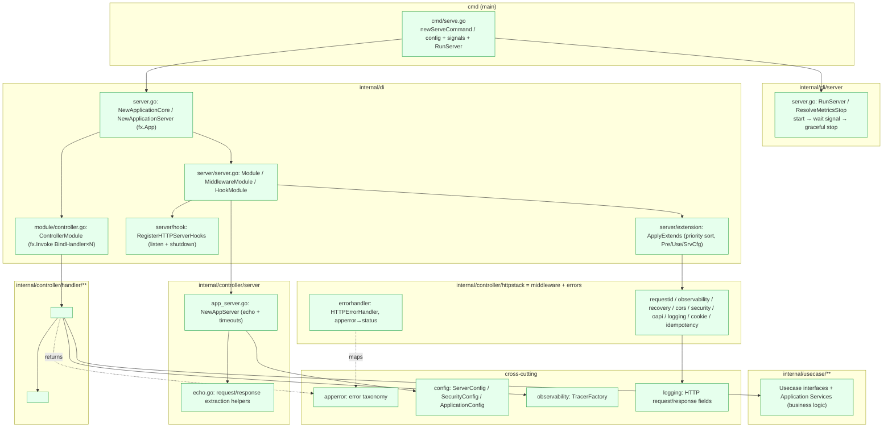
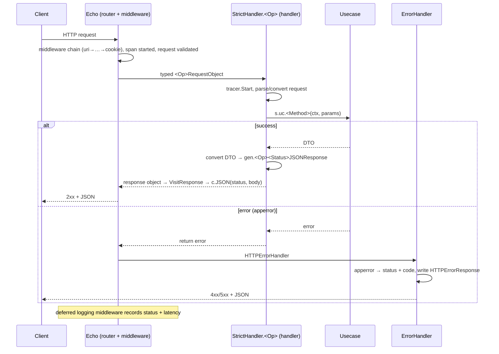
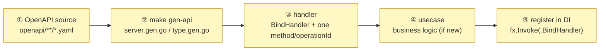

# REST Subsystem Design Reference

[Controller README](../../internal/controller/README.md) | 日本語: [rest.ja.md](../ja/design/rest.ja.md)

This document consolidates the REST (HTTP) scaffold's **role theory, state transitions, implementation locations, what an integrator must implement, and glossary** into a single reference, derived from a close reading of the implementation. For the handler-authoring detail see the [handler README](../../internal/controller/handler/README.md); the worker and job are its async / CLI siblings — see [worker.md](worker.md) and [job.md](job.md).

---

## 1. Role theory (what, and what for)

REST is the **"request-in driving adapter," the synchronous HTTP entry point into the Usecase layer**, and the original peer that the worker ("message-in") and job ("command-in") were modelled after. The Echo server is the transport; the handler is a thin template that adapts HTTP I/O to a usecase call. **All business logic stays in the usecase layer** — the handler binds, calls one usecase method, and shapes the response.

Responsibility split (who owns what):

| Component | Layer | Responsibility | Does NOT hold |
| --- | --- | --- | --- |
| **Echo server** (`server.NewAppServer`) | controller | TCP listener / read·write·idle timeouts / route table via generated `RegisterHandlers` | business logic, middleware policy |
| **middleware chain** (`httpstack/*`) | controller | cross-cutting concerns in a fixed order: uri(pre) → requestID → observability → recovery → cors → security → openapi → forcejson → logging → cookie | business logic |
| **handler** (`controller/handler/**`) | controller | parse typed request (`StrictHandler`) → call **one** usecase method → convert DTO → `gen` response | business logic, persistence, tx |
| **error handler** (`httpstack/errorhandler`) | controller | map `apperror` / Echo / OpenAPI errors → HTTP status + code, unified error body | business policy |
| **usecase** | usecase | **all** business logic, transaction boundaries, domain orchestration, error policy | HTTP, framework, presentation |
| **DI server + hook** (`di/server`) | di | compose Echo + ordered middleware (by priority) + lifecycle (listen / graceful shutdown) | business logic |
| **ServerConfig** | config | host / port / read-header·read·write·idle timeouts | business logic |

Design principles (invariants):

- **Contract-first.** Routes, request, and response types are generated from OpenAPI (`make gen-api`); handlers implement the generated `StrictServerInterface`. Handlers and usecases must not precede the contract.
- **Thin handler.** A handler is a template (bind → usecase → present); it holds no business logic and **does not import infrastructure** (depguard `maintain_a_sound_controller`).
- **Ordered middleware by priority.** Each middleware declares an integer priority in its `*_di.go`; the extension engine sorts and applies `Pre`/`Use` deterministically, so the chain order is data, not call-site ordering.

---

## 2. State transitions

### 2.1 server lifecycle (`cli/server.RunServer` + fx + signal)

### 2.2 per-request flow (middleware order → handler → usecase → present)

### 2.3 error path (`apperror` → HTTP)

---

## 3. Implementation locations (where in the architecture it lives and acts)

### 3.1 Package placement and dependency direction

> Dependencies point inward (`controller→usecase`). The handler depends on its generated `gen` package and a usecase interface only; it never imports infrastructure. Middleware ordering is owned by the DI extension engine, not by handlers.

### 3.2 Per-request action sequence

---

## 4. What an integrator implements (contract-first endpoint flow)

The scaffold provides the **server bootstrap, ordered middleware chain, error handler, DI wiring, and the `scaffold-*` skills**. To add an endpoint, follow the contract-first order (OpenAPI changes must precede handler/usecase code).

| # | Required implementation | Location | Reference |
| --- | --- | --- | --- |
| ① | define the path / operation / schemas in OpenAPI source, re-bundle | `openapi/**/*.yaml` → `openapi/openapi.gen.yaml` | existing paths |
| ② | regenerate the server interface + types | `make gen-api` → `internal/controller/handler/<path>/gen/` | — |
| ③ | implement `BindHandler(echo, tracerFactory, usecase, …)` + one method per `operationId` (tracer span → parse → usecase → response) | `internal/controller/handler/<path>/*_handler.go` | `scaffold-controller`, `v1/users` |
| ④ | implement the usecase method (if it does not exist), mapping domain → DTO | `internal/usecase/<feature>/` | `scaffold-usecase` |
| ⑤ | wire the handler: `fx.Invoke(<pkg>.BindHandler)` | `internal/di/module/controller.go` | existing invokes |

> Use the `scaffold-endpoint` orchestrator (or per-layer `scaffold-*` skills) to generate domain → infra → usecase → controller from the spec. A new cross-cutting middleware is added as a `*_di.go` with a priority constant under `internal/di/server/extension/` — the engine sorts it into the chain.

---

## 5. Glossary

| Term | Meaning |
| --- | --- |
| **driving adapter** | An entry point that drives the usecase layer. REST (HTTP) is the synchronous one; the [worker](worker.md) (queue) and [job](job.md) (CLI) are its siblings. |
| **Echo** | The HTTP framework. `server.NewAppServer(ServerConfig)` builds the `*echo.Echo` with timeouts; routes are registered by generated code. |
| **ServerInterface / StrictServerInterface** | The OpenAPI-generated route interface / its strongly-typed (request-object, response-object) variant. Handlers implement the strict form. |
| **RegisterHandlers / NewStrictHandler** | Generated functions: register routes on Echo / wrap the strict handler with a `StrictMiddlewareFunc` slice (e.g. idempotency). |
| **BindHandler** | The handler package's constructor: builds the `server{}` (tracer + usecase) and calls `RegisterHandlers(e, NewStrictHandler(...))`. Wired via `fx.Invoke`. |
| **handler / `server{}`** | The thin controller type with one method per `operationId`: tracer span → parse request → call one usecase method → convert DTO → `gen` response. |
| **presenter** | The DTO → `gen.<Op><Status>JSONResponse` conversion, implemented inline in the handler method. |
| **middleware (Use) / Pre** | Per-request cross-cutting functions applied in priority order (`Use`), plus `Pre` (path normalization) that runs before routing. |
| **priority** | The integer in each middleware's `*_di.go` that the extension engine sorts on (uri-pre 1; requestID 1, observability 2, recovery 3, cors 4, security 5, openapi 6, forcejson 7, logging 8, cookie 10). |
| **extension engine** (`ApplyExtends`) | Collects `Pre`/`Use`/`SrvCfg` providers, sorts by priority, and applies them to Echo; also applies non-middleware configurators (IP extractor, error handler). |
| **error handler** | `HTTPErrorHandler` set on Echo; normalizes `apperror` / `echo.HTTPError` / OpenAPI validation errors into a unified `HTTPErrorResponse` with the mapped status + code. |
| **apperror** | The framework-agnostic error taxonomy; the error handler maps it to HTTP status (e.g. `ErrConflict`→409, `ErrValidation`→422, `ErrInvalidArgument`→400). |
| **graceful shutdown** | On SIGINT/SIGTERM, `RunServer` stops accepting and calls `e.Shutdown(stopCtx)` to drain in-flight within `shutdownTimeout` (timed from shutdown start). |
| **lifecycle / Registrar** | The fx hook seam: `RegisterHTTPServerHooks` registers OnStart (listen + serve) and OnStop (shutdown). |
| **ServerConfig** | Host / port / read-header / read / write / idle timeouts (`SERVER_*`). Injected into `NewAppServer`. |
| **idempotency middleware** | A `StrictMiddleware` slot adopting handlers add to make non-idempotent writes safe. See [idempotency.md](idempotency.md). |
