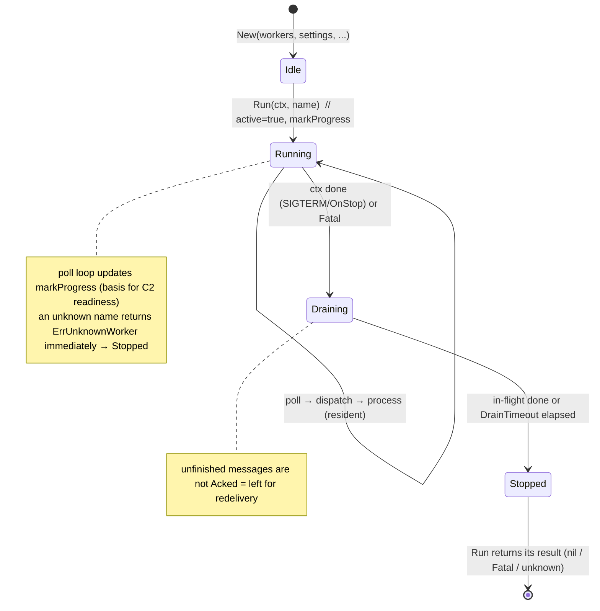
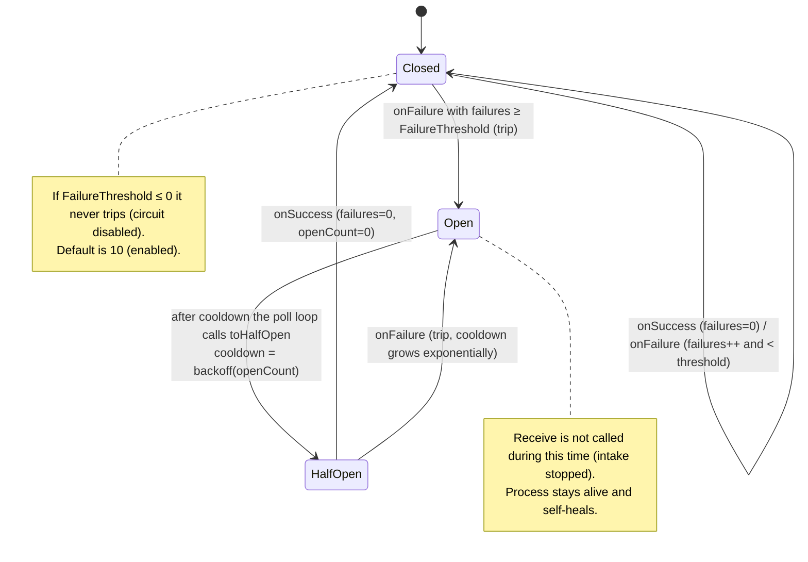
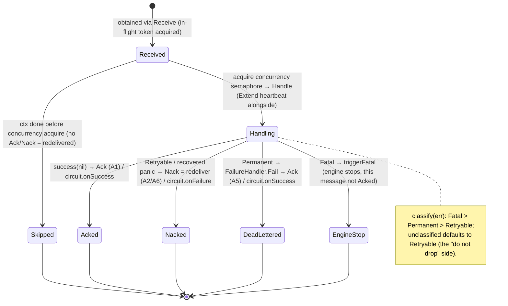
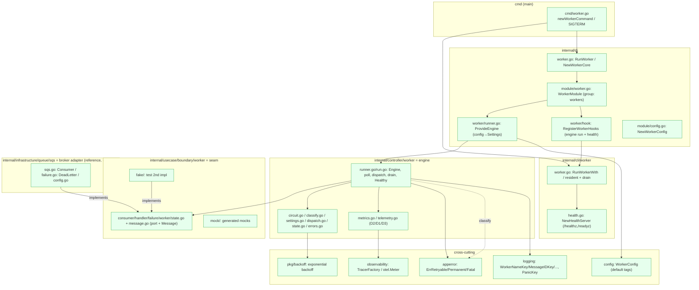
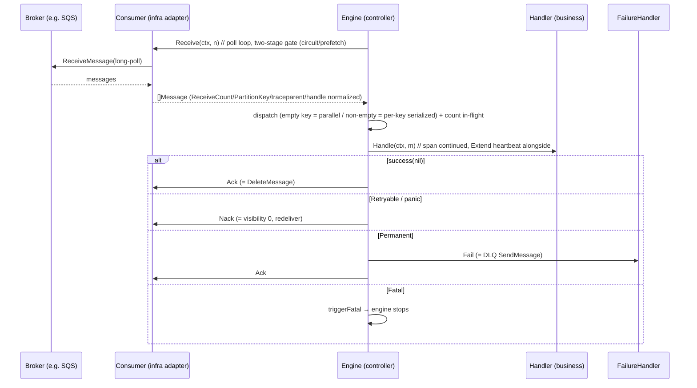
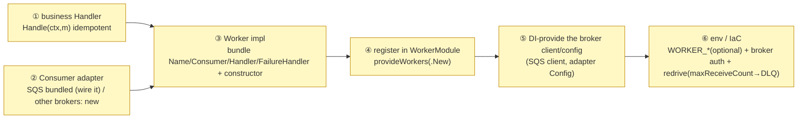

# Worker Subsystem Design Reference

[Worker README](../../internal/controller/worker/README.md) | 日本語: [worker.ja.md](worker.ja.md)

This document consolidates the worker scaffold's **role theory, state transitions, implementation locations, what an integrator must implement, and glossary** into a single reference, derived from a close reading of the implementation. For the overview see the README; for the adoption rationale see the worker ADRs ([ADR-0049 (broker-agnostic-worker-scaffold)](../adr/0049-broker-agnostic-worker-scaffold.md) onward).

---

## 1. Role theory (what, and what for)

A worker is a **"message-in driving adapter," a peer of the HTTP handler**. It is not a new architectural layer but **another entry point into the Usecase layer**, this time via a queue. If HTTP is "the mouth that takes a synchronous request," the worker is "the mouth that takes a message from a pull-ack queue."

Responsibility split (who owns what):

| Component | Layer | Responsibility | Does NOT hold |
| --- | --- | --- | --- |
| **engine** (`Engine`) | controller | transport orchestration: poll / concurrency & ordering / Ack-Nack discipline / circuit / drain / O11Y | business logic, broker-specifics |
| **seam** (`Consumer`/`Handler`/`FailureHandler`/`Worker`/`State`) | usecase/boundary | the contract between the engine and the outside (broker adapters & business) | implementations |
| **Handler** (business) | implemented by the integrator (calls usecases) | per-message business processing (**idempotent**) | ack/nack/redelivery control (engine's job) |
| **Consumer / FailureHandler** (broker adapter) | infrastructure | broker-specific API ↔ broker-agnostic `Message` conversion | business logic, concurrency control |
| **DI / cli / cmd** | di / cli / cmd(main) | composition / subcommand / lifecycle / health listener | business logic |
| **WorkerConfig** | config | engine-core settings (broker-agnostic) | broker-specific settings (adapter side) |

Design principle (invariant): **the engine depends only on the seam and never imports broker implementations** (mechanically enforced by depguard). This lets the engine be **completed against the fake** and have every invariant tested without a real broker.

---

## 2. State transitions

### 2.1 engine lifecycle (`Engine.Run` / `run.loop` / `run.drain`)

### 2.2 circuit breaker (`circuit.go`, B4)

- **Signals**: `onFailure` = handler Retryable failure + poll error / `onSuccess` = handler success + Permanent routed.
- AIMD is not used. cooldown is the exponential backoff from `pkg/backoff` (default 1s → 30s cap).

### 2.3 message processing (`run.process` / `run.handleResult`, A1/A2/A5/A6)

---

## 3. Implementation locations (where in the architecture it lives and acts)

### 3.1 Package placement and dependency direction

> Green = implemented here. Dependencies always point inward (`controller→usecase/boundary`, `infrastructure→usecase/boundary`). The `controller` (engine) does not import `infrastructure` (depguard `maintain_a_sound_controller`).

### 3.2 Per-message action sequence (when a real broker is wired)

---

## 4. What an integrator implements (the parts this project does not provide)

This project provides the **engine, seam, fake, SQS reference adapter, and wiring templates**. To run an actual worker in production, the consumer supplies the following (no worker is registered by default).

| # | Required implementation | Location (recommended) | Reference |
| --- | --- | --- | --- |
| ① | business `Handler` (idempotent, calls usecases) | `internal/controller/worker/<name>/` | `worker.Handler` IF |
| ② | `Consumer` (+ `FailureHandler`) adapter | wire `infrastructure/queue/sqs` for SQS / new package otherwise | `sqs.NewConsumer` / `NewDeadLetter` |
| ③ | `Worker` (returns Name/Consumer/Handler/FailureHandler) + `New(...)` | `internal/controller/worker/<name>/` | `worker.Worker` IF |
| ④ | add the constructor to `provideWorkers(...)` in `WorkerModule()` | `internal/di/module/worker.go` | same shape as `provideJobs` |
| ⑤ | `fx.Provide` the broker client and adapter `Config` | `internal/di/...` | `sqs.Config` |
| ⑥ | env (`WORKER_*` have defaults, override optional) / broker auth / DLQ & redrive (IaC) | `env/` & IaC | `CONSUMER_QUEUE_*` / `WorkerConfig` defaults |

> `CONSUMER_QUEUE_*` names *a* consumer queue, not *the* consumer queue — it is sized for the one worker shipped here. A second worker consuming a different queue gets its own prefix carrying the worker's name (`<WORKER_NAME>_QUEUE_*`); do not overload the existing one. `WORKER_*` stays shared, because engine-core settings are broker-agnostic and per-process.

<!-- sample-api:begin -->
> A worked example of all six ships as part of the removable sample set: `internal/controller/worker/withdrawalarchive` consumes the withdrawal event the outbox emits and archives it to object storage. `make setup-remove-sample-api` removes it and leaves `provideWorkers()` empty again.
<!-- sample-api:end -->

> A wired broker adapter links its SDK into the binary, and `serve` / `worker` / `outbox-relay` share one binary, so linkage cannot be scoped to the role that consumes a queue. Isolation is therefore defined over **coupling**: a concrete broker is named only by its adapter package and the wiring that selects it (E3, [ADR-0052 (broker-sdk-isolation-measured-as-coupling)](../adr/0052-broker-sdk-isolation-measured-as-coupling.md)).

---

## 5. Glossary

| Term | Meaning |
| --- | --- |
| **seam** | The port set that forms the boundary between the engine and the outside (broker adapters & business Handler). `internal/usecase/boundary/worker`. |
| **port** | The interfaces that make up the seam: `Consumer` / `Handler` / `FailureHandler` / `Worker` / `State`. |
| **Message** | The broker-agnostic message envelope (`ID`/`Body`/`Attributes`/`ReceiveCount`/`PartitionKey`). |
| **PartitionKey** | The normalization key that serializes the same key (empty = parallel). The adapter fills it from a broker value (e.g. SQS MessageGroupId). |
| **ReceiveCount** | Redelivery count. Used for poison detection (A7). |
| **reserved key (`_receipt_handle`)** | A `_`-prefixed key that isolates broker-specific handle/lease in `Attributes`. The engine passes it through without interpreting it. |
| **`event_type` attribute** | The `Attributes` key under which an adapter surfaces the event kind, so a `Handler` can decide whether a message is its own before decoding the body. Permanent seam vocabulary, not sample-specific: one queue carrying several kinds is a property of the pull-ack model, not of the bundled example, so it survives `make setup-remove-sample-api` like the rest of the seam. |
| **engine** | The driving adapter that runs the selected worker via pull-ack (`controller/worker.Engine`). |
| **poll loop** | The single goroutine that drives `Receive`. It has a two-stage gate (circuit and prefetch). |
| **dispatch** | Routes received messages to processing units. Empty key = parallel, non-empty = per-key serialized. |
| **in-flight / prefetch (`MaxInFlight`)** | The cap on received-but-unsettled (pre Ack/Nack) messages. Do not Receive more than can be handled (B2). |
| **concurrency (`Concurrency`)** | The cap on concurrent `Handle` executions (B1). |
| **circuit breaker** | The 3-state machine (Closed/Open/HalfOpen) that stops intake on continued downstream failure (B4). |
| **cooldown** | How long it stays Open. Grows per trip via the exponential backoff in `pkg/backoff`. |
| **Ack / Nack / Extend** | Confirm-and-delete / return for redelivery / extend lease (visibility). Methods of the Consumer port. |
| **Retryable / Permanent / Fatal** | Error classification sentinels (`apperror`). Nack-redeliver / route to FailureHandler then Ack / stop the engine. |
| **FailureHandler / DeadLetter / DLQ** | The dead-letter seam for permanent failures / its SQS implementation / the dead-letter queue. |
| **redrive** | The SQS IaC setting that auto-sends to the DLQ past `maxReceiveCount`. The app's general path is the FailureHandler. |
| **drain (`DrainTimeout`)** | On stop, wait for in-flight up to a deadline. Unfinished messages are not Acked = redelivered. |
| **readiness / liveness / health listener** | A plain net/http that serves `/readyz` (`Healthy()` = progress within `ProgressStaleAfter`) and `/healthz`. |
| **Settings** | The engine-core behavior settings (an engine-local struct). Mapped from `config.WorkerConfig` via DI. |
| **WorkerConfig** | The engine-core settings (broker-agnostic, `WORKER_*` with `default` tags). Broker-specific settings live in the adapter `Config`. |
| **traceparent / continuation** | W3C trace context. `Extract`ed from `Message.Attributes` to continue the span (D1). |
| **E1/E2/E3** | engine does not import infra / engine is green on the fake alone / knowledge of a concrete broker is confined to its adapter package and the wiring that selects it — no core `*.go` and no core document names a broker adapter ([ADR-0052 (broker-sdk-isolation-measured-as-coupling)](../adr/0052-broker-sdk-isolation-measured-as-coupling.md)). |
