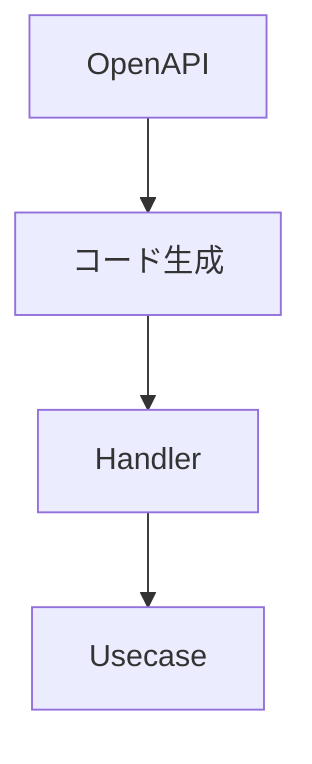
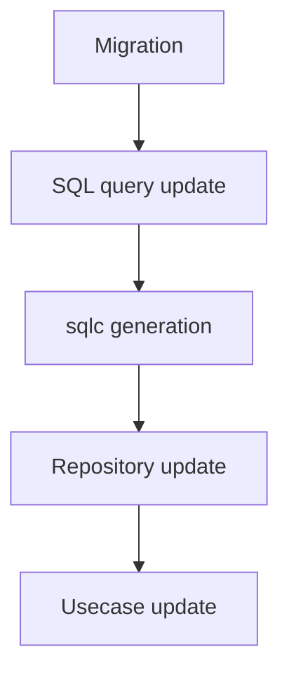
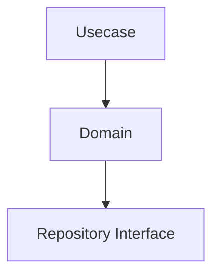

# 開発ワークフロー

このドキュメントでは、このプロジェクトで使用される **標準的な開発フロー** を説明します。

これらのワークフローは、アーキテクチャの整合性を維持し、  
生成コードが常にソース定義と同期されることを保証するために存在します。

## API変更フロー

APIエンドポイントを変更する場合は、以下の順序 **必ず従う必要があります**。

### API変更手順

1. `openapi/` にある OpenAPI 定義を更新する  
2. APIコードを再生成する  
3. handler を実装または更新する  
4. usecase ロジックを実装または更新する  



### API変更時の注意

- OpenAPI は **API契約の唯一のソース（Source of Truth）** です
- 生成されたファイルを **手動で編集してはいけません**

## データベース変更フロー

データベース変更は、SQL と生成コードの整合性を保つために  
厳密な順序で行う必要があります。

### データベース変更手順

1. 新しい migration ファイルを作成する  
2. SQL クエリを追加または更新する  
3. `sqlc` コードを再生成する  
4. 必要に応じて repository 実装を更新する  
5. 必要に応じて usecase を更新する  



### データベース変更時の注意

- SQL ファイルは **契約（Contract）** として扱われます
- `sqlc` によって生成されたコードを **手動で編集してはいけません**

## ビジネスロジック変更フロー

アプリケーションの振る舞いを変更する場合、  
通常は以下の順序で変更を行います。

### ビジネスロジック変更手順

1. usecase ロジックを更新する  
2. 必要に応じて domain ロジックを更新する  
3. データアクセスが変わる場合は repository interface を更新する  



外部連携やデータベース処理に変更がない限り、  
Infrastructure の変更は **不要な場合が多い** です。

## コード生成

このプロジェクトでは、API とデータベースアクセスに  
コード生成を利用しています。

## APIコード生成

```sh
make gen-api
```

OpenAPI 定義からサーバインターフェースと型定義を生成します。

## SQLコード生成

```sh
make gen-query
```

`sqlc` を使用して SQL クエリから型安全な Go コードを生成します。

## 生成コードのルール

生成されたファイルは **手動で編集することを想定していません**。

ルール：

- 生成ファイルを変更してはいけません
- ソース定義を変更した場合は必ず再生成してください
- CI によって生成コードの整合性が検証される場合があります

生成コードを変更する必要がある場合は、  
**生成元の定義を変更してください。**

例：

|生成コード|ソース|
|---|---|
|API server code|OpenAPI specification|
|SQL query bindings|SQL files|

## 典型的な機能開発フロー

一般的な機能開発は、以下の順序で進めます。

1. API 定義（OpenAPI）
2. Usecase 実装
3. 必要に応じて Repository 実装
4. Handler 実装
5. テスト追加

この順序により、

- API契約
- ドメインロジック

の整合性が維持されます。

## CI と構造的安全性

CI はアーキテクチャ整合性を維持する役割を持ちます。

代表的なチェック：

- コード生成の整合性確認
- Lint チェック
- ビルド検証

これにより、アーキテクチャの逸脱を防ぎ、プロジェクトの再現性を保ちます。

## AI支援開発

上記のフローは、**通常 AI アシスタントと共に実行されます**。それがこのリポジトリの標準経路であり、再利用可能な手順は読者が毎回導出し直す散文ではなく `.claude/skills/`（および対応する `.codex/skills/`）のスキルとして成文化されています。レイヤの scaffold、変更のレビュー、コミット、プルリクエストの作成、spec の検証は、それぞれスキルを持ちます。

同じフローを手で実行することも可能で、禁止もされていません。それは互換経路です。手順はここに書かれたとおりですが、本来それを駆動するスキルは手元に無く、同等の手動ツールも並行して保守されません。[ADR-0007 (agents-md-operational-contract)](adr/0007-agents-md-operational-contract.ja.md) を参照してください。

どちらの経路でもワークフロー自体は無条件です。AI 支援で生成したコードも、以下を守る必要があります。

- OpenAPI-first ワークフロー
- SQL-first データアクセス
- レイヤ分離ルール

AIエージェントはコード生成前に、必ず以下のドキュメントを参照してください。

- `architecture.ja.md`
- `rules.ja.md`

フローの結果が機械的に決定可能な場面 — 生成物のドリフト、レイヤ間 import、lint、テスト — では、`## CI と構造的安全性` の検査が答えを決めます。エージェントが何をしたと述べたかではありません。

## Summary

この開発フローは以下を保証します。

- API契約の一貫性
- 安全なデータベースマイグレーション
- 予測可能なコード生成
- アーキテクチャ整合性
