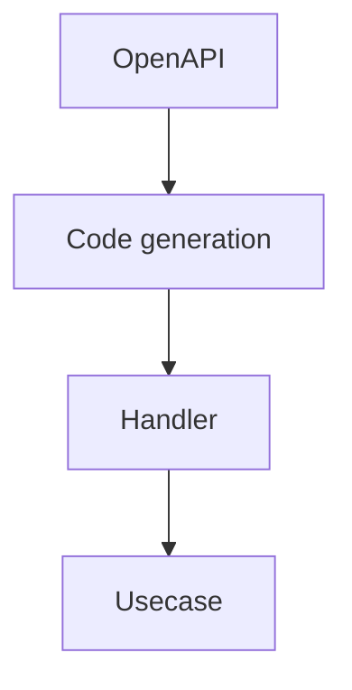
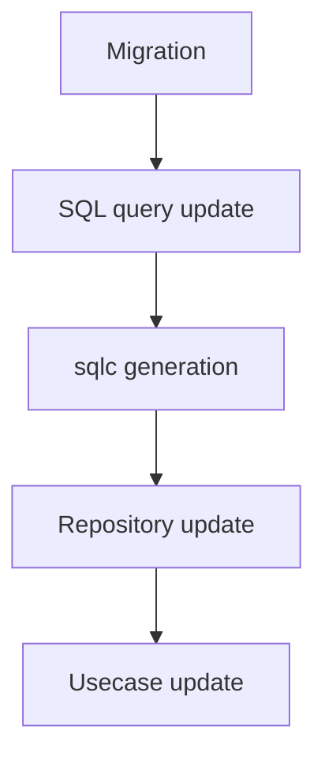
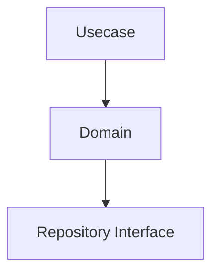

# Development Workflow

This document describes the **standard development workflow** used in this project.

These workflows exist to maintain architectural consistency and ensure that  
generated code is always synchronized with source definitions.

## API Change Flow

When modifying API endpoints, you **must follow** the steps below.

### API Change Steps

1. Update the OpenAPI definition in `openapi/`  
2. Regenerate API code  
3. Implement or update the handler  
4. Implement or update the usecase logic  



### Notes for API Changes

- OpenAPI is the **single source of truth for API contracts**
- Generated files **must not be edited manually**

## Database Change Flow

Database changes must follow a strict sequence to maintain  
consistency between SQL and generated code.

### Database Change Steps

1. Create a new migration file  
2. Add or update SQL queries  
3. Regenerate `sqlc` code  
4. Update repository implementation if needed  
5. Update usecase if needed  



### Notes for Database Changes

- SQL files are treated as **contracts**
- Code generated by `sqlc` **must not be edited manually**

## Business Logic Change Flow

When changing application behavior, follow this typical order:

### Business Logic Change Steps

1. Update usecase logic  
2. Update domain logic if necessary  
3. Update repository interface if data access changes  



If there are no changes to external integrations or database logic,  
Infrastructure changes are **often unnecessary**.

## Code Generation

This project uses code generation for both API and database access.

## API Code Generation

```sh
make gen-api
```

Generates server interfaces and type definitions from the OpenAPI specification.

## SQL Code Generation

```sh
make gen-query
```

Generates type-safe Go code from SQL queries using `sqlc`.

## Rules for Generated Code

Generated files are **not intended to be edited manually**.

Rules:

- Do not modify generated files
- Always regenerate after changing source definitions
- CI may validate consistency of generated code

If you need to modify generated behavior,  
**change the source definitions instead**.

Examples:

|Generated Code|Source|
|---|---|
|API server code|OpenAPI specification|
|SQL query bindings|SQL files|

## Typical Feature Development Flow

A typical feature development proceeds in the following order:

1. Define API (OpenAPI)
2. Implement usecase
3. Implement repository if needed
4. Implement handler
5. Add tests

This order ensures consistency between:

- API contracts
- Domain logic

## CI and Structural Safety

CI plays a role in maintaining architectural integrity.

Typical checks:

- Code generation consistency
- Lint checks
- Build validation

These mechanisms prevent architectural violations and ensure reproducibility.

## AI-assisted Development

AI-assisted development is supported, but  
the development workflow must always be followed.

AI-generated code must comply with:

- OpenAPI-first workflow
- SQL-first data access
- Layer separation rules

Before generating code, AI agents must refer to:

- `architecture.ja.md`
- `rules.ja.md`

## Summary

This development workflow ensures:

- Consistent API contracts
- Safe database migrations
- Predictable code generation
- Architectural integrity
