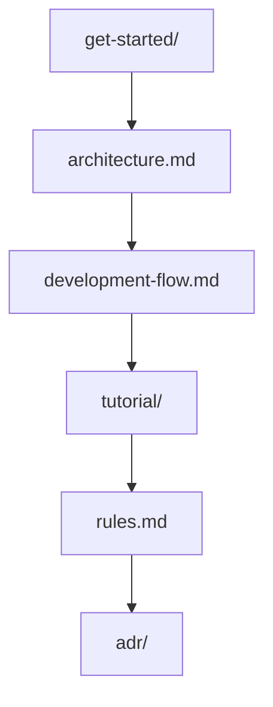
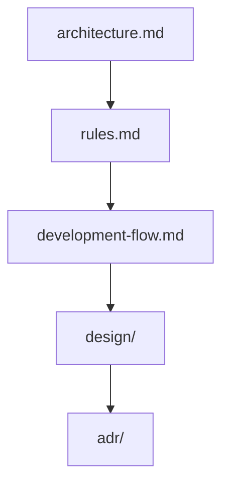
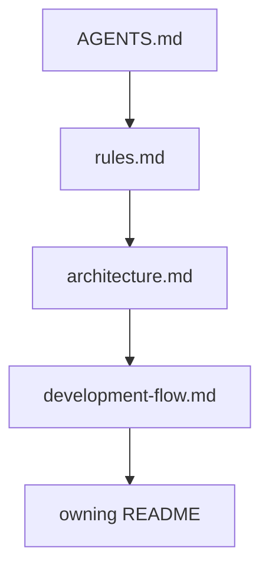
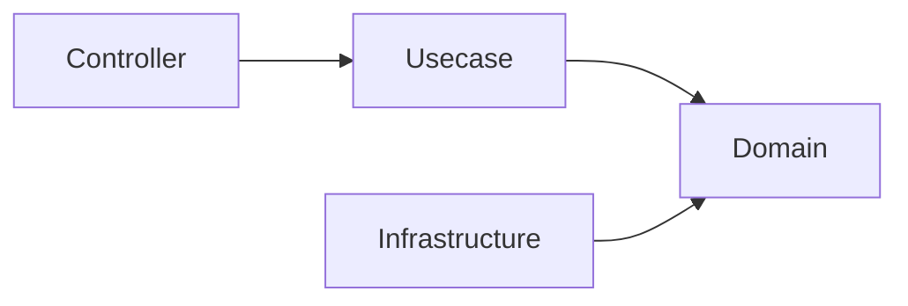
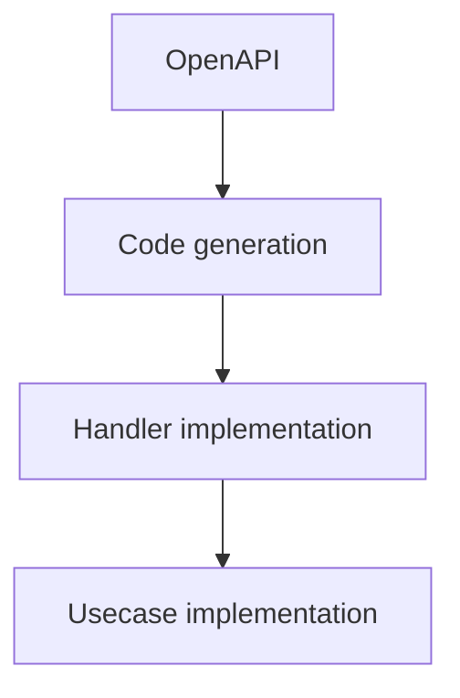
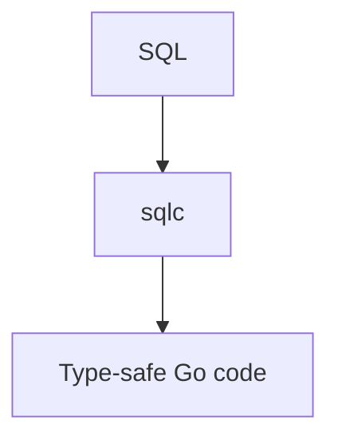
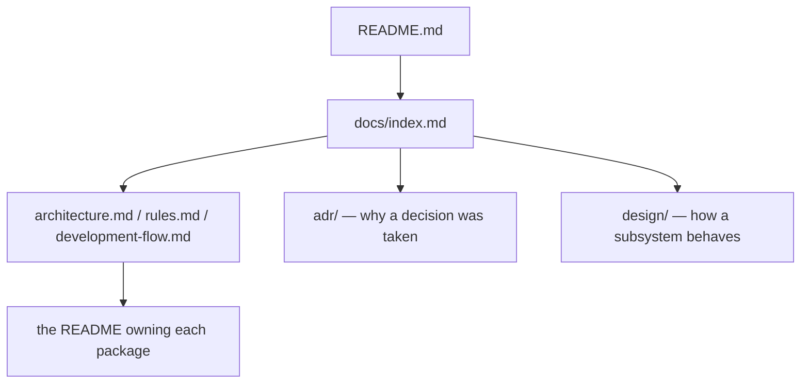

# Documentation

English | [日本語](./ja/index.ja.md)

This directory contains documentation related to the architecture and development of this project.

These documents explain the **design philosophy, architectural rules, and development workflows** adopted in this project.

The documentation is intended for both **human developers** and **AI agents**. AI-assisted
development is this project's standard path, so these documents are written to be read by an
agent as well as by a person; see [ADR-0007 (agents-md-operational-contract)](adr/0007-agents-md-operational-contract.md).

## Document List

### Root documents

|Document|Description|
|--------|--------|
|[architecture.md](architecture.md)|Overall system architecture and layer responsibilities|
|[rules.md](rules.md)|Architectural rules that must not be violated|
|[development-flow.md](development-flow.md)|Standard development workflow|
|[testing-conventions.md](testing-conventions.md)|Test structure, naming, assertions, and coverage exceptions|
|[decisions.md](decisions.md)|Redirect stub — the decision log now lives in `adr/`|

### Sections

|Section|Description|
|--------|--------|
|[adr/](adr/README.md)|Architecture Decision Records — one record per decision, with the technology rationale|
|[design/](design/README.md)|Subsystem design references — rest / worker / job / outbox / idempotency / observability / auth / security / context-map / agent-environment|
|[get-started/](get-started/setup-repository.md)|Setup performed once before development starts, and the troubleshooting index for when it does not go smoothly|
|[tutorial/](tutorial/build-user-feature.md)|Worked example — one feature built end to end|
|[spec/](spec/glossary.md)|Feature specifications and the business-vocabulary glossary|
|[project/](project/scope.md)|Scope, out-of-scope, maintenance policy, versioning, direction|
|[plan/](plan/distributed-ready-architecture.md)|Requirements for a release line that has not been built yet <!-- boilerplate-only:line -->|
|[reference/](reference/dependencies.md)|Living inventories that track the code, such as the direct dependency list|
|[maintenance/](maintenance/docs-structure.md)|Operational runbooks — documentation structure, local environment, DB worktree pool, upgrades|
|[deployment/](deployment/github-page.md)|Deployment procedures|

Japanese translations live under `ja/` mirroring this structure, and the remaining
subdirectories (`openapi/`, `godoc/`, `coverage/`, `db-schema/`, `portal/`) hold generated
output rather than documents to read. The rules that keep this layout generatable are in
[maintenance/docs-structure.md](maintenance/docs-structure.md).

## Recommended Reading Order

### New Developers

### Maintainers / Contributors

### AI Agents

## Key Concepts

This project is built on several important design principles.

### Onion Architecture

The system follows the layered structure below.

Dependencies must always point **toward inner layers**.

### OpenAPI-first Development

API contracts are defined using **OpenAPI**.

Implementation must always follow the contract definition.

### SQL-first Data Access

Data access is designed around **SQL rather than ORM**.

### Structural Safety

This project prioritizes **structural safety over convention**.

Instead of relying on implicit rules or manual reviews, safety is enforced through:

- Layer separation
- Code generation
- CI checks
- Lint rules

## AI-assisted Development

**AI-assisted development is the standard path of this project**, and the documentation, skills, and
automation here are built for it. Manual development stays available as a not-recommended
compatibility path that is not held to the same developer experience.

The application is a separate question: runtime, build, test, the domain model, the API contract, the
database schema, and the ordinary CI checks never depend on an AI service. See
[architecture.md](architecture.md) § *AI-assisted Development*.

Constraints are intentionally introduced to prevent architectural violations, and a deterministic
check outranks an agent's judgment wherever one exists.

Before generating code, AI agents must refer to:

- [`AGENTS.md`](../AGENTS.md) — the operational contract: what may be touched and how to behave
- [`rules.md`](rules.md)
- [`architecture.md`](architecture.md)
- the `README.md` nearest to the code being changed

How those instructions, the mechanical gates, and independent review fit together is described in
[design/agent-environment.md](design/agent-environment.md).

## Relationship with Other Documents

The overall structure of the documentation is as follows:

`README.md` explains the project overview, while `docs/` holds the detailed design documents and
each package `README.md` holds the contract local to that package.

## Contribution Guide

When making changes to this project, follow these rules:

1. Follow the architectural rules defined in `rules.md`  
2. Follow the development workflow described in `development-flow.md`  
3. Maintain consistency with the structure described in `architecture.md`  

If architectural changes are required, update the related documentation accordingly.

## Philosophy of This Project

This project aims to make backend development **safe and maintainable**.

It does not enforce a single “correct” architecture,  
but instead provides a **structured baseline** that teams can extend and adapt as needed.
