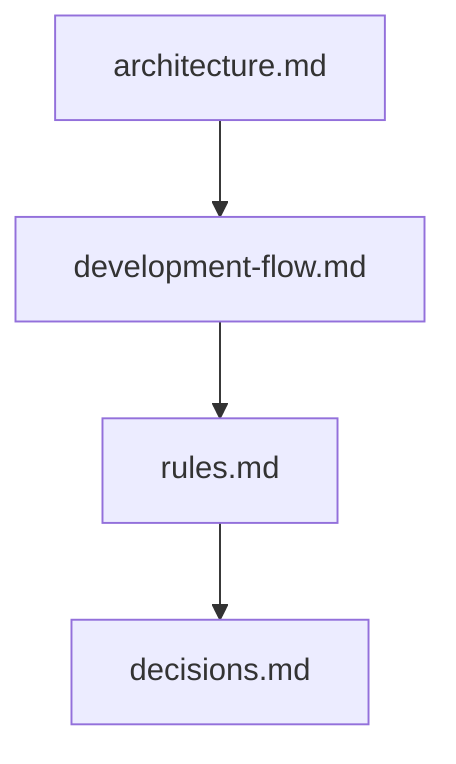
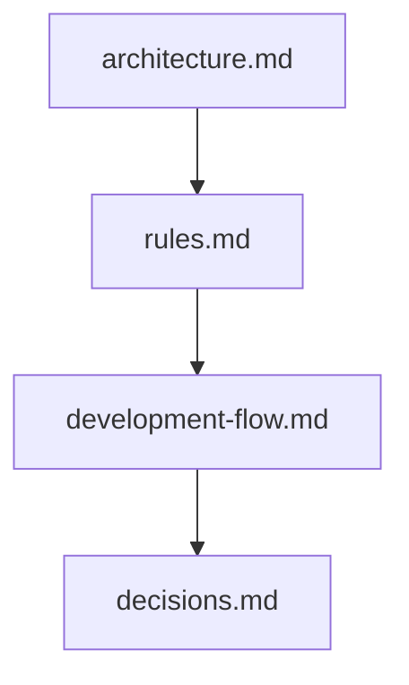
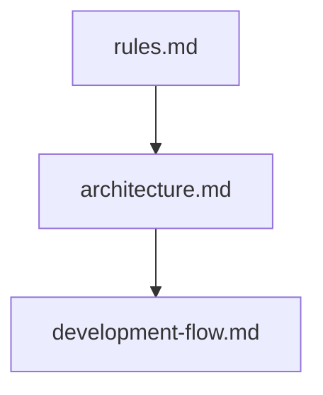
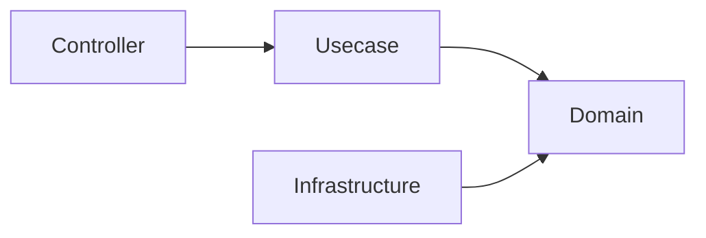
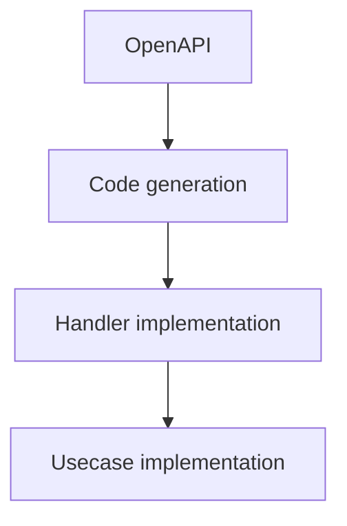
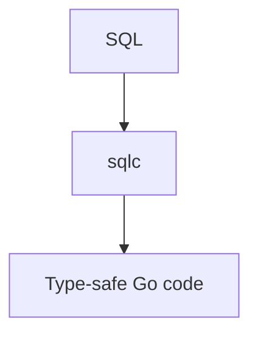
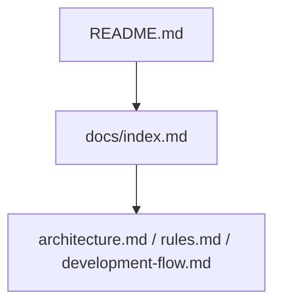

# Documentation

[English](../index.md) | Japanese

This directory contains documentation related to the architecture and development of this project.

These documents explain the **design philosophy, architectural rules, and development workflows** adopted in this project.

The documentation is intended for both **human developers** and **AI agents**.

## Document List

|Document|Description|
|--------|--------|
|[architecture.md](architecture.md)|Overall system architecture and layer responsibilities|
|[rules.md](rules.md)|Architectural rules that must not be violated|
|[development-flow.md](development-flow.md)|Standard development workflow|
|[decisions.md](decisions.md)|Background of technology selection and design decisions|

## Recommended Reading Order

### New Developers

### Maintainers / Contributors

### AI Agents

## Key Concepts

This project is built on several important design principles.

### Onion Architecture

The system follows the layered structure below.

Dependencies must always point **toward inner layers**.

### OpenAPI-first Development

API contracts are defined using **OpenAPI**.

Implementation must always follow the contract definition.

### SQL-first Data Access

Data access is designed around **SQL rather than ORM**.

### Structural Safety

This project prioritizes **structural safety over convention**.

Instead of relying on implicit rules or manual reviews, safety is enforced through:

- Layer separation
- Code generation
- CI checks
- Lint rules

## AI-assisted Development

This project is designed to work safely with **AI-assisted development tools**.

Constraints are intentionally introduced to prevent architectural violations.

Before generating code, AI agents must refer to:

- `rules.md`
- `architecture.md`

## Relationship with Other Documents

The overall structure of the documentation is as follows:

`README.md` explains the project overview,  
while the `docs/` directory contains detailed design documents.

## Contribution Guide

When making changes to this project, follow these rules:

1. Follow the architectural rules defined in `rules.md`  
2. Follow the development workflow described in `development-flow.md`  
3. Maintain consistency with the structure described in `architecture.md`  

If architectural changes are required, update the related documentation accordingly.

## Philosophy of This Project

This project aims to provide a **safe and maintainable starting point for backend development**.

It does not enforce a single “correct” architecture,  
but instead provides a **structured baseline** that teams can extend and adapt as needed.
