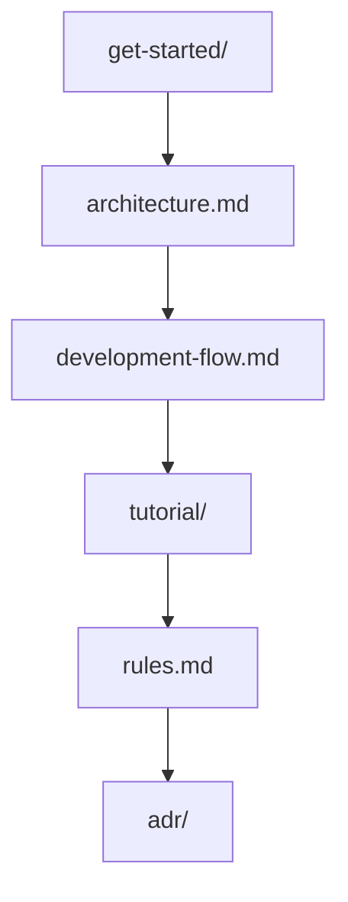
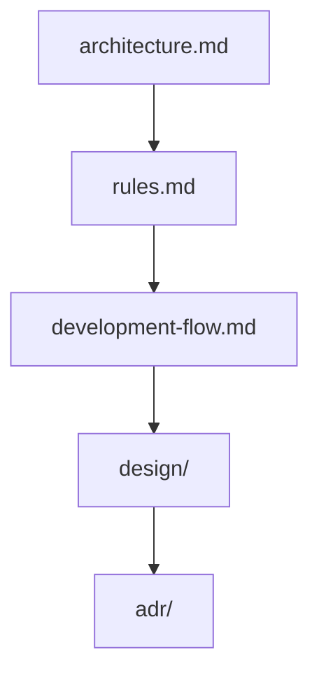
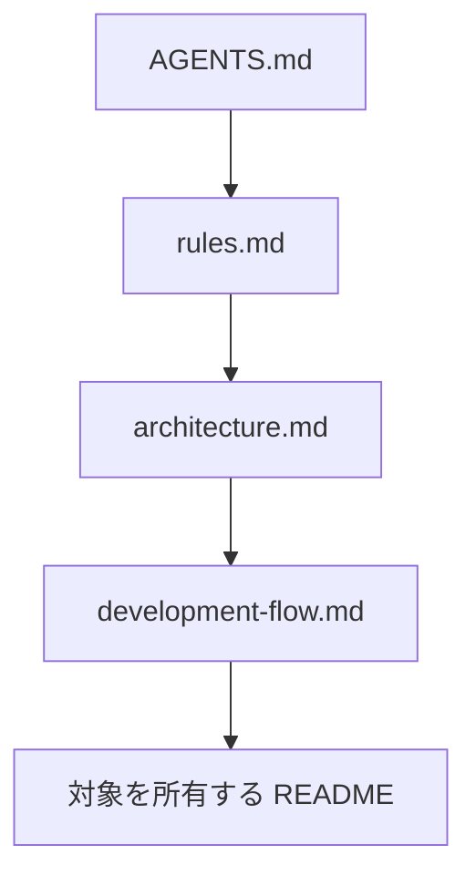
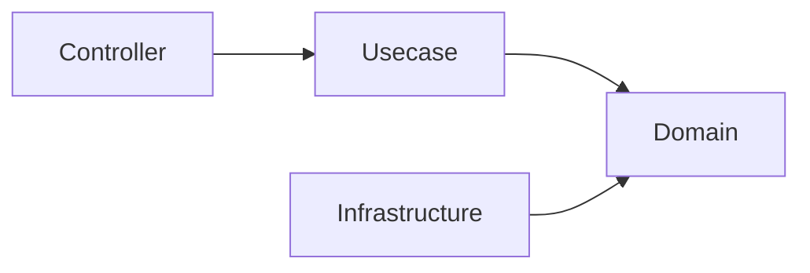
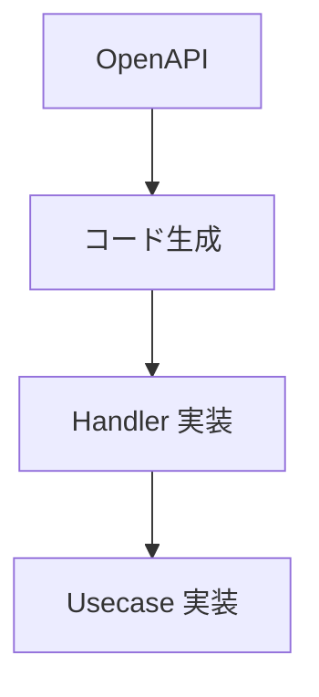
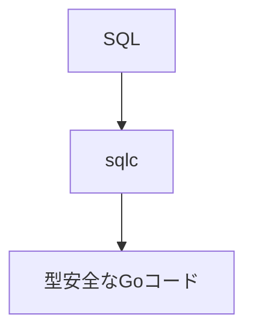
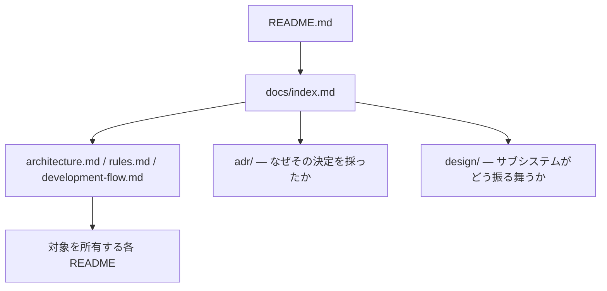

# ドキュメント

このディレクトリには、このプロジェクトのアーキテクチャおよび開発に関するドキュメントが含まれています。

これらのドキュメントでは、このプロジェクトで採用されている **設計思想、アーキテクチャルール、開発フロー** を説明しています。

ドキュメントは **人間の開発者** と **AIエージェント** の両方を対象としています。AI 支援開発は
本プロジェクトの標準経路であるため、これらの文書は人間だけでなくエージェントが読むことも前提に
書かれています。[ADR-0007 (agents-md-operational-contract)](adr/0007-agents-md-operational-contract.md) を参照してください。

## ドキュメント一覧

### ルート直下のドキュメント

|ドキュメント|説明|
|--------|--------|
|[architecture.md](architecture.md)|システム全体のアーキテクチャとレイヤ責務|
|[rules.md](rules.md)|破ってはいけないアーキテクチャルール|
|[development-flow.md](development-flow.md)|標準的な開発フロー|
|[testing-conventions.md](testing-conventions.md)|テストの構造・命名・アサーション・カバレッジ例外|
|[decisions.md](decisions.md)|リダイレクトのみ — 決定ログは `adr/` へ移動済み|

### セクション

|セクション|説明|
|--------|--------|
|[adr/](adr/README.md)|アーキテクチャ決定記録（ADR）— 1 決定 1 レコード。技術選定の根拠|
|[design/](design/README.md)|サブシステム設計リファレンス — rest / worker / job / outbox / idempotency / observability / auth / security / context-map / agent-environment|
|[get-started/](get-started/setup-repository.md)|開発を始める前に一度だけ行うセットアップと、うまくいかないときのトラブルシューティング索引|
|[tutorial/](tutorial/build-user-feature.md)|実例 — 1 つの機能を端から端まで作る <!-- sample-api:line -->|
|[spec/](spec/glossary.md)|機能仕様と業務語彙の用語集|
|[project/](project/scope.md)|スコープ・対象外・メンテナンス方針・バージョニング・方向性|
|[plan/](plan/distributed-ready-architecture.md)|まだ着手していないリリース線の要件 <!-- boilerplate-only:line -->|
|[reference/](reference/dependencies.md)|コードに追随する目録（直接依存の一覧など）|
|[maintenance/](maintenance/docs-structure.md)|運用 runbook — ドキュメント構造・ローカル環境・DB worktree プール・アップグレード|
|[deployment/](deployment/github-page.md)|デプロイ手順|

正本は `docs/` 直下の英語版で、このディレクトリはその構造を写した対訳です。`spec/` は日本語で書かれた
正本なので対訳を持ちません。残る `openapi/` `godoc/` `coverage/` `db-schema/` `portal/` は読むための
ドキュメントではなく生成物です。この構造を生成可能に保つための規則は
[maintenance/docs-structure.md](maintenance/docs-structure.md) にあります。

## 推奨読書順

### 新しく参加する開発者

### メンテナ / コントリビューター

### AIエージェント

## 主要コンセプト

このプロジェクトは、いくつかの重要な設計原則に基づいて構築されています。

### Onion Architecture

システムは以下のレイヤ構造に従っています。

依存関係は常に **内側のレイヤへ向かう** 必要があります。

### OpenAPI-first 開発

API契約は **OpenAPI** によって定義されます。

実装は必ず契約定義に従って行われます。

### SQL-first データアクセス

データアクセスは ORM ではなく **SQLを中心に設計**されています。

### 構造的安全性（Structural Safety）

このプロジェクトでは **慣習よりも構造による安全性** を重視しています。

暗黙のルールや人のレビューに依存するのではなく、以下によって安全性を担保します。

- レイヤ分離
- コード生成
- CIチェック
- Lintルール

## AI支援開発

**AI 支援開発は本プロジェクトの標準経路であり**、ここにあるドキュメント・スキル・自動化はそれを前提に
作られています。手動開発は、同等の開発者体験を保証しない推奨されない互換経路として利用可能なまま残します。

アプリケーションは別の話です。ランタイム、ビルド、テスト、ドメインモデル、API 契約、データベース
スキーマ、通常の CI 検査が AI サービスへ依存することはありません。[architecture.md](architecture.md)
§ *AI支援開発* を参照してください。

制約はアーキテクチャ違反を防ぐために意図的に導入されており、決定論的な検査が存在する場面では
その判定がエージェントの判断に優先します。

アーキテクチャ違反を防ぐために、意図的に制約が設けられています。

AIエージェントはコード生成を行う前に、必ず以下のドキュメントを参照してください。

- [`AGENTS.md`](../AGENTS.md) — 何に触れてよく、どう振る舞うべきかを定める運用契約
- [`rules.md`](rules.md)
- [`architecture.md`](architecture.md)
- 変更対象のコードに最も近い `README.md`

これらの指示・機械的ゲート・独立レビューがどう噛み合うかは
[design/agent-environment.md](design/agent-environment.md) が説明します。

## 他ドキュメントとの関係

ドキュメントの全体構造は以下の通りです。

`README.md` はプロジェクトの概要を説明し、`docs/` には詳細な設計ドキュメントが、各パッケージの
`README.md` にはそのパッケージに閉じた契約が格納されています。

## コントリビューションガイド

このプロジェクトに変更を加える場合は、以下のルールに従ってください。

1. `rules.md` に定義されたアーキテクチャルールを遵守する  
2. `development-flow.md` に記載された開発フローに従う  
3. `architecture.md` に記載された構造と整合性を保つ  

アーキテクチャ変更が必要な場合は、関連するドキュメントも更新してください。

## このプロジェクトの思想

このプロジェクトは、バックエンド開発を **安全で保守しやすいもの** にすることを目的としています。

特定の「唯一の正しいアーキテクチャ」を強制するものではなく、  
チームが必要に応じて拡張・調整できる **構造化されたベースライン** を提供します。
