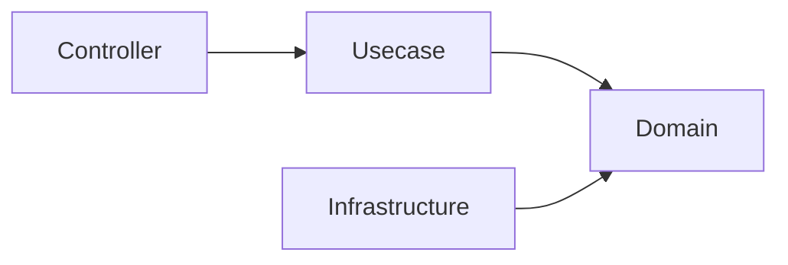

# ADR-0002: 実用的なオニオンアーキテクチャを採用する

English canonical: [0002-onion-architecture.md](../../adr/0002-onion-architecture.md)

## ステータス

accepted

## 背景

このプロジェクトは、インフラストラクチャとフレームワークの選択からビジネスロジックを独立させる必要がある。インフラストラクチャが交換可能（[ADR-0001](0001-avoid-lock-in.ja.md) 参照）であり、ドメインコアが長期にわたって安定してテスト可能であり続けるためである。主要な設計目標は、保守性・構造的安全性・型安全性・交換可能なインフラストラクチャ・長期的な運用性であり、生のパフォーマンスや最小限の抽象化ではない。

## 決定

**実用的なオニオンアーキテクチャ** を採用する。依存関係は内側を向く:

ドメインレイヤーはフレームワーク・インフラストラクチャ・外部システムへの依存を持たない; インフラストラクチャはドメインが定義したインターフェースを実装する。これは同心円レイヤーの概念を意図的に簡略化した形であり、追加の抽象レイヤーを持つ完全なクリーンアーキテクチャではない。

## 影響

### ポジティブな影響

- 責務の明確な分離。
- テストの容易さ（ドメインコアは純粋であり、テストにインフラストラクチャを必要としない）。
- ドメインインターフェースの背後で交換可能なインフラストラクチャ。
- 外部の変化から隔離された安定したドメインコア。
- 純粋なドメイン層とユースケース層が「移植可能なコア」となり、将来のリプレイスを現実的にする。
  Go のままなら実質この 2 層の引っ越しで済み、別言語への移行でもドメイン＋ユースケースの
  解析／移植に帰着する（両層はフレームワークやインフラに結合していないため）。これがオニオンを
  ロックイン回避（[ADR-0001](0001-avoid-lock-in.ja.md)）と組み合わせる理由である。

### ネガティブな影響

- フラットな構造よりも多くのレイヤーとマッピング（境界での DTO ↔ エンティティ変換）が必要になる。
- コントリビューターは依存方向の規律を学ばなければならない; これはレビューに任せるのではなく CI（depguard）で強制される。

## 検討した代替案

### レイヤード MVC

シンプルだが、ドメインロジックとインフラストラクチャロジックが混在しがちで、このプロジェクトが優先する安定したコアが侵食される。また、ビジネスロジックが特定のレイヤーに集中する Fat Model や Fat Usecase になりやすく、このアーキテクチャがドメイン・ユースケース・インフラストラクチャに明確な責務を割り当てることで回避している問題でもある。

### クリーンアーキテクチャ

概念的には非常に類似しているが、追加の抽象レイヤーを導入する傾向がある。このプロジェクトはより実用的で簡略化されたバージョンを採用する。

## 補足

- [`docs/rules.md`](../rules.ja.md) のレイヤー依存関係ルール（依存関係は内側を向く; ドメインの純粋性; DTO/型境界変換）によって強制される。これらはこの決定の日々の *帰結* である。
- `docs/decisions.md`（§「なぜオニオンアーキテクチャか」）から移行。
