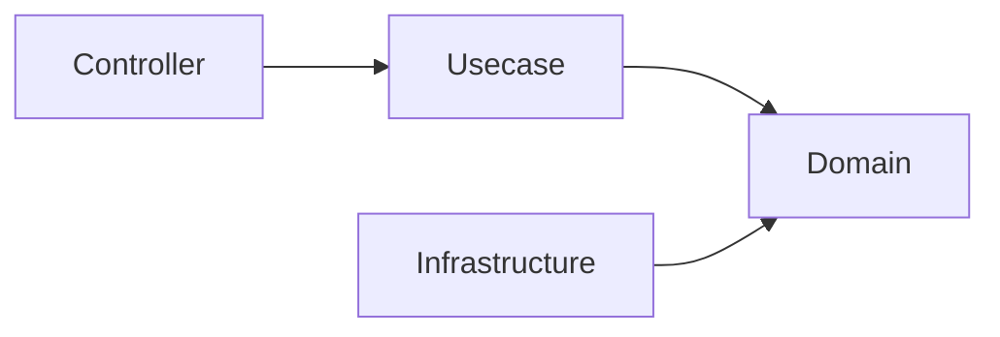

# アーキテクチャ決定事項

このドキュメントでは、このプロジェクトで採用されている **技術選定の理由** を説明します。

ここでの目的は、これらの技術が常に最良であると主張することではなく、  
**なぜこのアーキテクチャにおいて採用されたのか** を明確にすることです。

これらの技術選定は、以下の設計目標に基づいて行われています。

## 設計目標

このプロジェクトは以下を優先しています。

- 保守性（Maintainability）
- 構造的安全性（Structural safety）
- 型安全性（Type safety）
- インフラの交換可能性（Replaceable infrastructure）
- 長期運用性（Long-term operability）

パフォーマンスや抽象化の最小化は、  
このテンプレートの **主要な目的ではありません**。

## なぜ Onion Architecture なのか

### Intent（Onion Architecture）

ビジネスロジックをインフラやフレームワーク依存から分離するため。

### Decision（Onion Architecture）

このプロジェクトでは **Pragmatic Onion Architecture** を採用しています。

この構造では、依存関係の方向が以下のように強制されます。

Domain レイヤは外部システムから独立した状態を保ちます。

### Benefits（Onion Architecture）

- 責務の明確な分離
- テストの容易性
- インフラの交換可能性
- 安定したドメインコア

### Alternatives Considered（Onion Architecture）

#### Layered MVC

シンプルですが、ドメインロジックとインフラロジックが混在しやすい構造です。

#### Clean Architecture

概念的には非常に近いですが、  
追加の抽象レイヤが導入されることが多い傾向があります。

本プロジェクトでは **より実用的な簡略版** を採用しています。

## なぜ OpenAPI-first なのか

### Intent（OpenAPI-first）

実装より前に API 契約を明確に定義するため。

### Decision（OpenAPI-first）

API仕様は **OpenAPI** を使用して定義し、  
`oapi-codegen` を使ってサーバコードを生成します。

### Benefits（OpenAPI-first）

- API契約の明確化
- 型安全なリクエスト/レスポンス構造
- フロントエンドとの整合性
- APIドキュメントの自動生成

### Alternatives Considered（OpenAPI-first）

#### Code-first API

コードから OpenAPI を生成する方法は、  
API契約が不明確になりやすい問題があります。

#### GraphQL-first

GraphQL は強力ですが、一般的なバックエンドサービスでは複雑性が高くなる場合があります。

## なぜ SQL-first なのか

### Intent（SQL-first）

SQL を ORM の裏側に隠すのではなく、**契約として明示的に扱うため**。

### Decision（SQL-first）

クエリは SQL で直接記述し、`sqlc` によって Go コードを生成します。

### Benefits（SQL-first）

- クエリの完全な制御
- パフォーマンス特性の明確化
- 明示的なデータアクセスパターン

### Alternatives Considered（SQL-first）

#### Full ORM

ORM は便利ですが、  
クエリの挙動やパフォーマンスが見えにくくなる場合があります。

#### Query Builder

SQLの可視性が下がり、追加の抽象化によって複雑性が増す場合があります。

## なぜ sqlc なのか

### Intent（sqlc）

明示的な SQL と **型安全な Go コード** を組み合わせるため。

### Decision（sqlc）

`sqlc` を使用して SQL クエリから Go コードを生成します。

### Benefits（sqlc）

- コンパイル時の型安全性
- 明確な SQL 定義
- ランタイム抽象化の最小化

### Alternatives Considered（sqlc）

#### GORM

便利な ORM ですが、  
ORM抽象化と暗黙のクエリ生成が発生します。

#### Ent

スキーマファーストのアプローチであり、異なる開発フローが必要になります。

## なぜ Echo なのか

### Intent（Echo）

軽量で予測可能な HTTP フレームワークを提供するため。

### Decision（Echo）

HTTP ルーティングとミドルウェアに **Echo** を使用します。

### Benefits（Echo）

- シンプルで明確なミドルウェア構造
- 抽象化が少ない
- 良好なパフォーマンス

### Alternatives Considered（Echo）

#### Gin

非常に似たフレームワークですが、Echo の方がミドルウェア構成がややシンプルです。

#### Chi

優れたルーターですが、Echo はよりフレームワークとしての機能が揃っています。

## なぜ Fx なのか

### Intent（Fx）

構造化された依存関係解決と  
アプリケーションライフサイクル管理を提供するため。

### Decision（Fx）

依存性注入コンテナとして **Uber Fx** を採用しています。

### Benefits（Fx）

- 明示的な依存関係の配線
- アプリケーションライフサイクル管理
- モジュール構成の整理

### Alternatives Considered（Fx）

#### 手動DI

小規模システムでは有効ですが、システムが大きくなると管理が難しくなります。

#### Google Wire

コンパイル時DIですが、ランタイムのライフサイクル管理は提供されません。

## ライブラリ選定方針

### Intent（ライブラリ選定）

依存の全体像を監査可能・置換可能に保つため、各サードパーティライブラリは **単一の・名前を付けられる責務** に対応すべきです。

### Decision（ライブラリ選定）

ライブラリは **1責務＝1関心事、理想的には単一の上流エコシステムにのみ結合** する場合にのみ採用します。

**独立してバージョニングされる2つの上流**（フレームワーク/ライブラリ × OpenTelemetry）の中間に立つものは **bridge / instrumentation** ライブラリです。これらは単一責務の基準から逸脱するため、次節で例外として個別に記載します。

直接依存を責務ごとに分類します。

|領域|ライブラリ|責務|
|------|-----------|------|
|Web / API|`labstack/echo/v4`|HTTP Web フレームワーク（*なぜ Echo なのか* 参照）|
|Web / API|`oapi-codegen/echo-middleware`|Echo 向け OpenAPI リクエスト検証ミドルウェア|
|Web / API|`oapi-codegen/runtime`|oapi-codegen 生成コードのランタイム補助|
|Web / API|`getkin/kin-openapi`|OpenAPI 3 ドキュメントモデル / ローダ|
|設定|`caarlos0/env/v11`|環境変数 → struct デコード|
|設定|`joho/godotenv`|`.env` ファイルの読込|
|データベース|`jackc/pgx/v5`|PostgreSQL ドライバ|
|データベース|`golang-migrate/migrate/v4`|マイグレーション実行|
|エラー / ユーティリティ|`cockroachdb/errors`|スタックトレース付きエラーラップ|
|エラー / ユーティリティ|`google/uuid`|UUID 生成|
|エラー / ユーティリティ|`golang.org/x/crypto`|暗号プリミティブ|
|エラー / ユーティリティ|`golang.org/x/sync`|並行プリミティブ（errgroup 等）|
|DI / ログ / CLI|`go.uber.org/fx`|DI コンテナ（*なぜ Fx なのか* 参照）|
|DI / ログ / CLI|`go.uber.org/zap`|構造化ロギング|
|DI / ログ / CLI|`spf13/cobra`|CLI コマンドフレームワーク|
|テスト|`go.uber.org/mock`|モック生成ランタイム|
|テスト|`stretchr/testify`|アサーション|
|メッセージング / ワーカー|`aws/aws-sdk-go-v2`|AWS API クライアント基盤（ワーカーアダプタ、opt-in）|
|メッセージング / ワーカー|`aws/aws-sdk-go-v2/service/sqs`|SQS クライアント（pull-ack ワーカー）|
|メトリクス公開|`prometheus/client_golang`|Prometheus 形式メトリクス公開 + カスタム collector|
|オブザーバビリティ（otel コア）|`go.opentelemetry.io/otel`（+ `trace` / `metric` / `sdk` / `sdk/metric`）|OpenTelemetry API & SDK|
|オブザーバビリティ（otel コア）|`exporters/otlp/otlptrace/{otlptracehttp,otlptracegrpc}`|OTLP trace exporter（`OBS_*` config から明示構築）|
|オブザーバビリティ（otel コア）|`exporters/otlp/otlpmetric/{otlpmetrichttp,otlpmetricgrpc}`|OTLP metric exporter（`OBS_*` config から明示構築）|
|オブザーバビリティ（otel コア）|`exporters/otlp/otlplog/{otlploghttp,otlploggrpc}`|OTLP log exporter（`OBS_*` config から明示構築）|
|オブザーバビリティ（otel コア）|`contrib/instrumentation/runtime`|Go ランタイムメトリクス|

> otel コア群には v1.0 未満（`v0.x`）のモジュールが含まれますが、いずれも結合先は **単一**（OpenTelemetry 自身）であり2つではありません。したがって方針内であり、例外として扱いません。
>
> OTLP exporter は `contrib/exporters/autoexport` ではなく**型付き config から明示構築**します（`internal/observability/provider.go`）。autoexport は仕様標準の `OTEL_*` 環境変数を process env から直接読むため、エクスポータ設定をプロジェクト独自の `OBS_*` 型付き config（唯一の出所）に通す方針と両立しません。よって autoexport を廃し、小さな明示コンストラクタに置き換えました。後述の *config 駆動の可観測ゲーティング* を参照。

## config 駆動の可観測ゲーティング

### Intent（可観測ゲーティング）

可観測を単一・型付き・config 駆動のスイッチにし、軽量環境では OpenTelemetry の provider / exporter / instrumentation bridge を **一切構築しない** こと。

### Decision（可観測ゲーティング）

- exporter 設定は型付きの `OBS_*` config サブシステム（`OBS_TRACES_EXPORTER` / `OBS_METRICS_EXPORTER` / `OBS_LOGS_EXPORTER` / `OBS_OTLP_ENDPOINT` / `OBS_OTLP_PROTOCOL`）に置く。autoexport がアプリの裏で読む仕様標準の `OTEL_*` env には置かない。
- **専用の有効化フラグは持たない**。`OBS_TRACES_EXPORTER` / `OBS_METRICS_EXPORTER` / `OBS_LOGS_EXPORTER` のいずれかが空でも `none` でもない値のとき有効と*導出*する。これにより、かつて分断されていた2つの制御面（旧 `OBSERVABILITY_ENABLED` は trace-log 相関のみ、`OTEL_*` env は送出を制御）を1つに統合する。
- ゲーティングは **構築時** に適用する。signal が無効なら exporter / batcher / reader / ランタイム収集器を構築しない（ネットワーク・goroutine なし）。Echo の otelecho ミドルウェアは素通しに退避し、otelzap ログ core も zap logger へ Tee しない（`logging.WithCore` は nil core をスキップ）。trace/metric/log の SDK provider の殻は残る（安価・inert）。トグルは **ランタイム無効化** であり、依存のビルド時除去ではない。

### Benefits（可観測ゲーティング）

- 他の全サブシステムと一貫した、型付きの唯一の出所。第2の制御面が無い。
- 軽量環境は可観測コストを払わない（exporter / reader / ランタイム収集器 / リクエスト毎 span なし）。
- 可搬性を維持。任意の OTLP バックエンド（otel-lgtm / Datadog Agent の OTLP 受信 / OTel Collector）への送出は `OBS_*_EXPORTER=otlp` + endpoint だけ。非 OpenTelemetry の SDK（例: dd-trace-go）に切り替えるときのみシグナルが変わる。

### Alternatives Considered（可観測ゲーティング）

- **`OTEL_*` + autoexport を維持。** 却下: exporter 設定が型付き config に表現されず、env から直接読む第2の出所が残る。
- **exporter 設定と並んで専用の `OBSERVABILITY_ENABLED` フラグを持つ。** 却下:「exporter が構成されているか」と冗長で、矛盾状態（`ENABLED=true` かつ exporter なし）を招く。
- **otel/bridge 依存の build-tag 除去。** 現時点では却下: 軽量目的にはランタイム無効化で十分。ホットパス結線の instrumentation（otelecho / otelpgx）に対する build 時除去は、要件が無いまま2系統 wiring を抱える。

### 例外：instrumentation / bridge ライブラリ

以下は **独立してバージョニングされる2つの上流**（フレームワーク/ライブラリ × OpenTelemetry）の中間に立つため、「1関心事・1上流」から外れます。

これらは以下の共通の根拠で許容します。

- **接着剤を自前で再実装** すると、対象（Echo / pgx / zap）の内部ライフサイクルに密結合し、保守負債をむしろ増やします。
- いずれも **小さく Apache-2.0** であり、最悪の場合は自リポジトリへ vendor / fork できます。最悪の fork コストは下表の production 行数に限定されます（テストは未計上ですが、併せて取り込めます）。
- すべて **otel-contrib の月次リリーストレイン** に乗り、OpenTelemetry 本体と lockstep です。残るドリフト面はフレームワーク側のインターフェースのみで、それら（`echo.MiddlewareFunc` / pgx `QueryTracer` / `zapcore.Core`）は安定（v1）です。

下表のバージョンと行数は **2026-06-25 時点の調査値** です。「production 行数」はテストを除く `.go` ファイルのみを計上しています。

|ライブラリ|結合|役割|バージョン（調査時点）|production 行数|状態|
|-----------|------|------|----------------------|----------------|------|
|`contrib/instrumentation/.../otelecho`|Echo `MiddlewareFunc` × otel trace|リクエスト単位のルートサーバスパン（ステータス / パス正規化 / W3C 伝播の extract）。`httpstack/observability` の trace-first の起点|`v0.69.0`|1,186（うち `internal/semconv` 約891）|採用済み|
|`exaring/otelpgx`|pgx `QueryTracer` × otel trace|pgx の tracer フックによる SQL クエリスパン（`rdb/driver/query_tracer.go`）|`v0.11.1`|1,154（うち `tracer.go` 675）|採用済み|
|`contrib/bridges/otelzap`|zap `zapcore.Core` × otel/log|zap レコードを OTel ログレコードへ橋渡しし OTLP 送出する。アプリログを OTLP バックエンドに乗せる唯一の現実的経路（`logging.WithCore` で zap logger に Tee、`OBS_LOGS_EXPORTER` でゲート）|`v0.19.0`|735（3ファイル）|採用済み|

特に `otelzap` では、動く上流は **`otel/log`（v0.x）のみ**で、zap 側（`zapcore.Core`）は安定 v1 インターフェースのため、仮にブリッジが放棄されても新しい zap に対してコンパイルは通り続けます。最悪の fork コストは上記3ファイル（735行）に限定されます。

## 将来の進化

これらの技術選定は **不変ではありません**。

以下のような場合には変更される可能性があります。

- エコシステムの進化
- より良いツールの登場
- アーキテクチャ制約の変化

ただし変更を行う場合でも、**このテンプレートの設計目標** は維持されるべきです。
