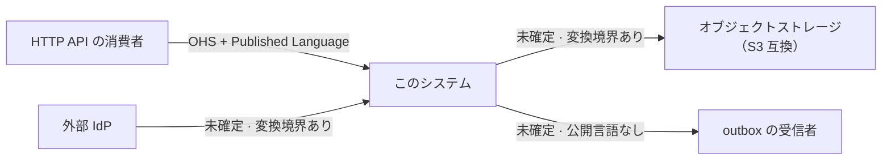

# コンテキストマップ

English: [context-map.md](../../design/context-map.md)

このページは、このシステムが自分の所有しないものとモデルをやりとりしている場所をすべて、Evans の
関係パターン語彙で辺として特徴づける。書くのは**関係**であって機構ではない。各連携がどう動くかは
それ自身の design reference のもので、表からリンクする。

保守は [`/context-map`](../../../.claude/skills/context-map/SKILL.md)、ズレの検出は
[`/context-map-audit`](../../../.claude/skills/context-map-audit/SKILL.md) が担う。

## 未確定の辺は空欄ではなく項目である

Evans の関係のいくつかは、コードベースに存在しない事実で区別される。下流側の辺で
Customer-Supplier を他と分けるのは、上流がこちらの要件を通してくれるかどうかである。それは**二つの
組織についての事実**であって、コードについての事実ではない。コードは境界に何が作られたかを示すが、
向こう側の誰かが聞く耳を持ったかどうかは示せない。

したがって、決着させる事実が手元に無い辺は、空欄にも当て推量にもせず、根拠と、決着させるための
問いを伴って `未確定` として記録する。ラベルの無い辺は答えられる者に問いを開いたまま渡すが、
誤って貼られた辺は、その前に判断を閉じてしまう。

> 上流限定: ここで `未確定` が未処理の課題ではなく終着状態である理由 — [ボイラープレート限定の規約](../get-started/boilerplate-only-conventions.ja.md)。 <!-- boilerplate-only:line -->

## 何を接触点とするか

モデルがこのシステムの外へ渡ること。外部の相手を持たない境界ポート——時計、トランザクション
マネージャ、job / worker のランナー——は、ポート一覧上どれだけ似て見えても接触点ではない。

方向は両方を数える。外向きの辺しか無い地図は「このシステムは誰の上流でもない」と主張してしまう。

## 辺

| 相手 | 向き | 関係 | 根拠 | 相手が動いたら |
| --- | --- | --- | --- | --- |
| HTTP API の消費者 | このシステムが上流 | **Open Host Service + Published Language** | `openapi/openapi.gen.yaml` を消費可能な成果物としてコミットし drift gate で鮮度を保つ。面は消費者ごとの endpoint ではなく全員に対する一律のプロトコル | 公開された契約が変わったときにだけ消費者が壊れ、その変更は gate によってレビューで可視になる |
| 外部 IdP | このシステムが下流 | `未確定` | アダプタがトークンをこのシステム自身の `Authn` へ変換し（`internal/infrastructure/auth/jwt/auth_jwt.go:243`）、subject / issuer / scopes をこのシステムの語で導出する。生の claim マップは不透明な積荷として持ち込まれるが production の読み手が無く、外部の語彙は越えてくるが消費されない——変換する境界が置かれている | issuer や claim の変更はアダプタが吸収する。プロトコルの変更は吸収しない |
| オブジェクトストレージ（S3 互換） | このシステムが下流 | `未確定` | ポートはこのシステムの語彙で述べられ、`internal/usecase/boundary/README.md:144` が vendor の語彙（bucket / region / etag）は境界を越えないと明言している | ベンダの差し替えはアダプタに閉じ、ポートは影響を受けない |
| outbox の受信者 | このシステムが上流 | `未確定` | publish 境界は substrate-agnostic な envelope を持つが、payload のスキーマは公開されていない。[ADR-0052](../adr/0052-message-id-idempotency-propagation.ja.md) が定めるのは転送規約のみ。[`outbox.ja.md`](outbox.ja.md) を参照 | 受信者の期待は、このシステムが公開するどの成果物にも守られていない |

## 未解決の問い

上の `未確定` の辺は、それぞれ 1 つのことを待っている。答えるのは調べ物ではなく判断である。

- **外部 IdP** — このシステムの要件は IdP を運用している側へ届くか。届くなら Customer-Supplier。
  届かないなら、既に置かれている変換の境界がその辺を Anticorruption Layer にする。

  **この 2 辺で Conformist は候補にならない。理由は述べておく価値がある。** Conformist とは変換層を
  作らないことを選び、上流のモデルをそのまま受け入れることであり、Anticorruption Layer とは作ることで
  ある。両者は同じ状況に対する 2 つの答えであって、ラベルとその付属品ではない。自らの根拠が変換
  アダプタである辺が Conformist であることはできない。両方を並べるのは、Evans の語彙を「関係」と
  「対処」が独立した軸であるかのように読むことであり、独立していない
- **オブジェクトストレージ** — 同じ問い。同じ変換の境界が既に在るので、候補も同じ 2 つ。境界が買って
  いる差し替え可能性は「この関係は荷重を持たない」ことを示唆するが、それは意図の読み取りであって、
  意図の根拠ではない
- **outbox の受信者** — 受信者は payload の形を要件で動かす既知の集合か（Customer-Supplier）、
  発行されたものを消費する開かれた集合か（Open Host Service）。同期面との非対称は
  [`outbox.ja.md`](outbox.ja.md) 第 4 節に記録されている。言語は公開されていない

## サンプル由来の接触点

サンプル機能一式は、外部 Web API への外向き gateway を足す。**サンプルを撤去すると消える**ため、
この地図がもう存在しない辺を語り続けないよう、別に列挙する。

- 住所補完 gateway と為替レート gateway（`internal/infrastructure/webapi/**`）。それぞれ usecase
  境界の意味論的なポートの背後にある

撤去後に残るのは、それらが示しているパターンのほうである。このシステムの語彙で述べた
`<service>.Gateway` ポートを立て、転送とベンダ由来の失敗をアダプタで変換する形。後から入る実際の
連携は同じ形に収まり、上の表に自分の行を得る。

## 図

## この地図が扱わないもの

- **データベース。** モデルを所有しているのではなくこのシステム自身のモデルを保存しているので、
  その辺ではモデルがシステムの外へ渡らない
- **外部の相手を持たないポート** — 時計、トランザクションマネージャ、job / worker のランナー
- **各連携がどう動くか。** 機構は [`docs/design/`](README.ja.md) 配下のサブシステム別リファレンスと
  パッケージ README のもので、このページは両者がどう関係するかだけを述べる
