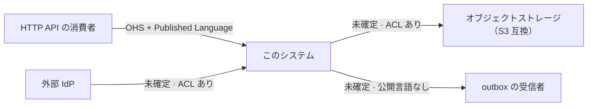

# コンテキストマップ

English: [context-map.md](../../design/context-map.md)

このページは、このシステムが自分の所有しないものとモデルをやりとりしている場所をすべて、Evans の
関係パターン語彙で辺として特徴づける。書くのは**関係**であって機構ではない。各連携がどう動くかは
それ自身の design reference のもので、表からリンクする。

保守は [`/context-map`](../../../.claude/skills/context-map/SKILL.md)、ズレの検出は
[`/context-map-audit`](../../../.claude/skills/context-map-audit/SKILL.md) が担う。

## 未確定の辺は空欄ではなく項目である

Evans の関係のいくつかは、コードベースに存在しない事実で区別される。Customer-Supplier と
Conformist は内側から見ると同じに見え——どちらも「相手のモデルを受け入れる」——上流がこちらの要件を
通してくれるかどうかだけが違う。それは組織についての事実であり、テンプレートにおいては**採用する側**
の組織についての事実であって、このリポジトリの事実ではない。

したがってここにある辺の多くは、根拠と、決着させるための問いを伴って `未確定` として記録されている。
**それがこのリポジトリにとっての正しい状態であり、書き漏らしではない。** ラベルの無い辺は採用者に
判断を促すが、誤って貼られた辺は、採用者が問いを見る前に判断を閉じてしまう。

## 何を接触点とするか

モデルがこのシステムの外へ渡ること。外部の相手を持たない境界ポート——時計、トランザクション
マネージャ、job / worker のランナー——は、ポート一覧上どれだけ似て見えても接触点ではない。

方向は両方を数える。外向きの辺しか無い地図は「このシステムは誰の上流でもない」と主張してしまう。

## 辺

| 相手 | 向き | 関係 | 根拠 | 相手が動いたら |
| --- | --- | --- | --- | --- |
| HTTP API の消費者 | このシステムが上流 | **Open Host Service + Published Language** | `openapi/openapi.gen.yaml` を消費可能な成果物としてコミットし drift gate で鮮度を保つ。面は消費者ごとの endpoint ではなく全員に対する一律のプロトコル | 公開された契約が変わったときにだけ消費者が壊れ、その変更は gate によってレビューで可視になる |
| 外部 IdP | このシステムが下流 | `未確定` | トークンの claims はアダプタ内でこのシステム自身の `Authn` へ変換される（`internal/infrastructure/auth/jwt/auth_jwt.go:222`）。外部の語彙は内側へ届かない——Anticorruption Layer の構造的シグネチャ | issuer や claim の変更はアダプタが吸収する。プロトコルの変更は吸収しない |
| オブジェクトストレージ（S3 互換） | このシステムが下流 | `未確定` | ポートはこのシステムの語彙で述べられ、`internal/usecase/boundary/README.md:144` が vendor の語彙（bucket / region / etag）は境界を越えないと明言している | ベンダの差し替えはアダプタに閉じ、ポートは影響を受けない |
| outbox の受信者 | このシステムが上流 | `未確定` | publish 境界は substrate-agnostic な envelope を持つが、payload のスキーマは公開されていない。[ADR-0052](../adr/0052-message-id-idempotency-propagation.ja.md) が定めるのは転送規約のみ。[`outbox.ja.md`](outbox.ja.md) を参照 | 受信者の期待は、このシステムが公開するどの成果物にも守られていない |

## 未解決の問い

上の `未確定` の辺は、それぞれ 1 つのことを待っている。答えるのは調べ物ではなく判断である。

- **外部 IdP** — このシステムの要件は IdP を運用している側へ届くか。届くなら Customer-Supplier、
  IdP が標準か、交渉に応じないベンダなら Conformist。Anticorruption Layer はどちらでも在る。
  あれは構造的な対処であって、関係そのものではない
- **オブジェクトストレージ** — 同じ問い。Anticorruption Layer も同じく既に在る。境界が買っている
  差し替え可能性は「この関係は荷重を持たない」ことを示唆するが、それは意図の読み取りであって、
  意図の根拠ではない
- **outbox の受信者** — 受信者は payload の形を要件で動かす既知の集合か（Customer-Supplier）、
  発行されたものを消費する開かれた集合か（Open Host Service）。同期面との非対称は
  [`outbox.ja.md`](outbox.ja.md) 第 4 節に記録されている。言語は公開されていない

## サンプル由来の接触点

サンプル機能一式は、外部 Web API への外向き gateway を足す。**サンプルを撤去すると消える**ため、
この地図がもう存在しない辺を語り続けないよう、別に列挙する。

- 住所補完 gateway と為替レート gateway（`internal/infrastructure/webapi/**`）。それぞれ usecase
  境界の意味論的なポートの背後にある

撤去後に残るのは、それらが示しているパターンのほうである。このシステムの語彙で述べた
`<service>.Gateway` ポートを立て、転送とベンダ由来の失敗をアダプタで変換する形。後から入る実際の
連携は同じ形に収まり、上の表に自分の行を得る。

## 図

## この地図が扱わないもの

- **データベース。** モデルを所有しているのではなくこのシステム自身のモデルを保存しているので、
  その辺ではモデルがシステムの外へ渡らない
- **外部の相手を持たないポート** — 時計、トランザクションマネージャ、job / worker のランナー
- **各連携がどう動くか。** 機構は [`docs/design/`](README.ja.md) 配下のサブシステム別リファレンスと
  パッケージ README のもので、このページは両者がどう関係するかだけを述べる
