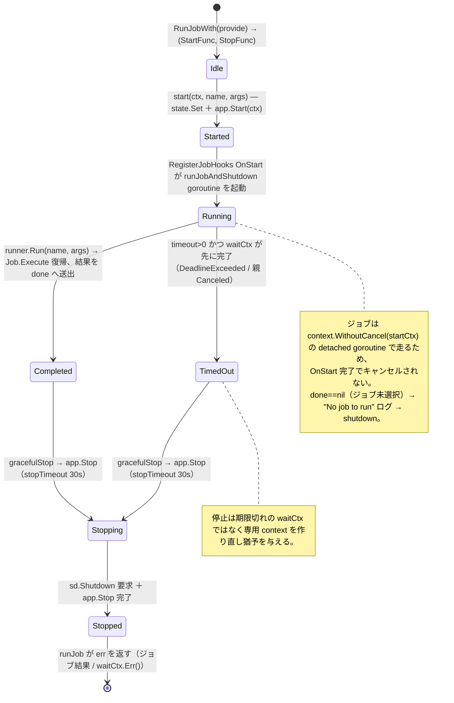
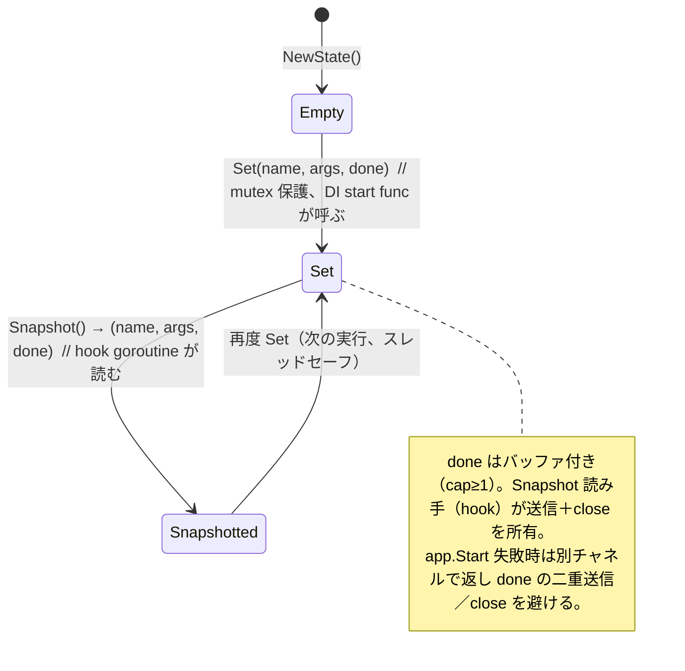
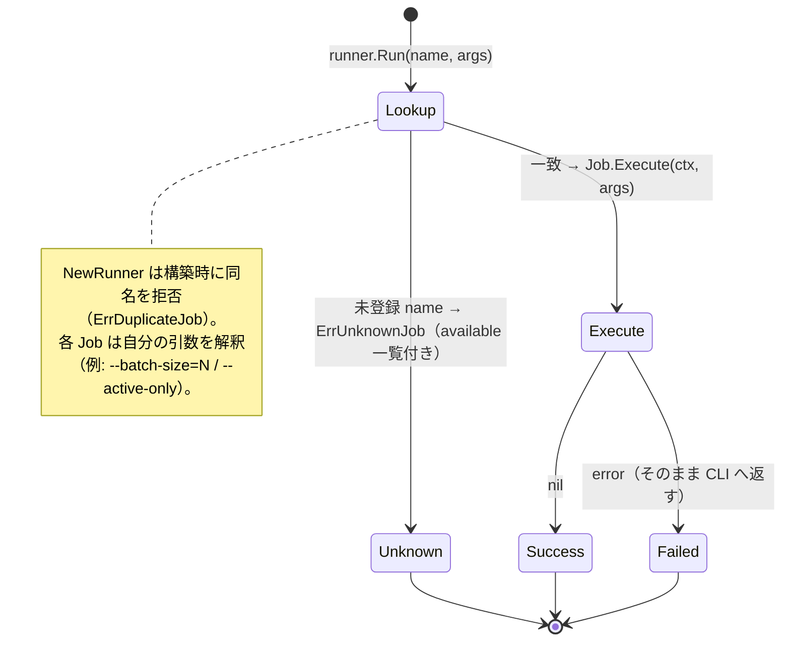
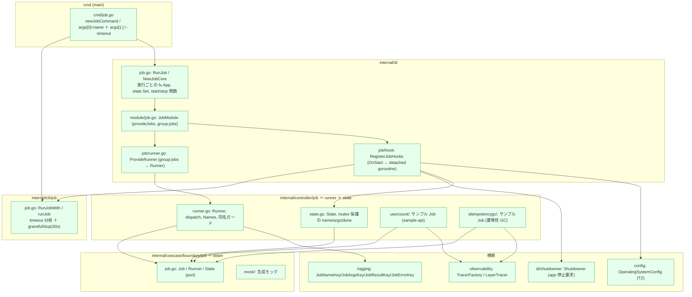
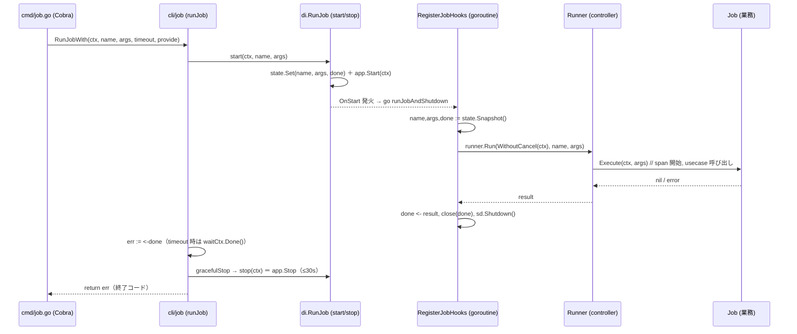
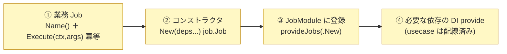

# Job サブシステム設計リファレンス

[Job README（日本語）](../../../internal/controller/job/README.ja.md) | English: [job.md](../../design/job.md)

本書は job scaffold の **役割論・状態遷移・実装箇所・integrator が書く箇所・用語** を、実装を精査して 1 枚にまとめた参照資料です。概要は README、非同期の兄弟である worker は [worker.ja.md](worker.ja.md) を参照。

---

## 1. 役割論（なにが・なんのために）

job は **HTTP handler・worker と同格の「command-in driving adapter」**。新しいアーキテクチャ層ではなく、**CLI（Cobra）経由で Usecase 層に入るもう 1 つの入口**。HTTP が「同期リクエストを受ける口」、worker が「キューメッセージを受ける口」なら、job は「1 回の CLI 実行を受けて終了する口」。

責務の分担（誰が何を持つか）:

| 構成要素 | 層 | 責務 | 持たないもの |
| --- | --- | --- | --- |
| **runner**（`Runner`） | controller | 名前 → `Job` のレジストリ / 名前ディスパッチ / 同名拒否 / `Names()` 列挙 | 業務ロジック・引数解釈 |
| **state**（`State`） | controller | 選択された実行（name / args / `done` チャネル）を保持し lifecycle hook へ受け渡す | ジョブ実行・引数解釈 |
| **seam**（`Job`/`Runner`/`State`） | usecase/boundary | CLI ライフサイクルと業務ジョブの契約 | 実装 |
| **Job**（業務処理） | integrator が実装（usecase を呼ぶ） | 1 回の実行の業務処理（**冪等推奨**） | ディスパッチ・lifecycle・停止 |
| **DI / cli / cmd** | di / cli / cmd(main) | 実行ごとの `fx.App` 合成 / サブコマンド / timeout・graceful stop / detached goroutine / 停止要求 | 業務ロジック |
| **OperatingSystemConfig** | config | 構造化ジョブログ用の TZ | ジョブ挙動 |

設計原則（不変）: **runner と state は seam（`job.Job` / `job.Runner` / `job.State`）のみに依存し実装を import しない。** 実行ごとに **新しい `fx.App` を構築**（常駐プロセスなし）し、ちょうど 1 件のジョブを実行して停止を要求する。worker と違い **broker・サーキットブレーカ・drain・health listener は無い** ——ジョブの失敗は CLI へ非ゼロ終了として返すだけ。

---

## 2. 状態遷移図

### 2.1 実行ライフサイクル（`cli/job.RunJobWith` / `runJob` ＋ DI フック）

### 2.2 状態の受け渡し（`controller/job/state.go`）

### 2.3 ディスパッチ（`run.Run`、レジストリ参照）

---

## 3. 実装箇所（このアーキテクチャ上のどこに・どう作用するか）

### 3.1 パッケージ配置と依存方向

> 緑＝scaffold 実装済み。依存方向は常に内向き（`controller→usecase/boundary`）。runner/state は業務ロジックも infra import も持たず、ジョブはデータへ usecase 層経由でのみ到達する。

### 3.2 実行 1 回の作用シーケンス

---

## 4. integrator が実装する箇所（scaffold が用意しない部分）

scaffold は **runner・state・lifecycle hook・DI 配線・2 つの参考ジョブ**（`usercount`・`idempotencygc`）を提供する。ジョブを追加するには次を用意する（ジョブは明示登録・自動検出なし）。

| # | 必要な実装 | 置き場（推奨） | 参考 |
| --- | --- | --- | --- |
| ① | 業務 `Job`：`Name()`（kebab-case）＋ `Execute(ctx, args)`（引数解釈・usecase 呼び出し・ログ） | `internal/controller/job/<name>/` | `usercount` / `idempotencygc` |
| ② | `New(...) job.Job` DI コンストラクタ（logging / tracer factory / usecase を受け取る） | ①と同じファイル | `usercount.New` |
| ③ | `JobModule()` の `provideJobs(...)` に コンストラクタ追加 | `internal/di/module/job.go` | `provideWorkers` と同形 |
| ④ | ジョブが必要とする追加依存の `fx.Provide`（usecase は提供済み） | `internal/di/module/` | 既存の usecase provider |

> 実行は `<binary> job <name> [args...] [--timeout 30s]`。`cmd/job.go` が `args[0]` をジョブ名、`args[1:]` をジョブ引数へ振り分け済みで、ジョブごとの CLI 配線は不要。

---

## 5. 用語集

| 用語 | 意味 |
| --- | --- |
| **seam** | CLI ライフサイクルと業務ジョブの境界となる port 群。`internal/usecase/boundary/job`。 |
| **port** | seam を構成する interface：`Job` / `Runner` / `State`。 |
| **Job** | CLI から 1 回実行される作業単位。`Name()` ＋ `Execute(ctx, args)`。冪等であるべき（運用者が再実行しうる）。 |
| **runner** | ジョブ名を `Job` に対応づけ `Execute` をディスパッチするレジストリ。構築時に同名を拒否。 |
| **State** | 選択された実行（`name` / `args` / `done`）のスレッドセーフな保持器。DI start func が `Set`、hook goroutine が `Snapshot`。 |
| **done チャネル** | hook がジョブ結果を送って close するバッファ付き（`chan error`, cap≥1）チャネル。読み手（hook）が所有。 |
| **StartFunc / StopFunc** | `di.RunJob` が返す開始/停止のペア。`start` は `state.Set` ＋ `app.Start` 後に `done` を返す、`stop` は `app.Stop`。 |
| **RunJobWith** | provider を差し替え可能にしてから `runJob`（timeout 分岐 ＋ graceful stop）へ委譲する `cli/job` のファサード。 |
| **runJobAndShutdown** | `RegisterJobHooks` OnStart が起動する detached goroutine。state を Snapshot し、ジョブを実行、結果送出、停止を要求。 |
| **context.WithoutCancel** | fx OnStart フック復帰でジョブの context がキャンセルされないようにする（ジョブは OnStart を超えて走る）。 |
| **timeout（`--timeout`）** | 任意の CLI 期限。`>0` ならジョブ完了か期限の早い方を待ち、`≤0` なら無期限に待つ。 |
| **gracefulStop / stopTimeout** | 完了・timeout 後、`app.Stop` に（期限切れでない）新規 30s context を与えて後始末させる。 |
| **Shutdowner** | ジョブ完了後に hook が呼ぶ fx の停止要求器。これでアプリが終了する。 |
| **provideJobs / `group:"jobs"`** | 全ジョブコンストラクタを `NewRunner` が食うスライスへ束ねる Fx 集約。 |
| **ErrUnknownJob / ErrDuplicateJob** | ディスパッチ時の未知名エラー（available 一覧付き）／構築時の同名エラー。 |
| **idempotencygc** | 失効した冪等性キーを掃除する同梱ジョブ（`--batch-size=N`）。[idempotency.ja.md](idempotency.ja.md) 参照。 |
