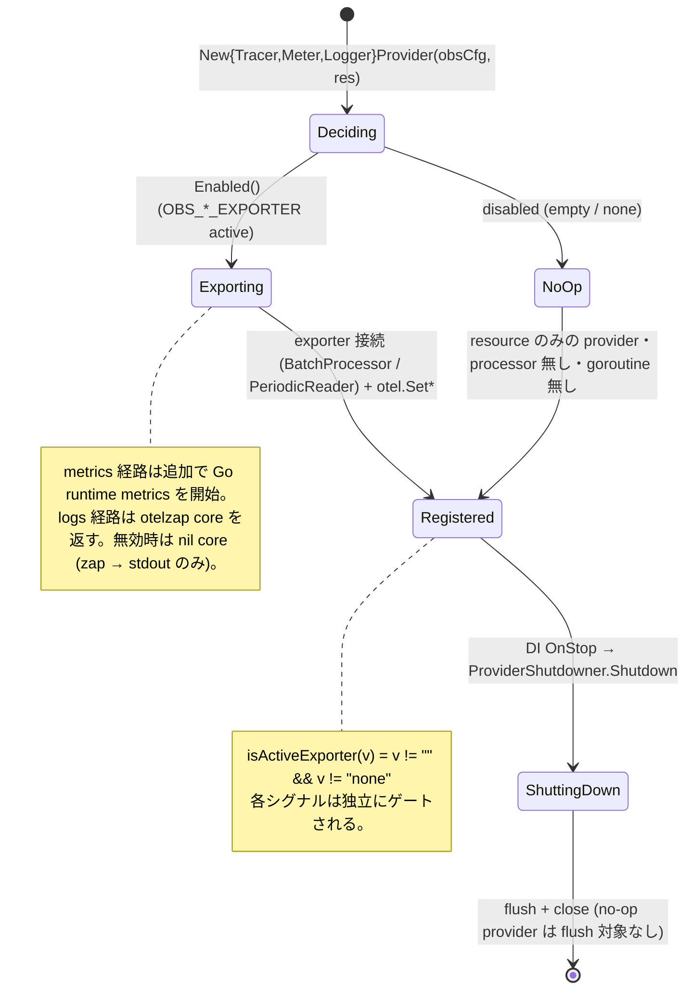
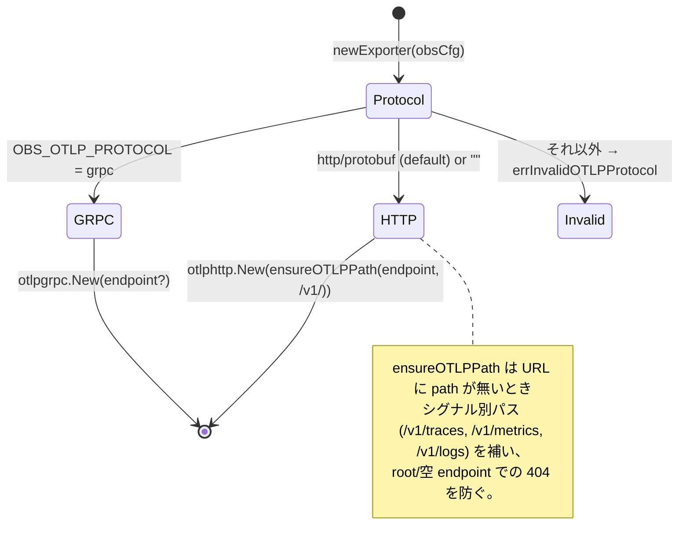
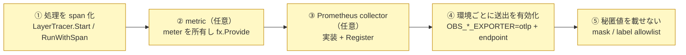

# Observability サブシステム設計リファレンス

[Observability README（日本語）](../../../internal/observability/README.ja.md) | English: [observability.md](../../design/observability.md)

本書は observability サブシステムの **役割論・シグナルのライフサイクル・実装箇所・提供機能・integrator が書く箇所・用語** を、実装を精査して 1 枚にまとめた参照資料です。パッケージ API の概要は README、計装対象のサブシステムは [worker.ja.md](worker.ja.md) / [outbox.ja.md](outbox.ja.md) / [idempotency.ja.md](idempotency.ja.md) / [rest.ja.md](rest.ja.md) を参照。

---

## 1. 役割論（何を・何のために）

observability は **レイヤーではなく**、各層が OpenTelemetry の 3 シグナル（**traces / metrics / logs**）を、どの層も OTel SDK を知らないまま送出するために依拠する **横断的な基盤（substrate）**です。アプリケーションコードは小さな `LayerTracer` / helper 面だけに依存し、SDK は **`internal/observability` に封じ込め**られています。

以下すべてを規定する 2 つの不変条件：

- **ベンダー非依存な OTLP のみ。** 本パッケージは Collector / Agent サイドカーへ OTLP を話す土台を配線するだけです。ベンダー固有（Grafana / Datadog / New Relic）はその Collector 側にあり、ここには持ち込みません。
- **config 駆動・独立ゲート・フェールセーフ。** 各シグナルは自分の `OBS_*_EXPORTER` 値で有効化され、無効時は no-op フォールバック（exporter 無し・goroutine 無し）になります。observability の失敗が業務処理に影響してはなりません。

責務分担（誰が何を持つか）：

| コンポーネント | 層 | 責務 | 持たないもの |
| --- | --- | --- | --- |
| **providers**（`TracerProvider` / `MeterProvider` / `LoggerProvider`） | observability | config でゲートしつつシグナル別に SDK パイプラインを構築 | 送出先ポリシー・ベンダー knob |
| **`TracerFactory` / `LayerTracer`** | observability | レイヤー別 span 名前空間 + span イベントの構造化ログ | 業務ロジック |
| **meter instruments**（`OutboxMetrics` / `WorkerMetrics` / `IdempotencyMetrics` / `HTTPClientMetrics`） | observability | meter を所有し型付き記録メソッドを公開 | いつ何を記録するか（所有サブシステムが決める） |
| **Prometheus collectors**（`buildinfo` / `queue`） | observability | scrape エンドポイントにプロセス/broker 状態を公開 | OTLP push |
| **アプリケーションコード**（handler / usecase / repository） | controller / usecase / infra | 適切な瞬間に span を `Start` / metric を記録 | provider 構築・exporter 選択 |
| **DI 配線**（`ObservabilityModule` + shutdown hook） | di | providers の提供・`Shutdown` 登録 | 業務ロジック |
| **`ObservabilityConfig`** | config | `OBS_*` の typed 設定（exporter トグル・endpoint・protocol・masking・対象ステータス） | ベンダー固有 OTLP キー |

設計原則（不変条件）：**providers はライフサイクル非依存**である — 具象 SDK provider（`Shutdown` を公開）を返し、shutdown 登録は DI hook に委ねる。ゆえに `observability` は `di/lifecycle` を import しない。

---

## 2. シグナルのライフサイクル（状態遷移）

### 2.1 provider 構築（シグナル別・config ゲート）

各 provider は同型：有効なら OTLP exporter を構築して接続、無効なら常駐 goroutine を持たない no-op provider を返す。

### 2.2 exporter 選択（protocol スイッチ・endpoint 共用）

3 シグナルは `OBS_OTLP_ENDPOINT` と `OBS_OTLP_PROTOCOL` を共用。トランスポートは OTLP のみ。

- **サンプリング**は SDK 既定の `ParentBased(AlwaysSample)`。現状 env で設定不可。
- **伝播（propagation）**は W3C `TraceContext` + `Baggage` の複合で、`otel.SetTextMapPropagator` によりグローバル登録される — サービス跨ぎのトレース継続（HTTP in/out、worker の `traceparent`）に必須。

---

## 3. 実装箇所（アーキテクチャ上どこに在り、どう作用するか）

### 3.1 パッケージ配置と依存方向

```mermaid
flowchart TD
    subgraph cfgL["internal/config"]
        OBSCFG["ObservabilityConfig<br/>OBS_* (exporter トグル / endpoint / protocol / masking)"]
    end
    subgraph obsL["internal/observability = substrate"]
        PROV["provider.go: NewResource / NewTracerProvider / NewMeterProvider"]
        LOGP["log_provider.go: NewLoggerProvider / NewLogCore (otelzap)"]
        TF["tracer_factory.go / layer_tracer.go: TracerFactory → LayerTracer"]
        HELP["helper.go: RunWithSpan / StartSpanWithParent / ShouldLogWithSpan / NewTraceExtractor"]
        PGX["pgx_tracer.go: NewPgxTracer (otelpgx)"]
        HC["http_client_*.go: transport + RED metrics"]
        MET["outbox / worker / idempotency / httpclient meter instruments"]
        PROM["metrics/buildinfo + metrics/queue (Prometheus collectors)"]
        SD["shutdown.go: ProviderShutdowner"]
    end
    subgraph diL["internal/di"]
        DIM["module/observability.go: ObservabilityModule"]
        HOOK["server/hook: RegisterObservabilityShutdownHooks"]
    end
    subgraph appL["アプリケーション各層（消費側）"]
        CTRL["controller: handler / outbox relay / worker engine"]
        UC["usecase"]
        INFRA["infrastructure: rdb (pgx) / 外部 HTTP client"]
    end
    subgraph logL["internal/logging = 基盤"]
        LOGGING["Logger (ctx-native) / TraceExtractor interface / LogCore"]
    end
    subgraph exitL["出口"]
        OTLP["OTLP → Collector/Agent (traces/metrics/logs)"]
        SCRAPE["/metrics (promhttp default registry)"]
    end

    OBSCFG --> PROV
    OBSCFG --> LOGP
    DIM --> PROV
    DIM --> LOGP
    DIM --> TF
    DIM --> PGX
    DIM --> HC
    DIM --> PROM
    DIM --> HOOK
    DIM --> HELP
    SD --> HOOK
    LOGP --> LOGGING
    HELP --> LOGGING
    CTRL --> TF
    UC --> TF
    INFRA --> PGX
    INFRA --> HC
    CTRL --> MET
    PROV --> OTLP
    LOGP --> OTLP
    PGX --> OTLP
    MET --> OTLP
    PROM --> SCRAPE

    classDef done fill:#e6ffed,stroke:#2da44e;
    class OBSCFG,PROV,LOGP,TF,HELP,PGX,HC,MET,PROM,SD,DIM,HOOK,CTRL,UC,INFRA,LOGGING,OTLP,SCRAPE done;
```

> アプリケーション各層からの依存は常に `observability` へ**内向き**に入る。`observability` 自身は `config` / `system` / `pkg`、`internal/logging`（実装する `TraceExtractor` interface と返す `LogCore` 型）、および OTel SDK に依存する。逆方向は成り立たない — `logging` は `observability` を import しないため、trace ゲートは pull ではなく `TraceExtractor` として注入される。`observability` は `di/lifecycle` を import しない（shutdown は `ProviderShutdowner` で反転）。

### 3.2 metrics の 2 つの出口（これは意図的）

| 経路 | Instruments | プロセスから出る方法 |
| --- | --- | --- |
| **OTLP push**（OTel meter） | `outbox` / `worker` / `idempotency` / `httpclient` + Go runtime + `otelpgx` DB metrics | `MeterProvider` の `PeriodicReader` → Collector。`MetricsEnabled()` のときのみ |
| **Prometheus scrape** | `app_build_info`（buildinfo）, `worker_queue_*`（queue） | default registry に登録し `promhttp` で `/metrics` に公開。`OBS_*` から独立 |

scrape 経路は本質的に *pull* な値（ビルド識別情報は結線時に一度解決、broker queue depth は scrape 毎に polling）のために存在し、OTLP exporter の有効化を必要としません。

---

## 4. 提供機能（observability が提供するもの）

substrate は以下の即利用可能な計装を同梱します。integrator は多くの場合これらを **消費**するだけで、新規追加は 5 節です。

| 機能 | 面 | 備考 |
| --- | --- | --- |
| **レイヤー別トレーシング** | `TracerFactory.Controller()/Usecase()/Infra()` → `LayerTracer.Start` | span 名 `layer.package.function`。開始/終了 + `trace_id`/`span_id` の構造化ログを自動出力 |
| **アドホック span helper** | `RunWithSpan` / `StartSpanWithParent` / `StartWithSuffix` | layer tracer 無しに任意関数を span 化。suffix で同一関数内の複数 span を区別 |
| **HTTP root span** | `echootel` middleware | リクエスト毎の root span（controller 層 span はこれとほぼ重複 — README 設計ポリシー 5 参照） |
| **DB トレーシング + metrics** | `NewPgxTracer`（`otelpgx`） | 接続情報は属性から抑止 |
| **外向き HTTP RED metrics** | `NewHTTPClientTransport` + `HTTPClientMetrics` | requests / errors / latency + retries / in-flight / breaker 状態 gauge |
| **サブシステム metrics** | `OutboxMetrics` / `WorkerMetrics` / `IdempotencyMetrics` | lag & dead / engine RED + DLQ / 冪等性の結果 & GC。低カーディナリティラベルのみ |
| **ランタイム metrics** | `runtime.Start` | Go GC / mem / goroutine。`MetricsEnabled()` のときのみ |
| **ビルド情報 gauge** | `metrics/buildinfo` → `app_build_info` | `/version` と同一 source of truth |
| **queue depth gauge** | `metrics/queue` → `worker_queue_depth` | broker adapter から scrape 毎に pull（SQS では approximate） |
| **OTLP ログ送出** | `NewLoggerProvider` + `NewLogCore`（otelzap） | `zap` → OTLP へ橋渡し。無効時は nil core・stdout のみ |
| **コンテキスト伝播** | `NewTextMapPropagator`（W3C TraceContext + Baggage） | サービス / worker 跨ぎのトレース継続 |
| **テストダブル** | `NewNoopTracerFactory`, `NewMock*LayerTracer`, `NewStubSpanContext` | 決定的・実 exporter 無し |

---

## 5. integrator が書く箇所（追加するもの）

substrate はパイプラインと共有 instrument を提供します。新機能を観測するには以下を足します。

| # | 必要な実装 | 推奨箇所 | 参考 |
| --- | --- | --- | --- |
| ① | 新規処理を span で包む | handler / usecase / repository | 既存 `LayerTracer.Start` 呼び出し / 任意コードは `RunWithSpan` |
| ② | 新規 metric | `WorkerMetrics` 等の meter 所有 struct を `ObservabilityModule` で `fx.Provide` し、所有サブシステムから記録 | `outbox_metrics.go` / `worker_metrics.go` |
| ③ | 新規 pull metric | `prometheus.Collector` + `Register` invoke | `metrics/buildinfo` / `metrics/queue` |
| ④ | 環境で送出を有効化 | `OBS_TRACES/METRICS/LOGS_EXPORTER=otlp` + `OBS_OTLP_ENDPOINT`（+ `OBS_OTLP_PROTOCOL`） | `env/.env.*` / `env/README.md` |
| ⑤ | span & label に秘匿値/PII を載せない | ユーザー入力に触れる計装全箇所 | `OBS_MASKED_DB_QUERY_ARGS` / `IdempotencyMetrics` の label allowlist / `otelpgx` の接続情報抑止 |

> 送出の有効化は **config/IaC** の操作でありコード変更ではない。同一バイナリがローカルでは no-op（`OBS_*_EXPORTER` 空）、staging/prod では OTLP を push する。

---

## 6. 用語

| 用語 | 意味 |
| --- | --- |
| **signal** | テレメトリ 3 種（traces / metrics / logs）のいずれか。各々が固有の provider と `OBS_*_EXPORTER` トグルを持つ。 |
| **OTLP** | OpenTelemetry Protocol。ここでの唯一の送出トランスポート（`http/protobuf` 既定、または `grpc`）。 |
| **exporter / `isActiveExporter`** | シグナル別トグル。`OBS_*_EXPORTER` 値が空でも `none` でもないとき有効。 |
| **no-op フォールバック** | シグナル無効時に使う resource のみの provider。exporter 無し・batch processor / periodic reader 無し・goroutine 無し。 |
| **resource** | `NewResource` がアプリ設定 + `system.BuildInfo` から構築する共有 OTel 識別情報（`service.name` / `deployment.environment` / `service.version` / `service.revision` / `service.build_date`）。 |
| **`TracerFactory` / `LayerTracer`** | レイヤー別 tracer を生む factory と、`layer.package.function` 名の span を生み開始/終了の構造化ログを出す layer tracer。 |
| **`RunWithSpan`** | 任意関数を span + observability ログ内で実行する layer 非依存の helper。 |
| **propagator** | サービス / worker 境界を越えてトレースコンテキストを運ぶ W3C `TraceContext` + `Baggage` 複合。 |
| **otelzap core** | `zap` ログを OTLP 送出する `NewLogCore` の bridge。`LogsEnabled()` が偽なら `nil`。 |
| **`ProviderShutdowner`** | `observability` が `di/lifecycle` に依存せず DI hook が `Shutdown` を登録できるようにする otel 非依存の後始末ハンドル。 |
| **meter instrument** | サブシステム struct（`OutboxMetrics` 等）が所有し OTLP 送出する OTel counter / histogram / gauge。 |
| **RED** | Requests / Errors / Duration。HTTP client と worker engine で用いる metric 形状。 |
| **info gauge** | 値が常に `1` で識別情報をラベルに持つ Prometheus gauge（`app_build_info`）。 |
| **`PeriodicReader` / `BatchProcessor`** | metric / span のバックグラウンド exporter。シグナル有効時のみ構築。 |
| **runtime metrics** | `runtime.Start` で開始する Go GC / メモリ / goroutine metric。`MetricsEnabled()` のときのみ。 |
| **`otelpgx`** | 明示 provider を注入し接続情報を抑止した pgx 計装（DB span + metric）。 |
| **`/metrics`** | Prometheus collector を公開する `promhttp` scrape エンドポイント（default registry）。OTLP トグルから独立。 |
